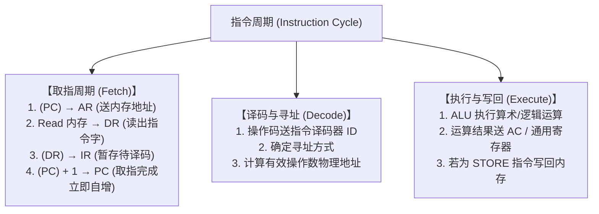

# 考点精要：CPU 体系结构、微架构与 CISC/RISC 对比

<Badge type="info" text="MOD-01 硬件体系" />
<Badge type="tip" text="考查题号：上午第 1 ~ 3 题 (约 2 ~ 3 分)" />
<Badge type="danger" text="⭐⭐⭐⭐⭐ 5星必考" />
<Badge type="warning" text="弱贯通下午" />

::: tip 🎯 45 分及格通关指引
- **【45分必背核心得分点】**：
  1. **PC vs IR 必杀口诀**：**“下一地址找 PC，当前指令看 IR，操作译码由 ID，中间结果存 AC”**。
  2. **PC 自增时机**：在**取指周期结束**时即完成自增，绝非等指令执行完成！
  3. **RISC 架构“四少一硬一专”**：
     - 指令少（精简）、字长固定等长、寻址方式少、通用寄存器多；
     - 控制器采用**硬布线逻辑**（超快，非微程序）；
     - 运算只在寄存器间进行，**只有 LOAD / STORE 专职访存**。
  4. **Flynn 架构速记**：**GPU 图形加速器是 SIMD**（单指令多数据流）；现代**多核 CPU 集群是 MIMD**。
- **【高分选读 / 考场可战略放弃点】**：
  - 极其偏门的微程序控制存储器 ROM 内部微地址转移逻辑及具体电平脉冲参数，考场直接放弃不纠结。
:::

---

## 一、 核心考纲与概念辨析

### 1. CPU 核心部件归属对比（运算器 vs 控制器）

计算机中央处理器（CPU）主要由运算器、控制器和内部寄存器组构成：

| CPU 部件类别 | 核心部件名称 | 英文缩写 | 核心功能与工作机制 | 考场快速判定法则 |
| :--- | :--- | :--- | :--- | :--- |
| **运算器** (执行数据加工) | **算术逻辑单元** | **ALU** | 负责执行所有算术运算（加减乘除）和逻辑运算（与或非异或） | 计算核心 |
| | **累加寄存器** | **AC** | 暂存算术逻辑运算的操作数或运算结果，为 ALU 提供临时输入输出缓冲 | 中间结果暂存 |
| | **数据缓冲寄存器** | **DR** | 暂存由内存读出或准备写入内存的数据字 | 内存读写数据中转 |
| | **状态条件寄存器** | **PSW** | 记录程序运行时的状态标志（如零标志 Z、溢出标志 V、符号标志 N、进位标志 C） | 状态标志位 |
| **控制器** (发出控制节拍) | **程序计数器** | **PC** | **存放下一条要执行指令的内存地址**，具备自动自增计数寻址功能 | **下一条指令地址** |
| | **指令寄存器** | **IR** | **存放当前正在执行的指令**，供指令译码器分析 | **当前执行指令** |
| | **指令译码器** | **ID** | 对指令寄存器中的**操作码**进行分析解释，产生对应的微操作控制信号 | 操作码分析与译码 |
| | **地址寄存器** | **AR** | 保存当前 CPU 正在访问的内存物理单元地址 | 内存物理地址 |
| | **时序控制部件**| / | 产生计算机工作所需的微节拍时钟脉冲，协调各部件按节拍同步运转 | 节拍发生器 |

---

### 2. CISC (复杂指令集) vs RISC (精简指令集) 全景对比

| 对比维度 | CISC (复杂指令系统计算机) | RISC (精简指令系统计算机) | 30 秒秒杀技巧 |
| :--- | :--- | :--- | :--- |
| **指令数量与复杂度** | **指令多（几百条）**，功能繁复 | **指令少（几十条）**，高频简单指令 | RISC 追求极简 |
| **指令长度与格式** | **指令字长不固定**，格式多样 | **指令字长严格固定（等长）**，规整统一 | RISC 便于译码与流水线 |
| **寻址方式** | **寻址方式多（十几种）** | **寻址方式少（2~3 种）** | CISC 寻址极繁琐 |
| **执行周期** | 大多指令需要多个机器周期 | **绝大多指令单周期（1个周期）完成** | RISC 单周期执行 |
| **访存限制** | 多种计算指令可直接读写内存 | **严格限制访存：仅 LOAD / STORE 允许访存** | **RISC 算存分离（必考题眼）** |
| **通用寄存器** | 通用寄存器数量少 | **配置大量通用寄存器** | RISC 减少访存开销 |
| **控制器实现** | **微程序控制器**（存放在控制 ROM） | **硬布线组合逻辑控制器**（电路直接触发） | **RISC 硬布线超高速** |
| **流水线优化** | 指令长短不一，难以优化流水线 | **极易实现指令级并行与超标量流水线** | RISC 天生适配流水线 |

---

### 3. Flynn 计算机体系结构分类法

根据**指令流 (Instruction Stream)** 和 **数据流 (Data Stream)** 的单重/多重性划分：

| 体系结构类别 | 英文缩写 | 核心特征与系统形态 | 现实对应实例（考场直接代入） |
| :--- | :--- | :--- | :--- |
| **单指令流单数据流** | **SISD** | 传统单 CPU 单核顺序执行计算机，一个控制部件对应一个运算器 | 传统单核冯·诺依曼计算机 |
| **单指令流多数据流** | **SIMD** | 单一控制部件控制**多个并行处理单元**，同步执行同一指令处理不同数据 | **向量处理机、阵列处理机、GPU 图形图像处理器** |
| **多指令流单数据流** | **MISD** | 多个控制部件对同一数据流操作，**工程上极少使用或不存在** | 理论容错多表决冗余系统 |
| **多指令流多数据流** | **MIMD** | 多个独立的 CPU 独立执行各自指令流，处理各自数据流 | **多核多处理器、分布式服务器集群、云计算节点** |

---

## 二、 分析模型与指令执行时序

### 1. 指令周期与微操作时序模型

一条机器指令的完整生命周期分为三大阶段：

- **程序计数器自增时机**：在**取指周期结束时**，PC 就已经完成了自动自增（指向下一条指令），而非等当前指令执行完毕后再加 1！

---

## 三、 命题题眼与陷阱防御

::: danger 🚨 常见命题陷阱盘点
1. **PC 与 IR 的功能偷换**：题干问“存放下一条待执行指令地址”必选 **PC**；题干问“存放当前正在执行指令内容”必选 **IR**。
2. **RISC 算存混合的伪命题**：干扰项常设置“RISC 允许 ADD 指令直接对内存地址的数据执行累加”，**坚决排除**！RISC 规定必须先 `LOAD` 到寄存器，运算后再 `STORE` 进内存。
3. **GPU 的体系归属误判**：GPU 由海量流处理器同步并发执行着色器指令处理不同像素点，属于 **SIMD**，千万不能错选为 MIMD。
4. **控制器实现方式对调**：出题人常把“硬布线”安给 CISC、“微程序”安给 RISC，务必牢记：**RISC 追求极致速度采用硬布线，CISC 追求兼容复杂性采用微程序**。
:::

---

## 四、 典型真题溯源与逐项排错解析 (Distractor Analysis)

### 【真题精选 1】（考查 CPU 控制器核心寄存器职责 · 2024上-机考回忆-Q1）

**题干**：CPU 在执行指令的过程中，用于存放当前正在执行的指令的部件是（ ），而用于存放下一条指令所在内存地址的部件是（ ）。
- (1) A. 程序计数器 (PC) &emsp; B. 指令寄存器 (IR) &emsp; C. 指令译码器 (ID) &emsp; D. 累加寄存器 (AC)  
- (2) A. 程序计数器 (PC) &emsp; B. 指令寄存器 (IR) &emsp; C. 地址寄存器 (AR) &emsp; D. 状态条件寄存器 (PSW)  

::: details 💡 点击展开【正确答案与逐项排错剖析】
- **【正确答案】**：**(1) B &emsp; (2) A**
- **【核心切入点】**：把握“当前指令内容在 IR，下一指令地址找 PC”的核心铁律。

#### 逐项排错剖析 (Distractor Analysis)
- **第 (1) 空排错**：
  - **选项 A (PC) 错误**：程序计数器用于追踪指令地址，不保存指令内容。
  - **选项 B (IR) 正确**：指令寄存器（Instruction Register）在取指阶段从内存缓冲寄存器（DR）接收并暂存当前正在执行的指令。
  - **选项 C (ID) 错误**：指令译码器用于对 IR 中的操作码进行解析产生控制节拍，本身不是存放整条指令的寄存器。
  - **选项 D (AC) 错误**：累加寄存器属于运算器部件，用于暂存算术逻辑运算的操作数或结果。
- **第 (2) 空排错**：
  - **选项 A (PC) 正确**：程序计数器（Program Counter）具有自动计数加 1 功能，专门存放下一条待执行指令的内存物理地址。
  - **选项 B (IR) 错误**：IR 存当前指令。
  - **选项 C (AR) 错误**：地址寄存器保存的是当前 CPU 正在访问的任意内存单元地址（包括操作数地址），并非专门用于指示下一条执行指令。
  - **选项 D (PSW) 错误**：状态条件寄存器保存的是算术逻辑运算的状态标志位（如进位 C、零 Z、溢出 V、负号 N 等）。
:::

---

### 【真题精选 2】（考查 RISC 与 CISC 核心技术特征辨析 · 2024下-机考回忆-Q2）

**题干**：精简指令系统计算机（RISC）与复杂指令系统计算机（CISC）相比，具有许多鲜明的技术特征。下列关于 RISC 特征的描述中，错误的是（ ）。
- A. 指令字长严格固定，指令种类相对较少  
- B. 控制器优先采用微程序控制器实现，以便于灵活扩展  
- C. 配置大量通用寄存器，尽量减少访存次数  
- D. 仅允许专用的 LOAD 和 STORE 指令直接访问内存  

::: details 💡 点击展开【正确答案与逐项排错剖析】
- **【正确答案】**：**B**
- **【核心切入点】**：牢记“RISC 绝不用慢速微程序，为了极致单周期性能采用硬布线组合逻辑”。

#### 逐项排错剖析 (Distractor Analysis)
- **选项 A 正确（不符合题意）**：RISC 精选高频指令，指令字长完全等长且规整，便于硬件译码和流水线流水。
- **选项 B 错误（符合题意，入选）**：采用微程序控制器是 **CISC** 的典型特征；RISC 为了追求绝大多数指令在一个时钟周期内完成，控制器必须采用**硬布线组合逻辑电路**（Hardwired Control）。
- **选项 C 正确（不符合题意）**：RISC 内部集成了大量通用寄存器，绝大多数算术逻辑运算都在寄存器之间进行，最大限度减少了昂贵的内存访问开销。
- **选项 D 正确（不符合题意）**：RISC 严格执行“算存分离”，算术运算指令不允许以内存单元作为操作数，只有专用的 LOAD（读）和 STORE（写）指令能够访问内存。
:::

---

### 【真题精选 3】（考查 Flynn 计算机体系结构分类与实例对应 · 2024上-机考回忆-Q3）

**题干**：在现代计算机体系结构中，图形处理器（GPU）通过上千个核心在同一指令驱动下对成批像素数据并行执行相同的光照渲染操作。按照 Flynn 体系结构分类法，GPU 属于（ ）体系结构。
- A. SISD  
- B. SIMD  
- C. MISD  
- D. MIMD  

::: details 💡 点击展开【正确答案与逐项排错剖析】
- **【正确答案】**：**B**
- **【核心切入点】**：提炼题干关键信息“同一指令驱动（单指令流 SI）”且“上千个核心对成批数据并行（多数据流 MD）”。

#### 逐项排错剖析 (Distractor Analysis)
- **选项 A (SISD) 错误**：单指令流单数据流，属于传统单核 CPU 架构，无并行硬件单元。
- **选项 B (SIMD) 正确**：单指令流多数据流（Single Instruction Multiple Data），单个控制部件广播一条控制指令，海量流处理器同步对不同数据矩阵并发处理，这正是现代 GPU、阵列处理机和向量机最本质的架构特征。
- **选项 C (MISD) 错误**：多指令流单数据流，理论上为多个不同指令处理同一份数据，现实工程中几乎无实用机型。
- **选项 D (MIMD) 错误**：多指令流多数据流，每个计算节点或核心有独立的控制器和指令指针，典型代表是多核 CPU、分布式集群或超算节点。
:::

---

## 考点通关与速查导航

- 📖 **全科公式速查**：[上午综合知识高频计算公式与速解模板速查表](../formula-cheat-sheet.md)
- 🚨 **全科避坑指南**：[上午综合知识高频易错避坑清单与秒杀模板库](../exam-pitfalls-and-short-cuts.md)
- 🏠 **专题备考导航**：[上午综合知识备考导航](../index.md)
