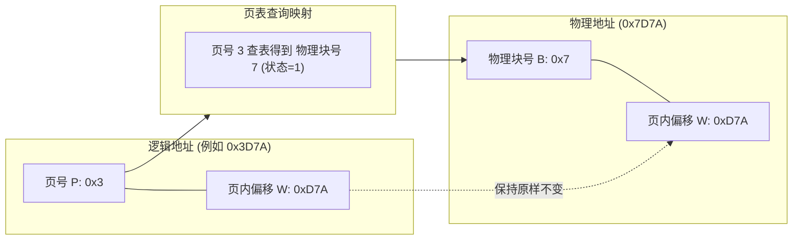

# 考点精要：存储管理、分页分段与页面置换算法

<Badge type="info" text="MOD-02 操作系统知识" />
<Badge type="tip" text="考查题号：上午第 25 ~ 27 题 (约 2 ~ 3 分)" />
<Badge type="danger" text="⭐⭐⭐⭐⭐ 5星必考" />

::: tip 🎯 45 分及格通关指引（极简避坑与得分铁律）
- **【45分必背核心得分点】**：
  1. **4KB 分页十六进制“低3位”秒拼法（10秒解题）**：$4\text{KB} = 2^{12}\text{B}$，对应十六进制最后 3 位（页内偏移）。去掉最后 3 位剩下的高位就是页号；查页表找到物理块号（转十六进制），直接替换拼在最后 3 位前面，秒出物理地址！
  2. **修改位（脏位）与写回磁盘判定**：
     - 状态位为 0：不在内存中，直接触发**缺页中断**；
     - 淘汰页面时，若修改位为 1（脏页），必须**写回外存磁盘**（产生 1 次磁盘 I/O）；若修改位为 0，直接丢弃覆盖，**写回磁盘页数为 0**。
  3. **Belady 异常终极秒杀**：物理块增加缺页率反而上升的现象，软考选择题**单选必定是先进先出置换算法（FIFO）**！LRU、OPT 绝不出现。
  4. **无快表下访存次数**：分页系统访问数据需 **2 次访存**（查页表+读数据）；段页式系统访问数据需 **3 次访存**（查段表+查页表+读数据）。
- **【高分选读 / 考场可战略放弃点】**：
  - 带有快表命中率、多级页表及缺页中断处理服务时间的复杂加权平均访存时间（EAT）长公式推导，分值低且计算繁琐，考场直接战略猜选或后置。
:::

---

## 一、 核心考纲与概念辨析

### 1. 分页、分段与段页式全景对照

| 维度对比 | 分页存储管理 (Paging) | 分段存储管理 (Segmentation) | 段页式存储管理 (Segment-Paging) |
| :--- | :--- | :--- | :--- |
| **地址空间维度** | **一维地址空间**（页长固定，程序员只需给出逻辑地址） | **二维地址空间**（段长可变，程序员必须显式指定段名和段内偏移） | **二维地址空间**（逻辑上按段组织，物理上按页切分） |
| **基本单位大小** | 物理大小固定（通常为 4KB，由硬件决定） | 逻辑大小可变（取决于程序模块、函数、数据块实际长度） | 段长可变，但每段内部均被切分成等长的数据页 |
| **碎片特征** | **无外部碎片**，仅存在微量页内**内部碎片**（最后一页未装满） | **无内部碎片**，但段与段之间产生大量动态**外部碎片** | 消除外部碎片，段内最后一页产生少量内部碎片 |
| **核心设计目的** | 极大提高内存利用率，方便离散分配 | 方便模块化编程、分段共享、动态链接与权限保护 | 兼具分段的逻辑模块化与分页的高内存利用率 |
| **未命中访存开销** | 无快表下访问数据需 **2 次访存**（查页表 + 读数据） | 无快表下访问数据需 **2 次访存**（查段表 + 读数据） | 无快表下访问数据需 **3 次访存**（查段表 + 查页表 + 读数据） |

---

### 2. 页面控制块的核心标志位

在请求分页系统中，页表不仅保存页号与物理块号的映射，还记录以下关键标志位（软考命题常客）：

| 标志位名称 | 别名 | 取值与物理语义 | 核心考法与性能影响 |
| :--- | :--- | :--- | :--- |
| **状态位 (Present Bit)** | 有效位 / 存在位 | `1` 表示已在内存，`0` 表示不在内存 | 当访问的页面状态位为 `0` 时，硬件自动触发**缺页中断 (Page Fault)** |
| **访问位 (Reference Bit)** | 引用位 | `1` 表示近期被访问，`0` 表示未被访问 | 供页面置换算法（如 CLOCK 算法）决定淘汰优先级 |
| **修改位 (Dirty Bit)** | 脏位 | `1` 表示在内存中被修改过，`0` 表示未被修改 | **淘汰时的磁盘 I/O 成本**：若为 `1`，淘汰时必须**写回外存磁盘**；若为 `0`，淘汰时直接覆盖，无需写磁盘！ |
| **保护位 (Protection)** | 权限位 | 读、写、执行权限编码 | 越权访问（如只读页面发起写操作）触发操作保护中断 |

---

## 二、 分析模型与核心计算推导

### 1. 逻辑地址到物理地址快速换算（十六进制位移秒杀法）

#### ① 核心推导原理
设系统页面大小为 $L = 2^k$ 字节（如页面大小为 $4\text{KB} = 4096\text{ 字节} = 2^{12}\text{ 字节}$，则 $k = 12$）：
- 逻辑地址二进制表示的低 $k$ 位为**页内偏移量 $W$**；
- 逻辑地址剥离低 $k$ 位后的剩余高位为**页号 $P$**。

$$\text{页号 } P = \lfloor \text{逻辑地址} / L \rfloor, \quad \text{页内偏移 } W = \text{逻辑地址} \bmod L$$

#### ② 十六进制秒杀技巧（无需乘除法与二进制转换）
- 若页面大小为 **$4\text{KB} = 2^{12}\text{B}$**：在十六进制下，$16 = 2^4$，12 位二进制正好对应 **3 位十六进制数**！
  - **逻辑地址末尾 3 位十六进制数**即为页内偏移量 $W$；
  - **去掉末尾 3 位后，前面所有十六进制数字**即为页号 $P$；
  - 查页表获取物理块号 $B$（转换为十六进制），将 $B$ 直接拼在页内偏移 $W$ 的前面，即为物理地址！
- **秒杀推演实例**：
  - 页面大小 4KB，逻辑地址为 `0x3D7A`，查页表可知 3 号页对应的物理块号为 7。
  - 末尾 3 位为 `D7A`（页内偏移保持不变）；
  - 高位为 `3`（对应 3 号页，对应物理块号 7）；
  - 物理地址直接拼接为：`0x7D7A`！

---

### 2. 快表 (TLB) 引入后的有效访存时间 (EAT)

在带有快表（联想寄存器 TLB）的现代分页系统中：
- 设快表访问时间为 $t_{\text{tlb}}$（纳秒级）；
- 内存访问时间为 $t_{\text{mem}}$；
- 快表命中率为 $\alpha$。

$$\text{有效访存时间 } EAT = \alpha \times (t_{\text{tlb}} + t_{\text{mem}}) + (1 - \alpha) \times (t_{\text{tlb}} + 2 \times t_{\text{mem}})$$
- **命中时**：访 TLB（$t_{\text{tlb}}$）直接得到物理块号，然后访问一次内存读写数据（$t_{\text{mem}}$），耗时 $t_{\text{tlb}} + t_{\text{mem}}$；
- **未命中时**：先查 TLB 失败（$t_{\text{tlb}}$），再访问内存查页表（$t_{\text{mem}}$），最后再次访问内存读写数据（$t_{\text{mem}}$），耗时 $t_{\text{tlb}} + 2 \times t_{\text{mem}}$。

---

### 3. 页面置换算法性能与 Belady 异常

#### ① 四大经典置换算法横向比对
1. **最佳置换算法 (OPT)**：淘汰未来最长时间内不再被访问的页面。性能理论上限，但无法预知未来，**仅作为基准参考，不可工程实现**。
2. **先进先出置换算法 (FIFO)**：淘汰最先进入内存的页面。实现最简单，但忽视了页面使用频次，可能导致频繁调出热点页。
3. **最近最久未使用置换算法 (LRU)**：淘汰过去最长时间未被访问的页面。利用局部性原理，性能最接近 OPT。
4. **时钟置换算法 (CLOCK / NRU)**：通过循环链表和访问位折中逼近 LRU。

#### ② Belady 异常深度剖析
- **定义**：在使用 **FIFO 算法**时，有时会出现**分配给进程的物理块数增加，缺页次数反而上升**的异常反常现象。
- **定理**：**LRU、OPT 等堆栈类置换算法严格证明绝不可能产生 Belady 异常！** 软考单选题只要问及 Belady 异常，直接锁定 FIFO 算法。

---

## 三、 命题题眼与陷阱防御

::: danger 🚨 常见命题陷阱盘点
1. **分段系统的“越界中断”双重校验**：
   - 分段系统中给出逻辑地址 `(段号 S, 段内偏移 W)` 时，必须做两次越界检查：
     - 检查段号 $S$ 是否 $\ge$ 段表长度（段号越界）；
     - **检查段内偏移 $W$ 是否 $\ge$ 该段的段长（段内偏移越界，极高频陷阱！）**。若 $W \ge$ 段长，直接触发越界异常中断，无需继续计算物理地址！
2. **缺页中断次数 vs 页面淘汰（写回磁盘）次数**：
   - **缺页中断次数**：只要访问的页面不在内存，就增加 1 次缺页中断；
   - **淘汰置换次数**：初始状态下空物理块装入不属于置换；当物理块满后，新调入页面挤出旧页面才计入淘汰；
   - **写回外存次数**：被淘汰的页面中，**只有“修改位为 1”的脏页才需要写回外存磁盘**！若修改位为 0，直接丢弃，不发生磁盘写操作。
3. **段页式系统的访存次数陷阱**：
   - 题目问“在段页式存储管理系统中，未配置快表时，CPU 读取一条指令或数据需要访问内存（ ）次” $\rightarrow$ **必须答 3 次**（第一次查段表找页表起始物理地址，第二次查页表找物理块号，第三次访存读数据）。若使用了快表且命中，则仅需 1 次访存。
:::

---

## 四、 典型真题溯源与逐项排错解析 (Distractor Analysis)

### 【真题精选 1】（考查分页地址变换与物理地址换算 · 2024上-机考回忆-Q26）
**题干**：某虚拟存储系统的页面大小为 4KB。页表部分内容如下表所示：

| 页号 | 物理块号 | 状态位 |
| :---: | :---: | :---: |
| 0 | 2 | 1 |
| 1 | 7 | 1 |
| 2 | 4 | 0 |
| 3 | 5 | 1 |

若进程访问逻辑地址为十六进制 `0x1E48`，则其对应的物理地址为（ ）。
A. `0x7E48`  
B. `0x4E48`  
C. `0x2E48`  
D. `0x1E48`  

::: details 💡 点击展开【正确答案与逐项排错剖析】
- **【正确答案】**：**A**
- **【核心考点】**：分页逻辑地址到物理地址映射计算，4KB 对应低 3 位十六进制偏移量。
- **【45分秒杀技巧】**：
  1. 页面大小 4KB，剥离十六进制末尾 3 位 `E48` 作为页内偏移（保持不变）；
  2. 剥离后高位为 `1`，说明是 1 号页；
  3. 查表：1 号页状态位为 1（在内存），物理块号是 7；
  4. 将 7 拼在 `E48` 前面，直接得出 `0x7E48`，10 秒秒选 A！
- **【逐项排错剖析】**：
  - **A 选项正确**：物理块号 7 与页内偏移 `E48` 精确拼接生成 `0x7E48`；
  - **B 选项排除**：`0x4E48` 是误将 2 号页的物理块号 4 拼入，且 2 号页状态位为 0（在内存外），若访问 2 号页会触发缺页中断；
  - **C 选项排除**：`0x2E48` 是误取 0 号页的物理块号 2 拼入；
  - **D 选项排除**：照抄逻辑地址 `0x1E48`，完全未做页表物理映射。
:::

---

### 【真题精选 2】（考查页面淘汰与修改位磁盘写回开销 · 2024下-机考回忆-Q27）
**题干**：某进程的页面大小为 4KB，其页表项包含“页号、物理块号、状态位、访问位、修改位”。系统分配给该进程 3 个物理块，初始已装入 0、1、2 号页，具体属性如下表所示：

| 页号 | 物理块号 | 状态位 | 访问位 | 修改位 |
| :---: | :---: | :---: | :---: | :---: |
| 0 | 10 | 1 | 1 | 0 |
| 1 | 12 | 1 | 0 | 1 |
| 2 | 15 | 1 | 0 | 0 |

若该进程访问逻辑地址 `0x3100`，采用页面置换算法淘汰访问位为 0 的页面（优先淘汰未访问且未修改的页面），则系统将发生（ 1 ），淘汰时需要执行写回磁盘操作的页数是（ 2 ）。
(1) A. 越界中断  B. 缺页中断  C. 浮点溢出  D. 保护中断  
(2) A. 0 页  B. 1 页  C. 2 页  D. 3 页  

::: details 💡 点击展开【正确答案与逐项排错剖析】
- **【正确答案】**：**(1) B  (2) A**
- **【核心考点】**：缺页中断判定机制与脏位（修改位）写回磁盘 I/O 成本计算。
- **【45分秒杀技巧】**：
  - (1) 逻辑地址 `0x3100` 去掉低 3 位得到页号 3，页号 3 不在内存中，必然触发**缺页中断**，秒选 B！
  - (2) 淘汰策略：优先淘汰“未访问且未修改”的页面，0 号页被访问过（访问位1）不能淘，1 号页被修改过（修改位1），2 号页访问位0且修改位0，因此淘汰 2 号页。2 号页修改位为 0（数据未变），直接丢弃覆盖即可，**需要写回磁盘的页数为 0**，秒选 A！
- **【逐项排错剖析】**：
  - **第 (1) 题排错**：
    - **B 选项正确**：3 号页不在内存物理块中，硬件自动触发缺页中断将页面从外存载入内存；
    - **A 选项排除**：越界中断仅在逻辑页号超出进程允许的最大分配页表长度时触发；
    - **C、D 选项排除**：与虚存页面管理机制无关。
  - **第 (2) 题排错**：
    - **A 选项正确**：淘汰的 2 号页脏位为 0，内存与外存数据完全一致，无需执行写盘，产生 0 次写磁盘；
    - **B 选项排除**：若误淘汰 1 号页（修改位为 1 的脏页），才需要发生 1 次写回磁盘；
    - **C、D 选项排除**：单次置换仅淘汰 1 个页面，不可能产生 2 页或 3 页写回。
:::

---

### 【真题精选 3】（考查 Belady 异常与置换算法特性 · 2024上-机考回忆-Q28）
**题干**：在虚拟存储管理系统中，增加分配给某进程的物理内存块数，其缺页中断次数反而可能增加，这种反常现象被称为 Belady 异常。下列页面置换算法中，可能出现 Belady 异常的是（ ）。
A. 最佳置换算法 (OPT)  
B. 先进先出置换算法 (FIFO)  
C. 最近最久未使用置换算法 (LRU)  
D. 最少使用置换算法 (LFU)  

::: details 💡 点击展开【正确答案与逐项排错剖析】
- **【正确答案】**：**B**
- **【核心考点】**：页面置换算法的堆栈特性与 Belady 异常识别。
- **【45分秒杀技巧】**：软考死记定论：**“Belady 异常只有 FIFO 会出现”**，秒选 B！
- **【逐项排错剖析】**：
  - **B 选项正确**：FIFO（先进先出）算法仅依据调入内存的时间先后来淘汰页面，忽视了程序局部性与访问频次，其驻留内存页面集合不满足单调包含关系，是唯一已被理论证明且软考考查的会产生 Belady 异常的算法；
  - **A 选项排除**：OPT 淘汰未来最久不用的页面，其集合具有严格包含性，绝不可能产生 Belady 异常；
  - **C 选项排除**：LRU 算法属于典型的堆栈型算法，分配 $m+1$ 个块时的页面集合必包含分配 $m$ 个块时的集合，已被数学证明绝无 Belady 异常；
  - **D 选项排除**：非软考对 Belady 异常的标准命题归属选项。
:::
