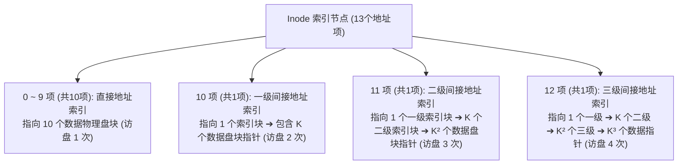

# 考点精要：文件管理索引结构与磁盘寻道算法

<Badge type="info" text="MOD-02 操作系统知识" />
<Badge type="tip" text="考查题号：上午第 26 ~ 28 题 (约 2 ~ 3 分)" />
<Badge type="danger" text="⭐⭐⭐⭐⭐ 5星必考" />

::: tip 🎯 45 分及格通关指引（极简避坑与得分铁律）
- **【45分必背核心得分点】**：
  1. **多级索引访盘次数与分界点（极高频大分项）**：
     - 单个索引块能容纳的指针数 $K = \text{盘块大小} / \text{地址项大小}$（通常为 $4\text{KB}/4\text{B} = 1024$）；
     - 直接索引（0~9号块）：**1 次访盘**；
     - 一级间接索引（10 ~ $10+K-1$ 号块，即 10~1033）：**2 次访盘**；
     - 二级间接索引（1034 以后）：**3 次访盘**；
     - 口诀：“**访问第几级间接索引，访盘次数就是几加一（在 Inode 在内存前提下）**”。
  2. **位示图换算避坑口诀**：
     - 第一眼看清“从 0 还是从 1 开始编号”；
     - 从 0 开始：字号 $i = b / W$，位号 $j = b \bmod W$；
     - 从 1 开始：**先统一减 1，做整除和取模，最后再统一加 1**！
  3. **磁盘最优交织错位存放总时间秒杀**：
     - **最优存放**：$N \times (\text{读单条用时} + \text{处理单条用时})$；
     - **顺序存放**：$(\text{读单条用时} + \text{处理单条用时}) + (N - 1) \times \text{磁盘转一圈周期}$。
- **【高分选读 / 考场可战略放弃点】**：
  - 磁盘寻道算法（SCAN/C-SCAN）带有 8 个以上长请求序列的手工磁道位移逐段累加计算，考场可直接按“外端 - 内端”极值粗估，无需费时逐段做长加法。
:::

---

## 一、 核心考纲与概念辨析

### 1. UNIX 多级索引节点 (Inode) 结构

UNIX/Linux 风格的文件系统采用多级索引结构来管理磁盘数据块，经典 Inode 结构通常包含 13 个地址项（编号 0 ~ 12）：

设磁盘物理盘块大小为 $B$ 字节，每个物理盘块地址指针占 $A$ 字节，则**单个索引块可容纳的地址项数量**为：
$$K = \frac{B}{A}$$

| 索引级别 | 涵盖的逻辑块号区间（从 0 开始） | 包含数据块总数 | 访问该区间数据所需的访盘次数 (Inode 已在内存) |
| :--- | :--- | :--- | :---: |
| **直接索引** (0~9项) | $0 \sim 9$ | $10$ 块 | **1 次**（直接读数据块） |
| **一级间接索引** (10项) | $10 \sim 10 + K - 1$ | $K$ 块 | **2 次**（1次读一级索引块 + 1次读数据块） |
| **二级间接索引** (11项) | $10 + K \sim 10 + K + K^2 - 1$ | $K^2$ 块 | **3 次**（1次读一级索引 + 1次读二级索引 + 1次读数据块） |
| **三级间接索引** (12项) | $10 + K + K^2 \sim 10 + K + K^2 + K^3 - 1$ | $K^3$ 块 | **4 次**（1次读一级 + 1次读二级 + 1次读三级 + 1次读数据块） |

---

### 2. 位示图法 (Bitmap) 存储管理

位示图使用二进制位的 `0` 和 `1` 分别表示磁盘物理块的空闲与占用状态。常用计算机字长 $W$ 位（通常 $W = 32$ 或 $16$）。

#### 两种编号体系换算对照（极高频陷阱）
- **体系 A：字号 $i$、位号 $j$、物理块号 $b$ 均从 0 开始编号**：
  $$b = i \times W + j$$
  $$i = \lfloor b / W \rfloor, \quad j = b \bmod W$$
- **体系 B：字号 $i$、位号 $j$、物理块号 $b$ 均从 1 开始编号**：
  $$b = (i - 1) \times W + j$$
  $$i = \lfloor (b - 1) / W \rfloor + 1, \quad j = ((b - 1) \bmod W) + 1$$

---

### 3. 磁盘移臂调度算法全景对比

| 调度算法 | 磁头移动服务策略 | 核心优缺点与特征 |
| :--- | :--- | :--- |
| **先来先服务 (FCFS)** | 严格按照进程发起 I/O 请求的到达先后顺序调度 | 绝对公平、无饥饿；但在请求分散时平均寻道距离过长，效率低下 |
| **最短寻道时间优先 (SSTF)**| 优先响应距离当前磁头所在磁道**最近**的请求 | 吞吐率高、平均寻道时间短；但可能导致边缘磁道的请求长久得不到响应，引发**“饥饿现象”** |
| **扫描算法 (SCAN / 电梯算法)**| 磁头沿当前移动方向单向运行，沿途响应请求，直到**最边缘磁道**后再反向扫描服务 | 彻底克服了饥饿现象，但在折返端附近的请求响应频次不对等 |
| **循环扫描算法 (C-SCAN)**| 磁头只沿**单向（如自内向外）**移动并服务请求；到达最边缘后**快速直接复位到最内端（途中不响应任何请求）**，继续单向服务 | 各磁道请求的平均等待时间分布最为均匀 |

---

## 二、 分析模型与核心推导演练

### 1. 磁盘旋转延迟与交织错位存放优化模型

#### ① 问题场景与物理约束
设磁盘以每圈 $R$ 毫秒恒定旋转，磁道上等距分布着 $N$ 个逻辑记录 $R_0, R_1, \dots, R_{N-1}$。
- 读取单条记录耗时：$t_{\text{read}} = R / N$；
- CPU 对每条读取记录的处理时间为 $t_{\text{proc}}$。
- **物理刚性约束**：在 CPU 进行内存处理的 $t_{\text{proc}}$ 时间内，**磁盘盘片不会停止旋转**！

#### ② 顺序存放 vs 优化交织存放对比推导
以经典参数为例：盘片每圈旋转周期 33ms，共划分为 11 个扇区（每扇区读取时间 $33 / 11 = 3\text{ms}$），CPU 处理单记录时间 $t_{\text{proc}} = 3\text{ms}$：
- **顺序存放（$R_0, R_1, R_2 \dots$ 连续排列）**：
  1. 读出 $R_0$ 耗时 3ms；
  2. CPU 处理 $R_0$ 耗时 3ms，此时盘片已转动了 1 个扇区，磁头正停留在 $R_2$ 的开头！
  3. 要想继续读取 $R_1$，必须等待盘片**空转整整一圈（33ms）**重新转到 $R_1$ 的起始位置；
  4. 读取并处理后 10 条记录，每条均需耗费“空转一圈 33ms + 读处理 6ms”；
  5. 处理完全部 11 条记录的总耗时为：$6 + 10 \times (33 + 3) = 366\text{ms}$！
- **优化交织错位存放**：
  1. 调整扇区排列，使得处理完 $R_0$（用时 3ms）时，磁头下方**恰好旋转到 $R_1$ 的起始边界**；
  2. 实现“无缝接续读取”，盘片只需连续旋转两圈即可无缝读完所有记录；
  3. 最优总时间仅为：$11 \times (3 + 3) = 66\text{ms}$！

---

## 三、 命题题眼与陷阱防御

::: danger 🚨 常见命题陷阱盘点
1. **多级索引访盘次数的边界判断**：
   - 题目问“访问逻辑块号 $N$ 需要几次访盘”：
     - 先算每个索引块容纳指针数 $K = B / A$；
     - 若 $N < 10$：直接索引，**1 次**；
     - 若 $10 \le N < 10 + K$：一级间接索引，**2 次**；
     - 若 $10 + K \le N < 10 + K + K^2$：二级间接索引，**3 次**。
   - **审题看清前提**：题干通常默认“索引节点 Inode 已在内存中”。如果题干特意指出“Inode 尚在外存磁盘中”，则所有访问次数必须额外 $+1$ 次用于读入 Inode！
2. **位示图的“从 0 还是从 1 开始”**：
   - 审题第一步永远是核对题目中字号、位号、块号的起始编号！
   - 若从 0 开始编号，直接套整除与取模：字号 $i = b / W$，位号 $j = b \% W$；
   - 若从 1 开始编号，必须先统一减 1，算完后再统一加 1：字号 $i = (b - 1) / W + 1$，位号 $j = (b - 1) \% W + 1$。
3. **SCAN 算法的磁头当前移动方向**：
   - 求解磁头移动总距离时，必须先看清题干中当前磁头是**向磁道增加方向（向外/大）**还是**向磁道减小方向（向内/小）**移动，方向搞反将直接算错路径总长。
:::

---

## 四、 典型真题溯源与逐项排错解析 (Distractor Analysis)

### 【真题精选 1】（考查多级索引寻址与访盘次数 · 2024上-机考回忆-Q27~28）
**题干**：某文件系统采用索引节点管理，索引节点中包含 10 个直接地址项、1 个一级间接地址项和 1 个二级间接地址项。设磁盘物理块大小为 4KB，每个物理块地址项占 4 字节。若在索引节点已调入内存的前提下，要访问该文件的第 1025 号逻辑块（逻辑块号从 0 开始编号），该逻辑块对应的索引项属于（ 1 ），访问该逻辑块需要进行（ 2 ）次访盘。
(1) 
A. 直接地址项  
B. 一级间接地址项  
C. 二级间接地址项  
D. 三级间接地址项  
(2) 
A. 1  
B. 2  
C. 3  
D. 4  

::: details 💡 点击展开【正确答案与逐项排错剖析】
- **【正确答案】**：**(1) B  (2) B**
- **【核心考点】**：多级索引节点各级覆盖范围递推与访盘次数分析。
- **【45分秒杀技巧】**：
  1. 单个索引块能放 $4\text{KB} / 4\text{B} = 1024$ 个地址；
  2. 直接索引管 0 ~ 9 号（共 10 块）；一级间接索引管 10 ~ $10+1024-1 = 1033$ 号；
  3. 待访 1025 在 $[10, 1033]$ 之间，必定属于**一级间接地址项**！秒杀 (1)；
  4. 读一级间接索引：1 次读一级索引块 + 1 次读目标数据块 = **2 次访盘**，秒杀 (2)！
- **【逐项排错剖析】**：
  - **第 (1) 题排错**：
    - **B 选项正确**：1025 号落入一级间接地址覆盖的 $[10, 1033]$ 区间内；
    - **A 选项排除**：直接地址项仅覆盖 $[0, 9]$ 号逻辑块；
    - **C 选项排除**：二级间接地址项覆盖 $[1034, 1034 + 1024^2 - 1]$ 区间；
    - **D 选项排除**：该文件系统 Inode 未配置三级索引项。
  - **第 (2) 题排错**：
    - **B 选项正确**：索引节点已在内存中，先访问 1 次磁盘调入一级索引块，再根据其内部指针访问 1 次磁盘调入目标数据块，合计 2 次；
    - **A 选项排除**：直接索引才是 1 次访盘；
    - **C 选项排除**：二级间接索引才需要 3 次访盘（一级索引+二级索引+数据块）；
    - **D 选项排除**：三级间接索引才需要 4 次访盘。
:::

---

### 【真题精选 2】（考查磁盘旋转延迟与优化存放总时间 · 2024下-机考回忆-Q28）
**题干**：某磁盘盘面被划分为 11 个扇区，分别存放逻辑记录 $R_0 \sim R_{10}$。盘片以 33ms/圈 的恒定速度单向旋转，每读出一个记录需要 3ms，CPU 接收并处理一个记录需要 3ms。
若记录以 $R_0, R_1, \dots, R_{10}$ 顺序存放，处理完这 11 个记录共需要（ 1 ）ms；若采用最优交织错位存放方案，处理完这 11 个记录共需要（ 2 ）ms。
(1) A. 33  B. 66  C. 366  D. 396  
(2) A. 33  B. 66  C. 132  D. 366  

::: details 💡 点击展开【正确答案与逐项排错剖析】
- **【正确答案】**：**(1) C  (2) B**
- **【核心考点】**：磁盘旋转延迟特性与交织错位存放优化机制。
- **【45分秒杀技巧】**：
  - 最优存放：$11 \times (3 + 3) = 66\text{ms}$，直接秒选 (2) 为 B！
  - 顺序存放：读完并处理第 1 个用时 6ms，磁盘已转到 $R_2$，要读 $R_1$ 必须等盘片转完一圈（33ms）。后续 10 个记录每个都要等一整圈：$6 + 10 \times 36 = 366\text{ms}$，秒选 (1) 为 C！
- **【逐项排错剖析】**：
  - **第 (1) 题排错**：
    - **C 选项正确**：顺序存放下除第 1 个记录外，后续每个记录的读取均因 CPU 处理耗时越过目标扇区，必须额外空转等待一整圈（33ms），总耗时为 $(3+3) + 10 \times 36 = 366\text{ms}$；
    - **A、B 选项排除**：忽视了磁盘单向旋转无法回退导致的空转周期惩罚；
    - **D 选项排除**：错误按 11 圈全额空转累加计算。
  - **第 (2) 题排错**：
    - **B 选项正确**：最优交织错位存放确保处理完当前记录时，磁头恰好到达下一个待读记录的起点，实现零空转连续流水读取，总耗时为 $11 \times (3 + 3) = 66\text{ms}$；
    - **A 选项排除**：33ms 仅为磁盘空转一圈时间，未计入 CPU 实际数据处理耗时；
    - **C、D 选项排除**：未能达到最优无缝流水调度的极限性能。
:::

---

### 【真题精选 3】（考查位示图物理块号与字号位号换算 · 2024下-机考回忆-Q29）
**题干**：某计算机系统的字长为 32 位，采用位示图法管理磁盘存储空间的分配与回收。若系统中的字号、位号和磁盘物理块号均**从 1 开始编号**。则第 1025 号物理块在位示图中的字号和位号分别为（ ）。
A. 32，32  
B. 32，33  
C. 33，1  
D. 33，32  

::: details 💡 点击展开【正确答案与逐项排错剖析】
- **【正确答案】**：**C**
- **【核心考点】**：从 1 开始编号体系下的位示图索引换算公式。
- **【45分秒杀技巧】**：
  - 题目注明“**从 1 开始编号**”：
  1. 先减 1：$1025 - 1 = 1024$；
  2. 除以 32：$1024 / 32 = 32$，余数 $1024 \bmod 32 = 0$；
  3. 各加 1：字号 $= 32 + 1 = 33$，位号 $= 0 + 1 = 1$。直接秒选 C！
- **【逐项排错剖析】**：
  - **C 选项正确**：$(33 - 1) \times 32 + 1 = 32 \times 32 + 1 = 1025$，严密吻合从 1 开始编号的物理映射；
  - **A 选项排除**：第 32 字第 32 位对应的物理块号为 $(32 - 1) \times 32 + 32 = 1024$，恰好是 1025 号的前一块；
  - **B 选项排除**：计算机字长只有 32 位，位号不可能达到 33；
  - **D 选项排除**：第 33 字第 32 位对应的物理块号为 $(33 - 1) \times 32 + 32 = 1056$。
:::

---

## 考点通关与速查导航

- 📖 **全科公式速查**：[上午综合知识高频计算公式与速解模板速查表](../formula-cheat-sheet.md)
- 🚨 **全科避坑指南**：[上午综合知识高频易错避坑清单与秒杀模板库](../exam-pitfalls-and-short-cuts.md)
- 🏠 **专题备考导航**：[上午综合知识备考导航](../index.md)
