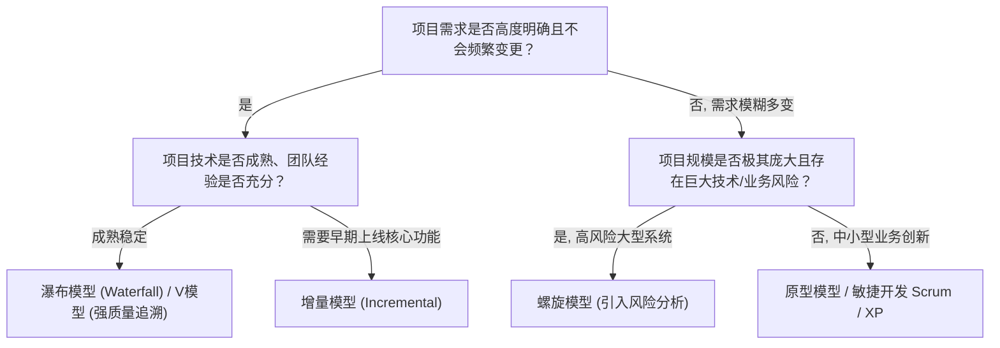

# 考点精要：软件开发模型与敏捷方法辨析

- **所属模块**：MOD-03 软件工程基础
- **考查题号**：上午第 14 ~ 18 题（约 2 ~ 3 分）
- **重要程度**：⭐⭐⭐⭐⭐（高频必考）

---

## 一、 核心考纲与概念辨析

### 1. 传统软件开发模型全景对比矩阵

| 开发模型 | 核心特征与工作机制 | 适用项目场景与适用边界 | 核心优缺点 |
| :--- | :--- | :--- | :--- |
| **瀑布模型 (Waterfall)** | 线性顺序流动，阶段严格划分，上一阶段输出作为下一阶段输入，**不支持返工回退** | **需求明确、稳定且技术成熟**的传统软件系统 | **优点**：阶段规范，易把控里程碑 **缺点**：缺乏灵活性，软件晚期才可见，风险严重滞后 |
| **原型模型 (Prototyping)** | 快速构建低保真/可运行界面原型，供用户交互试用并收集反馈，反复迭代明确需求 | **需求模糊、不确定或动态变化**的项目初期 | **优点**：大幅降低需求理解歧义 **缺点**：易将抛弃型原型演变为劣质系统，架构容易松散 |
| **增量模型 (Incremental)** | 将系统拆分为多个功能增量，每个增量按瀑布流水开发，**分批逐步交付可运行软件** | 核心需求明确，需快速抢占市场或资金/人力有限的项目 | **优点**：用户可早期试用核心功能，分摊财务风险 **缺点**：系统总体架构需极强前瞻性，增量间接口集成复杂度高 |
| **螺旋模型 (Spiral)** | 结合瀑布模型与原型模型，融合四象限演进：**制定计划 $\rightarrow$ 风险分析 $\rightarrow$ 实施工程 $\rightarrow$ 客户评估** | **高风险、大型、极其复杂**的关键核心系统 | **核心特征**：**引入“风险分析”机制** **缺点**：高度依赖风险评估专家的敏锐度 |
| **喷泉模型 (Fountain)** | 以对象为驱动，各阶段（分析、设计、编码）**无缝连接、高度重叠、反复迭代** | **面向对象 (OO)** 开发项目 | **核心特征**：**“无缝”与“迭代”**（由水喷出又落下的隐喻） |
| **V 模型 (V-Model)** | 将测试活动贯穿整个生命周期，**测试阶段与开发阶段严格一一对应** | 需求稳定、质量可靠性要求极高的项目（如航空、医疗） | **对应关系**： 需求分析 $\leftrightarrow$ 验收测试 概要设计 $\leftrightarrow$ 系统测试 详细设计 $\leftrightarrow$ 集成测试 编码实现 $\leftrightarrow$ 单元测试 |
| **构件组装模型 (CBSD)** | 利用现成的商业成熟软构件（COTS）通过标准化接口插拔组装软件 | 具有成熟构件库的业务领域开发 | **核心特征**：强调**软件复用（Reusability）**，极大缩短开发周期 |

---

### 2. 敏捷开发方法 (Agile) 核心体系对比

敏捷开发遵循《敏捷宣言》：**个体与交互高于流程与工具、可工作的软件高于详尽的文档、客户协作高于合同谈判、响应变化高于遵循计划**。

| 敏捷方法 | 核心理念与核心实践 | 软考高频命题锚点 |
| :--- | :--- | :--- |
| **Scrum** | 以“冲刺（Sprint，2~4周）”为周期迭代交付增量； • **三大角色**：产品负责人 (PO)、敏捷教练 (Scrum Master)、开发团队 (Team)； • **三大工件**：产品待办列表 (Product Backlog)、Sprint待办列表 (Sprint Backlog)、潜在可交付产品增量 (Increment)； • **四大会议**：Sprint 计划会、每日站会、Sprint 评审会、Sprint 回顾会 | - PO 负责管理产品待办列表并定义优先级 - Scrum Master 负责清除团队推进障碍，非传统自上而下的项目经理 - 增量必须达到预定义的“完成定义 (Definition of Done, DoD)” |
| **极限编程 (XP)** | 针对小团队高风险项目，以代码为核心，强调快速反馈； • **四大价值观**：沟通、简单、反馈、勇气； • **五大原则**：快速反馈、简单假设、逐步修改、提倡变革、高质量工作 | **十二大最佳实践（必背高频考点）**： 1. 计划游戏 2. 小型发布 3. 隐喻 4. 简单设计 5. **测试驱动开发 (TDD)** 6. **重构 (Refactoring)** 7. **结对编程 (Pair Programming)** 8. **集体代码所有权** 9. **持续集成 (CI)** 10. 每周40小时工作制 11. **现场客户 (On-site Customer)** 12. 编码标准 |
| **看板方法 (Kanban)** | 通过可视化看板管理价值流，严格实施**在制品限制 (WIP Limit)**，消除瓶颈，实现拉动式流动生产 | 核心原则：可视化工作流、限制在制品、管理流动、明确流程规则 |

---

## 二、 模型选型决策树与 V 模型映射模型

### 1. 软件过程模型选型决策树

### 2. V 模型开发阶段与测试阶段严格对称映射

$$\begin{aligned}
\text{需求分析 (Requirements)} &\longleftrightarrow \text{验收测试 (Acceptance Testing)} \\
\text{概要设计 / 架构设计} &\longleftrightarrow \text{系统测试 (System Testing)} \\
\text{详细设计 (Detail Design)} &\longleftrightarrow \text{集成测试 (Integration Testing)} \\
\text{编码实现 (Coding)} &\longleftrightarrow \text{单元测试 (Unit Testing)}
\end{aligned}$$

---

## 三、 命题题眼与陷阱防御

> [!CAUTION]
> ### 🚨 常见命题陷阱盘点
> 1. **“风险分析”的唯一匹配性**：凡是题干提到“**特别适用于大型、复杂且存在高风险的项目**”或者“**将风险分析贯穿各个迭代周期**”，选项 100% 为**螺旋模型 (Spiral Model)**！
> 2. **V 模型的测试层级对应倒置**：
>    - 需求分析 $\leftrightarrow$ **验收测试**（非单元测试！）
>    - 概要设计 $\leftrightarrow$ **系统测试**
>    - 详细设计 $\leftrightarrow$ **集成测试**
>    - 编码 $\leftrightarrow$ **单元测试**
>    出题常偷换“详细设计对应系统测试”，务必牢记 V 字形左右对称对应关系。
> 3. **喷泉模型的关键字识别**：凡是题干中出现“**面向对象开发**”、“**阶段间无缝衔接且反复迭代**”，100% 对应**喷泉模型**。
> 4. **XP 核心实践识别**：题干常列出若干实践，询问哪些属于极限编程（XP）。牢记高频核心四项：**结对编程、测试驱动开发(TDD)、持续集成、现场客户**。

---

## 四、 典型真题溯源与逐项排错解析 (Distractor Analysis)

### 【真题精选 1】（考查螺旋模型核心特征 · 2023上-上午-Q15）
**题干**：在常用的软件过程模型中，（ 1 ）模型结合了瀑布模型的线性和原型模型的迭代特征，并且在该模型的各个阶段都加入了（ 2 ），特别适合于大型复杂且高风险的软件项目。
(1) A. 增量模型  B. 喷泉模型  C. 螺旋模型  D. V 模型  
(2) A. 质量评审  B. 风险分析  C. 自动化测试  D. 持续集成  

- **【正确答案】**：**(1) C  (2) B**
- **【核心考点】**：螺旋模型的定义、阶段活动与风险驱动特征。
- **【逐项排错剖析】**：
  - **第 (1) 题排错**：
    - **A 选项排除**：增量模型是将系统拆分为多个小模块按批次交付，不以风险驱动为核心；
    - **B 选项排除**：喷泉模型的核心是面向对象的“无缝连接与反复迭代”；
    - **C 选项正确**：螺旋模型（Spiral Model）经典地融合了瀑布模型阶段划分与原型模型迭代，专为大型高风险项目定制；
    - **D 选项排除**：V 模型突出的是开发与测试的对称追溯。
  - **第 (2) 题排错**：
    - **B 选项正确**：螺旋模型区别于其他所有传统模型的核心标识即为“**风险分析 (Risk Analysis)**”；
    - **A、C、D 选项排除**：质量评审普遍存在于所有工程模型；自动化测试和持续集成是现代敏捷 XP 的工程实践，并非传统螺旋模型的四象限活动。

---

### 【真题精选 2】（考查敏捷开发与极限编程 XP 实践 · 2022下-上午-Q17）
**题干**：极限编程（XP）是一种轻量级、灵巧的敏捷软件开发方法，以下不属于极限编程十二大核心实践的是（ ）。
A. 结对编程（Pair Programming）  
B. 测试驱动开发（TDD）  
C. 现场客户（On-site Customer）  
D. 严格变更控制委员会（CCB）审批  

- **【正确答案】**：**D**
- **【核心考点】**：极限编程（XP）十二大核心实践的识别与敏捷价值观辨析。
- **【逐项排错剖析】**：
  - **A 选项排除**：结对编程（两位程序员共用一台电脑，一人写代码，一人做审查）是 XP 极其提倡的代码质量实践；
  - **B 选项排除**：测试驱动开发（先写失败的单元测试，再编写实现代码，最后重构）是 XP 核心实践；
  - **C 选项排除**：现场客户（业务用户全职驻场团队，随时澄清需求并验收功能）是敏捷高效协作的标志实践；
  - **D 选项正确**：变更控制委员会（Change Control Board, CCB）是**传统重量级项目管理（如 CMMI / 瀑布模型）**中繁琐的行政审批机制，与敏捷拥抱变化、响应变化的核心价值观背道而驰，不属于 XP 实践。
