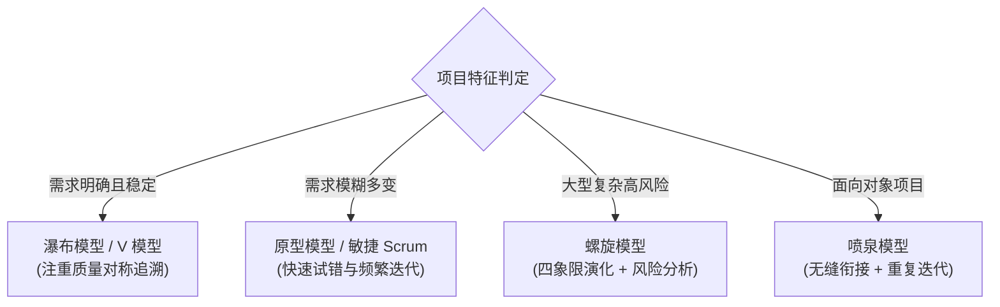

# 考点精要：软件开发模型与敏捷方法辨析

<Badge type="info" text="MOD-03 软件工程" />
<Badge type="tip" text="考查题号：上午第 14 ~ 18 题 (约 2 ~ 3 分)" />
<Badge type="danger" text="⭐⭐⭐⭐⭐ 5星必考" />
<Badge type="warning" text="弱贯通下午" />

::: tip 🎯 45 分及格通关指引
- **【45分必背核心得分点】**：
  1. **经典开发模型秒杀特征词**：
     - **瀑布模型**：需求明确稳定、线性顺序、阶段严格，缺乏灵活性；
     - **原型模型**：需求模糊、不确定或动态变化，快速构建交互；
     - **螺旋模型**：**大型、复杂、高风险**，引入**风险分析**；
     - **喷泉模型**：**面向对象 (OO)** 开发，阶段间**“无缝衔接与反复迭代”**；
     - **V 模型**：开发与测试**严格对称对应**（需求分析 $\leftrightarrow$ 验收测试、概要设计 $\leftrightarrow$ 系统测试、详细设计 $\leftrightarrow$ 集成测试、编码 $\leftrightarrow$ 单元测试）。
  2. **敏捷方法核心秒杀**：
     - **Scrum 框架**：三大角色（PO负责需求与优先级、Scrum Master扫除障碍、团队执行）、三大工件（Product Backlog、Sprint Backlog、增量）、四大会议（计划会、每日站会、评审会、回顾会）；
     - **极限编程 (XP)**：结对编程、测试驱动开发 (TDD)、持续集成 (CI)、现场客户。
- **【高分选读 / 考场可战略放弃点】**：
  - CMMI 5 个成熟度级别（初始级、已管理级、已定义级、定量管理级、优化级）内部数十个专业过程域 (PA) 英文简写，考场直接放弃不背。
:::

---

## 一、 核心考纲与概念辨析

### 1. 传统软件开发模型全景对比矩阵

| 开发模型 | 核心特征与工作机制 | 适用项目场景与适用边界 | 核心优缺点 |
| :--- | :--- | :--- | :--- |
| **瀑布模型 (Waterfall)** | 线性顺序流动，阶段严格划分，上一阶段输出作为下一阶段输入，**不支持返工回退** | **需求明确、稳定且技术成熟**的传统软件系统 | **优点**：阶段规范，易把控里程碑 **缺点**：缺乏灵活性，软件晚期才可见，风险严重滞后 |
| **原型模型 (Prototyping)** | 快速构建低保真/可运行界面原型，供用户交互试用并收集反馈，反复迭代明确需求 | **需求模糊、不确定或动态变化**的项目初期 | **优点**：大幅降低需求理解歧义 **缺点**：易将抛弃型原型演变为劣质系统，架构容易松散 |
| **增量模型 (Incremental)** | 将系统拆分为多个功能增量，每个增量按瀑布流水开发，**分批逐步交付可运行软件** | 核心需求明确，需快速抢占市场或资金/人力有限的项目 | **优点**：用户可早期试用核心功能，分摊财务风险 **缺点**：系统总体架构需极强前瞻性，增量间接口集成复杂度高 |
| **螺旋模型 (Spiral)** | 结合瀑布模型与原型模型，融合四象限演进：**制定计划 $\rightarrow$ 风险分析 $\rightarrow$ 实施工程 $\rightarrow$ 客户评估** | **高风险、大型、极其复杂**的关键核心系统 | **核心特征**：**引入“风险分析”机制** **缺点**：高度依赖风险评估专家的敏锐度 |
| **喷泉模型 (Fountain)** | 以对象为驱动，各阶段（分析、设计、编码）**无缝连接、高度重叠、反复迭代** | **面向对象 (OO)** 开发项目 | **核心特征**：**“无缝”与“迭代”**（由水喷出又落下的隐喻） |
| **V 模型 (V-Model)** | 将测试活动贯穿整个生命周期，**测试阶段与开发阶段严格一一对应** | 需求稳定、质量可靠性要求极高的项目（如航空、医疗） | **对应关系**： 需求分析 $\leftrightarrow$ 验收测试 概要设计 $\leftrightarrow$ 系统测试 详细设计 $\leftrightarrow$ 集成测试 编码实现 $\leftrightarrow$ 单元测试 |

---

### 2. 敏捷开发方法 (Agile) 核心体系对比

| 敏捷方法 | 核心理念与核心实践 | 软考高频命题锚点 |
| :--- | :--- | :--- |
| **Scrum** | 以“冲刺（Sprint，2~4周）”为周期迭代交付增量； • **三大角色**：产品负责人 (PO)、敏捷教练 (Scrum Master)、开发团队 (Team)； • **三大工件**：产品待办列表 (Product Backlog)、Sprint待办列表 (Sprint Backlog)、潜在可交付产品增量 (Increment)； • **四大会议**：Sprint 计划会、每日站会、Sprint 评审会、Sprint 回顾会 | - PO 负责管理产品待办列表并定义优先级 - Scrum Master 负责清除团队推进障碍，非传统自上而下的项目经理 - 增量必须达到预定义的“完成定义 (Definition of Done, DoD)” |
| **极限编程 (XP)** | 针对小团队高风险项目，以代码为核心，强调快速反馈； • **四大价值观**：沟通、简单、反馈、勇气； • **十二大最佳实践**：**结对编程**、**测试驱动开发 (TDD)**、**持续集成 (CI)**、**现场客户**、重构、小型发布、隐喻、代码集体所有权等 | 考查高频四大实践归属 |

---

## 二、 模型选型决策树与 V 模型映射

---

## 三、 命题题眼与陷阱防御

::: danger 🚨 常见命题陷阱盘点
1. **“风险分析”的唯一匹配性**：凡是题干提到“**特别适用于大型、复杂且存在高风险的项目**”或者“**将风险分析贯穿各个迭代周期**”，选项 100% 为**螺旋模型 (Spiral Model)**！
2. **V 模型的测试层级对应倒置**：
   - 需求分析 $\leftrightarrow$ **验收测试**（非单元测试！）
   - 概要设计 $\leftrightarrow$ **系统测试**
   - 详细设计 $\leftrightarrow$ **集成测试**
   - 编码 $\leftrightarrow$ **单元测试**
3. **喷泉模型的关键字识别**：凡是题干中出现“**面向对象开发**”、“**阶段间无缝衔接且反复迭代**”，100% 对应**喷泉模型**。
:::

---

## 四、 典型真题溯源与逐项排错解析 (Distractor Analysis)

### 【真题精选 1】（考查 Scrum 敏捷核心角色与职责 · 2024下-机考回忆-Q16）

**题干**：在敏捷开发 Scrum 框架中，（ ）负责维护和管理产品待办事项列表（Product Backlog），并负责确定产品功能特性的商业价值与优先级顺序。
- A. 敏捷教练 (Scrum Master)  
- B. 产品负责人 (Product Owner, PO)  
- C. 开发团队 (Development Team)  
- D. 项目赞助人 (Project Sponsor)  

::: details 💡 点击展开【正确答案与逐项排错剖析】
- **【正确答案】**：**B**
- **【核心切入点】**：区分 Scrum 三大核心角色——PO 管“做什么与优先级”，Scrum Master 管“流程与清障”，Team 管“怎么做与交付”。

#### 逐项排错剖析 (Distractor Analysis)
- **选项 A (Scrum Master) 错误**：Scrum Master 是敏捷过程的教练与服务型领导，主要职责是保障团队遵循 Scrum 规则，并积极协助团队消除日常工作中的外部阻碍，不负责定义需求优先级。
- **选项 B (Product Owner) 正确**：PO 代表客户利益，拥有产品功能定义的最终裁决权，专门负责整理 Product Backlog 并根据商业回报排定开发优先级。
- **选项 C (开发团队) 错误**：开发团队负责在每个 Sprint 冲刺期内将 Backlog 条目转化为潜在可交付的软件增量，决定技术实现方式。
- **选项 D (项目赞助人) 错误**：传统项目管理的投资方角色，并非 Scrum 框架内部定义的三大核心角色。
:::

---

### 【真题精选 2】（考查螺旋模型核心特征 · 2024上-机考回忆-Q15）

**题干**：某大型国防信息系统技术极其复杂，存在许多未知的前沿技术探索和高度的不确定性。为了有效规避开发过程中的各种重大风险，该项目最适宜采用的软件开发过程模型是（ ）。
- A. 瀑布模型  
- B. 增量模型  
- C. 螺旋模型  
- D. 喷泉模型  

::: details 💡 点击展开【正确答案与逐项排错剖析】
- **【正确答案】**：**C**
- **【核心切入点】**：“高风险、大型复杂”是螺旋模型的命题绝对题眼。

#### 逐项排错剖析 (Distractor Analysis)
- **选项 A (瀑布模型) 错误**：瀑布模型不支持返工，风险严重滞后到系统测试晚期，极不适合高风险和不确定性项目。
- **选项 B (增量模型) 错误**：增量模型要求核心体系架构在早期高度稳定清晰，难以承载高度未知的重大技术探索。
- **选项 C (螺旋模型) 正确**：螺旋模型（Spiral Model）在每个循环周期都专门设置了“风险分析”象限，特别适合大型复杂且伴随高风险的项目。
- **选项 D (喷泉模型) 错误**：喷泉模型适用于面向对象开发，主打无缝与迭代，未包含显式的风险分析驱动机制。
:::

---

## 考点通关与速查导航

- 📖 **全科公式速查**：[上午综合知识高频计算公式与速解模板速查表](../formula-cheat-sheet.md)
- 🚨 **全科避坑指南**：[上午综合知识高频易错避坑清单与秒杀模板库](../exam-pitfalls-and-short-cuts.md)
- 🏠 **专题备考导航**：[上午综合知识备考导航](../index.md)
