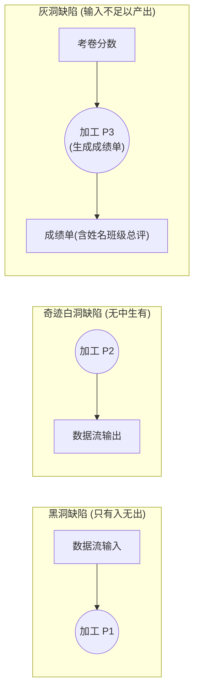

# 考点精要：需求工程与结构化分析 DFD

<Badge type="info" text="MOD-03 软件工程" />
<Badge type="tip" text="考查题号：上午第 18 ~ 20 题 (约 2 ~ 3 分)" />
<Badge type="danger" text="⭐⭐⭐⭐⭐ 5星必考" />
<Badge type="tip" text="强贯通下午 (下午题1 必考15分)" />

::: tip 🎯 45 分及格通关指引
- **【45分必背核心得分点】**：
  1. **DFD 连线合法性铁律**：**数据流的起点或终点必须至少有一端是“加工”！**
     - 实体 $\leftrightarrow$ 实体（❌ 非法，系统管不到外部直接通信）；
     - 实体 $\leftrightarrow$ 存储（❌ 非法，实体不能越过系统加工直接读写存储）；
     - 存储 $\leftrightarrow$ 存储（❌ 非法，存储间不能无加工自发同步）。
  2. **加工三大致命缺陷识别**：
     - **黑洞**：只有输入流，没有输出流（数据凭空消失）；
     - **奇迹 / 白洞**：只有输出流，没有输入流（无中生有）；
     - **灰洞**：输入的数据不足以生成输出数据项。
  3. **数据字典极简速记**：`=` 定义为，`+` 连接与，`[ | ]` 三选一，`{ }` 循环重复，`( )` 可选。
- **【高分选读 / 考场可战略放弃点】**：
  - 形式化需求工程规范语言（如 Z 语言、Petri 网状态方程求解），考场出现直接跳过。
:::

---

## 一、 核心考纲与概念辨析

### 1. 需求工程全景生命周期

```
需求工程
├── 需求开发：需求获取、需求分析、需求规格说明 (SRS)、需求验证
└── 需求管理：需求基线 (Baseline) 变更控制与需求跟踪矩阵 (RTM)
```

---

### 2. 数据流图 (DFD) 四大核心图元（贯通下午题 1）

| DFD 图元名称 | 图形符号 (Yourdon 风格) | 语义含义与规则约束 | 软考常见命题漏洞 |
| :--- | :--- | :--- | :--- |
| **外部实体 (Entity)** | **矩形框** | 系统外部的人员、组织、外部设备或第三方软件系统（数据的源点或终点） | 实体存在于系统边界之外，不属于系统内部构件 |
| **加工 / 处理 (Process)** | **圆形或圆角矩形** | 对数据进行转换、计算或处理的操作逻辑，必须包含输入和输出 | 加工必须能够依据输入生成输出，有编号（如 1.1, 1.2） |
| **数据存储 (Data Store)** | **双平行横线（或右开口矩形）** | 系统内部暂时或长期保存的数据集合（如数据库表、文件、缓存） | 数据存储必须通过加工进行读写，不能自发流向实体 |
| **数据流 (Data Flow)** | **带箭头的直线或弧线** | 处于流动状态的数据，箭头标明流动方向，必须标有数据名称 | 两个加工之间的数据流表示中间处理结果 |

---

### 3. 数据字典 (DD) 符号体系速查

| 符号 | 含义 | 示例 | 释义 |
| :--- | :--- | :--- | :--- |
| `=` | 被定义为 | `客户信息 = 姓名 + 手机号` | 客户信息由姓名和手机号拼接组成 |
| `+` | 顺序连接 / 与 | `A + B` | A 和 B 依次顺序出现 |
| `[ | ]` | 或 / 选择其一 | `支付方式 = [微信支付 | 支付宝 | 银行卡]` | 括号内选项三选一 |
| `{ }` | 重复 | `{订单项}` 或 $1\{\text{订单项}\}10$ | 订单项循环重复出现 1 到 10 次 |
| `( )` | 可选 / 0或1次 | `地址 + (邮编)` | 邮编属于可选字段 |

---

## 二、 分析模型与数据流守恒校验



---

## 三、 命题题眼与陷阱防御

::: danger 🚨 常见命题陷阱盘点
1. **顶层图的数据存储陷阱**：顶层 DFD 只能有 1 个代表全系统的核心大加工与若干外部实体，**原则上绝对不允许出现数据存储**！
2. **父子图平衡守恒规则**：子图输入输出流在数量和名称上必须与父图加工完全对应一致。
3. **数据字典符号混淆**：`[ | ]` 代表选择其一，`( )` 代表可选。
:::

---

## 四、 典型真题溯源与逐项排错解析 (Distractor Analysis)

### 【真题精选 1】（考查 DFD 数据流合法性约束 · 2024下-机考回忆-Q17）

**题干**：在结构化系统分析中，数据流图（DFD）用于描述系统中数据的流动和变换。下列关于数据流的画法中，符合 DFD 建模规则的是（ ）。
- A. 从外部实体直接画一条数据流指向另一个外部实体  
- B. 从外部实体直接画一条数据流指向数据存储  
- C. 从数据存储直接画一条数据流指向另一个数据存储  
- D. 从加工画一条数据流指向数据存储  

::: details 💡 点击展开【正确答案与逐项排错剖析】
- **【正确答案】**：**D**
- **【核心切入点】**：数据流的源端或宿端必须至少有一端是“加工”。

#### 逐项排错剖析 (Distractor Analysis)
- **选项 A 错误**：两个外部实体之间的数据流动属于系统外部行为，软件系统无法捕获和处理，不能在系统的 DFD 中呈现。
- **选项 B 错误**：外部实体不能越过系统的处理逻辑直接向数据库写数据，必须通过加工（如“录入数据”）处理后才能写入存储。
- **选项 C 错误**：两个数据存储之间不能自发传递数据，必须通过某个加工（如“数据归档/同步”）读取再写入。
- **选项 D 正确**：加工可以将处理计算的结果作为数据流写入数据存储中保存，完全合法合规。
:::

---

### 【真题精选 2】（考查加工数据流异常缺陷辨析 · 2024上-机考回忆-Q18）

**题干**：在某教务系统的数据流图中，加工“生成学生成绩单”接收了数据流“期末考卷分数”，但在没有接收任何与学生个人身份相关数据流的情况下，却输出了包含“学生姓名、学号、班级、总评成绩”的数据流“成绩单”。该加工存在的逻辑缺陷是（ ）。
- A. 黑洞 (Black Hole)  
- B. 奇迹 / 白洞 (Miracle)  
- C. 灰洞 (Gray Hole)  
- D. 死锁 (Deadlock)  

::: details 💡 点击展开【正确答案与逐项排错剖析】
- **【正确答案】**：**C**
- **【核心切入点】**：有输入也有输出，但输入的输入项不足以支撑生成输出项（巧妇难为无米之炊），属于典型的灰洞。

#### 逐项排错剖析 (Distractor Analysis)
- **选项 A (黑洞) 错误**：黑洞加工指仅有数据流入而无任何输出流产生。
- **选项 B (白洞) 错误**：白洞加工指没有任何输入流却自发产生输出流。
- **选项 C (灰洞) 正确**：灰洞（Gray Hole）指加工虽然有入有出，但输入的属性数据在逻辑上不足以支持生成完整的输出数据项（缺少学生身份和班级映射流）。
- **选项 D (死锁) 错误**：死锁属于操作系统并发或数据库事务术语，不属于 DFD 加工数据流图元缺陷。
:::

---

## 考点通关与速查导航

- 📖 **全科公式速查**：[上午综合知识高频计算公式与速解模板速查表](../formula-cheat-sheet.md)
- 🚨 **全科避坑指南**：[上午综合知识高频易错避坑清单与秒杀模板库](../exam-pitfalls-and-short-cuts.md)
- 🏠 **专题备考导航**：[上午综合知识备考导航](../index.md)
