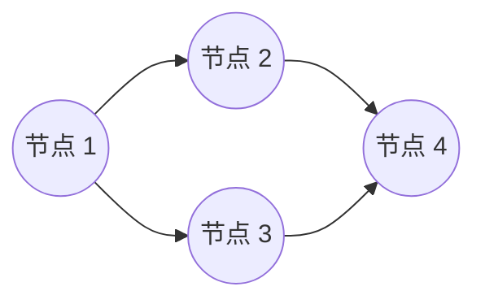

# 考点精要：软件测试技术与 McCabe 环路复杂度计算

<Badge type="info" text="MOD-03 软件工程" />
<Badge type="tip" text="考查题号：上午第 20 ~ 23 题 (固定 3 ~ 4 分)" />
<Badge type="danger" text="⭐⭐⭐⭐⭐ 5星必考" />
<Badge type="warning" text="弱贯通下午" />

::: tip 🎯 45 分及格通关指引
- **【45分必背核心得分点】**：
  1. **McCabe 环路复杂度秒杀公式**：
     - $V(G) = m - n + 2$（有向边数 $-$ 节点数 $+ 2$）；
     - 或 $V(G) = \text{判定节点数} + 1$（数出 `if` / `while` 分支节点个数直接 $+1$）。
  2. **四类软件维护判定（2024机考极高频）**：
     - **适应性维护**：适应**外部环境（操作系统升级、数据库更换、硬件接口变化）**；
     - **完善性维护**：**增加新功能、提升性能**（**工作量占比最大！超 50%**）；
     - **改正性维护**：修补运行中发现的 **Bug、运行缺陷**；
     - **预防性维护**：防患于未然，为未来维护铺路的重构。
  3. **白盒逻辑覆盖强度阶梯**：
     - 语句覆盖（最弱）$<$ 判定覆盖 $<$ 条件覆盖 $<$ 判定/条件覆盖 $<$ 条件组合覆盖 $<$ 路径覆盖（最强）。
- **【高分选读 / 考场可战略放弃点】**：
  - 带有复杂多层嵌套循环的路径爆炸组合测试用例具体数值设计，考场直接战略放弃。
:::

---

## 一、 核心考纲与概念辨析

### 1. 黑盒测试 vs 白盒测试方法全景

| 测试类别 | 测试方法 | 核心设计逻辑与测试用例设计依据 | 典型命题考点 |
| :--- | :--- | :--- | :--- |
| **黑盒测试** (功能测试/数据驱动) | **等价类划分** | 输入域划分为有效等价类与无效等价类 | 覆盖所有有效等价类与每个无效等价类 |
| | **边界值分析** | 选取刚好等于、刚好大于、刚好小于边界的值（$n-1, n, n+1$） | **最有效的黑盒方法**，大量错误发生在输入边界上 |
| | **错误推测法** | 凭直觉与经验推测易出错的特殊输入（如 0、空串、极大值） | 经验补充用例 |
| **白盒测试** (结构测试/逻辑驱动) | **逻辑覆盖测试** | 检验程序内部的语句、判定分支与逻辑条件 | 6 种覆盖强度递增梯队 |
| | **基本路径测试** | 依据控制流图导出线性无关的独立路径集合 | **必考 McCabe 环路复杂度计算** |

---

### 2. 软件维护四大类型对比（2024 机考命题重点）

| 维护类型 | 触发原因与维护目标 | 典型案例 | 工作量占比 |
| :--- | :--- | :--- | :--- |
| **完善性维护 (Perfective)** | 为满足用户提出的**新需求、增加新功能或提升性能与可维护性**而修改软件 | 增加导出 Excel 功能、优化 SQL 查询响应速度 | **占比最高！约 50% ~ 60%** |
| **适应性维护 (Adaptive)** | 为适应**外部运行环境（操作系统版本、数据库、外部网络接口、硬件）变化**而修改软件 | 系统从 Win 10 迁移至 Win 11、适配最新 JDK | 约 25% |
| **改正性维护 (Corrective)** | 修复交付使用后在运行过程中暴露出的**隐藏缺陷、程序 Bug 或逻辑错误** | 修复空指针异常、修补浮点数计算四舍五入偏差 | 约 15% ~ 20% |
| **预防性维护 (Preventive)** | 为防范未来潜在的风险或便于日后维护，**主动进行架构重构或引入新技术** | 模块解耦重构、增加工程自动化单元测试 | 约 5% |

---

## 二、 计算公式与分析模型

### McCabe 环路复杂度极速秒杀模型

- **公式一 (边点公式)**：$V(G) = m(\text{边}) - n(\text{点}) + 2 = 4 - 4 + 2 = 2$
- **公式二 (判定节点公式)**：$V(G) = \text{判定节点数} + 1 = 1 (\text{节点1为二分支}) + 1 = 2$
- **公式三 (区域公式)**：$V(G) = \text{封闭区域数} + 1 = 1 + 1 = 2$

---

## 三、 命题题眼与陷阱防御

::: danger 🚨 常见命题陷阱盘点
1. **软件维护占比的直觉陷阱**：
   - 题目问“在各类软件维护活动中，工作量占比最大的是哪一种？”
   - 80% 考生凭直觉误选“改正性维护”（误以为修 Bug 最费时间），标准答案 100% 为**完善性维护**（扩展新功能与优化性能占比超过 50%）！
2. **最弱与最强逻辑覆盖**：
   - 最弱逻辑覆盖：**语句覆盖**（仅执行每条语句一次，漏测大量分支）；
   - 最强逻辑覆盖：**路径覆盖**（遍历所有可能执行路径）。
:::

---

## 四、 典型真题溯源与逐项排错解析 (Distractor Analysis)

### 【真题精选 1】（考查软件维护类型精准判定 · 2024上-机考回忆-Q20）

**题干**：某商业管理信息系统上线运行两年后，因公司服务器操作系统全面升级为国产操作系统，数据库系统也同步切换为国产数据库，开发团队因此对该管理信息系统的部分底层接口和配置文件进行了修改。这种维护活动属于（ ）。
- A. 改正性维护  
- B. 适应性维护  
- C. 完善性维护  
- D. 预防性维护  

::: details 💡 点击展开【正确答案与逐项排错剖析】
- **【正确答案】**：**B**
- **【核心切入点】**：把握“外部软硬件运行环境（操作系统/数据库）发生变化”这一适应性维护的绝对关键词。

#### 逐项排错剖析 (Distractor Analysis)
- **选项 A (改正性维护) 错误**：改正性维护是针对系统在运行过程中暴露出的 Bug、逻辑缺陷或运行时错误进行的修复；题干中系统并未发生故障，而是因外部环境升级驱动的调整。
- **选项 B (适应性维护) 正确**：适应性维护（Adaptive Maintenance）的官方定义就是“为了使软件适应外部环境（如操作系统、编译器、数据库、硬件设备等）的变化而进行的修改”。
- **选项 C (完善性维护) 错误**：完善性维护是为了增加新业务功能或提升系统性能（如响应时间、吞吐量）而进行的修改，占比最大，但不符合题干环境迁移背景。
- **选项 D (预防性维护) 错误**：预防性维护是为了防患未然、提高未来可维护性而进行的主动性重构。
:::

---

### 【真题精选 2】（考查 McCabe 环路复杂度计算 · 2024下-机考回忆-Q21）

**题干**：某模块的程序控制流图中，共有 11 条有向边，8 个节点。按照 McCabe 环路度量方法，该模块的环路复杂度为（ ）。
- A. 3  
- B. 4  
- C. 5  
- D. 6  

::: details 💡 点击展开【正确答案与逐项排错剖析】
- **【正确答案】**：**C**
- **【核心切入点】**：套用边点公式 $V(G) = m - n + 2$。

#### 逐项排错剖析 (Distractor Analysis)
- **代入计算**：
  - 有向边数 $m = 11$；
  - 节点数 $n = 8$；
  - 连通平面单图：$V(G) = m - n + 2 = 11 - 8 + 2 = 5$。
- **选项 A (3) 错误**：误将公式当成 $m - n = 11 - 8 = 3$（漏加常数 2）。
- **选项 B (4) 错误**：计算偏差干扰项。
- **选项 C (5) 正确**：精准代入公式得出 5。
- **选项 D (6) 错误**：误将常数加成 3。
:::
