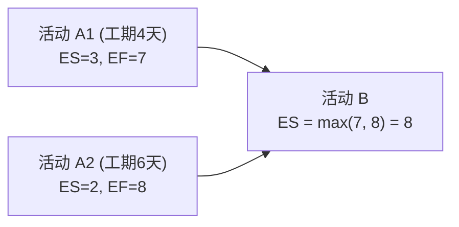

# 考点精要：软件项目管理与进度网络图分析

<Badge type="info" text="MOD-03 软件工程" />
<Badge type="tip" text="考查题号：上午第 16 ~ 19 题 (约 2 ~ 3 分)" />
<Badge type="danger" text="⭐⭐⭐⭐ 4星核心" />
<Badge type="warning" text="弱贯通下午" />

::: tip 🎯 45 分及格通关指引
- **【45分必背核心得分点】**：
  1. **甘特图 vs PERT 图秒杀对比**：
     - **甘特图**：清晰展示任务起止时间、工期跨度与进度日历，但**难以直接反映活动间复杂的逻辑制约与关键路径**；
     - **PERT 进度网络图**：明确展示**任务间先后逻辑依赖关系**，能精确计算关键路径与活动松弛时差。
  2. **关键路径两大黄金定理**：
     - 关键路径是网络图中**总耗时最长的那条路径**；
     - 关键路径上的所有活动，其**总时差严格为 0**（$TF = 0$）。
  3. **顺推与逆推极简口诀**：
     - **最早时间顺着推（起点到终点）**：遇到多条汇入线，**取大值 ($\max$)**；
     - **最迟时间倒着推（终点到起点）**：遇到多条发散线，**取小值 ($\min$)**；
     - 总时差 $TF = \text{迟} - \text{早} = LS - ES = LF - EF$。
  4. **CMMI 5 级极速识别**：1级个人英雄主义混乱 $\rightarrow$ 2级项目级可重复 $\rightarrow$ 3级组织级企业标准 $\rightarrow$ 4级定量数字统计 $\rightarrow$ 5级持续改进防患未然。
- **【高分选读 / 考场可战略放弃点】**：
  - 复杂的挣值分析（EAC、ETC 典型与非典型完工偏差高级数学公式预测），考场直接蒙题放弃。
:::

---

## 一、 核心考纲与概念辨析

### 1. 甘特图 vs PERT/CPM 进度网络图对比

| 工具对比 | 甘特图 (Gantt Chart) | 关键路径法 / PERT 网络图 |
| :--- | :--- | :--- |
| **图形形态** | 水平条形图，横轴表示时间日历，纵轴表示各项任务 | 包含事件节点与活动箭线构成的有向无环图 (DAG) |
| **核心优势** | **直观展示各项活动的开始时间、结束时间、工期跨度与并行进展** | **明确表达各活动之间的逻辑依赖关系，能够精确计算关键路径与活动时差** |
| **核心缺陷** | **难以直接反映活动之间错综复杂的逻辑制约与关键路径** | 不如甘特图直观反映资源与日历维度的分配情况 |

---

### 2. CMMI 能力成熟度模型集成（5 级阶梯）

| 级别 | 级别名称 | 核心特征与管理状态 | 记忆关键词 |
| :--- | :--- | :--- | :--- |
| **第 1 级** | **初始级 (Initial)** | 软件开发流程处于**混乱、无序、救火式**状态；成功完全依赖个别英雄员工的个人能力，不可复制 | 混乱、无规则、个人英雄主义 |
| **第 2 级** | **已管理级 (Managed)** | 建立了基本的项目管理规范（成本、进度、质量）；类似项目可借鉴以往经验重复成功 | **项目级管理**、规则可重复 |
| **第 3 级** | **已定义级 (Defined)** | 软件开发流程与工程管理上升为**全组织统一的标准过程体系**；全公司推行统一规范并裁剪执行 | **组织级标准过程**、全员文档化 |
| **第 4 级** | **已量化管理级 (Quantitatively)** | 对软件过程和产品质量建立了精细的**量化指标度量与统计控制体系** | **定量度量**、统计控制、数字指标 |
| **第 5 级** | **优化级 (Optimizing)** | 聚焦于**持续过程改进**，通过分析缺陷根因并主动引入新技术进行革新防御 | **持续改进**、主动创新、防患于未然 |

---

## 二、 计算公式与关键路径分析模型

- **顺推求早 (从起点到终点)**：$ES = \max(\text{紧前 } EF), \quad EF = ES + \text{工期}$
- **逆推求迟 (从终点到起点)**：$LF = \min(\text{紧后 } LS), \quad LS = LF - \text{工期}$
- **总时差 (Total Float)**：$TF = LS - ES = LF - EF$（关键路径上 $TF = 0$）

---

## 三、 命题题眼与陷阱防御

::: danger 🚨 常见命题陷阱盘点
1. **关键路径动态变化陷阱**：对关键活动赶工压缩工期时，一旦压缩时间超过其与次关键路径的差额，**次关键路径将跃升为新的关键路径**！
2. **CMMI 2 级与 3 级界限**：2 级是**项目级别**的管理，3 级是**企业组织级别**的统一标准规范。
:::

---

## 四、 典型真题溯源与逐项排错解析 (Distractor Analysis)

### 【真题精选 1】（考查项目管理图表特性辨析 · 2024下-机考回忆-Q19）

**题干**：在软件项目管理中，关于甘特图（Gantt Chart）和 PERT 图的叙述，正确的是（ ）。
- A. 甘特图能够明确清晰地展示各个活动之间的先后依赖关系  
- B. PERT 图能直观反映各项任务的日历时间进度安排，但无法识别关键路径  
- C. 甘特图能够直观清晰地展示各项活动的起止时间与并行情况，但难以反映复杂的逻辑制约关系  
- D. PERT 图中耗时最短的路径被称为关键路径  

::: details 💡 点击展开【正确答案与逐项排错剖析】
- **【正确答案】**：**C**
- **【核心切入点】**：牢记甘特图管“时间进度直观”，PERT 管“逻辑依赖与关键路径”。

#### 逐项排错剖析 (Distractor Analysis)
- **选项 A 错误**：甘特图的核心缺陷恰恰是无法清晰表达活动之间错综复杂的逻辑制约与先后依赖关系。
- **选项 B 错误**：PERT 网络图的核心价值就是通过前趋拓扑计算最早最迟时间并准确识别出关键路径。
- **选项 C 正确**：甘特图以水平时间条形式呈现，清晰直观地标明了活动起止时间与并行重叠情况，但无法直观体现复杂的逻辑依赖链，描述完全客观准确。
- **选项 D 错误**：关键路径是网络图中从起点到终点**耗时最长（工期总和最大）**的路径，绝非最短路径。
:::

---

### 【真题精选 2】（考查网络图关键参数与最早开始时间计算 · 2024上-机考回忆-Q19）

**题干**：在某信息系统项目进度网络图中，活动 $B$ 有两个紧前活动 $A_1$ 和 $A_2$。活动 $A_1$ 的最早开始时间为第 3 天，工期为 4 天；活动 $A_2$ 的最早开始时间为第 2 天，工期为 6 天。则活动 $B$ 的最早开始时间应为第（ ）天。
- A. 7  
- B. 8  
- C. 9  
- D. 15  

::: details 💡 点击展开【正确答案与逐项排错剖析】
- **【正确答案】**：**B**
- **【核心切入点】**：顺推求最早开始时间——必须等待所有紧前活动均完成，故取紧前活动最早完成时间的最大值 $\max$。

#### 逐项排错剖析 (Distractor Analysis)
- **参数演算**：
  - 紧前活动 $A_1$ 的最早完成时间：$EF(A_1) = ES(A_1) + \text{工期} = 3 + 4 = 7$ 天；
  - 紧前活动 $A_2$ 的最早完成时间：$EF(A_2) = ES(A_2) + \text{工期} = 2 + 6 = 8$ 天；
  - 活动 $B$ 必须等 $A_1$ 和 $A_2$ 全部顺利完成才能开工，因此其最早开始时间：
    $$ES(B) = \max(EF(A_1), EF(A_2)) = \max(7, 8) = 8\text{ 天}$$
- **选项 A (7) 错误**：误取了最小值 $\min(7, 8) = 7$；如果第 7 天开始，活动 $A_2$ 尚未完工（需第 8 天完工），违背前置依赖约束。
- **选项 B (8) 正确**：精准顺推求大，取第 8 天。
- **选项 C (9) 错误**：计算偏差干扰项。
- **选项 D (15) 错误**：误将 $7 + 8$ 串行相加。
:::

---

## 考点通关与速查导航

- 📖 **全科公式速查**：[上午综合知识高频计算公式与速解模板速查表](../formula-cheat-sheet.md)
- 🚨 **全科避坑指南**：[上午综合知识高频易错避坑清单与秒杀模板库](../exam-pitfalls-and-short-cuts.md)
- 🏠 **专题备考导航**：[上午综合知识备考导航](../index.md)
