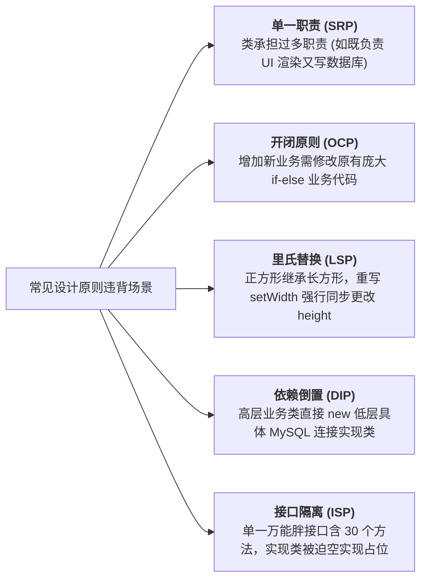

# 考点精要：面向对象基本概念与设计原则

<Badge type="info" text="MOD-04 面向对象" />
<Badge type="tip" text="考查题号：上午第 38 ~ 42 题 (约 3 ~ 4 分)" />
<Badge type="danger" text="⭐⭐⭐⭐⭐ 5星必考" />
<Badge type="success" text="强贯通下午 (题3+题6)" />

::: tip 🎯 45 分及格通关指引
- **【45分必背核心得分点】**：
  1. **对象三要素**：状态（属性）、行为（方法/操作）和标识（唯一性）。对象是类的具体**实例**，类是对象的抽象。
  2. **静态绑定 vs 动态绑定**：方法**重载**是编译时多态（**静态绑定**）；方法**重写**是运行时多态（**动态绑定**）。
  3. **三大设计原则秒杀**：
     - **开闭原则 (OCP)**：对**扩展**开放，对**修改**关闭（终极目标）；
     - **依赖倒置 (DIP)**：高层不依赖低层，二者依赖**抽象**；
     - **里氏替换 (LSP)**：子类必须能**透明替换**基类（父类出现的地方子类都能代替）。
- **【高分选读 / 考场可战略放弃点】**：
  - 复杂的多态理论分类（过载多态、强制多态、包含多态、参数多态的纯学术哲学辨析），考场遇偏门定义直接凭语感选“包含”或“参数”，绝不死磕。
:::

---

## 一、 核心考纲与概念辨析

### 1. 核心概念对比辨析矩阵

| 概念 | 定义与本质 | 软考核心考查关键点 | 易混淆防范 |
| :--- | :--- | :--- | :--- |
| **对象 (Object)** | 系统的基本运行实体，由一组属性（数据）和行为（方法）构成 | 包含状态（属性值）、行为（操作）和标识（唯一性）三要素 | 对象是类的具体**实例**，类是对象的抽象模板 |
| **类 (Class)** | 具有相同属性和方法的一组对象的集合 | 类的三种类型：实体类（业务数据）、控制类（业务逻辑协调）、边界类（人机界面与外部接口） | 软考常考“分析阶段的三种分析类”识别 |
| **封装 (Encapsulation)** | 隐藏对象的属性和实现细节，仅对外公开操作接口 | 增强安全性与可维护性，实现信息隐蔽（Information Hiding） | 强调“高内聚、低耦合”，杜绝外部直接修改内部属性 |
| **继承 (Inheritance)** | 子类共享父类数据结构和方法的机制 | 表达 `is-a`（是一种）的关系；Java 仅支持单继承但支持多接口实现 | 慎用深层继承，提倡优先使用组合/聚合而非继承 |
| **多态 (Polymorphism)** | 同一操作作用于不同的对象产生不同的执行结果 | 分为参数多态、包含多态（继承重写）、过载多态（重载）、强制多态 | 编译时多态（静态绑定） vs 运行时多态（动态绑定） |

---

### 2. 静态绑定 vs 动态绑定（高频秒杀考点）

- **静态绑定（前期绑定 / 编译时多态）**：在程序**编译阶段**即可确定调用的具体方法。主要体现为**方法重载 (Overload)**。
- **动态绑定（后期绑定 / 运行时多态）**：在程序**运行阶段**根据对象的实际运行类型动态确定调用的具体方法。主要体现为**方法重写 (Override) 与虚函数调用**。
- **重载 vs 重写的核心区别**：
  - **重载 (Overload)**：发生在**同一个类中**，方法名相同，参数列表（参数类型、个数、顺序）必须不同，与返回值类型无关。
  - **重写 (Override)**：发生在**子类与父类之间**，方法签名（方法名、参数列表、返回值兼容）必须完全一致，访问修饰符权限不能更严格，不能抛出更大范围的受检异常。

---

### 3. 面向对象七大设计原则 (SOLID +)

| 原则名称 | 中文释义 | 核心思想 / 判定标准 | 常见模式支撑 |
| :--- | :--- | :--- | :--- |
| **单一职责原则 (SRP)** | Single Responsibility Principle | 一个类应该仅有一个引起它变化的原因（职责单一） | 门面模式、代理模式 |
| **开闭原则 (OCP)** | Open-Closed Principle | **对扩展开放，对修改关闭**（面向对象设计的终极目标） | 策略模式、工厂方法、观察者模式 |
| **里氏替换原则 (LSP)** | Liskov Substitution Principle | 所有引用基类的地方必须能透明地替换为其子类对象而不出错 | 策略模式、模板方法模式 |
| **依赖倒置原则 (DIP)** | Dependency Inversion Principle | **高层模块不应依赖低层模块，二者都应依赖其抽象；抽象不应依赖细节，细节应依赖抽象** | 抽象工厂模式、依赖注入 |
| **接口隔离原则 (ISP)** | Interface Segregation Principle | 客户端不应被迫依赖它不使用的方法（接口尽量小而精，避免臃肿胖接口） | 适配器模式 |
| **迪米特法则 (LoD)** | Law of Demeter (最少知识原则) | 一个软件实体应尽可能少地与其他实体发生相互作用；只与直接的朋友通信 | 外观/门面模式 (Facade)、中介者模式 |
| **组合/聚合复用原则 (CARP)**| Composite/Aggregate Reuse Principle | 优先使用对象组合/聚合，而不是通过继承来达到复用的目的 | 装饰器模式、桥接模式、策略模式 |

---

## 二、 分析模型与经典反例矩阵

### 1. SOLID 原则正反代码意图与违背典型场景

---

## 三、 命题题眼与陷阱防御

::: danger 🚨 常见命题陷阱盘点
1. **“开闭原则”的偷换主谓**：题干常故意表述为“对修改开放，对扩展关闭”或“修改和扩展都开放”，务必牢记八字真言：**对扩展开放，对修改关闭**！
2. **“重载”与“重写”混淆**：若题干指出“在同一个类中定义了两个同名方法，返回值不同但参数完全相同”，属于**编译报错**，绝非重载！重载必须依靠参数列表区分。
3. **里氏替换原则的核心推论**：子类必须完全实现父类的抽象方法；子类可以有自己的个性；覆盖或实现父类方法时输入参数可以被放大（逆变），输出结果可以被缩小（协变）。
4. **白箱复用 vs 黑箱复用**：组合/聚合复用原则提倡黑箱复用（低耦合、不破坏封装），而继承复用是白箱复用（暴露父类内部细节，父类改动直接冲击子类）。
:::

---

## 四、 典型真题溯源与逐项排错解析 (Distractor Analysis)

### 【真题精选 1】（考查面向对象类与对象基础概念 · 2024下-机考回忆-Q38）

**题干**：在面向对象程序设计中，关于类和对象的描述，不正确的是（ ）。
- A. 类是具有相同属性和行为的一组对象的抽象  
- B. 对象是类的具体实例，拥有自身特定的属性值  
- C. 一个类只能创建一个对象实例  
- D. 对象的三要素包括状态、行为和唯一标识  

::: details 💡 点击展开【正确答案与逐项排错剖析】
- **【正确答案】**：**C**
- **【核心切入点】**：把握类是模板、对象是实例的 1:N 映射关系。

#### 逐项排错剖析 (Distractor Analysis)
- **选项 A 正确（不选）**：类是对具有相同属性和操作的一组实体的抽象与归纳，符合类的标准定义。
- **选项 B 正确（不选）**：对象是类的具体实例化产物，共享类的结构定义，但在运行时拥有自己独立的属性状态值。
- **选项 C 错误（符合题意，入选）**：类是创建对象的蓝图与模板，一个类在程序生命周期中可以实例化出**任意多个相互独立的对象实例**（除非显式设计为单例模式），“只能创建一个”严重违背常识。
- **选项 D 正确（不选）**：对象具有状态（数据）、行为（方法）和标识（内存地址或唯一 ID）三要素，这是软考考纲固定原话。
:::

---

### 【真题精选 2】（考查设计原则核心定义 · 2024上-机考回忆-Q40）

**题干**：在面向对象设计中，当需要增加新的业务功能时，应该通过增加新的模块或者类来实现，而不是去修改原有的已测试通过的代码。这一设计思想体现了（ ）原则。
- A. 单一职责原则  
- B. 开闭原则  
- C. 里氏替换原则  
- D. 依赖倒置原则  

::: details 💡 点击展开【正确答案与逐项排错剖析】
- **【正确答案】**：**B**
- **【核心切入点】**：“增加新类扩展功能”代表对扩展开放，“不修改原有稳定代码”代表对修改关闭。

#### 逐项排错剖析 (Distractor Analysis)
- **选项 A (单一职责原则) 错误**：单一职责原则强调“一个类只负责一项核心职责，只有一个引起它改变的原因”，考查高内聚，并非强调对扩展开放。
- **选项 B (开闭原则) 正确**：开闭原则（Open-Closed Principle, OCP）是面向对象设计的终极目标，要求软件实体“对扩展开放，对修改关闭”，题干描述完全吻合。
- **选项 C (里氏替换原则) 错误**：里氏替换强调基类出现的地方子类必须能透明无误地替换，关注继承体系的契约一致性。
- **选项 D (依赖倒置原则) 错误**：依赖倒置强调高层模块依赖抽象接口而非低层具体实现，关注解耦与依赖反转。
:::

---

## 考点通关与速查导航

- 📖 **全科公式速查**：[上午综合知识高频计算公式与速解模板速查表](../formula-cheat-sheet.md)
- 🚨 **全科避坑指南**：[上午综合知识高频易错避坑清单与秒杀模板库](../exam-pitfalls-and-short-cuts.md)
- 🏠 **专题备考导航**：[上午综合知识备考导航](../index.md)
