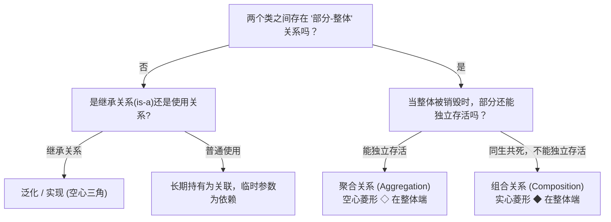

# 考点精要：UML 核心图谱与关系辨析

- **所属模块**：MOD-04 面向对象技术与设计模式
- **考查题号**：上午第 40 ~ 44 题（约 3 ~ 4 分，下午题 3 强关联 15 分）
- **重要程度**：⭐⭐⭐⭐⭐（重中之重）

---

## 一、 核心考纲与概念辨析

### 1. UML 图谱全景分类矩阵（静态结构图 vs 动态行为图）

统一建模语言 (UML 2.x) 共有 14 种图，软考重点考查以下高频常用图：

| 大类 | UML 图名称 | 核心用途与图元要素 | 上/下午考查特点 |
| :--- | :--- | :--- | :--- |
| **结构图 (静态图)** | **类图 (Class Diagram)** | 描述系统中的类及其接口、属性、方法以及类之间的静态结构关系 | **必考**，贯通下午题 3 与设计模式填空 |
| | **对象图 (Object Diagram)** | 描述某一特定时间点上类的具体实例（对象）及其属性值和链 | 类图在某运行瞬间的“快照” |
| | **构件图/组件图 (Component Diagram)** | 描述软件代码构件、模块、库及接口之间的物理组织与依赖 | 系统物理架构与二进制包划分 |
| | **部署图 (Deployment Diagram)** | 描述软件运行时的物理硬件节点、网络拓扑及软件构件在节点的部署配置 | 硬件环境与中间件拓扑部署 |
| **行为图 (动态图)** | **用例图 (Use Case Diagram)** | 描述参与者（Actor）与用例之间的业务功能关系，刻画系统外部黑盒需求 | **必考**，下午题 3 需求分析高频图元 |
| | **顺序图/时序图 (Sequence Diagram)** | 按**时间顺序**展示对象之间交互消息传递的动态协作流程 | **必考**，重点在时间顺序、生命线、激活期 |
| | **通信图/协作图 (Communication Diagram)** | 强调收发消息的对象的**组织结构**，用序列号标明消息执行次序 | 与时序图语义等价，可无损互转 |
| | **状态机图/状态图 (State Machine Diagram)** | 描述对象在其生命周期内经历的各种**状态、事件触发及状态转移** | 适合具有复杂状态流转的对象（如订单流转） |
| | **活动图 (Activity Diagram)** | 描述业务流程或计算逻辑中的工作流控制流与并行分支（分岔与汇合） | 类似于流程图，但支持多泳道并发 |

---

### 2. 类图 6 大关系权威辨析（由弱到强排列）

类间关系由弱到强的顺序为：
$$\text{依赖 (Dependency)} < \text{关联 (Association)} < \text{聚合 (Aggregation)} < \text{组合 (Composition)} < \text{泛化 (Generalization)} \approx \text{实现 (Realization)}$$

```
【依赖】 - - - - >    带箭头的虚线（方法参数/局部变量使用）
【关联】 ───────>     带箭头的实线（作为长期成员变量引用）
【聚合】 ◇───────>     空心菱形 + 实线箭头（菱形在整体端，同生不同死）
【组合】 ◆───────>     实心菱形 + 实线箭头（菱形在整体端，同生共死）
【泛化】 ───────▷     空心三角箭头 + 实线（箭头指向父类，继承关系）
【实现】 - - - - ▷    空心三角箭头 + 虚线（箭头指向接口，契约实现）
```

| 关系名称 | 语义本质 | 典型代码表现 / 现实映射 | 图形符号表示 |
| :--- | :--- | :--- | :--- |
| **依赖 (Dependency)** | `uses-a`（使用关系）：某类在其方法参数、局部变量或静态调用中使用了另一类的对象 | `void drive(Car car)` 中的形参 | **带箭头的虚线**（指向被使用者） |
| **关联 (Association)** | `has-a`（持有关系）：类之间的长期结构化引用，彼此平级 | 作为类的成员变量：`private Person customer;` | **带箭头的实线**（或无箭头双向实线） |
| **聚合 (Aggregation)** | `has-a`（部分与整体）：部分可以脱离整体而独立存在，“同生不同死” | 汽车与轮胎；班级与学生 | **空心菱形 + 实线箭头**（菱形位于整体端） |
| **组合 (Composition)** | `contains-a`（部分与整体）：部分不可脱离整体独立存在，“同生共死” | 人与大脑；公司与部门；订单与订单项 | **实心菱形 + 实线箭头**（菱形位于整体端） |
| **泛化 (Generalization)**| `is-a`（继承关系）：子类继承父类的属性和方法 | Java 中的 `extends` 继承基类 | **空心三角箭头 + 实线**（指向父类） |
| **实现 (Realization)** | 类实现接口所定义的契约规范 | Java 中的 `implements` 实现接口 | **空心三角箭头 + 虚线**（指向接口） |

---

## 二、 分析模型与关系判定决策树

### 1. 类图整体与部分关系判定流程



### 2. 用例图三核心关系混淆辨析

- **包含关系 (`<<include>>`)**：
  - 核心特征：基础用例执行时**必须无条件执行**被包含用例。抽取出多个用例公共的子功能，消除重复。
  - 箭头方向：**基础用例 $\longrightarrow$ 被包含用例**（虚线箭头，标注 `<<include>>`）。
  - 口诀：买手机必须包含“身份校验与付款”。
- **扩展关系 (`<<extend>>`)**：
  - 核心特征：在特定扩展点和满足特定监护条件时，被扩展用例才可能被执行。基础用例自身流程完整独立，被扩展用例提供的是**附加或可选行为**。
  - 箭头方向：**扩展用例 $\longrightarrow$ 基础用例**（虚线箭头，标注 `<<extend>>`，出题人最爱在此设置反向陷阱！）。
  - 口诀：买手机可选“加购碎屏保”（碎屏保指向买手机）。
- **泛化关系 (Generalization)**：
  - 核心特征：通用抽象用例与具体特化用例之间的父子继承关系。
  - 箭头方向：**子用例 $\longrightarrow$ 父用例**（实线空心三角箭头）。例如微信支付、支付宝支付指向“在线支付”。

---

## 三、 命题题眼与陷阱防御

> [!CAUTION]
> ### 🚨 常见命题陷阱盘点
> 1. **聚合与组合的菱形混淆**：
>    - 空心菱形 = **聚**合（松散，能分开）；
>    - 实心菱形 = **组**合（紧密，不能分开，同生共死）。**菱形永远画在“整体（Whole）”这一侧**，绝不能画在“部分（Part）”一侧！
> 2. **包含与扩展的箭头方向极易颠倒**：
>    - 包含 `<<include>>`：**主用例 $\rightarrow$ 被包含用例**（我要做 A，必须顺带做 B，故 A 指向 B）；
>    - 扩展 `<<extend>>`：**扩展用例 $\rightarrow$ 主用例**（B 是对 A 的补充，故 B 指向 A！）。出题人 80% 的干扰选项都会把扩展关系的箭头方向倒置！
> 3. **静态图与动态行为图分类混淆**：
>    - 静态图核心四剑客：类图、对象图、组件图、部署图；
>    - 状态机图、活动图、时序图、用例图均为**动态行为图**。
> 4. **活动图的分岔 (Fork) 与汇合 (Join)**：分岔表示一条控制流分支为多条**并发**控制流；汇合表示多个并发流必须全部到达后才能继续向下执行，在图上使用粗水平黑横条表示。

---

## 四、 典型真题溯源与逐项排错解析 (Distractor Analysis)

### 【真题精选 1】（考查用例图扩展关系与箭头方向 · 2023上-上午-Q41）
**题干**：在 UML 用例图中，（ ）关系用于说明一个用例在特定条件下会向另一个基础用例追加行为，此时虚线箭头的方向是由（ ）指向（ ）。
A. 包含；基础用例；被包含用例  
B. 扩展；基础用例；扩展用例  
C. 扩展；扩展用例；基础用例  
D. 泛化；子用例；父用例  

- **【正确答案】**：**C**
- **【核心考点】**：UML 用例图扩展关系语义与标准箭头方向。
- **【逐项排错剖析】**：
  - **A 选项排除**：包含（`<<include>>`）是基础用例无条件必须执行的公共行为，而非“在特定条件下追加行为”；
  - **B 选项排除**：扩展关系用于特定条件下的行为追加，但箭头方向规定为从“扩展用例”指向“基础用例”，B 选项将箭头反向；
  - **C 选项正确**：准确指出了扩展用例（Extend）的定义，且指明箭头由“扩展用例指向基础用例”；
  - **D 选项排除**：泛化（Generalization）表达的是用例继承关系，且图形符号是实线空心三角箭头，非带标签的虚线箭头。

---

### 【真题精选 2】（考查类图组合与聚合强弱特征 · 2022下-上午-Q43）
**题干**：某在线销售系统中，订单（Order）由多个订单项（OrderItem）组成，当一个订单被删除时，属于该订单的所有订单项也必须随之被删除，不能独立存在。在 UML 类图中，Order 和 OrderItem 之间最恰当的关系是（ ）。
A. 依赖关系  
B. 关联关系  
C. 聚合关系  
D. 组合关系  

- **【正确答案】**：**D**
- **【核心考点】**：组合关系（Composition）的核心特征 —— 生命周期同生共死。
- **【逐项排错剖析】**：
  - **A 选项排除**：依赖关系（uses-a）表现为临时方法调用或传参，订单与订单项存在长期的整体与部分包含，绝非轻量级依赖；
  - **B 选项排除**：关联关系（has-a）表达平等对象间的长期引用，未体现“整体-部分”以及“同生共死”的紧密生命周期约束；
  - **C 选项排除**：聚合关系（Aggregation）虽然也是整体与部分关系，但部分可以脱离整体独立存在（同生不同死，如公司与员工）；
  - **D 选项正确**：题干明确指出“订单被删除时，所有订单项必须随之被删除，不能独立存在”，完全符合组合关系的强依赖特征（在 Order 端画实心菱形）。

---

### 【真题精选 3】（考查静态结构图与动态行为图分类 · 2023下-上午-Q40）
**题干**：UML 2.0 提供了多种图形来支持面向对象软件建模。以下选项中，全部属于静态结构图的是（ ）。
A. 类图、对象图、组件图、部署图  
B. 用例图、时序图、协作图、活动图  
C. 类图、状态图、构件图、时序图  
D. 对象图、通信图、活动图、部署图  

- **【正确答案】**：**A**
- **【核心考点】**：UML 14 种图的静态结构 vs 动态行为大类划分。
- **【逐项排错剖析】**：
  - **A 选项正确**：类图、对象图、组件图（构件图）、部署图均用于刻画系统的静态架构与物理构成，全部为静态结构图；
  - **B 选项排除**：用例图、时序图、协作图（通信图）、活动图全部用于刻画系统的交互与业务流程，全部属于动态行为图；
  - **C 选项排除**：状态图（State Diagram）和时序图（Sequence Diagram）为动态行为图，选项混杂；
  - **D 选项排除**：通信图与活动图均为动态行为图，不属于纯静态结构图。
