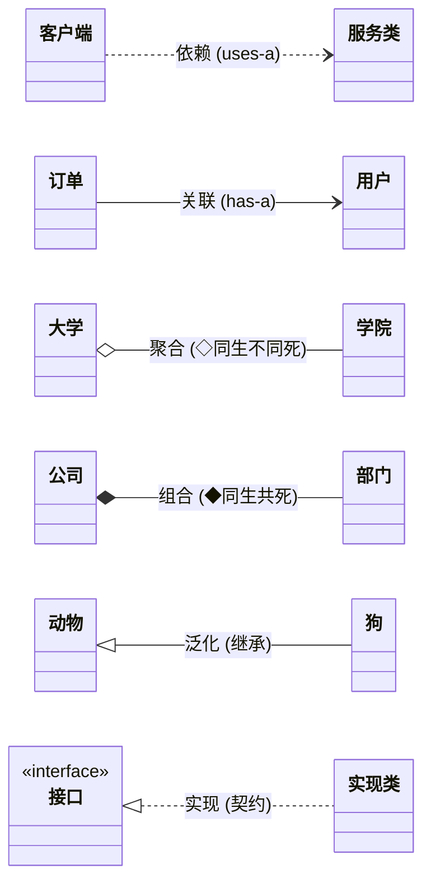
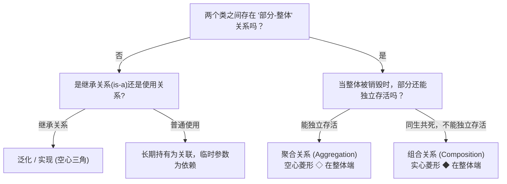

# 考点精要：UML 核心图谱与关系辨析

<Badge type="info" text="MOD-04 面向对象" />
<Badge type="tip" text="考查题号：上午第 40 ~ 44 题 (约 3 ~ 4 分)" />
<Badge type="danger" text="⭐⭐⭐⭐⭐ 5星必考" />
<Badge type="success" text="强贯通下午 (下午题3 必考15分)" />

::: tip 🎯 45 分及格通关指引
- **【45分必背核心得分点】**：
  1. **静动二分法（必考分类题）**：
     - **静态结构图（4个）**：类图、对象图（快照）、构件/组件图、部署图（物理节点）。
     - **动态行为图（5个）**：用例图、顺序/时序图（按时间）、通信/协作图、状态机图、活动图（支持并发工作流）。
  2. **关系强弱与符号秒杀**：
     - 依赖（虚箭头 uses-a）$<$ 关联（实箭头 has-a）$<$ 聚合（**空心菱形**，同生不同死）$<$ 组合（**实心菱形**，同生共死）$<$ 泛化（空心三角继承）；
     - 菱形**永远在整体端**（如公司端是实心菱形，部门端是箭头）。
  3. **用例关系箭头**：
     - 包含 `<<include>>`：**基础用例 $\rightarrow$ 被包含用例**（必须执行）；
     - 扩展 `<<extend>>`：**扩展用例 $\rightarrow$ 基础用例**（可选执行，方向易设坑！）。
- **【高分选读 / 考场可战略放弃点】**：
  - 交互概览图、复合结构图、包图依赖深入语义（考频 $<1\%$，直接蒙题放弃）。
:::

---

## 一、 核心考纲与概念辨析

### 1. UML 图谱全景分类矩阵（静态结构图 vs 动态行为图）

统一建模语言 (UML 2.x) 共有 14 种图，软考重点考查以下高频常用图：

| 大类 | UML 图名称 | 核心用途与图元要素 | 上/下午考查特点 |
| :--- | :--- | :--- | :--- |
| **结构图 (静态图)** | **类图 (Class Diagram)** | 描述系统中的类及其接口、属性、方法以及类之间的静态结构关系 | **必考**，贯通下午题 3 与设计模式填空 |
| | **对象图 (Object Diagram)** | 描述某一特定时间点上类的具体实例（对象）及其属性值和链 | 类图在某运行瞬间的“快照” |
| | **构件图/组件图 (Component Diagram)** | 描述软件代码构件、模块、库及接口之间的物理组织与依赖 | 系统物理架构与二进制包划分 |
| | **部署图 (Deployment Diagram)** | 描述软件运行时的物理硬件节点、网络拓扑及软件构件在节点的部署配置 | 硬件环境与中间件拓扑部署 |
| **行为图 (动态图)** | **用例图 (Use Case Diagram)** | 描述参与者（Actor）与用例之间的业务功能关系，刻画系统外部黑盒需求 | **必考**，下午题 3 需求分析高频图元 |
| | **顺序图/时序图 (Sequence Diagram)** | 按**时间顺序**展示对象之间交互消息传递的动态协作流程 | **必考**，重点在时间顺序、生命线、激活期 |
| | **通信图/协作图 (Communication Diagram)** | 强调收发消息的对象的**组织结构**，用序列号标明消息执行次序 | 与时序图语义等价，可无损互转 |
| | **状态机图/状态图 (State Machine Diagram)** | 描述对象在其生命周期内经历的各种**状态、事件触发及状态转移** | 适合具有复杂状态流转的对象（如订单流转） |
| | **活动图 (Activity Diagram)** | 描述业务流程或计算逻辑中的工作流控制流与并行分支（分岔与汇合） | 类似于流程图，但支持多泳道并发 |

---

### 2. 类图 6 大关系权威辨析（由弱到强排列）

类间关系由弱到强的顺序为：
$$\text{依赖 (Dependency)} < \text{关联 (Association)} < \text{聚合 (Aggregation)} < \text{组合 (Composition)} < \text{泛化 (Generalization)} \approx \text{实现 (Realization)}$$

| 关系名称 | 语义本质 | 典型代码表现 / 现实映射 | 图形符号表示 |
| :--- | :--- | :--- | :--- |
| **依赖 (Dependency)** | `uses-a`（使用关系）：某类在其方法形参、局部变量中临时使用另一类的对象 | `void drive(Car car)` 中的形参 | **带箭头的虚线**（指向被使用者） |
| **关联 (Association)** | `has-a`（持有关系）：类之间的长期结构化引用，彼此平级 | 作为类的成员变量：`private Person customer;` | **带箭头的实线**（或无箭头双向实线） |
| **聚合 (Aggregation)** | `has-a`（部分与整体）：部分可以脱离整体而独立存在，“同生不同死” | 汽车与轮胎；班级与学生 | **空心菱形 + 实线箭头**（菱形位于整体端） |
| **组合 (Composition)** | `contains-a`（部分与整体）：部分不可脱离整体独立存在，“同生共死” | 人与大脑；公司与部门；窗口与窗口按纽 | **实心菱形 + 实线箭头**（菱形位于整体端） |
| **泛化 (Generalization)**| `is-a`（继承关系）：子类继承父类的属性和方法 | Java 中的 `extends` 继承基类 | **空心三角箭头 + 实线**（指向父类） |
| **实现 (Realization)** | 类实现接口所定义的契约规范 | Java 中的 `implements` 实现接口 | **空心三角箭头 + 虚线**（指向接口） |

---

## 二、 分析模型与关系判定决策树

### 1. 类图整体与部分关系判定流程

### 2. 用例图三大核心关系辨析

- **包含关系 (`<<include>>`)**：
  - 核心特征：基础用例执行时**必须无条件执行**被包含用例。抽取出多个用例公共的子功能，消除重复。
  - 箭头方向：**基础用例 $\longrightarrow$ 被包含用例**（虚线箭头，标注 `<<include>>`）。
- **扩展关系 (`<<extend>>`)**：
  - 核心特征：在特定扩展点和满足特定监护条件时，被扩展用例才可能被执行。基础用例自身流程完整独立，被扩展用例提供的是**附加或可选行为**。
  - 箭头方向：**扩展用例 $\longrightarrow$ 基础用例**（虚线箭头，标注 `<<extend>>`，出题人最爱在此设置反向陷阱！）。
- **泛化关系 (Generalization)**：
  - 核心特征：通用抽象用例与具体特化用例之间的父子继承关系。
  - 箭头方向：**子用例 $\longrightarrow$ 父用例**（实线空心三角箭头）。例如微信支付、支付宝支付指向“在线支付”。

---

## 三、 命题题眼与陷阱防御

::: danger 🚨 常见命题陷阱盘点
1. **聚合与组合的菱形混淆**：
   - 空心菱形 = **聚**合（松散，能分开）；
   - 实心菱形 = **组**合（紧密，不能分开，同生共死）。**菱形永远画在“整体（Whole）”这一侧**，绝不能画在“部分（Part）”一侧！
2. **包含与扩展的箭头方向极易颠倒**：
   - 包含 `<<include>>`：**主用例 $\rightarrow$ 被包含用例**（我要做 A，必须顺带做 B，故 A 指向 B）；
   - 扩展 `<<extend>>`：**扩展用例 $\rightarrow$ 主用例**（B 是对 A 的补充，故 B 指向 A！）。出题人 80% 的干扰选项都会把扩展关系的箭头方向倒置！
3. **静态图与动态行为图分类混淆**：
   - 静态图核心四剑客：类图、对象图、组件图、部署图；
   - 状态机图、活动图、时序图、用例图均为**动态行为图**。
:::

---

## 四、 典型真题溯源与逐项排错解析 (Distractor Analysis)

### 【真题精选 1】（考查静态结构图与动态行为图分类 · 2024上-机考回忆-Q41）

**题干**：UML 2.0 提供了多种用于建模的图，它们被分为结构图和行为图两类。下列 UML 图中，属于动态行为图的是（ ）。
- A. 类图 (Class Diagram)  
- B. 构件图 (Component Diagram)  
- C. 活动图 (Activity Diagram)  
- D. 部署图 (Deployment Diagram)  

::: details 💡 点击展开【正确答案与逐项排错剖析】
- **【正确答案】**：**C**
- **【核心切入点】**：把握静态图（类、对象、构件、部署）与动态图（用例、时序、活动、状态）的标准二分法。

#### 逐项排错剖析 (Distractor Analysis)
- **选项 A 错误**：类图展现类与接口的静态结构特征，是典型的结构图（静态图）。
- **选项 B 错误**：构件图展现可执行模块与代码库之间的依赖组织，属于静态物理实现图。
- **选项 C 正确**：活动图（Activity Diagram）用于展示业务工作流的控制逻辑与分支并行，属于典型的**动态行为图**。
- **选项 D 错误**：部署图展现物理硬件节点与网络配置，属于静态架构结构图。
:::

---

### 【真题精选 2】（考查类图组合关系判定 · 2024下-机考回忆-Q42）

**题干**：在面向对象建模中，窗口类 `Window` 和菜单栏类 `MenuBar` 之间存在整体与部分的关系。当窗口对象被销毁时，其包含的菜单栏对象也随之被销毁而不能独立存在。这种关系在 UML 类图中应表示为（ ）。
- A. 依赖关系 (Dependency)  
- B. 聚合关系 (Aggregation)  
- C. 组合关系 (Composition)  
- D. 泛化关系 (Generalization)  

::: details 💡 点击展开【正确答案与逐项排错剖析】
- **【正确答案】**：**C**
- **【核心切入点】**：“同生共死、部分不可脱离整体独立存活”直接锁定组合关系（实心菱形）。

#### 逐项排错剖析 (Distractor Analysis)
- **选项 A (依赖) 错误**：依赖是临时的“uses-a”方法形参或局部调用关系，不存在整体与部分的长期结构持有。
- **选项 B (聚合) 错误**：聚合虽然也是部分与整体关系，但强调“同生不同死”（如班级解散了，学生依然独立存在）；题干明确指出窗口销毁菜单栏也随之销毁，属于强依赖的组合。
- **选项 C (组合) 正确**：组合（Composition）表示生命周期强绑定的部分-整体关系，同生共死，完全符合题意。
- **选项 D (泛化) 错误**：泛化是“is-a”继承关系（如猫是一种动物），窗口和菜单栏显然不存在父子继承语义。
:::

---

## 考点通关与速查导航

- 📖 **全科公式速查**：[上午综合知识高频计算公式与速解模板速查表](../formula-cheat-sheet.md)
- 🚨 **全科避坑指南**：[上午综合知识高频易错避坑清单与秒杀模板库](../exam-pitfalls-and-short-cuts.md)
- 🏠 **专题备考导航**：[上午综合知识备考导航](../index.md)
