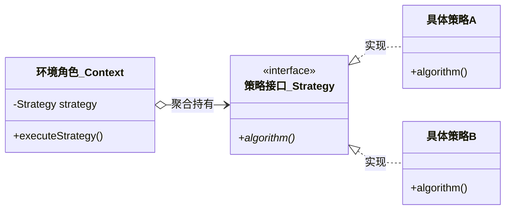

# 考点精要：GoF 23 种设计模式全景分类与辨析矩阵

<Badge type="info" text="MOD-04 面向对象" />
<Badge type="tip" text="考查题号：上午第 44 ~ 47 题 (固定 4 分)" />
<Badge type="danger" text="⭐⭐⭐⭐⭐ 5星必考" />
<Badge type="tip" text="强贯通下午 (下午题6 必考15分)" />

::: tip 🎯 45 分及格通关指引
- **【45分必背核心得分点】**：
  1. **目的分类记忆（5 / 7 / 11）**：
     - **创建型（5个）**：单例、工厂方法、抽象工厂、建造者、原型；
     - **结构型（7个）**：适配器、桥接、组合、装饰器、外观/门面、享元、代理；
     - **行为型（11个）**：责任链、命令、解释器、迭代器、中介者、备忘录、观察者、状态、策略、模板方法、访问者。
  2. **四大类模式秒杀口诀**：**“解模工适”**（解释器、模板方法、工厂方法、类适配器）为类模式，其余 19 种全是对象模式！
  3. **高频题干题眼秒杀词典**：
     - 看到“**树形结构 / 部分-整体 / 一致性对待**” $\rightarrow$ **组合模式 (Composite)**；
     - 看到“**动态地给对象添加额外职责 / 不采用继承**” $\rightarrow$ **装饰器模式 (Decorator)**；
     - 看到“**定义一系列算法 / 封装相互替换**” $\rightarrow$ **策略模式 (Strategy)**；
     - 看到“**一系列相互依赖的产品族**” $\rightarrow$ **抽象工厂 (Abstract Factory)**；
     - 看到“**一对多依赖 / 状态改变广播通知**” $\rightarrow$ **观察者模式 (Observer)**；
     - 看到“**为子系统提供一致的统一高层门面**” $\rightarrow$ **外观/门面模式 (Facade)**。
- **【高分选读 / 考场可战略放弃点】**：
  - 访问者模式的“双重分派（Double Dispatch）”底层机制推导、解释器模式的终结符与非终结符表达式解析，考场遇生僻代码直接跳过。
:::

---

## 一、 核心考纲与概念辨析

### 1. 23 种设计模式全景矩阵（按目的与范围分类）

GoF（Gang of Four）设计模式根据**目的（创建/结构/行为）**与**范围（类模式/对象模式）**二维划分如下：

| 分类（按目的） | 模式名称 | 英文名称 | 范围（类/对象） | 核心意图与设计动机 | 经典应用场景 / 现实隐喻 |
| :--- | :--- | :--- | :--- | :--- | :--- |
| **创建型模式** (Creational) | **工厂方法** | Factory Method | **类模式** | 定义一个创建对象的接口，让子类决定实例化哪一个类 | 日志记录器、不同数据库驱动连接 |
| | **抽象工厂** | Abstract Factory | 对象模式 | 提供一个创建**一系列相关或相互依赖对象族**的接口，而无需指定具体类 | 跨平台 UI 控件库（Windows/Mac 按钮与文本框族） |
| | **单例模式** | Singleton | 对象模式 | 保证一个类仅有一个实例，并提供一个访问它的全局访问点 | 线程池、数据库连接池、全局配置中心 |
| | **建造者模式** | Builder | 对象模式 | 将一个复杂对象的构建过程与其表示分离，使同样的构建过程可以创建不同的表示 | 组装电脑、组装快餐套餐 |
| | **原型模式** | Prototype | 对象模式 | 用原型实例指定创建对象的种类，并且通过**克隆（深拷贝/浅拷贝）**这些原型创建新对象 | 复杂大对象的快速复制（如 `Object.clone()`） |
| **结构型模式** (Structural) | **适配器模式** | Adapter | **类/对象** | 将一个类的接口转换成客户希望的另外一个接口，解决接口不兼容问题 | 电源插头转接头、Type-C转接器 |
| | **桥接模式** | Bridge | 对象模式 | 将**抽象部分与它的实现部分分离**，使它们都可以独立地变化（解耦多维度变化） | 毛笔与颜色分离、图形与操作系统渲染分离 |
| | **组合模式** | Composite | 对象模式 | 将对象组合成**树形结构**以表示“部分-整体”的层次结构，使用户对单个对象和组合对象的使用具有一致性 | 文件与文件夹目录树、公司组织架构 |
| | **装饰器模式** | Decorator | 对象模式 | **动态地给一个对象添加额外的职责**；比生成子类更为灵活 | Java I/O 流包装包装器、咖啡加奶糖 |
| | **外观/门面模式**| Facade | 对象模式 | 为子系统中的一组接口提供一个一致的界面，定义一个高层接口使得子系统更容易使用 | 医院前台一站式接待、智能家居一键离家 |
| | **享元模式** | Flyweight | 对象模式 | 运用**共享技术**有效地支持大量细粒度对象的复用，区分内部状态与外部状态 | 围棋棋盘上的黑白棋子、文本编辑器字形共享 |
| | **代理模式** | Proxy | 对象模式 | 为其他对象提供一种代理以控制对这个对象的访问 | 远程代理、虚拟代理（延迟加载大图）、安全权限代理 |
| **行为型模式** (Behavioral) | **责任链模式** | Chain of Responsibility | 对象模式 | 使多个对象都有机会处理请求，从而避免请求的发送者和接收者之间的耦合关系，沿链传递请求 | 请假审批流、Servlet 过滤器链 |
| | **命令模式** | Command | 对象模式 | 将请求封装为一个对象，从而可用不同的请求对客户进行参数化；支持请求排队、撤销（Undo）与重做 | 遥控器按钮、文本编辑器撤销与重做操作 |
| | **解释器模式** | Interpreter | **类模式** | 给定一个语言，定义它的文法的一种表示，并定义一个解释器处理该文法 | 正则表达式解析器、SQL 简单语法解释 |
| | **迭代器模式** | Iterator | 对象模式 | 提供一种方法顺序访问一个聚合对象中各个元素，而又不需要暴露该对象的内部表示 | Java `Iterator` 遍历集合容器 |
| | **中介者模式** | Mediator | 对象模式 | 用一个中介对象来封装一系列的对象交互，使各对象不需要显式地相互引用，松散耦合 | 机场空中交通调度塔、聊天室服务端 |
| | **备忘录模式** | Memento | 对象模式 | 在不破坏封装性的前提下，捕获一个对象的内部状态，并在该对象之外保存这个状态以便以后恢复 | 游戏存档读档、文本编辑器撤销快照 |
| | **观察者模式** | Observer | 对象模式 | 定义对象间的一种一对多的依赖关系，当一个对象的状态发生改变时，所有依赖于它的对象都得到通知并被自动更新 | 微信公众号订阅发布、消息队列推送通知 |
| | **状态模式** | State | 对象模式 | 允许一个对象在其内部状态改变时改变它的行为，对象看起来似乎修改了它的类 | 自动售货机投币状态机、订单状态机流转 |
| | **策略模式** | Strategy | 对象模式 | 定义一系列算法，把它们一个个封装起来，并且使它们可以相互替换；算法独立于使用它的客户而变化 | 支付方式选择、打折促销算法、出行路线算法 |
| | **模板方法模式**| Template Method | **类模式** | 定义一个操作中的算法骨架，而将一些步骤延迟到子类中；子类可不改变算法结构而重定义特定步骤 | 冲茶/咖啡的标准流水线（烧水、冲泡、加料） |
| | **访问者模式** | Visitor | 对象模式 | 表示一个作用于某对象结构中的各元素的操作；可以在不改变各元素的类的前提下定义作用于这些元素的新操作 | 编译器语法树遍历分析、财务报表不同角色审计 |

---

## 二、 模式识别分析模型与类图代码映射

---

## 三、 命题题眼与陷阱防御

::: danger 🚨 常见命题陷阱盘点
1. **“动静”偷换**：
   - 装饰器模式是**动态**增加职责（运行时组合），继承是**静态**增加职责（编译时固定）。
   - 桥接模式将抽象与实现解耦，使二者可以**独立变化**。
2. **树形结构的绝对标志**：凡是题干中出现“部分-整体层次结构”、“树形结构”、“客户希望对单个对象和组合对象的使用具有一致性”，100% 对应**组合模式 (Composite)**！
3. **算法族的绝对标志**：凡是题干出现“定义一系列算法，把它们封装起来，并且使它们可以相互替换”，100% 对应**策略模式 (Strategy)**！
:::

---

## 四、 典型真题溯源与逐项排错解析 (Distractor Analysis)

### 【真题精选 1】（考查策略模式定义与算法替换 · 2024下-机考回忆-Q45）

**题干**：在某电商订单结算模块中，系统支持“普通用户原价支付”、“VIP 会员九折优惠”和“大促满减促销”等多种不同的计费算法。系统设计要求定义一系列算法，把它们一个个封装起来，并使它们之间可以相互替换，且算法的变化不会影响到使用算法的客户。该场景最适合采用（ ）设计模式。
- A. 模板方法模式 (Template Method)  
- B. 策略模式 (Strategy)  
- C. 观察者模式 (Observer)  
- D. 访问者模式 (Visitor)  

::: details 💡 点击展开【正确答案与逐项排错剖析】
- **【正确答案】**：**B**
- **【核心切入点】**：把握“定义一系列算法，封装并相互替换”的策略模式标准定义。

#### 逐项排错剖析 (Distractor Analysis)
- **选项 A (模板方法) 错误**：模板方法模式是在基类中定义算法的执行骨架，将某些可变具体步骤延迟到子类重写，并不强调算法的独立动态互相替换。
- **选项 B (策略模式) 正确**：策略模式（Strategy Pattern）的核心动机就是将一系列可互换的算法独立封装在具体策略类中，由客户端按需切换，完全符合电商促销算法需求。
- **选项 C (观察者模式) 错误**：观察者模式解决的是对象间一对多的状态依赖与广播联动，与算法互换无关。
- **选项 D (访问者模式) 错误**：访问者模式是在不改变稳定元素结构的前提下向对象动态附加新操作，实现极其复杂，不适宜算法封装。
:::

---

### 【真题精选 2】（考查组合模式与树形结构 · 2024上-机考回忆-Q46）

**题干**：在开发一个图形编辑软件时，基础图形元素包含线段、圆和矩形，多个基础图形可以组合成复合图形，复合图形又可以进一步参与更高级的复杂图形组合。为了使用户能够以一致的方式对待单个基础图形和复杂复合图形，最适宜采用的设计模式是（ ）。
- A. 装饰器模式 (Decorator)  
- B. 享元模式 (Flyweight)  
- C. 组合模式 (Composite)  
- D. 适配器模式 (Adapter)  

::: details 💡 点击展开【正确答案与逐项排错剖析】
- **【正确答案】**：**C**
- **【核心切入点】**：“单个对象与复合对象的一致性对待”、“树形嵌套结构”是组合模式独一无二的标志。

#### 逐项排错剖析 (Distractor Analysis)
- **选项 A (装饰器) 错误**：装饰器模式的核心是透明、动态地增强单一对象的功能职责，不强调树形部分-整体的一致性处理。
- **选项 B (享元模式) 错误**：享元模式侧重运用共享技术避免大量细粒度对象的重复创建开销（如字符或棋子），与树形嵌套结构无关。
- **选项 C (组合模式) 正确**：组合模式（Composite Pattern）将对象组织为树形层次结构，让叶子节点与容器节点实现相同接口，从而使客户能够一致地使用单个对象和组合对象。
- **选项 D (适配器) 错误**：适配器模式用于转换已有不兼容接口，使原本因接口不合的类能协同工作。
:::

---

## 考点通关与速查导航

- 📖 **全科公式速查**：[上午综合知识高频计算公式与速解模板速查表](../formula-cheat-sheet.md)
- 🚨 **全科避坑指南**：[上午综合知识高频易错避坑清单与秒杀模板库](../exam-pitfalls-and-short-cuts.md)
- 🏠 **专题备考导航**：[上午综合知识备考导航](../index.md)
