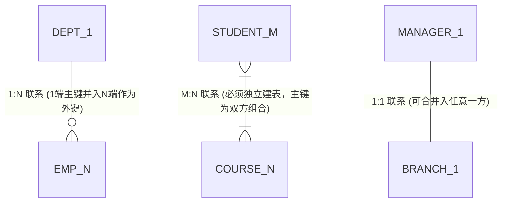

# 考点精要：E-R 模型向关系模式转换与关系代数

<Badge type="info" text="MOD-05 数据库系统知识" />
<Badge type="tip" text="考查题号：上午第 48 ~ 51 题 (约 2 ~ 3 分)" />
<Badge type="danger" text="⭐⭐⭐⭐⭐ 5星必考" />
<Badge type="tip" text="强贯通下午 (下午题2 必考15分)" />

::: tip 🎯 45 分及格通关指引（极简避坑与得分铁律）
- **【45分必背核心得分点】**：
  1. **E-R 转换最少关系模式数量速算**：
     - 公式：**最少关系模式总数 = 独立实体数 + M:N 联系数**；
     - 1:1 联系可并入任意一端；1:N 联系合并入 N 端（多端）；只有 M:N 联系必须独立成表，其主键为两端实体主键的联合主键。
  2. **关系代数三剑客特征与避坑**：
     - **选择 ($\sigma$)**：按行水平挑选，符合条件的元组留下；
     - **投影 ($\pi$)**：按列垂直提取，**数学上默认自动消重**；
     - **自然连接 ($\bowtie$)**：找全部同名公共属性等值比对，**必须在结果中剔除重复的公共列**（列数 $= R列数 + S列数 - 公共列数$）。
  3. **除运算 ($\div$) 题眼**：凡是题干出现“**同时选修了某集合中全部课程**”、“**购买了全部指定配件**”等全覆盖语义，直接锁定除运算 $\div$。
- **【高分选读 / 考场可战略放弃点】**：
  - 涉及三元复杂多元联系在外键约束级联触发器细节、带有 4 行以上超大二维表手工完整推演除运算象集的微观数学步骤，考场若时间紧可直接根据“结果只保留被除关系独有列”与“覆盖全集”特征直接排除 2~3 个选项。
:::

---

## 一、 核心考纲与概念辨析

### 1. E-R 图向关系模式转换三大黄金规则

在数据库逻辑结构设计中，将概念层面的 E-R 模型转换为关系数据模型（二维关系表）时，必须严格遵循以下规则：



| 实体间联系类型 | 关系模式转换策略 | 主键 (PK) 与外键 (FK) 设定规则 | 最少转换模式数量 |
| :--- | :--- | :--- | :--- |
| **1 : 1 联系**<br>(一对一，如部门与经理) | **方案 A（合并入任一端）**：将联系与任意一端的实体模式合并<br>**方案 B（独立建表）**：为联系单独建立一个独立关系模式 | - 若合并：将另一端实体的主键引入作为**外键**，并将联系属性并入；<br>- 若独立：两端实体主键均可作为候选码，任选其一作为主键 | **最少 2 个**（推荐合并）<br>独立建表则为 3 个 |
| **1 : N 联系**<br>(一对多，如部门与员工) | **合并入 N 端 (多端实体)**；亦可单独建立独立关系模式 | **将 1 端实体的主键引入到 N 端实体作为外键**，联系属性一并放入 N 端实体 | **最少 2 个**（通常强制合并入多端） |
| **M : N 联系**<br>(多对多，如学生与选课) | **必须单独建立一个独立的关系模式**（绝对不可合并入任何一方！） | **新模式的主键为两端实体主键的联合组合键**；两端主键在新模式中分别作为外键 | **必须为 3 个**（2 实体表 + 1 联系表） |
| **三元联系 / 多元联系**<br>(如供应商-零件-项目) | 若多元联系中**存在多对多 (M:N) 语义，必须独立转换为一个关系模式** | 独立模式的主键为各参与实体主键的组合键，并引入联系自身属性 | 视实体数而定，多元联系独立成表 |

::: info 💡 最少关系模式数量速算口诀
$$\text{最少关系模式总数} = \text{独立实体个数} + \text{M:N 联系个数} + \text{多元 M:N 联系个数}$$
*(因为 1:1 和 1:N 联系都可以无损并入实体端，只有 M:N 联系无法合并，必须独立建表)*。
:::

---

### 2. 关系代数五大专门运算剖析

设关系 $R$ 与 $S$：

| 运算符号 | 运算名称 | 过滤维度与本质 | 核心规则与去重特征 |
| :---: | :--- | :--- | :--- |
| **$\sigma$** | **选择 (Select)** | **按行水平过滤** | 挑选出满足给定谓词逻辑条件的元组。例如 $\sigma_{\text{Age} > 20}(R)$。结果元组数 $\le R$ 的元组数。 |
| **$\pi$** | **投影 (Project)** | **按列垂直过滤** | 挑选出指定的一个或多个属性列，**数学上默认自动消除重复行**。例如 $\pi_{\text{Sno, Sname}}(R)$。 |
| **$\bowtie$** | **自然连接 (Natural Join)** | **同名属性等值匹配并消重** | 1. 自动寻找两关系中的**全部同名公共属性**；<br>2. 仅保留公共属性值相等的元组；<br>3. **在结果集中剔除重复的同名列**（结果属性数 $= \text{列数}(R) + \text{列数}(S) - \text{同名列数}$）。 |
| **$\underset{F}{\bowtie}$** | **等值连接 / 条件连接** | **指定条件的连接** | 在广义笛卡尔积 $R \times S$ 基础上，挑选满足连接条件 $F$ 的元组，**不自动剔除重复属性列**。 |
| **$\div$** | **除运算 (Division)** | **象集包含判定** | 求解“同时覆盖某集合全部属性”的问题（如“选修了所有指定课程的学生”）。 |

---

## 二、 分析模型与核心推导演练

### 1. 关系代数除运算 ($\div$) 象集手工推演四步法

除运算是软考上午题中公认最容易丢分的抽象代数运算。掌握**“象集覆盖法”**即可 100% 破解。

设关系 $R(X, Y)$ 和关系 $S(Y, Z)$，其中 $Y$ 为二者的公共属性组，$X$ 为 $R$ 独有的属性组。求 $R \div S$：

#### 标准推演四步：
1. **确定结果属性列**：除运算的结果属性必然只包含 **$R$ 中独有、而在 $S$ 中不存在的属性组 $X$**；
2. **提取 $R$ 在 $X$ 上的所有可能取值**：列出 $\pi_X(R)$ 的全部互异值 $\{x_1, x_2, \dots\}$；
3. **求每个 $x_i$ 在 $R$ 中对应的“象集 $Y_{x_i}$”**：找出 $X = x_i$ 时，伴随出现的所有 $Y$ 属性值的集合；
4. **象集包含性比对**：提取 $S$ 在公共属性 $Y$ 上的投影 $\pi_Y(S)$。**若象集 $Y_{x_i}$ 完整包含 $\pi_Y(S)$（即 $\pi_Y(S) \subseteq Y_{x_i}$），则该 $x_i$ 保留入最终结果**；否则舍弃。

#### 实例演练：
设关系 $R(A, B, C)$ 与 $S(B, C)$ 如下表所示：

关系 $R$：
| $A$ | $B$ | $C$ |
| :---: | :---: | :---: |
| $a_1$ | $b_1$ | $c_1$ |
| $a_1$ | $b_2$ | $c_2$ |
| $a_2$ | $b_1$ | $c_1$ |
| $a_3$ | $b_2$ | $c_2$ |

关系 $S$：
| $B$ | $C$ |
| :---: | :---: |
| $b_1$ | $c_1$ |
| $b_2$ | $c_2$ |

- **第 1 步**：$R$ 独有属性为 $A$，$R \div S$ 的结果只包含列 $A$；
- **第 2 步**：$A$ 的取值集合为 $\{a_1, a_2, a_3\}$；
- **第 3 步**：分别求各自的象集：
  - $a_1$ 的象集为：$\{(b_1, c_1), (b_2, c_2)\}$；
  - $a_2$ 的象集为：$\{(b_1, c_1)\}$；
  - $a_3$ 的象集为：$\{(b_2, c_2)\}$；
- **第 4 步**：$S$ 在 $(B, C)$ 上的全集为 $\{(b_1, c_1), (b_2, c_2)\}$；
  - 对比可见，只有 $a_1$ 的象集完全包含了 $S$ 的全集！$a_2$ 和 $a_3$ 均有缺失；
  - 因此 $R \div S = \{a_1\}$！

---

### 2. 查询优化与关系代数等价表达式变换

在关系数据库执行引擎中，代数优化的基本原则是：**“尽可能早地执行选择 ($\sigma$) 与投影 ($\pi$) 操作”**，以尽早缩减参与后续笛卡尔积或连接操作的数据规模。

```
【低效未优化】:  π_Name( σ_Dept='CS' ∧ Score>90 ( Student ⋈ Score ) )
                               ▲
                               │ 必须先将两张大表做庞大的笛卡尔积/连接，产生巨大中间表
【高效优化后】:  π_Name( (σ_Dept='CS'(Student)) ⋈ (σ_Score>90(Score)) )
                               ▲
                               │ 先各自过滤本表，再用过滤后的小表做连接，开销骤降
```

---

## 三、 命题题眼与陷阱防御

::: danger 🚨 常见命题陷阱盘点
1. **自然连接列数计算陷阱**：
   - 题目：关系 $R$ 有 4 个属性，关系 $S$ 有 5 个属性，其中有 2 个同名公共属性。
   - 笛卡尔积 $R \times S$ 的属性列数：$4 + 5 = 9$ 列；
   - 自然连接 $R \bowtie S$ 的属性列数：$4 + 5 - 2 = 7$ 列（**必须减去公共列数**，出题人常设 9 列作为迷惑选项！）。
2. **投影 $\pi$ 的去重天性**：
   - 关系代数中的投影 $\pi$ 严格基于集合论，**相同行自动合并**；
   - 题目给出原表 10 行数据，投影 `姓名` 列后，若有 2 人同名，结果只有 9 行！
3. **E-R 转换多端主键并入的防混淆**：
   - 1:N 联系只能将 1 端的主键放入 N 端作为外键；绝不能将 N 端的主键放入 1 端（否则 1 端字段会出现多值集合，直接破坏第一范式 1NF）。
:::

---

## 四、 典型真题溯源与逐项排错解析 (Distractor Analysis)

### 【真题精选 1】（考查 E-R 模型转换关系模式数量与外键归属 · 2024上-机考回忆-Q49~50）
**题干**：某商场管理系统中，实体“商品”有商品号、品名、单价属性；实体“仓库”有仓库号、名称、地点属性。一个仓库可以存放多种商品，一种商品可以存放在多个仓库中；每个仓库由一名仓管员负责管理，一名仓管员只负责一个仓库。仓管员有员工号、姓名、电话属性。
在将该 E-R 图转换为关系模式时，最少应转换为（ 1 ）个关系模式；其中，“存放”联系应（ 2 ）。
(1) 
A. 3  
B. 4  
C. 5  
D. 6  
(2) 
A. 独立转换为一个关系模式，其主键为（仓库号，商品号）  
B. 与仓库模式合并，并将商品号作为外键  
C. 与商品模式合并，并将仓库号作为外键  
D. 与仓管员模式合并，并将商品号和仓库号作为外键  

::: details 💡 点击展开【正确答案与逐项排错剖析】
- **【正确答案】**：**(1) B  (2) A**
- **【核心考点】**：E-R 模型向关系模式转换规则（1:1、1:N 合并，M:N 独立建表）与最少模式数计算。
- **【45分秒杀技巧】**：
  - 实体数：商品、仓库、仓管员（3 个）；
  - 联系类型：仓库与仓管员是 1:1（可合并），商品与仓库是 M:N（必须独立成表）；
  - 最少模式数 $= 3(\text{实体}) + 1(\text{M:N}) = 4$ 个！秒杀 (1) 选 B；
  - M:N 必须独立建表，主键为两端主键联合（仓库号，商品号），秒杀 (2) 选 A！
- **【逐项排错剖析】**：
  - **第 (1) 题排错**：
    - **B 选项正确**：3 个实体对应 3 个表，1:1 联系合并进仓库表，M:N 存放联系独立成 1 个表，最少共 4 个关系模式；
    - **A 选项排除**：3 个模式无法承载 M:N 存放联系，强行合并必然导致多值字段违背 1NF；
    - **C、D 选项排除**：未将 1:1 联系合并，产生了不必要的冗余表。
  - **第 (2) 题排错**：
    - **A 选项正确**：多对多联系必须独立建立关系模式，主码由两端实体的码联合构成；
    - **B、C 选项排除**：单端无法容纳多对多的对应关系；
    - **D 选项排除**：仓管员与商品存放不是多对多直属关系。
:::

---

### 【真题精选 2】（考查关系代数自然连接与等价表达式变换 · 2024下-机考回忆-Q50）
**题干**：设有关系 $R(A, B, C)$ 和 $S(B, C, D)$，它们具有公共属性 $B$ 和 $C$。则自然连接运算 $R \bowtie S$ 等价于下列关系代数表达式（ ）。

- **A.** $\sigma_{R.B = S.B \land R.C = S.C}(R \times S)$
- **B.** $\pi_{A, R.B, R.C, D}(\sigma_{R.B = S.B \land R.C = S.C}(R \times S))$
- **C.** $\pi_{A, B, C, D}(R \times S)$
- **D.** $\sigma_{R.B = S.B \lor R.C = S.C}(R \times S)$  

::: details 💡 点击展开【正确答案与逐项排错剖析】
- **【正确答案】**：**B**
- **【核心考点】**：自然连接的两大数学定义要素——**同名属性等值选择** 与 **投影剔除重复属性列**。
- **【45分秒杀技巧】**：自然连接 = 笛卡尔积 + 公共列等值选择 + 投影消重列。选项 A 没消重列（有 6 列），选项 C 没做等值选择，选项 D 用了“或 $\lor$”，只有 B 完全符合定义，秒选 B！
- **【逐项排错剖析】**：
  - **B 选项正确**：先对广义笛卡尔积 $R \times S$ 实施全部同名列的等值筛选（$\sigma_{R.B = S.B \land R.C = S.C}$），再通过投影 $\pi$ 剔除多余的重复列（只保留 $A, R.B, R.C, D$），数学上与 $R \bowtie S$ 完全等价；
  - **A 选项排除**：缺少投影消重步，结果包含 6 列，属于一般的等值连接而非自然连接；
  - **C 选项排除**：直接从笛卡尔积投影，未执行公共属性等值匹配；
  - **D 选项排除**：逻辑条件误用了“析取 $\lor$”，自然连接要求所有同名列必须全部相等（合取 $\land$）。
:::

---

### 【真题精选 3】（考查关系代数除运算 $\div$ 象集求解 · 2024上-机考回忆-Q51）
**题干**：给定关系 $R(A, B, C, D)$ 和关系 $S(C, D, E)$ 如下表所示：

关系 $R$：
| $A$ | $B$ | $C$ | $D$ |
| :---: | :---: | :---: | :---: |
| 1 | 2 | 3 | 4 |
| 1 | 2 | 5 | 6 |
| 2 | 3 | 3 | 4 |
| 2 | 3 | 5 | 6 |
| 3 | 4 | 3 | 4 |

关系 $S$：
| $C$ | $D$ | $E$ |
| :---: | :---: | :---: |
| 3 | 4 | 7 |
| 5 | 6 | 8 |

则关系代数表达式 $R \div \pi_{C, D}(S)$ 的运算结果为（ ）。
A. $\{(1, 2)\}$  
B. $\{(1, 2), (2, 3)\}$  
C. $\{(2, 3), (3, 4)\}$  
D. $\{(1, 2), (2, 3), (3, 4)\}$  

::: details 💡 点击展开【正确答案与逐项排错剖析】
- **【正确答案】**：**B**
- **【核心考点】**：关系代数除运算的象集全覆盖比对法。
- **【45分秒杀技巧】**：
  - 目标集合为 $\pi_{C, D}(S) = \{(3, 4), (5, 6)\}$（必须同时包含这两对）；
  - 看 $(A, B)$ 的取值：
    - $(1, 2)$ 对应的 $(C, D)$ 有 $(3, 4)$ 和 $(5, 6)$ $\rightarrow$ 全覆盖，满足！
    - $(2, 3)$ 对应的 $(C, D)$ 有 $(3, 4)$ 和 $(5, 6)$ $\rightarrow$ 全覆盖，满足！
    - $(3, 4)$ 对应的 $(C, D)$ 只有 $(3, 4)$ $\rightarrow$ 缺少 $(5, 6)$，淘汰！
  - 结果为 $\{(1, 2), (2, 3)\}$，秒选 B！
- **【逐项排错剖析】**：
  - **B 选项正确**：$(1, 2)$ 与 $(2, 3)$ 的象集均完整包含 $S$ 在 $(C, D)$ 上的全部元组；
  - **A 选项排除**：漏选了同样完全覆盖目标的 $(2, 3)$；
  - **C、D 选项排除**：错误混入了未完全覆盖目标的 $(3, 4)$。
:::

---

## 考点通关与速查导航

- 📖 **全科公式速查**：[上午综合知识高频计算公式与速解模板速查表](../formula-cheat-sheet.md)
- 🚨 **全科避坑指南**：[上午综合知识高频易错避坑清单与秒杀模板库](../exam-pitfalls-and-short-cuts.md)
- 🏠 **专题备考导航**：[上午综合知识备考导航](../index.md)
