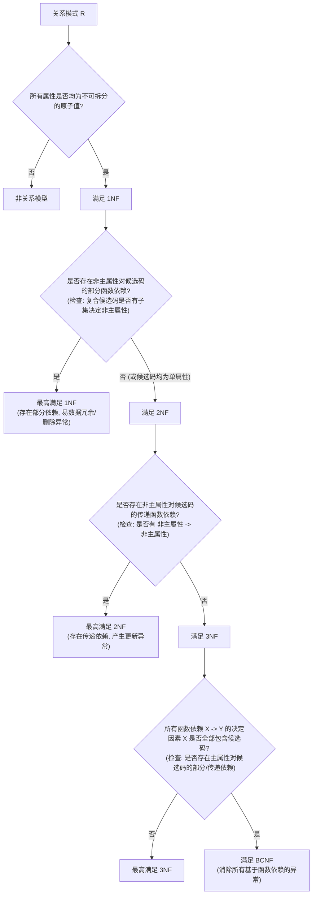

# 考点精要：规范化理论、函数依赖与范式判定

- **所属模块**：MOD-05 数据库系统知识
- **考查题号**：上午第 50 ~ 53 题（固定 2 ~ 3 分，**软考公认核心难点**）
- **重要程度**：⭐⭐⭐⭐⭐（决定能否考取 50+ 高分的试金石）

> [!TIP]
> ### 🎯 45 分及格通关指引（极简避坑与得分铁律）
> - **【45分必背核心得分点】**：
>   1. **候选码极速分类闭包法（1分钟拿分）**：
>      - $L$ 类（只在箭头左侧出现）和 $N$ 类（左右均未出现）：**必定是候选码的核心成员**；
>      - $R$ 类（只在箭头右侧出现）：**绝对不可能出现在任何候选码中**；
>      - 直接令种子集 $K = L \cup N$ 求属性闭包 $K^+$，若 $K^+ = U$（全集），则 $K$ 为唯一候选码！
>   2. **范式等级终极秒杀口诀**：
>      - **1NF**：属性不可再分（基本二维表）；
>      - **2NF**：“**单键必 2NF**”——若候选码仅由单个属性组成，绝无部分函数依赖，必达 2NF；
>      - **3NF**：“**无传递依赖**”——不存在“非主属性 $\rightarrow$ 非主属性”；
>      - **BCNF**：“**左边全为码**”——检查每个函数依赖 $X \rightarrow Y$，$X$ 必须全部是候选码。
>   3. **Armstrong 公理常用推论**：
>      - 合并规则：$X \rightarrow Y \land X \rightarrow Z \implies X \rightarrow YZ$；
>      - 伪传递规则：$X \rightarrow Y \land WY \rightarrow Z \implies WX \rightarrow Z$。
> - **【高分选读 / 考场可战略放弃点】**：
>   - 4NF 多值依赖复杂严格证明、极小函数依赖集（保持依赖且消除多余左侧属性）的手工 4 步迭代演算，在上午综合知识中耗时与得分收益不成正比，考场死记“4NF 消除非平凡多值依赖”常识概念即可。

---

## 一、 核心考纲与概念辨析

### 1. 三种函数依赖定义与判断

设 $R(U)$ 是属性集 $U$ 上的关系模式，$X, Y \subset U$：

| 函数依赖类型 | 符号表达 | 核心特征与通俗定义 | 破坏范式等级 |
| :--- | :--- | :--- | :--- |
| **完全函数依赖** | $X \xrightarrow{f} Y$ | $Y$ 依赖于整个属性组 $X$，且 **$X$ 的任何真子集都无法独立决定 $Y$**。<br>例如：$(\text{学号}, \text{课程号}) \xrightarrow{f} \text{成绩}$ | 规范状态 |
| **部分函数依赖** | $X \xrightarrow{p} Y$ | $X$ 是复合属性，但 **$X$ 的某个真子集就能独立决定 $Y$**。<br>例如：$(\text{学号}, \text{课程号}) \xrightarrow{p} \text{姓名}$，只需学号即可决定姓名 | **违反 2NF** |
| **传递函数依赖** | $X \rightarrow Z$ (传递) | 若 $X \rightarrow Y$（且 $Y \nrightarrow X$），$Y \rightarrow Z$（$Z \notin Y$），则称 $Z$ 传递依赖于 $X$。<br>例如：$\text{学号} \rightarrow \text{系名}$，$\text{系名} \rightarrow \text{系主任}$ | **违反 3NF** |

---

### 2. Armstrong 公理系统与推论

设关系模式 $R(U)$，其上的函数依赖集为 $F$：

- **三大基本公理**：
  1. **自反律**：若 $Y \subseteq X \subseteq U$，则 $X \rightarrow Y$ 成立（平凡函数依赖）；
  2. **增广律**：若 $X \rightarrow Y$ 成立，且 $Z \subseteq U$，则 $XZ \rightarrow YZ$ 成立；
  3. **传递律**：若 $X \rightarrow Y$ 且 $Y \rightarrow Z$ 成立，则 $X \rightarrow Z$ 成立。
- **三大常用推论**：
  1. **合并规则**：若 $X \rightarrow Y$ 且 $X \rightarrow Z$，则 $X \rightarrow YZ$；
  2. **分解规则**：若 $X \rightarrow YZ$，则 $X \rightarrow Y$ 且 $X \rightarrow Z$；
  3. **伪传递规则**：若 $X \rightarrow Y$ 且 $WY \rightarrow Z$，则 $WX \rightarrow Z$。

---

### 3. 主属性与非主属性界定

- **候选码（候选键）**：能够唯一标识关系中元组的**极小属性组**（其闭包包含全集 $U$，且自身任何真子集无法决定 $U$）；
- **主码（主键）**：从多个候选码中人为挑选指定的一个作为主键；
- **主属性 (Prime Attribute)**：**包含在任何一个候选码中的属性**（若有多个候选码，只要属于其中任意一个候选码，该属性就是主属性！）；
- **非主属性 (Non-prime Attribute)**：不包含在任何候选码中的属性。

---

## 二、 分析模型与核心推导演练

### 1. 候选码图解秒杀求法：L/R/LR/N 属性分类闭包法

面对复杂的函数依赖集 $F$，按以下系统化算法可在 1 分钟内求准全部候选码：

```
                    ┌── L 类 (只在左侧出现): 必是候选码的核心成员
                    ├── R 类 (只在右侧出现): 绝不可能出现在任何候选码中
   属性分类矩阵 ────┼── N 类 (未在依赖集出现): 孤立属性，必是候选码成员
                    └── LR 类 (左右均出现): 中间过渡属性，需组合闭包测试
```

#### 标准算法三步：
1. **统计属性分类**：
   - $L$：只在依赖集箭头左边出现的属性；
   - $R$：只在依赖集箭头右边出现的属性；
   - $N$：在依赖集箭头左右均未出现的属性；
   - $LR$：在依赖集箭头左右两侧均出现过的属性。
2. **核心种子集求闭包**：
   - 令核心种子集 $K = L \cup N$；
   - 计算 $K$ 关于 $F$ 的**属性闭包 $K^+$**；
   - **若 $K^+ = U$（覆盖全部属性）**：则 **$K$ 是该模式唯一的候选码**！算法直接终止！
3. **组合 LR 属性扩展测试**：
   - 若 $K^+ \neq U$，则依次将 $LR$ 中的单属性加入 $K$ 中计算闭包；
   - 能推出全集的极小属性组合即为候选码；若仍不足再尝试加入 2 个 LR 属性。

---

### 2. 关系范式阶梯逐级判定树 (1NF $\rightarrow$ BCNF)



#### 范式级别极速秒杀口诀：
- **1NF**：属性不可再分；
- **2NF**：**“单键必 2NF”** —— 只要候选码是单个属性，绝不可能存在部分依赖，直接跳过 2NF 检查！
- **3NF**：**“无传递”** —— 不允许非主属性推导非主属性（$X \rightarrow Y$ 中，要么 $X$ 是候选码，要么 $Y$ 是主属性）；
- **BCNF**：**“左边全为码”** —— 检查每一个函数依赖，箭头左边的决定属性组必须每一个都是候选码！

---

### 3. 模式分解的无损连接性与保持函数依赖

将模式 $R$ 分解为 $\rho = \{R_1, R_2\}$：
- **两分解无损连接定理**：
  $\rho = \{R_1, R_2\}$ 具有无损连接性的充要条件是：
  $$(R_1 \cap R_2) \rightarrow (R_1 - R_2) \quad \text{或} \quad (R_1 \cap R_2) \rightarrow (R_2 - R_1)$$
  *(即公共属性必须能够函数决定其中一个分表的差集属性，即公共属性是其中某个分表的超键)*。
- **保持函数依赖**：原依赖集 $F$ 中的每一个依赖，在分解后的各子模式上通过投影依然能够被推导出来。

---

## 三、 命题题眼与陷阱防御

> [!CAUTION]
> ### 🚨 常见命题陷阱盘点
> 1. **主属性的隐蔽性陷阱**：
>    - 若求出候选码有 2 个：$AB$ 和 $BC$。则主属性包含 $\{A, B, C\}$！即使 $C$ 在某个候选码中未出现，但只要它在另一个候选码中，它就是**主属性**！非主属性只有其余未包含的字段。
> 2. **2NF 判定中的复合键前提**：
>    - 试题给出单属性主键（如学号 Sno），并问其最高范式等级。考生如果还在苦苦寻找部分依赖，就是掉入陷阱。单属性主键**绝对不可能存在部分函数依赖**，必达 2NF！
> 3. **3NF 与 BCNF 的临界区别**：
>    - 3NF 允许依赖 $X \rightarrow Y$ 中 $Y$ 是主属性（即使 $X$ 不是候选码）；
>    - 但 BCNF 绝不妥协，**只要 $X$ 不是候选码，哪怕 $Y$ 是主属性也直接破防**，跌出 BCNF！

---

## 四、 典型真题溯源与逐项排错解析 (Distractor Analysis)

### 【真题精选 1】（考查闭包求候选码与范式判定 · 2024上-机考回忆-Q50~51）
**题干**：给定关系模式 $R(A, B, C, D, E)$，其上的函数依赖集 $F = \{ A \rightarrow B, BC \rightarrow D, D \rightarrow E \}$。则关系模式 $R$ 的候选码为（ 1 ），该关系模式最高属于（ 2 ）。
(1) 
A. $A$  
B. $AC$  
C. $ABC$  
D. $ACD$  
(2) 
A. 1NF  
B. 2NF  
C. 3NF  
D. BCNF  

- **【正确答案】**：**(1) B  (2) A**
- **【核心考点】**：属性分类 L/R 闭包求解算法与部分函数依赖导致降级至 1NF。
- **【45分秒杀技巧】**：
  - 找只在左边出现的属性：$A$ 和 $C$ 属于 L 类，必定在候选码中；
  - 算闭包 $(AC)^+$：$AC \rightarrow B$（因为 $A\rightarrow B$），进而 $BC\rightarrow D$，进而 $D\rightarrow E$。$(AC)^+$ 覆盖全属性 $ABCDE$，候选码必定是 $AC$，秒杀 (1) 选 B！
  - 判定范式：候选码是复合键 $AC$，但存在依赖 $A \rightarrow B$（候选码的子集 $A$ 决定非主属性 $B$），这是典型的**部分函数依赖**，直接破防 2NF，最高只有 1NF，秒杀 (2) 选 A！
- **【逐项排错剖析】**：
  - **第 (1) 题排错**：
    - **B 选项正确**：$AC$ 是能够推出全集 $U$ 的极小属性组；
    - **A 选项排除**：$A^+ = \{A, B\}$，无法推出 $C, D, E$；
    - **C、D 选项排除**：含有冗余属性，不符合候选码“极小性”定义。
  - **第 (2) 题排错**：
    - **A 选项正确**：存在非主属性 $B$ 对码 $AC$ 的部分函数依赖，无法达到 2NF，最高为 1NF；
    - **B、C、D 选项排除**：忽视了 $A \rightarrow B$ 破坏 2NF 的致命缺陷。

---

### 【真题精选 2】（考查 Armstrong 公理系统推论 · 2024上-机考回忆-Q52）
**题干**：设关系模式 $R(U, F)$，其中 $U = \{A, B, C, D\}$，$F$ 为函数依赖集。若已知 $A \rightarrow B$ 且 $AC \rightarrow D$ 属于 $F$ 的逻辑蕴涵，则根据 Armstrong 公理系统推论，必有（ ）。
A. $A \rightarrow D$  
B. $AC \rightarrow BD$  
C. $B \rightarrow D$  
D. $C \rightarrow D$  

- **【正确答案】**：**B**
- **【核心考点】**：Armstrong 公理系统的增广律与合并规则。
- **【45分秒杀技巧】**：
  - 由 $A \rightarrow B$，根据**增广律**两边同乘 $C$，得 $AC \rightarrow BC$（可推出 $AC \rightarrow B$）；
  - 已知 $AC \rightarrow B$ 且 $AC \rightarrow D$，根据**合并规则**直接得出 $AC \rightarrow BD$。秒选 B！
- **【逐项排错剖析】**：
  - **B 选项正确**：根据增广律由 $A \rightarrow B$ 导出 $AC \rightarrow BC$，再结合分解与合并规则可严密导出 $AC \rightarrow BD$；
  - **A 选项排除**：$AC \rightarrow D$ 中必须同时有 $A$ 和 $C$ 参与，单凭 $A$ 无法推导 $D$；
  - **C 选项排除**：无法从已知依赖中导出属性 $B$ 与 $D$ 的直接确定关系；
  - **D 选项排除**：同理，单凭属性 $C$ 无法独立推导 $D$。

---

### 【真题精选 3】（考查传递依赖与范式规范化分解 · 2024下-机考回忆-Q51~52）
**题干**：设有关系模式 $R(\text{职工号}, \text{姓名}, \text{部门名}, \text{部门电话})$，其中每位职工只属于一个部门，每个部门只有一部电话。函数依赖集为：
$\text{职工号} \rightarrow \text{姓名}, \text{职工号} \rightarrow \text{部门名}, \text{部门名} \rightarrow \text{部门电话}$。
该关系模式最高满足（ 1 ），若要使其满足 3NF，应将其分解为（ 2 ）。
(1) 
A. 1NF  
B. 2NF  
C. 3NF  
D. BCNF  
(2) 
A. $R_1(\text{职工号}, \text{姓名}), R_2(\text{部门名}, \text{部门电话})$  
B. $R_1(\text{职工号}, \text{姓名}, \text{部门名}), R_2(\text{部门名}, \text{部门电话})$  
C. $R_1(\text{职工号}, \text{姓名}, \text{部门电话}), R_2(\text{部门名}, \text{部门电话})$  
D. $R_1(\text{职工号}, \text{部门名}), R_2(\text{职工号}, \text{姓名}, \text{部门电话})$  

- **【正确答案】**：**(1) B  (2) B**
- **【核心考点】**：“单键必 2NF”原则与消除传递依赖达成 3NF。
- **【45分秒杀技巧】**：
  - 码为“职工号”（单属性）$\rightarrow$ “**单键必 2NF**”，直接排除 1NF；
  - 存在 $\text{职工号} \rightarrow \text{部门名} \rightarrow \text{部门电话}$（非主属性决定非主属性），属于**传递依赖**，破坏 3NF，最高只能满足 2NF，秒杀 (1) 选 B！
  - 分解为 3NF：把部门独立出去 $R_2(\text{部门名}, \text{部门电话})$，原表保留部门名作为关联外键 $R_1(\text{职工号}, \text{姓名}, \text{部门名})$，秒杀 (2) 选 B！
- **【逐项排错剖析】**：
  - **第 (1) 题排错**：
    - **B 选项正确**：候选码为单属性满足 2NF，但存在非主属性传递依赖破坏 3NF，最高属 2NF；
    - **A 选项排除**：忽视了单属性候选码绝不可能存在部分依赖的定理；
    - **C、D 选项排除**：存在传递依赖绝无法达到 3NF 或更高。
  - **第 (2) 题排错**：
    - **B 选项正确**：公共属性“部门名”为 $R_2$ 的主键，满足无损连接且保持函数依赖，彻底消除了传递依赖；
    - **A 选项排除**：原表中彻底丢失了职工与部门的从属关联；
    - **C、D 选项排除**：分解错误，未消除传递依赖或造成信息失真。
