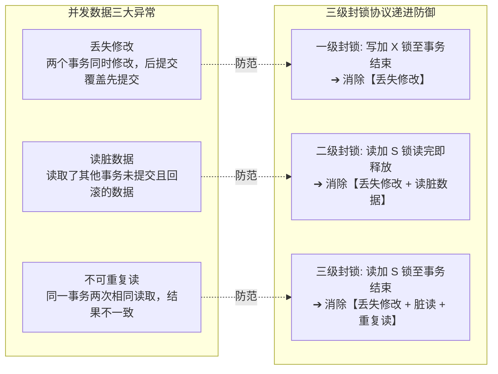
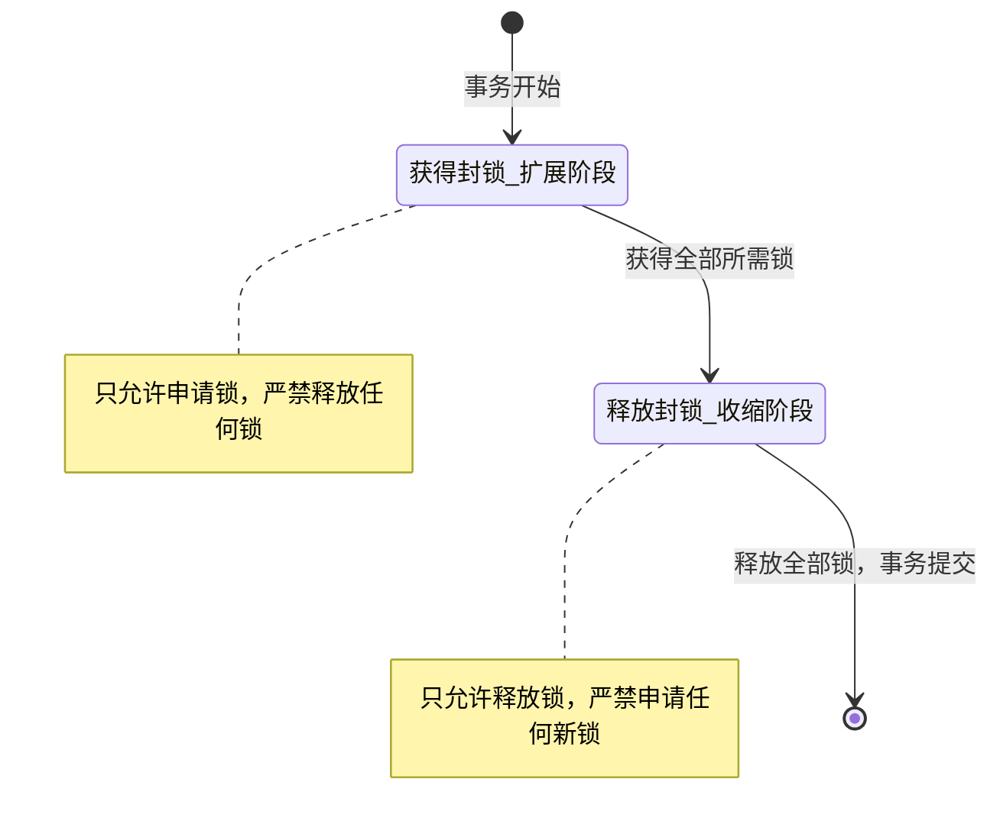

# 考点精要：事务 ACID 特性与并发控制封锁协议

<Badge type="info" text="MOD-05 数据库系统知识" />
<Badge type="tip" text="考查题号：上午第 51 ~ 53 题 (约 2 ~ 3 分)" />
<Badge type="danger" text="⭐⭐⭐⭐ 4星高频" />
<Badge type="tip" text="强贯通下午 (下午题2 事务并发)" />

::: tip 🎯 45 分及格通关指引（极简避坑与得分铁律）
- **【45分必背核心得分点】**：
  1. **ACID 与底层日志支撑一一映射**：
     - **原子性 (A)**：Undo Log（回滚日志，保证要么全做要么全撤销）；
     - **持久性 (D)**：Redo Log（重做日志/预写日志 WAL，保证提交后宕机不丢）；
     - **隔离性 (I)**：封锁机制（Locking）与多版本并发控制（MVCC）；
     - **一致性 (C)**：事务执行的终极目标。
  2. **三级封锁协议秒杀口诀**：
     - **一级封锁**：写加 X 锁到事务结束，**防丢失修改**；
     - **二级封锁**：读加 S 锁**读完即放**，**防丢失修改 + 防读脏数据**；
     - **三级封锁**：读加 S 锁**直到事务结束才放**，**防丢失修改 + 防读脏数据 + 防不可重复读**；
     - 终极口诀：“**二级读完即放防脏读，三级结业才放防重读**”。
  3. **两段锁协议 (2PL) 命题陷阱**：
     - 定理：并发事务遵循两段锁协议，则调度**必定是可串行化的**（执行结果必然正确）；
     - 🚨 陷阱：**遵循两段锁协议依然可能发生死锁！**（2PL 绝不能避免死锁）。
- **【高分选读 / 考场可战略放弃点】**：
  - 分布式两阶段提交协议（2PC）和三阶段提交协议（3PC）在极端网络分区下的协调者状态机迁移推演，分值极低，考场记住“2PC 协调者单点故障可能导致参与者一直阻塞”的常识即可。
:::

---

## 一、 核心考纲与概念辨析

### 1. 事务 ACID 四大特性与底层机制全解

数据库事务是用户定义的一个数据库操作序列，这些操作要么全做，要么全不做，是一个不可分割的逻辑工作单元：

| ACID 特性 | 中文名称 | 核心定义与保障目标 | 底层核心支撑机制 |
| :--- | :--- | :--- | :--- |
| **A - Atomicity** | **原子性** | 事务中的所有操作**要么全部提交成功，要么全部撤回回滚**，绝不允许停滞在中间状态 | **Undo Log（回滚日志）** |
| **C - Consistency** | **一致性** | 事务执行前后，数据库的完整性约束必须保持正确，从一个合法的状态转移到另一个合法状态 | 应用层逻辑 + 外键/触发器约束 + AID 三大特性的共同保证 |
| **I - Isolation** | **隔离性** | 并发执行的各个事务之间互不干扰，未提交的中间变更对外界不可见 | **锁机制 (Locking) + 多版本并发控制 (MVCC)** |
| **D - Durability** | **持久性** | 事务一旦成功提交（Commit），其所做的修改就会被永久保存到磁盘，即使发生系统崩溃宕机也不会丢失 | **Redo Log（重做日志 / WAL 预写日志）** |

---

### 2. 封锁类型与相容矩阵 (Lock Compatibility Matrix)

数据库管理系统主要通过两类基本锁实现并发调度：

- **排他锁 (X 锁 / 写锁)**：若事务 $T$ 对数据对象 $A$ 加上了 X 锁，则只允许 $T$ 读取和修改 $A$；其他任何事务既**不能再对 $A$ 加任何类型的锁（无论 S 锁还是 X 锁）**，直到 $T$ 释放该锁。
- **共享锁 (S 锁 / 读锁)**：若事务 $T$ 对数据对象 $A$ 加上了 S 锁，则事务 $T$ 只能读 $A$ 不能写；**其他事务可以并发对 $A$ 继续加 S 锁读数据**，但不能加 X 锁写数据。

| 当前持有的锁 \ 申请加的锁 | 申请共享锁 (S 锁) | 申请排他锁 (X 锁) |
| :---: | :---: | :---: |
| **共享锁 (S 锁)** | **相容（允许加锁）** | **冲突（必须等待阻塞）** |
| **排他锁 (X 锁)** | **冲突（必须等待阻塞）** | **冲突（必须等待阻塞）** |

---

## 二、 分析模型与核心推导演练

### 1. 并发事务三大异常与三级封锁协议演化矩阵

如果不进行并发控制，多事务交叉执行会引发三大典型的数据不一致问题。针对这些问题，DBMS 演进出了三级封锁协议：

| 封锁协议级别 | 规则定义（加锁动作与释放时机） | 彻底消灭的并发异常 | 仍遗留的缺陷 |
| :--- | :--- | :--- | :--- |
| **一级封锁协议** | 事务在**修改数据前必须加 X 锁**，且**直到事务结束（Commit/Rollback）才释放**；读数据不加锁 | **彻底防止“丢失修改”** | 无法防止读“脏”数据，无法防止不可重复读 |
| **二级封锁协议** | 在一级基础上，事务在**读取数据前必须加 S 锁**，**读完数据后即可立即释放 S 锁** | **防止“丢失修改” + 防止读“脏”数据** | 无法防止不可重复读 |
| **三级封锁协议** | 在一级基础上，事务在**读取数据前必须加 S 锁**，且**必须直到事务结束才释放 S 锁** | **防止丢失修改 + 防止读脏数据 + 防止不可重复读** | 封锁时间长，并发性能略有降低 |

::: info 💡 二级 vs 三级封锁协议的分水岭口诀
**“二级读完即放 S，只能防脏读；三级结业才放 S，方防重复读！”**
:::

---

### 2. 两段锁协议 (2PL, Two-Phase Locking)

两段锁协议是保证并发调度正确性（可串行化）的标准协议。

#### 核心规范与阶段划分
事务对数据项的加锁与解锁操作必须严格分为两个阶段：
1. **第一阶段：获得封锁（扩展阶段）**：事务可以申请并获得任何类型的锁，但**不能释放任何锁**；
2. **第二阶段：释放封锁（收缩阶段）**：事务可以释放任何类型的锁，但**绝不能再申请获得任何新的锁**。

#### 黄金定理与极高频考题结论
1. **定理一（充分条件）**：**若并发执行的所有事务都遵循两段锁协议，则这些事务的任何并发调度必定是可串行化的（Serializable，即执行结果绝对正确）！**
2. **定理二（非必要条件）**：可串行化的调度不一定所有事务都遵循两段锁协议（两段锁是可串行化的充分条件，而非必要条件）。
3. **🚨 终极死锁陷阱**：**遵循两段锁协议的事务依然可能发生死锁！**（例如：事务 $T_1$ 获得 $A$ 的锁后去申请 $B$ 的锁，事务 $T_2$ 获得 $B$ 的锁后去申请 $A$ 的锁，二者均在扩展阶段，互不释放，陷入死锁）。

---

## 三、 命题题眼与陷阱防御

::: danger 🚨 常见命题陷阱盘点
1. **两段锁协议能“避免死锁”的致命误导**：
   - 选项常设坑：“两段锁协议可以避免死锁” $\rightarrow$ **100% 判定为错误选项**！两段锁协议只保证并发调度的可串行化，**根本无法防止死锁**！
2. **S 锁释放时机的概念偷换**：
   - 题目：为了防止不可重复读，应该采用（ ）。
   - 必须选择**三级封锁协议**！若选项说“读取时加 S 锁，读完即释放”，这只是二级封锁协议，只能防脏读，读完释放后别的事务完全可以修改数据，依然会发生不可重复读！
3. **ACID 支撑机制一一映射**：
   - 原子性 (A) $\rightarrow$ Undo Log；
   - 持久性 (D) $\rightarrow$ Redo Log；
   - 隔离性 (I) $\rightarrow$ 锁 / MVCC；
   - 一致性 (C) $\rightarrow$ 事务执行的目标（而非单纯某一机制）。出题人若问“保证事务原子性的关键技术是”，务必精准锁定 **Undo Log**。
:::

---

## 四、 典型真题溯源与逐项排错解析 (Distractor Analysis)

### 【真题精选 1】（考查并发异常成因与封锁协议级别匹配 · 2024上-机考回忆-Q53~54）
**题干**：在数据库系统中，事务 $T_1$ 读取了数据项 $X$ 的值；随后事务 $T_2$ 对 $X$ 进行了修改并成功提交；当事务 $T_1$ 再次读取数据项 $X$ 时，发现其值已与之前不一致。这种并发异常被称为（ 1 ）。为了从根本上避免该异常的发生，系统应采用（ 2 ）。

(1) 
A. 丢失修改  
B. 读“脏”数据  
C. 不可重复读  
D. 幽灵读（幻读）  
(2) 
A. 一级封锁协议  
B. 二级封锁协议  
C. 三级封锁协议  
D. 两段锁协议  

::: details 💡 点击展开【正确答案与逐项排错剖析】
- **【正确答案】**：**(1) C  (2) C**
- **【核心考点】**：并发操作三种不一致性（丢失修改、读脏数据、不可重复读）与三级封锁协议的防范能力对照。
- **【45分秒杀技巧】**：
  - 同一事务两次读取同一数据得到不同结果，字面对应“**不可重复读**”，秒杀 (1) 选 C！
  - 口诀：“**二级读完即放防脏读，三级结业才放防重读**”。要防不可重复读，必须锁定**三级封锁协议**，秒杀 (2) 选 C！
- **【逐项排错剖析】**：
  - **第 (1) 题排错**：
    - **C 选项正确**：$T_1$ 在同一事务内前后两次读 $X$ 读到了 $T_2$ 提交修改后的不同值，完全符合“不可重复读”定义；
    - **A 选项排除**：丢失修改是两事务同时写，后写的把先写的覆盖了；
    - **B 选项排除**：读脏数据是指读到了未提交且随后发生回滚的虚假数据，本题中 $T_2$ 已经提交；
    - **D 选项排除**：幻读是指按相同条件统计记录条数，因其他事务插入了新行导致总行数不一致。
  - **第 (2) 题排错**：
    - **C 选项正确**：三级封锁协议要求读数据加 S 锁并一直持有到事务结束，杜绝了中间其他事务对 $X$ 施加 X 锁修改的可能，彻底消除了不可重复读；
    - **A 选项排除**：一级封锁读不加锁，只能防丢失修改；
    - **B 选项排除**：二级封锁读完立即释放 S 锁，释放后其他事务立刻能修改 $X$，无法防不可重复读；
    - **D 选项排除**：两段锁协议是关于可串行化的调度准则，非具体封锁协议等级名称。
:::

---

### 【真题精选 2】（考查两段锁协议特性与死锁辨析 · 2024下-机考回忆-Q53）
**题干**：关于数据库管理系统中的两段锁协议 (2PL)，下列叙述中正确的是（ ）。

A. 遵循两段锁协议的事务并发调度，可以保证调度的可串行化，且绝不会发生死锁  
B. 遵循两段锁协议的事务并发调度，可以保证调度的可串行化，但仍有可能发生死锁  
C. 遵循两段锁协议是事务调度可串行化的充要条件  
D. 两段锁协议允许事务在执行过程中，加锁和解锁操作交叉穿插进行  

::: details 💡 点击展开【正确答案与逐项排错剖析】
- **【正确答案】**：**B**
- **【核心考点】**：两段锁协议的充分性（保证可串行化）与不防死锁的核心定理。
- **【45分秒杀技巧】**：软考死记两句话：“**两段锁必可串行化**”与“**两段锁绝不防死锁**”。选项 A 吹嘘“绝不死锁”必错，选项 B 兼顾可串行化与仍可能死锁，秒选 B！
- **【逐项排错剖析】**：
  - **B 选项正确**：两段锁协议保证了调度的可串行性，但在扩展阶段由于不同事务竞争多个互斥资源，依然完全可能陷入循环等待导致死锁；
  - **A 选项排除**：“绝不会发生死锁”是出题人预设的最经典认知陷阱；
  - **C 选项排除**：两段锁协议只是可串行化的**充分条件**（遵循 2PL 必可串行化，但可串行化的调度不一定都遵循 2PL），非必要条件；
  - **D 选项排除**：两段锁协议严格要求分阶段，一旦开始释放锁（收缩阶段），严禁再申请任何新锁，绝不允许交叉。
:::

---

### 【真题精选 3】（考查 ACID 特性与底层日志支撑机制 · 2024下-机考回忆-Q54）
**题干**：数据库管理系统中的事务具有 ACID 四大特性。其中，用于保障事务原子性 (Atomicity) 的关键底层技术是（ 1 ）；用于保障事务持久性 (Durability) 的关键底层技术是（ 2 ）。

(1) A. 回滚日志 (Undo Log)  B. 重做日志 (Redo Log)  C. 影子分页技术  D. 乐观并发控制  
(2) A. 回滚日志 (Undo Log)  B. 重做日志 (Redo Log)  C. 两阶段提交协议  D. 共享锁机制  

::: details 💡 点击展开【正确答案与逐项排错剖析】
- **【正确答案】**：**(1) A  (2) B**
- **【核心考点】**：事务 ACID 特性的底层日志支撑机制（Undo Log 保障原子性回滚，Redo Log 保障持久性重做）。
- **【45分秒杀技巧】**：记牢字母对应：“**原子 (Atomicity) 靠撤销回滚 Undo**，**持久 (Durability) 靠重做 Redo**”。秒杀 (1) 选 A，(2) 选 B！
- **【逐项排错剖析】**：
  - **第 (1) 题排错**：
    - **A 选项正确**：Undo Log 记录了事务修改数据前的值，当事务执行失败或被用户主动 Rollback 时，依据 Undo Log 撤销全部已执行操作，确保“要么全做要么全不做”的原子性；
    - **B 选项排除**：Redo Log 记录物理页的修改用于重做，用于持久性；
    - **C、D 选项排除**：非通用主流单机 DBMS 保障事务原子性的核心机制。
  - **第 (2) 题排错**：
    - **B 选项正确**：DBMS 遵循 WAL（Write-Ahead Logging 预写日志）原则，提交前必须先将 Redo Log 刷入磁盘，即使系统随后断电宕机，重启时通过 Redo Log 也能将数据完全恢复重做，保障持久性；
    - **A 选项排除**：Undo Log 是为了撤销回滚，无法在断电后重做已提交的变更；
    - **C、D 选项排除**：两阶段提交协议用于分布式环境一致性，锁用于隔离性。
:::

---

## 考点通关与速查导航

- 📖 **全科公式速查**：[上午综合知识高频计算公式与速解模板速查表](../formula-cheat-sheet.md)
- 🚨 **全科避坑指南**：[上午综合知识高频易错避坑清单与秒杀模板库](../exam-pitfalls-and-short-cuts.md)
- 🏠 **专题备考导航**：[上午综合知识备考导航](../index.md)
