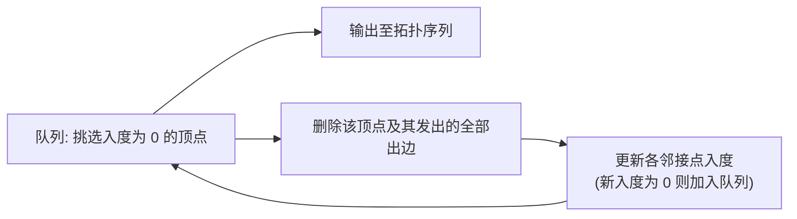

# 考点精要：图的存储遍历与最小生成树拓扑排序

<Badge type="info" text="MOD-06 数据结构与算法" />
<Badge type="tip" text="考查题号：上午第 60 ~ 63 题 (约 2 ~ 3 分)" />
<Badge type="danger" text="⭐⭐⭐⭐ 4星核心" />
<Badge type="warning" text="弱贯通下午" />

::: tip 🎯 45 分及格通关指引（极简避坑与得分铁律）
- **【45分必背核心得分点】**：
  1. **邻接矩阵 vs 邻接表核心口诀**：邻接矩阵空间 $O(n^2)$ 适合稠密图，有向图“**行出列入**”（第 $i$ 行非零和为出度，第 $j$ 列非零和为入度）；邻接表空间 $O(n+e)$ 适合稀疏图。
  2. **最小生成树算法两分法**：
     - **Prim（普里姆）**：从顶点出发切分，时间复杂度 $O(n^2)$（与边数无关），适合**稠密图**；
     - **Kruskal（克鲁斯卡尔）**：从边出发贪心选边加权判环，时间复杂度 $O(e \log e)$，适合**稀疏图**；
     - 任意 $n$ 个顶点的连通网，最小生成树包含且仅包含 **$n-1$ 条边**。
  3. **拓扑排序与判环铁律**：每次挑选**入度为 0** 的顶点出队并删边；若最终输出顶点数 $< n$，说明**存在有向回路（死锁环）**；只有有向无环图（DAG）才能拓扑排序。
  4. **遍历与辅助数据结构**：DFS 类似树的先序遍历，辅助结构为**栈（递归）**；BFS 类似树的层序遍历，辅助结构为**队列**。
- **【高分选读 / 考场可战略放弃点】**：
  - 复杂的差分约束系统推导、Dijkstra 带负权边时的松弛过程（Bellman-Ford / SPFA 详细推演）、网络流最大流最小割算法，在上午题中分值权重极低，考场若遇冷门变式可根据“最短/贪心”常理猜选，切忌深陷推导耗费时间。
:::

---

## 一、 核心考纲与概念辨析

### 1. 邻接矩阵 vs 邻接表对比矩阵

| 存储结构 | 存储原理与空间复杂度 | 适用图类型 | 节点出度/入度计算特征 |
| :--- | :--- | :--- | :--- |
| **邻接矩阵** | 使用一维数组存顶点，二维数组 $A[n][n]$ 存边的权值或有无关系；**空间复杂度为 $O(n^2)$** | **稠密图**（边数接近 $n^2$） | - **无向图**的邻接矩阵关于主对角线**对称**，行非零元素之和为度数 - **有向图**中，第 $i$ 行非零元素之和为节点 $i$ 的**出度**；第 $j$ 列非零元素之和为节点 $j$ 的**入度**（口诀：“**行出列入**”） |
| **邻接表** | 顺序存储顶点表头，每个顶点挂接一条单链表存储其所有的邻接出边；**空间复杂度为 $O(n + e)$**（有向）或 $O(n + 2e)$（无向） | **稀疏图**（边数 $e \ll n^2$） | - 计算**出度**极快（直接统计单链表节点个数） - 计算有向图**入度**需遍历整张表（或借助**逆邻接表**） |

---

### 2. 深度优先 (DFS) vs 广度优先 (BFS) 遍历

- **深度优先搜索 (DFS, Depth First Search)**：
  - 遍历策略：类似树的**先序遍历**；从起点出发，尽可能深地沿着一条路径访问未被访问的邻接点，当无路可走时沿原路**回溯**。
  - 核心辅助数据结构：**栈 (Stack)**（系统递归调用栈）。
  - 空间复杂度：$O(n)$。
- **广度优先搜索 (BFS, Breadth First Search)**：
  - 遍历策略：类似树的**层序遍历**；从起点出发，由近及远逐层辐射访问所有相连的邻接顶点。
  - 核心辅助数据结构：**队列 (Queue)**。
  - 空间复杂度：$O(n)$。

---

### 3. 最小生成树算法决斗：普里姆 (Prim) vs 克鲁斯卡尔 (Kruskal)

包含 $n$ 个顶点的连通无向网络，其最小生成树必定包含且仅包含 **$n-1$ 条边**，且全图权值总和最小。

| 算法对比 | 普里姆算法 (Prim) | 克鲁斯卡尔算法 (Kruskal) |
| :--- | :--- | :--- |
| **搜索机制** | **从顶点出发（点切分扩展）**：初始选任一顶点，每次从未加入树的顶点中选一个离当前树最近（边权最小）的顶点加入 | **从边出发（贪心选边加权）**：将所有边按权值从小到大排序，每次选取权值最小且**与已有边不构成回路（不形成环）**的边加入 |
| **时间复杂度** | **$O(n^2)$**（与边数无关，依赖顶点数） | **$O(e \log e)$**（与边数密切相关，基于并查集判环） |
| **最优适用场景** | **稠密图**（顶点少、边数极其密集） | **稀疏图**（顶点多、边数相对稀疏） |

---

## 二、 算法推导与有向无环图 (DAG) 分析模型

### 1. 拓扑排序 (Topological Sorting) 算法步骤与判环模型

- **AOV 网 (Activity On Vertex)**：用顶点表示活动，用有向边 $\langle v_i, v_j \rangle$ 表示活动 $v_i$ 必须先于活动 $v_j$ 执行。
- **核心判定结论**：
  1. 若输出的拓扑序列包含的顶点个数**小于**图中全部顶点数，则说明**图中必定存在有向回路（死锁环路）**；
  2. 只有**有向无环图 (DAG)** 才能完成完整的拓扑排序；
  3. 拓扑排序序列通常**不唯一**（当某一时刻存在多个入度为 0 的节点可供选择时）。

### 2. 单源最短路径算法：Dijkstra 算法模型

- 采用贪心策略，逐步扩展已求得最短路径的顶点集合 $S$；
- **核心限制**：图中**不能包含负权边**（若含负权边需采用 Bellman-Ford 或 SPFA 算法）；
- 基础实现时间复杂度为 $O(n^2)$，基于优先队列（小顶堆）优化后复杂度为 $O(e \log n)$。

---

## 三、 命题题眼与陷阱防御

::: danger 🚨 常见命题陷阱盘点
1. **稠密图与稀疏图算法选型**：
   - 软考经典考题：“对于一个具有 1000 个顶点和 4000 条边的网络，求其最小生成树宜选用（ ）算法” $\rightarrow$ 边数 $4000 \ll 1000^2$，为典型稀疏图，必须选 **Kruskal 算法**！
2. **邻接矩阵的有向图出度与入度**：
   - 行非零元素之和是**出度**（横行出去）；列非零元素之和是**入度**（纵列进来）。两字口诀：“**行出列入**”！
3. **拓扑排序序列的唯一性条件**：
   - 拓扑序列不唯一是常态。只有当图的拓扑排序在每一步中**都恰好只有唯一的入度为 0 顶点**时，拓扑序列才唯一。
:::

---

## 四、 典型真题溯源与逐项排错解析 (Distractor Analysis)

### 【真题精选 1】（考查拓扑排序与回路检测 · 2024上-机考回忆-Q60）

**题干**：在对某有向图进行拓扑排序的过程中，若某时刻图中不存在入度为 0 的顶点，但此时尚未遍历完图中所有的顶点，则说明（ ）。
- A. 该有向图一定存在有向环路  
- B. 该有向图是完全有向图  
- C. 该有向图的拓扑序列是唯一的  
- D. 该有向图的连通分量个数大于 1  

::: details 💡 点击展开【正确答案与逐项排错剖析】
- **【正确答案】**：**A**
- **【核心考点】**：AOV 网拓扑排序算法的终止条件与有向回路（环路）检测。
- **【45分秒杀技巧】**：拓扑排序核心规则是“每次找入度为 0 的点”。找不到了却还没排完，说明剩下的点相互依赖成了死锁环，秒选 A。

#### 逐项排错剖析 (Distractor Analysis)
- **A 选项正确**：拓扑排序通过不断移除入度为 0 的节点来剥除前驱依赖。若剩余未输出顶点中不存在入度为 0 的节点，说明剩余的每个顶点至少都有一个前驱位于该剩余集合中，这在有限集合下必然构成至少一个有向回路（有向环），陷入死锁无法推进；
- **B 选项排除**：完全有向图要求任意两个顶点之间都有双向相反的有向边，这是极度严格的结构，存在局部环路并不意味着一定是完全图；
- **C 选项排除**：既然存在环路，拓扑排序直接宣告失败，根本无法生成完整的拓扑序列，更谈不上唯一；
- **D 选项排除**：有向图存在环路与图的弱连通/强连通分量个数无必然充要关系，单个连通分量内部包含一个简单三元环即可导致该现象。
:::

---

### 【真题精选 2】（考查最小生成树算法特征与复杂度 · 2024下-机考回忆-Q61）

**题干**：某连通无向网 $G$ 包含 $n$ 个顶点和 $e$ 条边。若采用克鲁斯卡尔（Kruskal）算法求解其最小生成树，则该算法适合用于求解（ 1 ）网的最小生成树，其时间复杂度为（ 2 ）。
- (1) A. 稠密 &emsp; B. 稀疏 &emsp; C. 有向 &emsp; D. 二部  
- (2) A. $O(n^2)$ &emsp; B. $O(n \log n)$ &emsp; C. $O(e \log e)$ &emsp; D. $O(n \cdot e)$  

::: details 💡 点击展开【正确答案与逐项排错剖析】
- **【正确答案】**：**(1) B &emsp; (2) C**
- **【核心考点】**：Kruskal 算法的贪心选边机理、时间复杂度与稀疏图适用场景。
- **【45分秒杀技巧】**：记住口诀“**克边稀（Kruskal看边适合稀疏图），普点稠（Prim看点适合稠密图）**”。Kruskal 对边排序，耗时 $O(e \log e)$，稀疏图选 Kruskal。

#### 逐项排错剖析 (Distractor Analysis)
- **第 (1) 题排错**：
  - **B 选项正确**：Kruskal 算法是将所有边按权值升序排列，逐一检测是否构成环路加入树中。在边数远小于顶点平方（$e \ll n^2$）的稀疏网络中，边数较少，排序开销小，因此极适合稀疏图；
  - **A 选项排除**：在稠密网中边数极大（接近 $n^2$），此时排序边开销剧增，适合使用时间复杂度只与顶点数相关的 Prim 算法（$O(n^2)$）；
  - **C 选项排除**：最小生成树标准算法面向无向带权连通图，有向图的最小树形图需采用朱-刘算法；
  - **D 选项排除**：二部图是图的拓扑分类，不是算法选型的核心决策依据。
- **第 (2) 题排错**：
  - **C 选项正确**：Kruskal 算法的核心耗时在于对所有 $e$ 条边进行堆排序或快速排序，耗时为 $O(e \log e)$，后续利用并查集进行连通性检测近乎线性，故总时间复杂度为 $O(e \log e)$；
  - **A 选项排除**：$O(n^2)$ 为未优化邻接矩阵表示下 Prim 算法的时间复杂度；
  - **B、D 选项排除**：不符合 Kruskal 算法标准的渐进上界形式。
:::

---

## 考点通关与速查导航

- 📖 **全科公式速查**：[上午综合知识高频计算公式与速解模板速查表](../formula-cheat-sheet.md)
- 🚨 **全科避坑指南**：[上午综合知识高频易错避坑清单与秒杀模板库](../exam-pitfalls-and-short-cuts.md)
- 🏠 **专题备考导航**：[上午综合知识备考导航](../index.md)
