# 考点精要：查找与内部排序算法时空复杂度全景矩阵

<Badge type="info" text="MOD-06 数据结构与算法" />
<Badge type="tip" text="考查题号：上午第 63 ~ 65 题 (固定 3 分)" />
<Badge type="danger" text="⭐⭐⭐⭐⭐ 5星必考" />
<Badge type="success" text="强贯通下午 (下午题4 必考15分)" />

::: tip 🎯 45 分及格通关指引（极简避坑与得分铁律）
- **【45分必背核心得分点】**：
  1. **时空复杂度三剑客**：快速排序、归并排序、堆排序平均时间均为 $O(n\log_2 n)$。
     - **堆排序**：无论最好、最坏、平均，时间复杂度**恒定为 $O(n\log_2 n)$**，空间 $O(1)$，**不稳定**；
     - **快速排序**：平均最优 $O(n\log_2 n)$，但在完全有序/逆序的最坏情况下退化为 **$O(n^2)$**，空间为递归栈 $O(\log_2 n)$，**不稳定**；
     - **归并排序**：时间恒为 $O(n\log_2 n)$，辅助空间开销最大为 **$O(n)$**，**稳定**。
  2. **稳定性终极秒杀口诀**：“**快选希堆不稳定，其余全稳定！**”（快速排序、简单选择排序、希尔排序、堆排序不稳定）。
  3. **经典排序一趟过程模拟**：
     - **简单选择排序**：第 $k$ 趟必定选出第 $k$ 小的元素放入下标 $k-1$ 位置（两两元素直接交换位置）；
     - **冒泡排序**：第 $k$ 趟必定将第 $k$ 大的元素沉到底部；
     - **快速排序**：一趟划分后，基准元素（Pivot）放置在最终全局有序的位置，左边元素全小于它，右边全大于它。
  4. **折半查找（二分查找）比较次数**：长度为 $n$ 的有序表，最大比较次数即为判定树深度 $\lfloor \log_2 n \rfloor + 1$。例如 1000 个元素，$2^9 = 512 < 1000 \le 2^{10} = 1024$，最大比较次数为 10 次。
- **【高分选读 / 考场可战略放弃点】**：
  - 基数排序复杂的分配收集内部链表指针调整、高级平衡二叉树（红黑树插入旋转细节、B+树分裂合并细节），在上午基础题中分值极低，考场切勿花费时间死磕微观指针调整。
:::

---

## 一、 核心考纲与概念辨析

### 1. 经典内部排序算法时空复杂度与稳定性全景大表

| 排序类别 | 算法名称 | 最好时间复杂度 | 最坏时间复杂度 | 平均时间复杂度 | 空间复杂度 | 稳定性 | 核心工作原理与特征 |
| :--- | :--- | :--- | :--- | :--- | :--- | :--- | :--- |
| **插入排序** | **直接插入排序** | $O(n)$ | $O(n^2)$ | $O(n^2)$ | $O(1)$ | **稳定** | 顺序比较并向后移位，原序列基本有序时最快 |
| | **希尔排序 (Shell)** | $O(n)$ | $O(n^2)$ | $O(n^{1.3} \sim n^2)$ | $O(1)$ | **不稳定** | 缩小增量（步长 $d$）分组直接插入排序 |
| **交换排序** | **冒泡排序** | $O(n)$ | $O(n^2)$ | $O(n^2)$ | $O(1)$ | **稳定** | 相邻两两比较交换，每趟确定一个最值沉底 |
| | **快速排序** | $O(n \log_2 n)$ | **$O(n^2)$** | **$O(n \log_2 n)$** | **$O(\log_2 n)$** | **不稳定** | 基于基准划分左右两个子区间，**平均性能最优** |
| **选择排序** | **简单选择排序** | $O(n^2)$ | $O(n^2)$ | $O(n^2)$ | $O(1)$ | **不稳定** | 每趟从未排序列中选最小元素放入已排末尾 |
| | **堆排序 (Heap)** | **$O(n \log_2 n)$** | **$O(n \log_2 n)$** | **$O(n \log_2 n)$** | **$O(1)$** | **不稳定** | 基于大顶堆/小顶堆，**任何情况时间复杂度均恒定** |
| **归并排序** | **二路归并排序** | **$O(n \log_2 n)$** | **$O(n \log_2 n)$** | **$O(n \log_2 n)$** | **$O(n)$** | **稳定** | 分治策略将两个有序子表合并，空间辅助开销最大 |
| **分配排序** | **基数排序** | $O(d(n+r))$ | $O(d(n+r))$ | $O(d(n+r))$ | $O(r)$ | **稳定** | 按关键字的位（个/十/百位）分配与收集，无直接比较 |

---

### 2. 稳定性判断口诀（软考秒杀绝技）

::: info 💡 算法稳定性与秒杀口诀
**算法稳定性定义**：若待排序序列中存在两个相等的关键字 $K_i = K_j$，排序前 $K_i$ 在 $K_j$ 之前，排序后 $K_i$ 依然在 $K_j$ 之前，则称该算法是**稳定**的。

**不稳定的排序算法只有 4 种**：
1. **快**（快速排序）
2. **选**（简单选择排序）
3. **希**（希尔排序）
4. **堆**（堆排序）

💡 **秒杀口诀**：**“快选希堆不稳定，其余全稳定！”**
:::

---

### 3. 四大经典算法策略辨析（贯通下午题 4）

| 算法策略 | 核心思想与解决思路 | 经典软考真题算法题例 | 常见时间复杂度 |
| :--- | :--- | :--- | :--- |
| **分治法 (Divide & Conquer)** | 将原问题分解为规模较小但结构相同的独立子问题，递归求解并合并 | 二分查找、归并排序、快速排序 | $O(\log n)$ 或 $O(n \log n)$ |
| **动态规划法 (Dynamic Programming)** | 将问题分解为相互重叠的子问题，**利用表格（记忆化）保存中间状态**；满足**最优子结构**与**子问题重叠**性质 | 0-1 背包问题、最长公共子序列 (LCS)、矩阵连乘、最短路径 Floyd | 通常为多项式级 $O(n^2)$ 或 $O(n \cdot C)$ |
| **贪心法 (Greedy Algorithm)** | 每一步都做出**当前看起来最优的选择（局部最优）**，不从全局整体考虑，期望导致全局最优 | 哈夫曼编码、最小生成树 (Prim/Kruskal)、单源最短路 Dijkstra、找零钱问题 | $O(n \log n)$ |
| **回溯法 (Backtracking)** | 深度优先搜索状态空间树，当发现当前节点不满足约束条件时，**“走不通就掉头（剪枝回溯）”** | $N$ 皇后问题、迷宫寻路、图的着色问题、旅行商问题 (TSP) | 通常为指数级 $O(2^n)$ 或 $O(n!)$ |

```mermaid
flowchart TD
    Start["算法策略选型决策"] --> Q1{"是否需要求最优解/极值？"}
    Q1 -- "否 (求解空间搜索/全部解)" --> Backtrack["回溯法 (Backtracking)<br/>• 深度优先搜索 + 剪枝回溯<br/>• 典例: N皇后、迷宫寻路、TSP"]
    Q1 -- "是" --> Q2{"能否由局部最优选择<br/>直接保证全局最优？"}
    Q2 -- "能 (具备贪心选择性质)" --> Greedy["贪心法 (Greedy)<br/>• 局部贪心递推全局最优<br/>• 典例: 哈夫曼编码、Prim、Kruskal、Dijkstra"]
    Q2 -- "否 (需权衡多阶段选择)" --> Q3{"子问题之间是否相互重叠？"}
    Q3 -- "重叠 (最优子结构 + 重叠子问题)" --> DP["动态规划法 (DP)<br/>• 状态转移方程 + 表格记忆化<br/>• 典例: 0-1背包、LCS、Floyd"]
    Q3 -- "独立 (各子问题互不相干)" --> Divide["分治法 (Divide & Conquer)<br/>• 分解独立子问题 + 递归合并<br/>• 典例: 归并排序、快速排序、二分查找"]
```

---

## 二、 计算公式与时空分析模型

### 1. 基于比较排序的时间复杂度下界理论

任何基于关键字“两两比较”的内部排序算法，在最坏情况下的时间复杂度下界至少为：
$$\Omega(n \log_2 n)$$
- **判定树证明机制**：$n$ 个不同元素的全部排列共有 $n!$ 种可能形态。一棵高度为 $h$ 的二叉判定树至少要有 $n!$ 个叶子节点：
  $$2^h \ge n! \implies h \ge \log_2(n!) = \sum_{i=1}^n \log_2 i \approx n \log_2 n - n \log_2 e = O(n \log_2 n)$$
- 因此，任何比较排序算法的时间复杂度不可能优于 $O(n \log n)$（基数排序因利用桶分配避开了直接比较，能达到线性）。

### 2. 快速排序递归树深度与最坏恶化模型

- **平均/最好情况**：基准元素每次都能将区间等分成两半，递归树深度为 $\lfloor \log_2 n \rfloor + 1$，每层划分耗时 $O(n)$，总耗时为 $O(n \log_2 n)$，空间复杂度为递归栈深度 $O(\log n)$；
- **最坏情况**：当待排序序列**原本已经有序（完全正序或逆序）**且每次选取第一个元素作为基准时，区间退化为 $0$ 与 $n-1$，递归树变成单支斜树，深度达 $n$，时间复杂度急剧恶化为 **$O(n^2)$**，空间复杂度恶化为 $O(n)$。

---

## 三、 命题题眼与陷阱防御

::: danger 🚨 常见命题陷阱盘点
1. **堆排序与归并排序的稳定性**：
   - 堆排序是不稳定的（筛选调整父子节点时打乱原序）；
   - 归并排序是稳定的（两路归并时设定 $\le$ 即可维持左序优先）。
2. **空间复杂度考查**：
   - 归并排序空间复杂度为 **$O(n)$**（需要与原数组同等大小的辅助数组）；
   - 快速排序空间复杂度为 **$O(\log_2 n)$**（系统递归调用栈深度的开销）；
   - 堆排序空间复杂度为 **$O(1)$**（原地建堆）。
3. **动态规划与分治法的根本区别**：
   - 分治法的子问题之间是**相互独立**的（如快速排序的左右区间）；
   - 动态规划的子问题之间是**高度重叠**的，通过表格备忘录消除重复计算。
:::

---

## 四、 典型真题溯源与逐项排错解析 (Distractor Analysis)

### 【真题精选 1】（考查简单选择排序过程模拟 · 2024上-机考回忆-Q63）
**题干**：给定待排序序列 `(46, 79, 56, 38, 40, 84)`，采用简单选择排序算法对其进行升序排列，经过两趟排序后的序列为（ ）。
A. `(38, 40, 56, 46, 79, 84)`  
B. `(38, 40, 46, 79, 56, 84)`  
C. `(38, 46, 56, 79, 40, 84)`  
D. `(38, 79, 56, 46, 40, 84)`  

::: details 💡 点击展开【正确答案与逐项排错剖析】
- **【正确答案】**：**A**
- **【核心考点】**：简单选择排序每趟选出最小元素与对应未排序首位进行物理交换的执行轨迹。
- **【45分秒杀技巧】**：
  1. 第 1 趟：在 `(46, 79, 56, 38, 40, 84)` 中挑出最小数 38，与第 1 个位置的 46 交换 $\rightarrow$ 变为 `(38, 79, 56, 46, 40, 84)`；
  2. 第 2 趟：在后续剩余序列 `(79, 56, 46, 40, 84)` 中挑出最小数 40，与第 2 个位置的 79 交换 $\rightarrow$ 变为 `(38, 40, 56, 46, 79, 84)`。秒选 A！
- **【逐项排错剖析】**：
  - **A 选项正确**：两趟排序后前两个元素必然确定为全局最小的两个有序元素 38 与 40，且其余元素的内部相对位置在交换后准确无误呈现 `(56, 46, 79, 84)`；
  - **B 选项排除**：序列后部为 `(46, 79, 56, 84)`，误将 46 与 56 再次进行了交换，违背简单选择排序每趟只发生一次首位与最小位交换的规则；
  - **C 选项排除**：序列第二位误排为 46，40 仍滞留在原位，说明第二趟未正确选取全局剩余最小值；
  - **D 选项排除**：该结果仅为第一趟排序完成后的中间序列状态，尚未执行第二趟选择交换。
:::

---

### 【真题精选 2】（考查二分查找最大比较次数 · 2024下-机考回忆-Q64）
**题干**：在包含 1000 个有序元素的顺序表中进行折半查找（二分查找），若查找一个不存在于表中的元素，最多需要进行的关键字比较次数为（ ）。
A. 9  
B. 10  
C. 11  
D. 500  

::: details 💡 点击展开【正确答案与逐项排错剖析】
- **【正确答案】**：**B**
- **【核心考点】**：二分查找二叉判定树的高度计算公式 $h = \lfloor \log_2 n \rfloor + 1$。
- **【45分秒杀技巧】**：二分查找无论查成功还是查失败，最大比较次数都是找二叉判定树的最大深度。$2^9 = 512 < 1000 \le 2^{10} = 1024$，指数为 10，直接选 B。
- **【逐项排错剖析】**：
  - **B 选项正确**：折半查找过程可以用一棵二叉判定树表示。树的高度即为查找失败或成功时关键字的最大比较次数。对于含有 $n$ 个结点的有序表，二叉判定树的高度为 $h = \lfloor \log_2 n \rfloor + 1$。代入 $n=1000$ 得 $\lfloor \log_2 1000 \rfloor + 1 = 9 + 1 = 10$ 次；
  - **A 选项排除**：9 次仅能覆盖最多 $2^9 - 1 = 511$ 个元素，对于 1000 个元素二分无法完全区分；
  - **C 选项排除**：当且仅当元素个数超过 $2^{10} = 1024$ 时（如 1025 个元素），最大比较次数才会上升至 11 次；
  - **D 选项排除**：500 次是顺序查找（线性查找）在未排序表中的平均查找长度，非二分查找的对数级性能。
:::

---

### 【真题精选 3】（考查算法稳定性与空间复杂度 · 2024下-机考回忆-Q65）
**题干**：在内部排序算法中，排序算法的稳定性对于多关键字排序（例如先按成绩排序、成绩相同时按学号排序）至关重要。下列排序算法中，属于稳定排序且在最坏情况下的时间复杂度仍为 $O(n \log_2 n)$ 的是（ ）。
A. 快速排序  
B. 堆排序  
C. 简单选择排序  
D. 归并排序  

::: details 💡 点击展开【正确答案与逐项排错剖析】
- **【正确答案】**：**D**
- **【核心考点】**：稳定性口诀“快选希堆不稳定”与最坏时间复杂度对比。
- **【45分秒杀技巧】**：口诀“**快选希堆不稳定**”，选项 A（快）、B（堆）、C（选）全部瞬间排除，只能选 D（归并）。
- **【逐项排错剖析】**：
  - **A 选项排除**：快速排序属于“快选希堆”不稳定序列，且在初始序列已有序的最坏情况下时间复杂度恶化为 $O(n^2)$；
  - **B 选项排除**：堆排序虽然任何情况时间复杂度均为 $O(n \log_2 n)$，但其根节点与末尾节点交换过程会破坏相同关键字的先后顺序，属于**不稳定排序**；
  - **C 选项排除**：简单选择排序不仅不稳定，且最好、最坏时间复杂度均为 $O(n^2)$；
  - **D 选项正确**：归并排序（2-way Merge Sort）在最好、最坏、平均情况下时间复杂度均为 $O(n \log_2 n)$，且两个有序子区间合并时，凡遇关键字相等均优先复制左子区间的元素，严格保持原顺序，属于**稳定排序**。
:::

---

## 考点通关与速查导航

- 📖 **全科公式速查**：[上午综合知识高频计算公式与速解模板速查表](../formula-cheat-sheet.md)
- 🚨 **全科避坑指南**：[上午综合知识高频易错避坑清单与秒杀模板库](../exam-pitfalls-and-short-cuts.md)
- 🏠 **专题备考导航**：[上午综合知识备考导航](../index.md)
