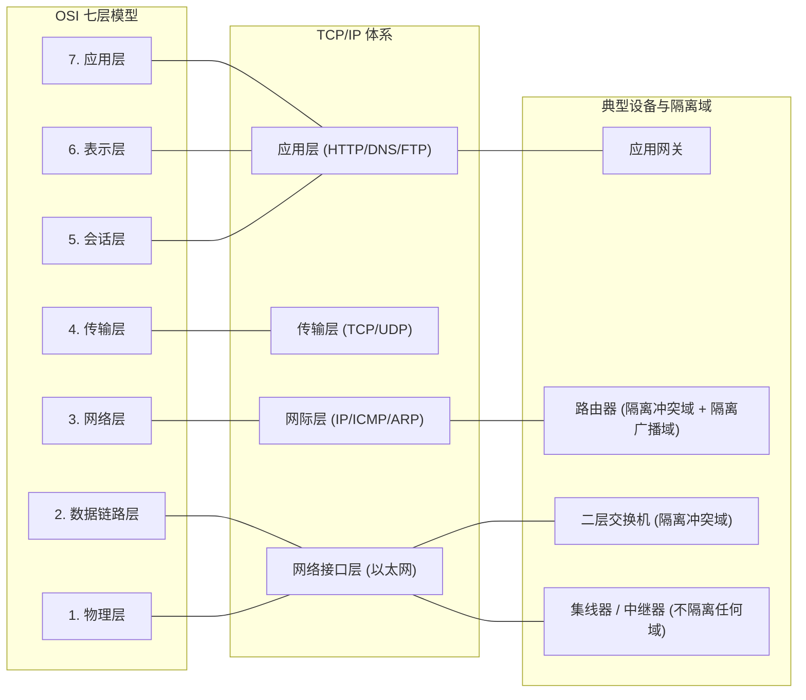

# 考点精要：OSI 七层模型与 TCP/IP 协议栈协议端口

<Badge type="info" text="MOD-07 网络与信息安全" />
<Badge type="tip" text="考查题号：上午第 66 ~ 68 题 (约 2 ~ 3 分)" />
<Badge type="danger" text="⭐⭐⭐⭐⭐ 5星必考" />

::: tip 🎯 45 分及格通关指引
- **【45分必背核心得分点】**：
  1. **设备与隔离域秒杀口诀**：
     - **集线器/中继器（物理层）**：啥都不隔离（同冲突域、同广播域）；
     - **网桥/二层交换机（数据链路层）**：**隔离冲突域**，不隔离广播域；
     - **路由器/三层交换机（网络层）**：**既隔冲突域，又隔广播域**（阻断广播风暴）。
  2. **高频知名端口号（闭眼秒选）**：
     - 网页：HTTP（80）、HTTPS（443）；
     - 邮件：发信 **SMTP（TCP 25）**、收信 **POP3（TCP 110）**、云同步 IMAP4（TCP 143）；
     - 基础服务：DNS（**UDP 53**）、DHCP（**UDP 67/68**）、SNMP（**UDP 161/162**）；
     - 远程与文件：FTP（**20数据/21控制**）、SSH（22）、Telnet（23）。
  3. **TCP vs UDP 本质**：TCP 可靠、有连接、面向字节流、开销大（最小 20 字节）；UDP 不可靠、无连接、面向报文、开销小（固定 8 字节）。
- **【高分选读 / 考场可战略放弃点】**：
  - 极其细微的 TCP 拥塞避免算法（NewReno、BIC、BBR）复杂数学窗口动态推导，直接战略放弃。
:::

---

## 一、 核心考纲与概念辨析

### 1. OSI 七层参考模型与 TCP/IP 体系对照矩阵

| OSI 七层模型 | TCP/IP 四层架构 | 协议数据单元 (PDU) | 典型网络互联设备 | 核心协议清单 |
| :--- | :--- | :--- | :--- | :--- |
| **7. 应用层** | **应用层** | 报文 (Message) | 应用程序网关 (Gateway) | HTTP, HTTPS, FTP, DNS, DHCP, SMTP, POP3, Telnet, SNMP |
| **6. 表示层** | | | | 数据格式编码转换、加密解密、压缩解压（ASCII, JPEG, MPEG） |
| **5. 会话层** | | | | 建立、管理和终止不同主机进程之间的通信会话 |
| **4. 传输层** | **传输层** | 报文段 (Segment) | 四层交换机 | **TCP**（可靠面向连接）、**UDP**（不可靠无连接数据报） |
| **3. 网络层** | **网际层** | 分组 / 数据报 (Packet) | **路由器 (Router)**、三层交换机 | **IP, ICMP**（网际控制报文协议, ping）、**IGMP, ARP**（IP转MAC） |
| **2. 数据链路层**| **网络接口层** | 帧 (Frame) | **网桥 (Bridge)**、**二层交换机 (Switch)**、网卡 | PPP, HDLC, CSMA/CD, 以太网 (IEEE 802.3), Wi-Fi (802.11) |
| **1. 物理层** | | 比特流 (Bit) | **中继器 (Repeater)**、**集线器 (Hub)** | RS-232, RJ-45, 光纤接口，规范机械、电气与功能特性 |

---

### 2. 常用高频网络应用层协议与默认端口号速查表

| 协议名称 | 中文全称 | 传输层基础 | 默认知名端口 | 30 秒考场秒杀提示 |
| :--- | :--- | :--- | :---: | :--- |
| **DNS** | 域名解析系统 | **UDP / TCP** | **53** | 域名与 IP 双向解析，日常查询用 UDP 53 |
| **DHCP** | 动态主机配置协议 | **UDP** | **67(服务端) / 68(客户端)**| 动态租约下发 IP、子网掩码与默认网关 |
| **HTTP** | 超文本传输协议 | **TCP** | **80** | 万维网明文传输 |
| **HTTPS** | 安全超文本传输协议 | **TCP** | **443** | 基于 SSL/TLS 证书加密传输 |
| **FTP** | 文件传输协议 | **TCP** | **20(数据) / 21(控制)** | 21 负责控制鉴权，20 负责传输文件实体 |
| **SMTP** | 简单邮件传输协议 | **TCP** | **25** | **发送邮件（发件箱送出）** |
| **POP3** | 邮局协议版本3 | **TCP** | **110** | **接收邮件（从收件箱拉取并可删除）** |
| **IMAP4** | 互联网邮件访问协议 | **TCP** | **143** | **接收邮件（支持多终端状态实时同步）** |
| **SNMP** | 简单网络管理协议 | **UDP** | **161(查询) / 162(Trap告警)**| 网络设备健康状态巡检与故障告警 |
| **SSH** | 安全外壳协议 | **TCP** | **22** | 替代 Telnet 的加密远程管理终端 |

---

### 3. TCP 与 UDP 核心机制全解

| 对比维度 | TCP (传输控制协议) | UDP (用户数据报协议) |
| :--- | :--- | :--- |
| **连接状态** | **面向连接**（需三次握手、四次挥手） | **无连接**（即发即收，无握手建立时延） |
| **可靠性保障** | **可靠交付**（序号机制、ACK 确认、超时重传） | **不可靠交付**（尽最大努力交付，不重传） |
| **传输模式** | **面向字节流**（视为连续字节流） | **面向报文**（保留应用层完整报文边界） |
| **首部开销** | 首部较长（**最小 20 字节**，最大 60 字节） | 首部极小（**固定 8 字节**），额外协议损耗低 |
| **典型应用场景**| 网页 (HTTP/HTTPS)、文件 (FTP)、邮件 (SMTP) | 实时音视频通话、在线游戏、DNS 单次查询 |

---

## 二、 分析模型与网络设备隔离域矩阵

| 设备名称 | 工作的最高层次 | 能否隔离冲突域？ | 能否隔离广播域？ | 30 秒秒杀记忆口诀 |
| :--- | :---: | :---: | :---: | :--- |
| **集线器 (Hub) / 中继器** | **第 1 层 (物理层)** | **否** | **否** | 纯电信号放大，啥都不隔 |
| **二层交换机 (Switch) / 网桥** | **第 2 层 (数据链路层)**| **是**（**每端口独享带宽与冲突域**） | **否**（同 VLAN 内广播通发） | **隔冲突，不隔广播** |
| **路由器 (Router) / 三层交换机** | **第 3 层 (网络层)** | **是** | **是**（**每个接口阻断广播风暴**） | **双隔离：既隔冲突又隔广播** |

---

## 三、 命题题眼与陷阱防御

::: danger 🚨 常见命题陷阱盘点
1. **FTP 控制与数据端口颠倒**：控制连接端口为 **21**（鉴权与指令交互），数据连接端口为 **20**（实际文件二进制传输）。
2. **邮件收发协议偷换概念**：发信是 **SMTP (TCP 25)**，收信是 **POP3 (TCP 110) / IMAP4 (TCP 143)**。出题人常设坑“小李通过 POP3 协议将邮件发送给小张”，**绝对错误**！
3. **DNS 传输层协议单选陷阱**：DNS 客户端日常查询域名解析时使用的是 **UDP 53** 端口；主从 DNS 服务器同步区数据（Zone Transfer）时使用的是 **TCP 53** 端口。
4. **二层交换机能隔离广播域的错觉**：交换机若没有划分 VLAN，所有端口均处于同一个广播域中，无法阻断 ARP 或广播风暴。
:::

---

## 四、 典型真题溯源与逐项排错解析 (Distractor Analysis)

### 【真题精选 1】（考查网络设备层次与数据链路层设备识别 · 2024上-机考回忆-Q66）
**题干**：在计算机网络拓扑结构中，用于互联局域网并工作在数据链路层的网络互联设备是（ ）。

A. 中继器  
B. 集线器  
C. 以太网交换机  
D. 路由器  

::: details 💡 点击展开【正确答案与逐项排错剖析】
- **【正确答案】**：**C**
- **【核心切入点】**：明确各网络互联设备所在协议栈层次（中继器/集线器工作在物理层，交换机/网桥工作在数据链路层，路由器工作在网络层）。

#### 逐项排错剖析 (Distractor Analysis)
- **选项 A (中继器) 错误**：中继器（Repeater）工作在第 1 层物理层，用于整形放大信号以延长传输距离，不具备解析 MAC 帧的能力。
- **选项 B (集线器) 错误**：集线器（Hub）实质上是一个多端口中继器，同样工作在物理层，属于共享式总线设备。
- **选项 C (以太网交换机) 正确**：以太网交换机（二层 Switch）或网桥工作在第 2 层数据链路层，能够基于数据链路层帧头部的 MAC 地址学习建立 MAC 地址转发表，实现硬件线速定向转发，隔离冲突域。
- **选项 D (路由器) 错误**：路由器工作在第 3 层网络层，基于 IP 数据报的分组地址进行寻址和路由选择，隔离广播域。
:::

---

### 【真题精选 2】（考查知名网络应用协议与传输层及端口匹配 · 2024下-机考回忆-Q66）
**题干**：在网络互联应用中，协议、传输层支撑协议及其默认知名端口号搭配完全正确的是（ ）。

A. DNS — TCP — 80  
B. SMTP — TCP — 25  
C. DHCP — TCP — 67  
D. POP3 — UDP — 110  

::: details 💡 点击展开【正确答案与逐项排错剖析】
- **【正确答案】**：**B**
- **【核心切入点】**：熟练掌握 SMTP（TCP 25 发件）、POP3（TCP 110 收件）、DNS（UDP 53 查域名）、DHCP（UDP 67/68 租约分配）。

#### 逐项排错剖析 (Distractor Analysis)
- **选项 A 错误**：DNS 常规查询基于 **UDP** 协议运行，默认端口为 **53**；TCP 80 为明文 HTTP 协议端口。
- **选项 B 正确**：SMTP（Simple Mail Transfer Protocol，简单邮件传输协议）基于可靠的 **TCP** 传输，默认知名端口为 **25**。
- **选项 C 错误**：DHCP 采用 **UDP** 数据报进行广播发现与租约配置，服务端端口为 67，客户端端口为 68，并非 TCP。
- **选项 D 错误**：POP3（Post Office Protocol Version 3）用于从邮件服务器拉取邮件，基于可靠的 **TCP** 连接（端口 110），绝非无连接不可靠的 UDP。
:::

---

## 考点通关与速查导航

- 📖 **全科公式速查**：[上午综合知识高频计算公式与速解模板速查表](../formula-cheat-sheet.md)
- 🚨 **全科避坑指南**：[上午综合知识高频易错避坑清单与秒杀模板库](../exam-pitfalls-and-short-cuts.md)
- 🏠 **专题备考导航**：[上午综合知识备考导航](../index.md)
