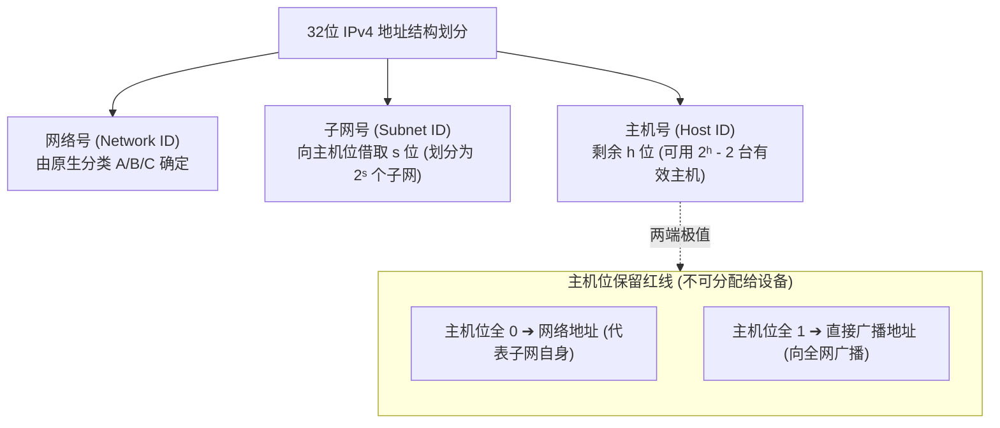

# 考点精要：IP 地址规划、子网划分与 CIDR 路由聚合

<Badge type="info" text="MOD-07 网络与信息安全" />
<Badge type="tip" text="考查题号：上午第 68 ~ 70 题 (固定 2 ~ 3 分)" />
<Badge type="danger" text="⭐⭐⭐⭐⭐ 5星必考" />

::: tip 🎯 45 分及格通关指引
- **【45分必背核心得分点】**：
  1. **可用主机数必减 2 铁律**：$N_{\text{有效}} = 2^h - 2$（$h$ 为剩余主机位数，**必须减去全 0 的网络地址和全 1 的广播地址**）。
  2. **子网掩码第四字节与可用主机数 1 秒速配表**：
     - 掩码 `.128` (/25) $\rightarrow$ 剩余 7 位 $\rightarrow$ **126 台**
     - 掩码 `.192` (/26) $\rightarrow$ 剩余 6 位 $\rightarrow$ **62 台**
     - 掩码 `.224` (/27) $\rightarrow$ 剩余 5 位 $\rightarrow$ **30 台**
     - 掩码 `.240` (/28) $\rightarrow$ 剩余 4 位 $\rightarrow$ **14 台**
     - 掩码 `.252` (/30) $\rightarrow$ 剩余 2 位 $\rightarrow$ **2 台**（点对点路由器互联链路）
  3. **CIDR 汇聚三步法**：找差异字节 $\rightarrow$ 展开 8 位二进制 $\rightarrow$ 找最长公共前缀补 0 封顶。
  4. **最长前缀匹配**：路由器转发面对多个匹配路由时，**优先挑掩码最长（数值最大）的路由条目**。
- **【高分选读 / 考场可战略放弃点】**：
  - 极其偏门复杂的 IPv6 任意播 (Anycast) 边界路由协议 BGP4+ 属性判定，遇生僻题直接战略放弃。
:::

---

## 一、 核心考纲与概念辨析

### 1. IPv4 分类与私有专用地址范围

| 类别 | 范围（首字节十进制） | 默认子网掩码 | 专属私有专用地址段 (RFC 1918) | 特殊预留用途 |
| :--- | :--- | :--- | :--- | :--- |
| **A 类** | **1.0.0.0 ~ 126.255.255.255** | `255.0.0.0` (/8) | **`10.0.0.0 ~ 10.255.255.255`** (/8) | `127.0.0.0/8` 为本机**环回测试地址 (Loopback)** |
| **B 类** | **128.0.0.0 ~ 191.255.255.255** | `255.255.0.0` (/16) | **`172.16.0.0 ~ 172.31.255.255`** (/12) | `169.254.0.0/16` 为 DHCP 获取失败时的自动私有地址 (APIPA) |
| **C 类** | **192.0.0.0 ~ 223.255.255.255** | `255.255.255.0` (/24) | **`192.168.0.0 ~ 192.168.255.255`** (/16) | 中小型企业局域网最常用私网段 |
| **D 类** | **224.0.0.0 ~ 239.255.255.255** | 无（无网络号与主机号） | / | **多播 / 组播地址 (Multicast)** |
| **E 类** | **240.0.0.0 ~ 255.255.255.255** | 无 | / | 保留用于科学实验与研究 |

---

### 2. 子网划分与可用主机数计算标准模型

把传统两级 IP 地址（网络号 + 主机号）划分为三级 IP 地址（网络号 + **子网号** + **主机号**）：



- **网络地址**：主机位**全部置为 0** 的地址（代表当前子网自身，不可分配给主机）；
- **直接广播地址**：主机位**全部置为 1** 的地址（向当前子网内所有节点广播，不可分配给主机）；
- **有效可用主机地址范围**：
  $$\text{有效主机数} = 2^{h} - 2$$
  *(其中 $h$ 为划分后剩余的**主机位位数**，必须严格减去全 0 的网络地址和全 1 的广播地址)*。

---

## 二、 分析模型与 CIDR 路由超网聚合

### 1. CIDR 路由汇聚三步法

将多个连续的小子网合并汇聚为一个大路由条目，大幅压缩骨干路由表项：

```
实例目标：将 192.168.64.0/24 到 192.168.67.0/24 汇聚为一个超网

第 1 步：定位差异字节 ──> 第三字节（64 到 67）
第 2 步：展开为 8 位二进制比对
         64:  0 1 0 0 0 0  0 0
         65:  0 1 0 0 0 0  0 1
         66:  0 1 0 0 0 0  1 0
         67:  0 1 0 0 0 0  1 1
              ───────────
第 3 步：提取最长公共前缀
         公共部分: 前 6 位完全相同 (010000)
         汇聚掩码: 16(前两字节) + 6 = 22 位
         汇聚地址: 192.168.64.0/22
```

---

## 三、 命题题眼与陷阱防御

::: danger 🚨 常见命题陷阱盘点
1. **可用主机数漏减 2**：这是全科失分率最高的马虎陷阱！算出 $2^5 = 32$，选项一定会有 32 诱导你选，必须牢记：**凡是问“可用/有效主机数”，必须扣除网络地址与广播地址，选 30**！
2. **IP 处于同一子网的判定**：将两个 IP 地址分别与子网掩码做**按位与运算 (AND)**，所得“网络地址”一致才在同一子网。
3. **网络地址 vs 广播地址混淆**：若子网为 `192.168.1.0/26`，块大小为 64，则四个子网的网络地址分别是 .0, .64, .128, .192；广播地址分别是 .63, .127, .191, .255。
:::

---

## 四、 典型真题溯源与逐项排错解析 (Distractor Analysis)

### 【真题精选 1】（考查子网掩码与可用主机数秒算 · 2024上-机考回忆-Q67）
**题干**：某网络管理员将一个网络地址 `192.168.10.0/24` 划分子网，选用的子网掩码为 `255.255.255.224`。则该网络被划分为了（ ）个子网，每个子网内最多可分配的有效主机 IP 地址数为（ ）个。

(1) A. 4  B. 6  C. 8  D. 16  
(2) A. 14  B. 30  C. 32  D. 62  

::: details 💡 点击展开【正确答案与逐项排错剖析】
- **【正确答案】**：**(1) C  (2) B**
- **【核心切入点】**：由掩码末位 224 推出借用 3 位主机位，剩余 5 位主机位。

#### 逐项排错剖析 (Distractor Analysis)
- **第 (1) 空排错**：
  - 子网掩码第四字节 $224 = 128 + 64 + 32 = 11100000_2$；
  - 借用了 3 位作为子网号，划分的子网数为 $2^3 = 8$ 个。
  - **选项 C 正确**；选项 A (4个) 对应掩码 .192；选项 B 为无此划分；选项 D (16个) 对应掩码 .240。
- **第 (2) 空排错**：
  - 剩余主机位位数 $h = 32 - 27 = 5$ 位；
  - 每个子网的最大可用主机数必须扣除全 0 和全 1：
    $$N = 2^5 - 2 = 32 - 2 = 30\text{ 个}$$
  - **选项 B 正确**；选项 C (32) 属于未扣除保留地址的经典错项；选项 A (14) 是借 4 位的容量；选项 D (62) 是借 2 位的容量。
:::

---

### 【真题精选 2】（考查 CIDR 路由汇聚与超网计算 · 2024下-机考回忆-Q67）
**题干**：某单位骨干路由器收到来自局域网的 4 条路由条目：`192.168.64.0/24`、`192.168.65.0/24`、`192.168.66.0/24` 和 `192.168.67.0/24`。为了优化路由表项，采用 CIDR 技术将其汇聚为一条超网路由，汇聚后的最佳路由条目是（ ）。

A. `192.168.64.0/21`  
B. `192.168.64.0/22`  
C. `192.168.64.0/23`  
D. `192.168.0.0/16`  

::: details 💡 点击展开【正确答案与逐项排错剖析】
- **【正确答案】**：**B**
- **【核心切入点】**：第三字节 64~67 展开为二进制求最长公共前缀。

#### 逐项排错剖析 (Distractor Analysis)
- **二进制比对推演**：
  - 64 的二进制为 `0100 0000`
  - 65 的二进制为 `0100 0001`
  - 66 的二进制为 `0100 0010`
  - 67 的二进制为 `0100 0011`
  - 四个网段前 6 位均为 `010000` 完全相同，从第 7 位起开始变化；
  - 汇聚后的子网掩码长度为 $8 + 8 + 6 = 22$ 位；
  - 汇聚后的网络地址为 `192.168.64.0/22`。
- **选项 A (/21) 错误**：/21 前缀过短，将汇聚 8 个 C 类子网（64~71），包含未声明的网段，不是最佳精细汇聚。
- **选项 B 正确**：精准汇聚 4 个子网，无缝封顶且无多余网段。
- **选项 C (/23) 错误**：/23 仅能汇聚 2 个子网（64 和 65），漏掉了 66 和 67。
- **选项 D (/16) 错误**：粗暴合并为 B 类大网，路由粒度严重失真。
:::

---

## 考点通关与速查导航

- 📖 **全科公式速查**：[上午综合知识高频计算公式与速解模板速查表](../formula-cheat-sheet.md)
- 🚨 **全科避坑指南**：[上午综合知识高频易错避坑清单与秒杀模板库](../exam-pitfalls-and-short-cuts.md)
- 🏠 **专题备考导航**：[上午综合知识备考导航](../index.md)
