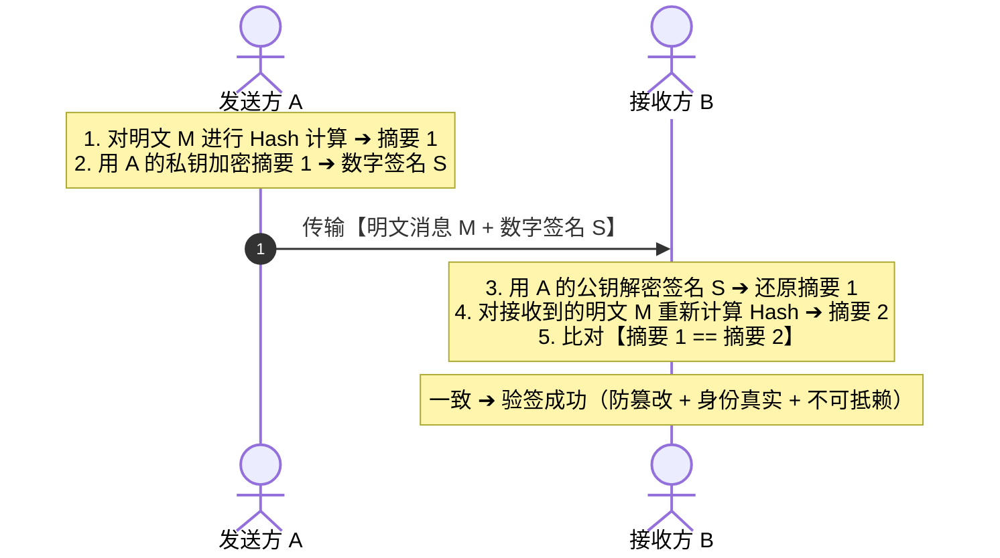
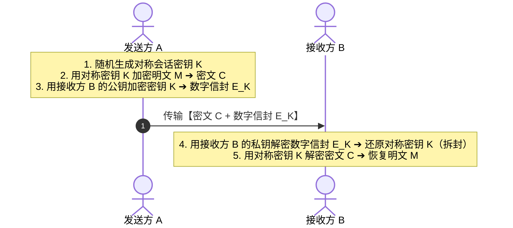

# 考点精要：网络安全加解密算法、数字签名与数字信封

<Badge type="info" text="所属模块：MOD-07 网络与信息安全" />
<Badge type="tip" text="考查题号：上午第 7 ~ 13 题（固定 3 ~ 4 分）" />
<Badge type="danger" text="重要程度：⭐⭐⭐⭐⭐（软考绝对必背天王级考点）" />

::: tip 🎯 45 分及格通关指引
- **【45分必背核心得分点】**：
  1. **十六字绝密加解密口诀（闭眼秒杀）**：
     - **“公钥加密防偷窥，私钥解密拆信封”**（用于机密传输）；
     - **“私钥签名证身份，公钥验签防抵赖”**（用于数字签名与完整性校验）。
  2. **数字信封谁的公私钥**：
     - 制作信封：用**接收方的公钥**加密会话密钥；
     - 拆开信封：用**接收方的私钥**解密出原会话密钥。
  3. **算法分类秒记**：
     - **对称算法（快、管钥匙难）**：DES、3DES、AES、RC4、IDEA、SM4；
     - **非对称算法（慢、算力大）**：RSA、ECC、ElGamal、SM2；
     - **消息摘要（防篡改、定长散列）**：MD5（128位）、SHA-1（160位）、SHA-256（256位）、SM3（256位）。
  4. **等保 2.0 定级**：地市重要系统、三甲医院 HIS、金融核心 $\rightarrow$ **第三级（监督保护级）**。
- **【高分选读 / 考场可战略放弃点】**：
  - 极其复杂的椭圆曲线密码学离散对数底层数学证明及 Diffie-Hellman 中间人攻击代数推导，考场直接放弃。
:::

---

## 一、 核心考纲与概念辨析

### 1. 对称密码 vs 非对称密码体制全景对比

| 对比维度 | 对称加密体制 (Symmetric) | 非对称加密体制 (Asymmetric / 公钥密码) |
| :--- | :--- | :--- |
| **密钥机制** | **加密与解密使用相同密钥**（同源单密钥） | **拥有公钥（公开）和私钥（绝对私密）对** |
| **运算效率** | **计算速度极快**，适合硬件加速 | **计算速度缓慢**（大数模乘幂），比对称慢上千倍 |
| **适用业务场景** | **加密传输海量业务数据明文**（文件、通信流） | **加密短小会话密钥、数字签名与身份鉴权** |
| **密钥分发管理** | $n$ 个用户双向通信需维护 $\frac{n(n-1)}{2}$ 个密钥 | $n$ 个用户全网仅需维护 $2n$ 个密钥（$n$ 对） |
| **主流标准算法** | **DES** (56位有效), **3DES** (112/168位), **AES** (128/256位), **RC4**, **SM4** | **RSA** (基于大素数分解), **ECC** (椭圆曲线), **SM2** |

---

### 2. 消息摘要算法 (Hash)

- **核心定义**：将任意长度输入数据转换为**固定长度**输出散列值（消息指纹）。
- **三大单向散列特性**：
  1. **单向性 (One-way)**：正向计算极快，逆向反解在计算上不可行；
  2. **雪崩效应 (Avalanche Effect)**：明文改动 1 位，输出摘要面目全非；
  3. **抗碰撞性 (Collision Resistance)**：极难找到两份产生相同摘要的明文。
- **高频摘要算法输出长度速记**：
  - **MD5**：输出 **128 位**（16 字节）；
  - **SHA-1**：输出 **160 位**（20 字节）；
  - **SHA-256**：输出 **256 位**（32 字节）；
  - **SM3** (国密)：输出 **256 位**。

---

### 3. 国家网络安全等级保护 2.0 (等保 2.0) 框架

| 等级名称 | 等级级别 | 侵害客体与后果严重程度 | 典型适用系统对象（常考题眼） |
| :--- | :---: | :--- | :--- |
| **第一级** | **自主保护级** | 损害公民合法权益，**不损害国家安全与公共利益** | 普通小型内部测试系统 |
| **第二级** | **指导保护级** | 严重损害公民权益，或损害公共利益，**不损害国家安全** | 市级普通单位网站、一般信息平台 |
| **第三级** | **监督保护级** | **严重损害社会秩序和公共利益**，或**损害国家安全** | **地级市核心政务系统、三甲医院HIS、金融能源核心系统** |
| **第四级** | **强制保护级** | 特别严重损害公共利益，或**严重损害国家安全** | 国家级电网调度、战略交通调度 |
| **第五级** | **专控保护级** | **特别严重损害国家安全** | 国防军工命脉核心系统 |

---

## 二、 分析模型与安全工作流

### 1. 数字签名与身份认证工作流

- **数字签名三大安全目标**：完整性（防篡改）、真实性（身份认证）、不可抵赖性（防否认）。

---

### 2. 数字信封 (Digital Envelope) 混合密码工作流

---

## 三、 命题题眼与陷阱防御

::: danger 🚨 常见命题陷阱盘点
1. **数字签名私钥归属偷换**：A 给 B 发签名信息，A 必须用 **A 自己的私钥** 签名；B 必须用 **A 的公钥** 验签。绝不可能用 B 的私钥！
2. **数字信封加密公钥偷换**：制作数字信封封装会话密钥时，必须使用 **接收方 B 的公钥**；只有这样，接收方 B 才能用自己唯一的私钥拆开。
3. **对称与非对称算法混淆**：
   - 对称：AES、DES、3DES、IDEA、SM4；
   - 非对称：RSA、ECC、ElGamal、SM2；
   - 选项常出“RSA 是一种高效的对称加密算法”，直接秒判错误！
:::

---

## 四、 典型真题溯源与逐项排错解析 (Distractor Analysis)

### 【真题精选 1】（考查数字签名机制与公私钥归属 · 2024上-机考回忆-Q8）
**题干**：甲向乙发送了一份带有数字签名的商业合同电子文档，甲应当使用（ ）对该合同的消息摘要进行加密生成数字签名；乙收到后，应当使用（ ）对数字签名进行解密以验证其合法性。
(1) A. 甲的私钥  B. 甲的公钥  C. 乙的私钥  D. 乙的公钥  
(2) A. 甲的私钥  B. 甲的公钥  C. 乙的私钥  D. 乙的公钥  

::: details 💡 点击展开【正确答案与逐项排错剖析】
- **【正确答案】**：**(1) A  (2) B**
- **【核心切入点】**：牢记“私钥签名证明身份，公钥验签防止抵赖”。

#### 逐项排错剖析 (Distractor Analysis)
- **第 (1) 空排错**：
  - 数字签名的核心目标是防伪造与抗抵赖，全网只有甲拥有**甲的私钥**，所以签名生成必须由甲使用**甲的私钥**加密。
  - **选项 A 正确**；选项 B（甲的公钥是公开的，任何人都能用公钥加密，无法作为签名证据）；选项 C/D（甲没有乙的私钥，且与乙的密钥无关）。
- **第 (2) 空排错**：
  - 乙收到签名后，为了核实确由甲所发出，必须使用**甲的公钥**解密恢复出原始消息摘要并比对。
  - **选项 B 正确**；选项 A（乙不可能拥有甲的私钥）；选项 C/D（乙的密钥无法解密甲私钥签发的签名）。
:::

---

### 【真题精选 2】（考查数字信封工作机制与密钥分发 · 2024下-机考回忆-Q8）
**题干**：在利用数字信封技术实现保密通信时，发送方使用（ ）对随机生成的对称会话密钥进行加密封入信封；接收方收到信封后，使用（ ）进行解密提取对称会话密钥。
A. 发送方的公钥；发送方的私钥  
B. 发送方的私钥；接收方的公钥  
C. 接收方的公钥；接收方的私钥  
D. 接收方的私钥；接收方的公钥  

::: details 💡 点击展开【正确答案与逐项排错剖析】
- **【正确答案】**：**C**
- **【核心切入点】**：信封是给接收方拆的，必须使用接收方公钥封装、接收方私钥拆封。

#### 逐项排错剖析 (Distractor Analysis)
- **选项 A 错误**：若用发送方公钥加密，接收方拿不到发送方的私钥，导致接收方无法解密拆封。
- **选项 B 错误**：发送方私钥加密相当于签名，任何持有发送方公钥的人都能拆开信封偷看会话密钥，完全失去机密性。
- **选项 C 正确**：发送方使用**接收方的公钥**加密对称密钥；全网只有接收方持有对应的私钥，因此只有接收方能用**接收方的私钥**解密拆开信封，完美解决对称密钥的安全传输问题。
- **选项 D 错误**：发送方根本不可能拥有接收方的私钥。
:::

---

### 【真题精选 3】（考查常见加密算法类型识别 · 2024下-机考回忆-Q12）
**题干**：下列网络安全算法中，属于非对称加密算法的是（ ），属于消息摘要算法的是（ ）。
(1) A. AES  B. DES  C. RSA  D. RC4  
(2) A. 3DES  B. SHA-256  C. ECC  D. IDEA  

::: details 💡 点击展开【正确答案与逐项排错剖析】
- **【正确答案】**：**(1) C  (2) B**
- **【核心切入点】**：快速分类对称算法（AES/DES/RC4/IDEA）、非对称算法（RSA/ECC）和摘要算法（MD5/SHA/SM3）。

#### 逐项排错剖析 (Distractor Analysis)
- **第 (1) 空排错**：
  - **选项 C (RSA) 正确**：RSA 是基于大素数分解困难性的典型非对称公钥密码算法。
  - **选项 A/B/D (AES, DES, RC4) 错误**：均属于对称密码算法（AES、DES 为分组密码，RC4 为流密码）。
- **第 (2) 空排错**：
  - **选项 B (SHA-256) 正确**：安全散列算法（Secure Hash Algorithm），输出 256 位固定长度散列值，属于消息摘要算法。
  - **选项 A/D (3DES, IDEA) 错误**：属于对称加密算法；选项 C (ECC 椭圆曲线) 属于非对称加密算法。
:::
