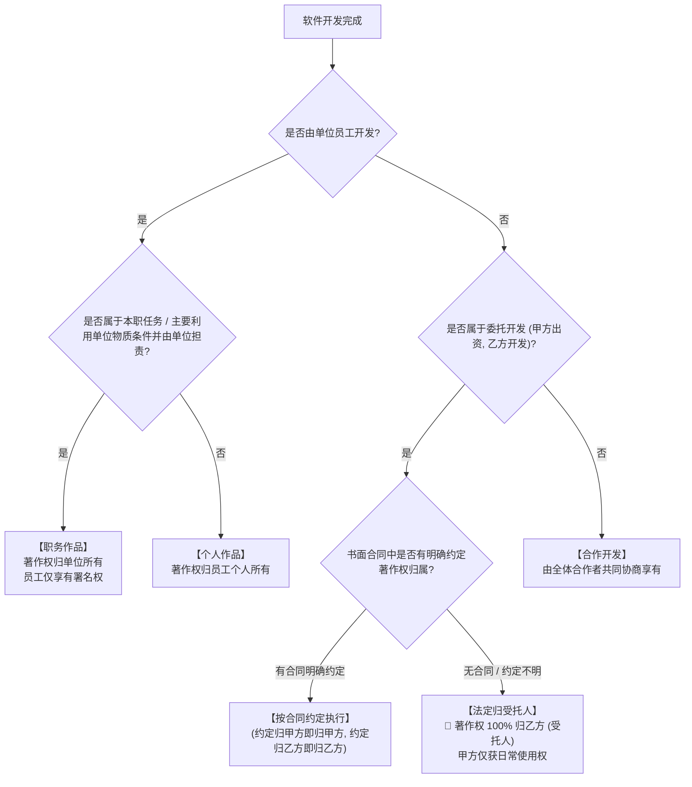

# 考点精要：软件著作权归属与侵权判定

- **所属模块**：MOD-08 知识产权与标准化
- **考查题号**：上午第 15 ~ 17 题（约 1 ~ 2 分）
- **重要程度**：⭐⭐⭐⭐⭐（纯送分记忆考点）

---

## 一、 核心考纲与概念辨析

### 1. 软件著作权归属判定四大核心场景（高频必考）

根据我国《计算机软件保护条例》，著作权归属判定规则如下：

| 开发形式 | 产生情境与界定条件 | 著作权最终归属 | 核心注意细节 |
| :--- | :--- | :--- | :--- |
| **独立开发** | 公民独立自主构思并编写完成的软件 | **归开发者个人所有** | 享有发表权、署名权、修改权、使用权和获得报酬权全部人身与财产权利 |
| **职务开发** (在职员工开发) | 满足下列条件之一： ① 针对本职工作中明确指派的任务所开发的软件； ② 开发的软件是从事本职工作活动所预见或自然产生的结果； ③ 主要利用了单位的资金、设备等物质技术条件并由单位承担法律责任 | **著作权归单位（法人或非法人组织）全部享有** | **开发者仅享有署名权**，单位可根据贡献给予物质或精神奖励 |
| **委托开发** (乙方为甲方定制) | 委托人（甲方）出资，委托受托人（乙方）进行定制软件研发 | **有合同约定的，按合同约定归属**； **🚨 若合同未约定或约定不明，著作权 100% 归受托人（乙方/实际开发者）所有！** | 即使甲方全额付清项目款，无合同明确约定著作权仍归乙方！甲方仅享有法定使用权 |
| **合作开发** | 两个以上法人、组织或自然人共同合作开发软件 | 合作作品著作权由**全体合作开发者共同享有** | 若可以分割独立使用，各作者可对各自独立部分单独享有著作权（但行使时不得侵犯整体著作权） |

---

### 2. 软件著作权保护客体与例外（思想与表达二分法）

- **受保护的客体**：
  1. **计算机程序**：源程序、目标程序（在法律上两者视为同一作品）；
  2. **软件文档**：程序设计说明书、流程图、用户手册等文字和图表资料。
- **不受保护的客体（绝密核心考点）**：
  - **开发软件所用的思想、处理过程、操作方法或者数学概念**！
  - *法律原理*：著作权只保护**表达形式**（具体的代码文本、文档排版），**不保护抽象算法思想/业务逻辑**（若想垄断保护某项技术方案或数据处理流程，必须向国家知识产权局申请**发明专利**）。

---

### 3. 软件著作权的保护期限

| 权利类别 / 权利主体 | 保护起始点 | 保护终结点 | 特殊说明 |
| :--- | :--- | :--- | :--- |
| **署名权、修改权、保护作品完整权** | 软件创作完成之日 | **永久保护（不受时间限制）** | 属于人身权范畴，永不随时间流逝而失效 |
| **自然人软件著作权**（发表权与财产权） | 软件开发完成之日 | **作者终生及其死后 50 年**（截至死后第 50 年的 12 月 31 日） | 合作开发以最后死亡的作者死亡时间为起算基准 |
| **法人或其他组织著作权**（发表权与财产权） | 软件开发完成之日 | **首次发表后 50 年**（截至首次发表后第 50 年的 12 月 31 日） | **开发完成之日起 50 年内未发表的，法律不再予以保护！** |

---

## 二、 分析模型与归属判定决策树

---

## 三、 命题题眼与陷阱防御

> [!CAUTION]
> ### 🚨 常见命题陷阱盘点
> 1. **出资方必然拥有版权的误导思维**：
>    - 题目：A 公司全额出资 100 万元委托 B 公司开发系统，合同未提及著作权归属。
>    - **考生直觉**：“我出钱我最大，版权肯定归甲方 A 公司” $\rightarrow$ **大错特错！** 法律硬性规定：合同未明确约定时，著作权归实际开发者（乙方 B 公司）所有！甲方仅获得该软件在合同约定范围内的使用权。
> 2. **借鉴思路 vs 抄袭代码的界限**：
>    - 某程序员读了某优秀开源项目的算法论文，完全使用自己的风格重新编写了一套新代码，并未直接复制原作者代码。这**绝不构成侵权**！著作权不保护算法思想。
> 3. **备份复制品的外流红线**：
>    - 合法购买软件的用户有权制作备份盘，但如果将备份盘**借给朋友、出租或上传到网络分享**，立刻构成侵权！

---

## 四、 典型真题溯源与逐项排错解析 (Distractor Analysis)

### 【真题精选 1】（考查委托开发软件著作权归属 · 2023上-上午-Q15）
**题干**：甲公司委托乙公司开发了一套人事考勤管理软件系统，甲公司按合同约定向乙公司全额支付了开发费用。但在签订合同时，双方未对该软件系统的著作权归属作出任何约定，事后双方也未达成补充协议。根据我国《著作权法》和《计算机软件保护条例》的规定，该软件系统的著作权属于（ ）。
A. 甲公司  
B. 乙公司  
C. 甲公司和乙公司共同享有  
D. 考勤软件的实际使用员工  

- **【正确答案】**：**B**
- **【核心切入点】**：牢记委托开发“有约定从约定，无约定归受托人（乙方）”法定原则。

#### 逐项排错剖析 (Distractor Analysis)
- **选项 A 错误**：甲公司虽然是出资委托方，但在法律上，没有合同约定时著作权绝不默认归委托方所有。
- **选项 B 正确**：乙公司是受托开发方（实际创作人），在合同未约定著作权归属的情况下，著作权依法独属于受托人乙公司。
- **选项 C 错误**：共同享有仅适用于合作开发，委托开发在无明确共有一致约定时不会自动判定为共有。
- **选项 D 错误**：实际使用员工仅为终端最终用户，与知识产权归属无关。

---

### 【真题精选 2】（考查职务作品界定与署名权 · 2022下-上午-Q15）
**题干**：张工是某软件公司的全职高级程序员，他在本职工作时间内，接受公司指派的研发任务，利用公司的服务器和开发工具编写了一套智能风控引擎代码。关于该软件代码的著作权，下列说法正确的是（ ）。
A. 该软件属于个人作品，著作权全部归张工所有  
B. 著作权归软件公司所有，张工仅享有署名权  
C. 著作权由张工与软件公司共同享有  
D. 该软件属于开源作品，不受法律保护  

- **【正确答案】**：**B**
- **【核心切入点】**：执行本职任务且主要利用单位物质技术条件所完成的软件属于职务作品。

#### 逐项排错剖析 (Distractor Analysis)
- **选项 A 错误**：代码是张工执行公司明确指派的任务且利用公司物质资源完成的，依法属于职务作品，张工不能单独主张全部著作权。
- **选项 B 正确**：对于执行单位指派任务完成的职务作品，著作权中的财产权及发表权由单位全部享有，开发者自然人（张工）依法仅保留署名权。
- **选项 C 错误**：职务开发作品非合作开发，不成立自然人与法人的共有。
- **选项 D 错误**：职务作品自创作完成起即受知识产权法保护，并非开源无主作品。
