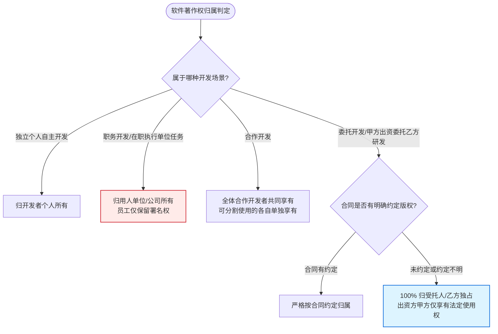

# 考点精要：软件著作权归属与侵权判定

<Badge type="info" text="所属模块：MOD-08 知识产权与标准化" />
<Badge type="tip" text="考查题号：上午第 15 ~ 17 题（约 1 ~ 2 分）" />
<Badge type="danger" text="重要程度：⭐⭐⭐⭐⭐（纯送分必考高频记忆考点）" />

::: tip 🎯 45 分及格通关指引
- **【45分必背核心得分点】**：
  1. **委托开发版权归属（全科最高频坑）**：
     - **有合同按合同**；
     - **合同没约定或约定不明 $\rightarrow$ 著作权 100% 归受托人（乙方/开发者）所有！**（甲方哪怕出了 1000 万也只有使用权）。
  2. **职务作品权能划分**：
     - 本职工作、公司指派、主要利用公司设备 $\rightarrow$ **著作权归单位，员工仅享有署名权**。
  3. **思想与表达二分法（侵权判定关键）**：
     - **只保护表达形式**（具体的源代码、目标码、开发文档）；
     - **绝对不保护开发思想、算法逻辑、操作方法或数学公式**（若想独占算法方案必须申请发明专利）。
  4. **保护期限**：公民作者终生及死后 50 年；法人作品发表后 50 年；**署名权、修改权、保护作品完整权永久保护**。
- **【高分选读 / 考场可战略放弃点】**：
  - 极其细琐的涉外版权国际条约（伯尔尼公约、世界版权公约互惠期限）细节，考场直接放弃。
:::

---

## 一、 核心考纲与概念辨析

### 1. 软件著作权归属判定四大核心场景

根据我国《计算机软件保护条例》，著作权归属判定规则如下：

| 开发形式 | 产生情境与界定条件 | 著作权最终归属 | 30 秒秒杀切入点 |
| :--- | :--- | :--- | :--- |
| **独立开发** | 公民独立自主构思并编写完成的软件 | **归开发者个人所有** | 个人完全享有 |
| **职务开发** (在职员工开发) | ① 本职工作指派；② 工作活动自然结果；③ 主要利用单位物质技术条件并由单位担责 | **著作权归单位全部享有** | **公司全拿，员工仅留署名权** |
| **委托开发** (乙方为甲方定制) | 甲方出资委托乙方进行定制研发 | **有合同从合同；无合同或约定不明归受托人（乙方）！** | **出钱没约定，版权归乙方** |
| **合作开发** | 两个以上法人、组织或自然人共同合作开发 | **全体合作开发者共同享有** | 可分割的各自单独享有 |

---

### 2. 软件著作权保护客体与例外（思想与表达二分法）

- **受保护的客体**：
  1. **计算机程序**：源程序、目标程序（法律上视为同一作品）；
  2. **软件文档**：程序设计说明书、流程图、用户手册等。
- **不受保护的客体（必考题眼）**：
  - **开发软件所用的思想、处理过程、操作方法或者数学概念**！
  - *法律原理*：著作权只保护**表达形式**，不保护算法思想。他人使用相同算法思想重新编写代码，绝不构成侵权。

---

### 3. 软件著作权的保护期限

| 权利类别 / 权利主体 | 保护起始点 | 保护终结点 | 特殊说明 |
| :--- | :--- | :--- | :--- |
| **署名权、修改权、保护作品完整权** | 软件创作完成之日 | **永久保护（不受时间限制）** | 人身权，永不过期 |
| **自然人软件著作权**（发表权与财产权） | 软件开发完成之日 | **作者终生及其死后 50 年**（截至死后第 50 年底） | 合作开发以最后死亡作者为准 |
| **法人或其他组织著作权**（发表权与财产权） | 软件开发完成之日 | **首次发表后 50 年**（截至首次发表后第 50 年底） | **创作完成后 50 年内未发表的不再保护** |

---

## 二、 命题题眼与陷阱防御

::: danger 🚨 常见命题陷阱盘点
1. **“甲方出资因此版权归甲方”的强盗逻辑**：试题常设“某政府部门出资 50 万委托科技公司开发系统，合同未就版权归属作特别约定”，干扰项必然出现“归政府部门所有”。牢记：**出资不是拥有版权的法律依据，没约定必须归受托人乙方！**
2. **借鉴思想被指抄袭的真伪判定**：某程序员阅读了别人的商业软件，理解其核心业务流程后，采用全新的 Java 架构独立编写了一套功能相同的软件。只要没有直接抄袭复制其源程序文本，便**不构成侵犯著作权**。
3. **合法备份盘的外借侵权**：合法购买软件者可以制作备份盘，但备份盘若提供给他人使用或对外出租，立刻构成侵权。
:::

---

## 三、 典型真题溯源与逐项排错解析 (Distractor Analysis)

### 【真题精选 1】（考查委托开发软件著作权归属 · 2024上-机考回忆-Q15）
**题干**：甲公司委托乙软件公司开发了一套内部供应链管理系统，双方在签订委托开发合同时，并未就该软件系统的著作权归属进行任何明确约定，事后也未签署补充协议。根据我国《计算机软件保护条例》，该供应链管理系统的著作权归（ ）所有。

A. 甲公司  
B. 乙公司  
C. 甲公司和乙公司共同  
D. 国家版权局  

::: details 💡 点击展开【正确答案与逐项排错剖析】
- **【正确答案】**：**B**
- **【核心切入点】**：牢记委托开发“合同无约定或约定不明时，著作权归受托人（乙方）”。

#### 逐项排错剖析 (Distractor Analysis)
- **选项 A 错误**：甲公司为委托出资方，但在我国法律体系中，出资并不能直接衍生出著作权，没有书面特别约定时，出资方仅享有法定的正常使用权。
- **选项 B 正确**：乙公司为实际开发方（受托人），根据《计算机软件保护条例》第十条规定，委托开发的软件，版权归属由双方在合同中约定；无约定或约定不明确的，著作权属于受托人（乙公司）。
- **选项 C 错误**：共有只发生在合作开发场景，委托开发未约定时法律规定独归受托人。
- **选项 D 错误**：国家版权局是行政主管登记部门，不享有民商事软件版权。
:::

---

### 【真题精选 2】（考查软件著作权保护客体与思想表达二分法 · 2024下-机考回忆-Q15）
**题干**：程序员李工在分析并运行某知名开源压缩工具软件后，领会了其独特的字典压缩算法思想，随后李工使用 C++ 语言完全独立重新编写了一款压缩工具，其核心压缩算法处理逻辑与该开源软件一致，但源码实现完全不同。关于李工这一行为，下列说法正确的是（ ）。

A. 李工的行为侵犯了原作者的软件著作权，因为核心算法逻辑相同  
B. 李工的行为侵犯了原作者的商业秘密权  
C. 李工的行为不构成侵犯著作权，因为著作权法只保护表达而不保护算法思想  
D. 李工应当向原作者支付算法版权使用费  

::: details 💡 点击展开【正确答案与逐项排错剖析】
- **【正确答案】**：**C**
- **【核心切入点】**：把握“著作权保护代码文本表达，不保护抽象思想与算法概念”的基本准则。

#### 逐项排错剖析 (Distractor Analysis)
- **选项 A 错误**：我国著作权法明确规定，开发软件所用的思想、处理过程、操作方法或者数学概念不属于著作权保护范畴。只要源程序表达不同，就不构成版权侵犯。
- **选项 B 错误**：该软件本身是开源公开软件，不存在侵犯商业秘密的前提。
- **选项 C 正确**：著作权法的基石是“思想与表达二分法”，李工独立编写了 C++ 源码表达，仅借鉴了抽象算法思想，依法不构成侵犯著作权。
- **选项 D 错误**：合法借鉴开源思想无需支付版权费。
:::

---

## 考点通关与速查导航

- 📖 **全科公式速查**：[上午综合知识高频计算公式与速解模板速查表](../formula-cheat-sheet.md)
- 🚨 **全科避坑指南**：[上午综合知识高频易错避坑清单与秒杀模板库](../exam-pitfalls-and-short-cuts.md)
- 🏠 **专题备考导航**：[上午综合知识备考导航](../index.md)
