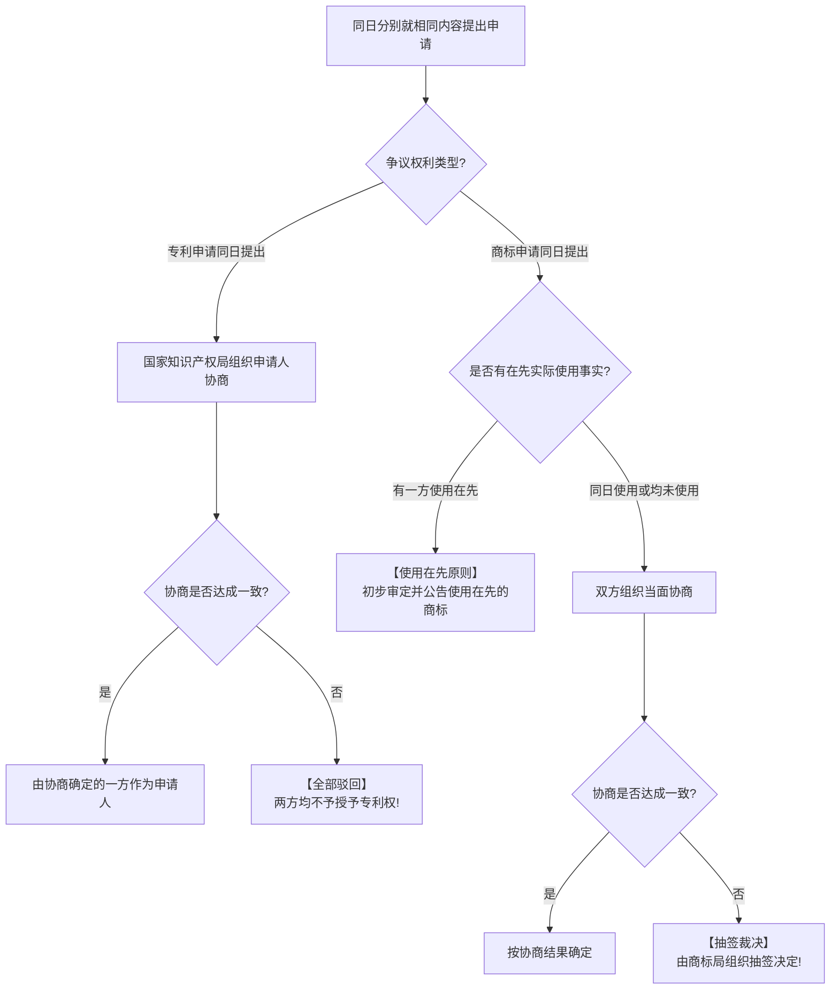

# 考点精要：专利权、商标权保护期限与标准化代号

- **所属模块**：MOD-08 知识产权与标准化
- **考查题号**：上午第 16 ~ 17 题（约 1 ~ 2 分）
- **重要程度**：⭐⭐⭐⭐（记忆型必拿分考点）

---

## 一、 核心考纲与概念辨析

### 1. 专利权核心法律规则与保护期限

- **专利确权基本原则**：我国专利法实行**“先申请原则”**（即谁先向国家知识产权局递交符合规定的申请文件，专利权就授予谁）。
- **三大专利类型与法定保护期限**：

| 专利类型 | 核心保护范围 | 法定保护期限 | 保护期起算时间点 |
| :--- | :--- | :--- | :--- |
| **发明专利** | 对产品、方法或者其改进所提出的**新的技术方案**（含软件算法方案） | **20 年** | **自申请日（递交申请之日）起算** |
| **实用新型专利**| 对产品的形状、构造或者其结合所提出的适于实用的新的技术方案（小发明/硬件改进） | **10 年** | **自申请日起算** |
| **外观设计专利**| 对产品的形状、图案或者色彩与形状的结合所作出的富有美感的新设计 | **15 年** | **自申请日起算** |

---

### 2. 商标权核心法律规则与续展机制

- **商标确权原则**：我国商标法同样实行**“先申请原则”**。
- **商标权保护期限与无限续展**：
  - **法定有效期**：注册商标的有效期为 **10 年**；
  - **起算时间点**：**自核准注册之日起计算**（🚨 绝非申请日！这是与专利权最大的区别）；
  - **续展规则**：期满前 **12 个月内**可以申请续展；若在此期间未提出，给予 **6 个月的宽展期**。每次续展注册的有效期同样为 **10 年**，**续展次数不受限制（可无限期续展，实现百年老字号保护）**。

---

### 3. 商业秘密权与商业不正当竞争

- **商业秘密构成三要素**：
  1. **不为公众所知悉（秘密性）**；
  2. **具有商业价值（实用性与经济性）**；
  3. **权利人采取了相应保密措施（保密性）**。
- **保护期限**：**无固定年限限制**！只要保密措施得当、秘密未公开泄露，商业秘密即享有**永久保护**（如可口可乐配方）。
- **反向工程抗辩**：通过技术手段对合法取得的产品进行逆向拆解分析（反向工程）获得技术信息的，**不属于侵犯商业秘密**。

---

### 4. 标准化基础与标准代号速查表

| 标准层次级别 | 标准代号（强制性） | 标准代号（推荐性） | 标准代号（指导性） |
| :--- | :--- | :--- | :--- |
| **国家标准** | **GB** | **GB/T** | **GB/Z** |
| **行业标准** | 通信行业：**YD/T**；电子行业：**SJ/T**；航天行业：**QJ**；机械：**JB/T** | / | / |
| **地方标准** | **DB + 省市行政区划代码**（如 DB11/T 代表北京市地方标准） | / | / |
| **企业标准** | **Q + 企业代号** | / | / |
| **国际标准** | **ISO**（国际标准化组织）、**IEC**（国际电工委员会）、**IEEE**（电气与电子工程师协会） |

---

## 二、 分析模型与确权争议裁决流程

---

## 三、 命题题眼与陷阱防御

> [!CAUTION]
> ### 🚨 常见命题陷阱盘点
> 1. **专利起算日 vs 商标起算日（出题大陷阱）**：
>    - **专利权**：自 **申请日** 起计算（发明 20 年、外观 15 年、实用新型 10 年）；
>    - **商标权**：自 **核准注册之日** 起计算（10 年，可续展）。出题人常把商标起算日偷换为“申请日”！
> 2. **同一天申请的处理区别**：
>    - 专利同一天申请：协商，协商不成**全部驳回**；
>    - 商标同一天申请：先看**谁使用在先**；若同一天使用且协商不成，由商标局**抽签决定**。
> 3. **国家标准推荐性符号**：
>    - `GB` 两个字母为**国家强制性标准**（涉及人身健康安全）；
>    - 加了 `/T`（`GB/T`，T 代表“推”）代表**国家推荐性标准**。

---

## 四、 典型真题溯源与逐项排错解析 (Distractor Analysis)

### 【真题精选 1】（考查商标权与专利权起算日及期限 · 2023上-上午-Q16~17）
**题干**：根据我国相关法律法规，注册商标的有效期为（ ）年，自（ ）起计算；发明专利权的保护期限为（ ）年，自（ ）起计算。
(1) A. 10  B. 15  C. 20  D. 50  
(2) A. 申请之日  B. 初步审定之日  C. 核准注册之日  D. 公告之日  
(3) A. 10  B. 15  C. 20  D. 50  
(4) A. 申请之日  B. 授权公告之日  C. 缴纳年费之日  D. 研发完成之日  

- **【正确答案】**：**(1) A  (2) C  (3) C  (4) A**
- **【核心切入点】**：商标自核准注册日算 10 年，发明专利自申请日算 20 年。

#### 逐项排错剖析 (Distractor Analysis)
- **第 (1)~(2) 空排错（商标）**：
  - 我国《商标法》第三十九条规定：注册商标的有效期为 **10 年**，自 **核准注册之日** 起计算。
  - **(1) 选 A，(2) 选 C**；选项 B (初步审定) 与选项 D (公告之日) 均为审核中间公示环节，尚未正式确权生效；选项 A (申请之日) 是专利权的起算基准，不能套用到商标上。
- **第 (3)~(4) 空排错（专利）**：
  - 我国《专利法》第四十二条规定：发明专利权的期限为 **20 年**，自 **申请之日** 起计算。
  - **(3) 选 C，(4) 选 A**；选项 B (授权公告之日) 是权利正式生效对外公示的时间，但法定期限起算点倒溯至申请日；选项 C/D 无法律起算依据。

---

### 【真题精选 2】（考查标准代号层级辨析 · 2022下-上午-Q17）
**题干**：我国国家标准的代号由大写汉语拼音字母构成，其中“GB/T”表示（ ）。
A. 强制性国家标准  
B. 推荐性国家标准  
C. 国家标准指导性技术文件  
D. 行业推荐性标准  

- **【正确答案】**：**B**
- **【核心切入点】**：把握标准代号中字母组合含义：GB 代表国标，/T 代表推荐性。

#### 逐项排错剖析 (Distractor Analysis)
- **选项 A 错误**：强制性国家标准代号仅为 **GB**，不带任何后缀字母。
- **选项 B 正确**：**GB/T** 中“/T”是汉语拼音“推 (Tuī)”的声母缩写，代表推荐性国家标准。
- **选项 C 错误**：国家标准指导性技术文件代号为 **GB/Z**（“/Z”代表指导性技术文件）。
- **选项 D 错误**：行业推荐性标准使用行业代号后加 /T，如通信行业推荐性标准为 YD/T，电子行业推荐性标准为 SJ/T。
