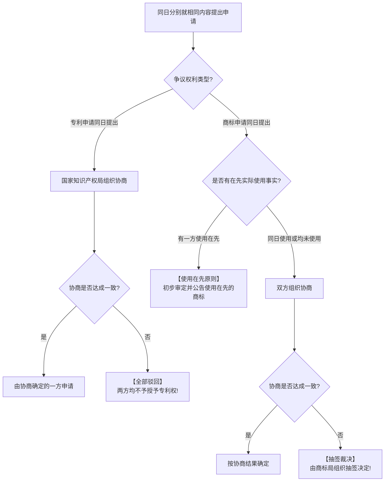

# 考点精要：专利权、商标权保护期限与标准化代号

- **所属模块**：MOD-08 知识产权与标准化
- **考查题号**：上午第 16 ~ 17 题（约 1 ~ 2 分）
- **重要程度**：⭐⭐⭐⭐（记忆型必拿满分考点）

> [!TIP]
> ### 🎯 45 分及格通关指引
> - **【45分必背核心得分点】**：
>   1. **起算日与年限秒杀口诀**：
>      - **“发明专利 20 年，自申请日起算”**（外观 15 年、实用新型 10 年）；
>      - **“注册商标 10 年，自核准注册日起算”**（可无限期续展，期满前 12 个月申请，宽展期 6 个月）。
>   2. **同日申请争议裁判绝招**：
>      - **专利**同一天申请：双方协商，**协商不成全部驳回（两败俱伤）**；
>      - **商标**同一天申请：看**谁先实际使用**；若同一天使用或均未使用，协商；**协商不成由商标局抽签决定（抽签定胜负）**。
>   3. **国标代号秒记**：
>      - `GB`：国家**强制性**标准；
>      - `GB/T`：国家**推荐性**标准（T 即“推”）；
>      - `GB/Z`：国家指导性技术文件（Z 即“指”）；
>      - `DB`：地方标准；`Q`：企业标准。
> - **【高分选读 / 考场可战略放弃点】**：
>   - 极偏门的各行业部委历史老代号（如轻工、纺织行标代码），考场直接放弃。

---

## 一、 核心考纲与概念辨析

### 1. 专利权核心法律规则与保护期限

- **专利确权基本原则**：我国专利法实行**“先申请原则”**（即谁先向国家知识产权局递交符合规定的申请文件，专利权就授予谁）。
- **三大专利类型与法定保护期限**：

| 专利类型 | 核心保护范围 | 法定保护期限 | 保护期起算时间点 | 30 秒秒杀切入点 |
| :--- | :--- | :--- | :--- | :--- |
| **发明专利** | 对产品、方法或者其改进所提出的**新的技术方案**（含软件算法） | **20 年** | **自申请日（递交申请日）起算** | 算法技术，自申请日 20 年 |
| **实用新型专利**| 对产品的形状、构造所提出的适于实用的新技术方案（小硬件发明） | **10 年** | **自申请日起算** | 硬件结构改进 10 年 |
| **外观设计专利**| 对产品的形状、图案或色彩富有美感的新设计 | **15 年** | **自申请日起算** | 视觉外观 15 年 |

---

### 2. 商标权核心法律规则与续展机制

- **商标确权原则**：我国商标法同样实行**“先申请原则”**。
- **商标权保护期限与无限续展**：
  - **法定有效期**：注册商标的有效期为 **10 年**；
  - **起算时间点**：**自核准注册之日起计算**（🚨 绝非申请日！这是全科最大易混淆考点）；
  - **续展规则**：期满前 **12 个月内**可以申请续展；若在此期间未提出，给予 **6 个月的宽展期**。每次续展注册的有效期同样为 **10 年**，**续展次数不受限制（可无限期续展，实现百年老字号保护）**。

---

### 3. 标准化基础与标准代号速查表

| 标准层次级别 | 标准代号（强制性） | 标准代号（推荐性） | 考场识别技巧 |
| :--- | :--- | :--- | :--- |
| **国家标准** | **GB** | **GB/T** | 带 /T 为推荐性（汉语拼音“推”） |
| **行业标准** | 通信行业：**YD/T**；电子行业：**SJ/T**；航天：**QJ**；机械：**JB/T** | / | 字母对应行业首字母 |
| **地方标准** | **DB + 行政区划代码**（如 DB11/T 代表北京地标） | / | DB 为“地标”拼音声母 |
| **企业标准** | **Q + 企业代号** | / | Q 为“企”拼音声母 |
| **国际标准** | **ISO**（国际标准化组织）、**IEC**（国际电工委员会）、**IEEE**（电气工程师学会） | / | 常见国际标准化组织代号 |

---

## 二、 分析模型与确权争议裁决流程

---

## 三、 命题题眼与陷阱防御

> [!CAUTION]
> ### 🚨 常见命题陷阱盘点
> 1. **商标与专利起算日偷梁换柱**：
>    - 发明专利：**自申请日起算 20 年**；
>    - 注册商标：**自核准注册日起算 10 年**！出题人最喜欢问“注册商标自申请日起算有效”，必须立刻识破。
> 2. **同一天申请判定法则混淆**：
>    - 专利同一天申请协商不成 $\rightarrow$ **驳回全部申请**（一个都不给批）；
>    - 商标同一天申请协商不成且同日使用 $\rightarrow$ **抽签决定**（必有一家得）。
> 3. **国家标准强制性辨识**：
>    - 只有 `GB` 两个字母是强制性国标；带 `/T` 的 `GB/T` 是推荐性标准。

---

## 四、 典型真题溯源与逐项排错解析 (Distractor Analysis)

### 【真题精选 1】（考查专利与商标保护期限及起算日判定 · 2024上-机考回忆-Q16）
**题干**：根据我国相关法律法规，某企业于 2024 年 3 月 1 日向国家专利局递交了一项发明专利申请，并于 2024 年 9 月 1 日获得授权公告；同日，该企业申请的一项注册商标获得核准注册。则该发明专利权的保护期起算日为（ ），该注册商标的有效期限为（ ）年。
(1) A. 2024年3月1日  B. 2024年9月1日  C. 2024年12月31日  D. 研发完成日  
(2) A. 10  B. 15  C. 20  D. 50  

- **【正确答案】**：**(1) A  (2) A**
- **【核心切入点】**：牢记发明专利自递交“申请日”起算 20 年，商标自“核准注册日”起算 10 年。

#### 逐项排错剖析 (Distractor Analysis)
- **第 (1) 空排错**：
  - 我国《专利法》第四十二条明确规定：发明专利权的期限为 20 年，自**申请之日**起计算。
  - **选项 A 正确**：2024 年 3 月 1 日为递交申请日；选项 B (9月1日) 为授权公告日，权利虽自公告之日起生效，但期限回溯自申请日起算；选项 C/D 无法律依据。
- **第 (2) 空排错**：
  - 我国《商标法》第三十九条规定：注册商标的有效期为 **10 年**，自核准注册之日起计算。
  - **选项 A 正确**；选项 B (15年) 是外观设计专利期限；选项 C (20年) 是发明专利期限；选项 D (50年) 是法人软件著作权期限。

---

### 【真题精选 2】（考查同日申请争议裁定原则 · 2024下-机考回忆-Q16）
**题干**：甲、乙两家软件开发企业在同一天分别就各自独立研发且技术特征相同的软件算法向国家知识产权局递交了发明专利申请。若双方在专利行政部门的主持下协商无法达成一致，依据我国专利法，该发明专利申请的处理方式应当是（ ）。
A. 由国家专利局组织抽签决定授予哪一方  
B. 授予实际研发完成日期在先的一方  
C. 授予实际投入商用在先的一方  
D. 两方的申请均予以驳回  

- **【正确答案】**：**D**
- **【核心切入点】**：专利同日申请协商不成全部驳回；抽签是商标同日申请的处理规则。

#### 逐项排错剖析 (Distractor Analysis)
- **选项 A 错误**：“抽签决定”是《商标法实施条例》中关于同日申请且同日使用商标争议的处理规则，专利法绝无抽签授权机制。
- **选项 B/C 错误**：我国专利法实行“先申请原则”，并非“先发明原则”或“先使用原则”。在同日递交申请的情形下，法律只认可申请日的效力，不考查谁先研发完成或谁先投入商用。
- **选项 D 正确**：根据《专利法实施细则》第十三条规定，同一天提出申请的，申请人应当在收到通知后自行协商确定申请人；协商不成的，国家知识产权局对两方的专利申请**均予以驳回**。
