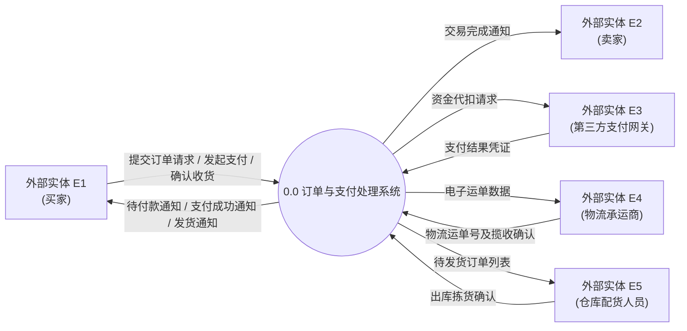
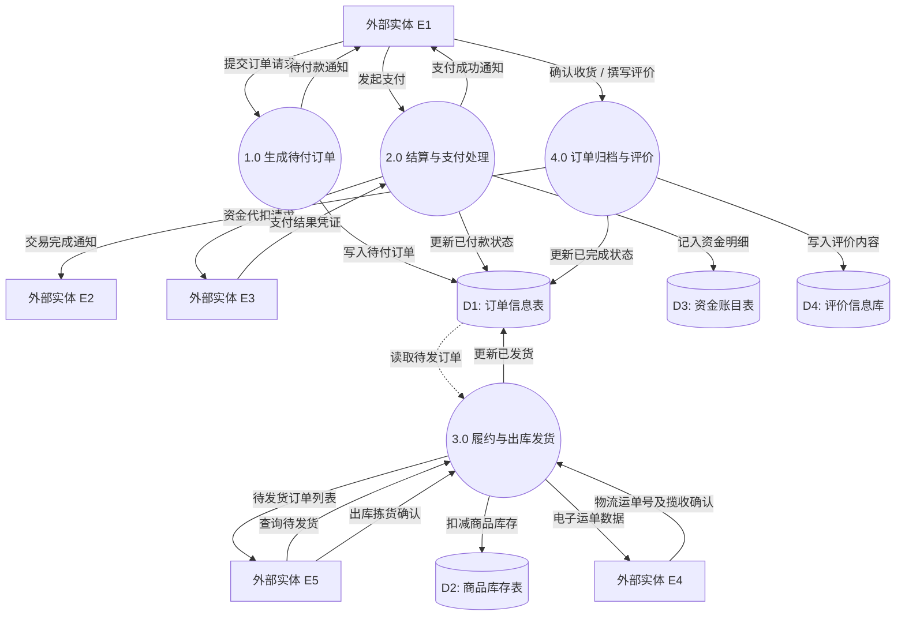
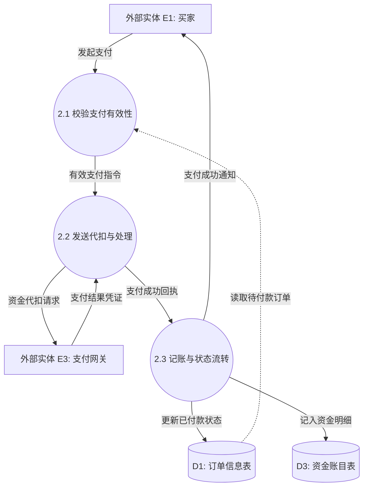

# 案例一：电商平台订单处理与在线支付系统 (DFD 精讲)

<Badge type="info" text="真题原型：电商/零售综合业务模型" />
<Badge type="tip" text="主攻考点：外部实体识别 · 父子图平衡 · 黑洞排查" />
<Badge type="danger" text="及格保底：14 ~ 15 分 (冲刺满分)" />

::: tip 🎯 案例背景与训练目标
本案例基于全国软考下午试题一典型命题场景改编。系统涉及买家、卖家、第三方支付平台、物流公司等多方参与角色，重点考查：
1. 区分系统内部加工与系统外部实体；
2. 运用“父子图平衡四查法”捕捉顶层图与 0 层图的跨边界缺失数据流；
3. 检查加工节点是否存在“只进不出”的黑洞缺陷。
:::

---

## 一、 试题情境与需求说明

某知名电子商务平台为支持跨境与多渠道零售业务，拟升级其核心订单与支付处理子系统。系统的主要业务功能描述如下：

1. **商品选购与下单**：注册买家登录系统后，可浏览商品库。买家将选中的商品加入购物车并提交订单，系统生成待支付订单，记录至订单信息表，同时向买家发送待付款通知。
2. **在线支付与资金结算**：买家通过系统发起支付请求，系统对接第三方第三方支付网关完成资金代扣。支付网关返回支付结果凭证；若支付成功，系统更新订单信息表为“已付款”状态，向买家发送支付成功通知，并将结算款项明细记入资金账目表。
3. **订单履约与出库发货**：仓库配货人员每日定时从系统查询待发货订单，核对库存信息表后执行商品出库拣货，向物流承运商提交电子运单，并更新订单信息表为“已发货”状态。物流承运商揽件后，向系统回传物流运单号与揽收确认。
4. **收货确认与订单评价**：买家收到商品后，在系统中执行确认收货，系统将订单状态更新为“已完成”，并通知卖家交易完成。买家可针对订单撰写商品评价，系统将评价内容存储至评价信息库，并向买家赠送积分。

根据上述需求，系统分析师绘制了系统的顶层数据流图（图 1-1）和 0 层数据流图（图 1-2）。

---

## 二、 系统数据流图架构（Mermaid 矢量呈现）

### 2.1 顶层数据流图 (Context Diagram)



### 2.2 0 层数据流图 (Level 0 DFD)



### 2.3 加工 2.0（结算与支付处理）的 1 层数据流细化图 (Level 1 DFD)

为了考查子加工细化与更深层级的父子图平衡，将 0 层图中的 **加工 2.0（结算与支付处理）** 进一步细化分解为 3 个子加工（编号为 2.1、2.2、2.3）：



> [!NOTE] 1 层细化子图父子平衡核查
> - **父加工 2.0 边界输入流**：买家“发起支付”、订单表“读取待付款订单”、网关“支付结果凭证”（共 3 条）；
> - **子图边界输入流**：流入 2.1 有 2 条、流入 2.2 有 1 条，合计 3 条，**完全守恒**；
> - **父加工 2.0 边界输出流**：“资金代扣请求”、“更新已付款状态”、“记入资金明细”、“支付成功通知”（共 4 条）；
> - **子图边界输出流**：2.2 流出 1 条，2.3 流出 3 条，合计 4 条，**完全守恒**。

---

## 三、 考场设问与检索式自测 (Active Recall Drill)

### 问题 1：识别外部实体（4分）
请根据题干说明，给出图 1-1 中外部实体 $E_1 \sim E_5$ 的具体名称。

<details>
<summary>🔍 查看外部实体标准答案与题眼解析</summary>

#### 标准答案：
- $E_1$：**买家**（或：注册买家、顾客）
- $E_2$：**卖家**（或：商户、平台商家）
- $E_3$：**第三方支付网关**（或：支付平台、银联支付系统）
- $E_4$：**物流承运商**（或：物流公司、快递承运商）
- $E_5$：**仓库配货人员**（或：配货员、仓管人员）

#### 题眼解析与避坑提示：
- **抓主谓宾定位**：在功能描述 1 中，动作主体是“买家”，因此与系统交互最频繁的 $E_1$ 确定为买家；
- **区分内部与外部**：仓库配货人员虽为企业员工，但在系统边界视角下，他是通过界面操作系统的**人机交互角色**，属于外部实体，严禁将其当作内部加工处理！
</details>

---

### 问题 2：识别数据存储（4分）
请根据题干说明，给出图 1-2 中数据存储 $D_1 \sim D_4$ 的具体名称。

<details>
<summary>🔍 查看数据存储标准答案与题眼解析</summary>

#### 标准答案：
- $D_1$：**订单信息表**（或：订单表、订单库）
- $D_2$：**商品库存表**（或：库存信息表、库存台账）
- $D_3$：**资金账目表**（或：结算款项明细表、资金明细表）
- $D_4$：**评价信息库**（或：评价信息表、商品评价库）

#### 题眼解析与避坑提示：
- **检查多加工共享**：$D_1$ 在加工 1.0、2.0、3.0、4.0 中均被反复读写，其生命周期贯穿下单、支付、发货、评价，必然对应“订单信息表”；
- **核对读写动作**：加工 3.0 有“扣减商品库存”箭头指向 $D_2$，直接定位为库存表；加工 2.0 有“记入资金明细”指向 $D_3$，对应资金账目表。
</details>

---

### 问题 3：父子图平衡与缺失数据流补充（5分）
对比图 1-1（顶层图）与图 1-2（0层图），图 1-2 存在若干条数据流遗漏。请指出缺失的数据流名称、起点与终点。

<details>
<summary>🔍 查看缺失数据流标准答案与排查推导</summary>

#### 标准答案：
1. **数据流 1**：
   - 数据流名称：**发货通知**
   - 起点：**加工 3.0**（或：3.0 履约与出库发货）
   - 终点：**外部实体 $E_1$**（买家）
2. **数据流 2**：
   - 数据流名称：**商品详情数据**（或：商品库存查询结果）
   - 起点：**数据存储 $D_2$**（商品库存表）
   - 终点：**加工 3.0**（或：3.0 履约与出库发货）
3. **数据流 3**：
   - 数据流名称：**待付款订单状态**（或：订单支付金额数据）
   - 起点：**数据存储 $D_1$**（订单信息表）
   - 终点：**加工 2.0**（或：2.0 结算与支付处理）

#### 逐条排错推导推演：
- **推导 1（父子平衡法）**：在顶层图（图 1-1）中，系统输出流明确包含“发货通知 $\to E_1$”，但在 0 层图（图 1-2）中，加工 3.0 接收到物流运单后并未向 $E_1$ 发出任何发货通知！父子图跨边界不平衡，必然缺失该数据流。
- **推导 2（灰洞排查法）**：在 0 层图中，加工 3.0 执行“核对库存”，并向 $D_2$ 写入“扣减商品库存”，但此前加工 3.0 根本没有从 $D_2$ 读取库存信息的输入流！加工只有向外写而没有读入基础数据，属于原材料不足的灰洞缺陷。
- **推导 3（灰洞排查法）**：加工 2.0 仅收到买家“发起支付”，在没有从 $D_1$ 读取订单应付金额的前提下，不可能凭空向第三方支付网关发起“资金代扣请求”。必须存在一条从 $D_1 \to$ 加工 2.0 的订单读取流。
</details>

---

### 问题 4：数据字典条目补充（2分）
若系统中“订单详情”由以下数据项构成：订单编号、下单时间、买家信息、买家选择的支付方式，以及一条或多条购买商品条目。请使用数据字典的标准规范符号书写“订单详情”的定义式。

<details>
<summary>🔍 查看数据字典标准答案与规范写法</summary>

#### 标准答案：
```text
订单详情 = 订单编号 + 下单时间 + 买家信息 + 支付方式 + 1 { 购买商品条目 }
```
*(注：其中支付方式若展开定义，可记为 `支付方式 = [ 微信支付 | 支付宝支付 | 银行卡支付 ]`)*

#### 规范评分要点：
- 必须使用 `=` 表达定义；
- 属性之间必须使用 `+` 连接；
- “一条或多条商品条目”必须使用花括号 `{ }` 并标明下限 `1`（写作 `1 { 购买商品条目 }` 或 `{ 购买商品条目 } 1..*` 均给满分）。
</details>
