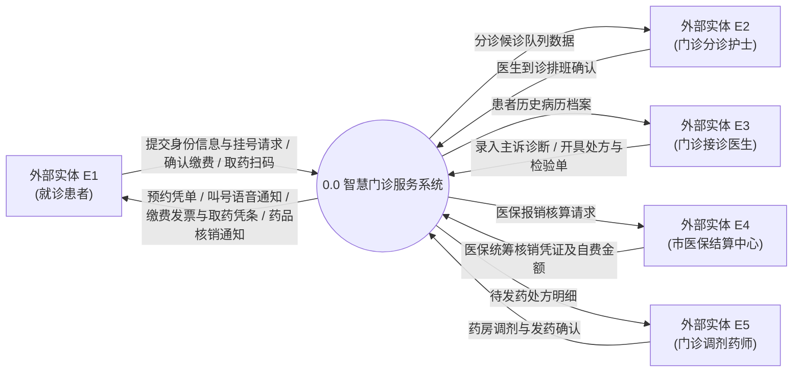
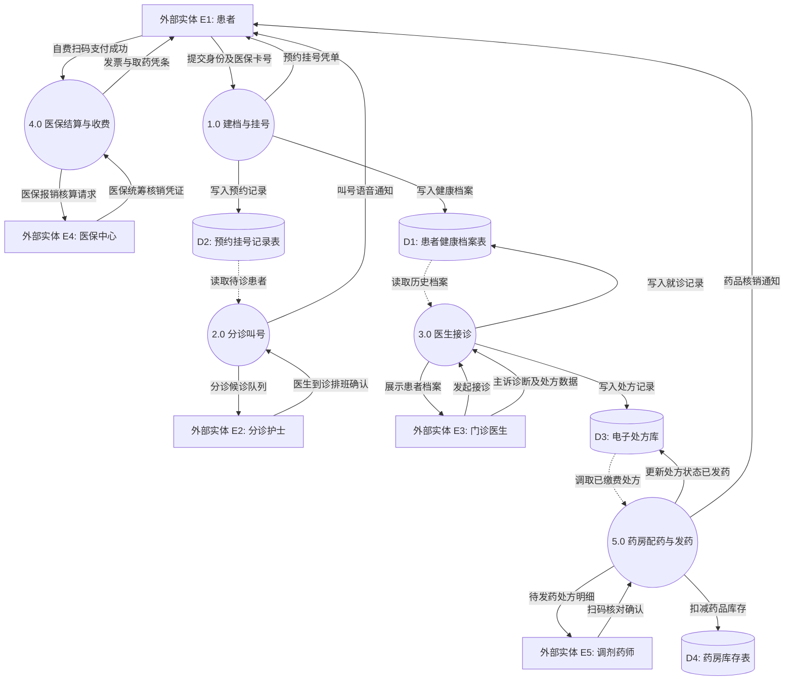

# 案例二：智慧医院门诊挂号与诊疗收费系统 (DFD 精讲)

<Badge type="info" text="真题原型：医疗/政务信息系统模型" />
<Badge type="tip" text="主攻考点：灰洞排查 · 读写对称性 · 多级加工数据流动" />
<Badge type="danger" text="及格保底：14 ~ 15 分 (冲刺满分)" />

::: tip 🎯 案例背景与训练目标
医疗信息化（HIS）是全国软考下午案例分析最钟爱的高频考查背景之一。业务逻辑紧密，涵盖患者、门诊医生、医保结算中心、检验科室等多重外部实体。
本案例重点攻坚：
1. 数据存储“只读不写”或“只写不读”的读写对称性排查；
2. 加工节点“灰洞”（输入流数据项缺失导致无法推导输出流）的严密分析；
3. 数据存储之间越权直连的违规排查。
:::

---

## 一、 试题情境与需求说明

某三甲综合医院为提高患者就医体验与诊疗效率，开发“智慧门诊一站式服务系统”。系统的核心业务流程描述如下：

1. **患者建档与预约挂号**：初次就诊患者在自助机或手机端提交个人身份信息与医保卡号，系统验证身份后建立患者电子健康档案，写入档案库。患者选择就诊科室与专家排班，系统生成挂号预约凭单，记录至预约挂号记录表，并将排号信息推送至分诊候诊队列。
2. **就诊分诊与叫号**：门诊分诊护士根据医生到诊情况开启候诊队列，分诊叫号屏自动按就诊号呼叫患者。当患者进入诊室后，系统更新该挂号单为“就诊中”。
3. **门诊医生接诊与开立处方**：门诊医生在工作站查阅患者历史病历档案，录入本次主诉与诊断结果，并开立电子处方或医技检验申请单。处方信息记录至电子处方库，检验单记录至医技检验库。
4. **医保核销与费用结算**：患者在自助缴费终端发起缴费，系统向市医保结算中心提交医保报销核算请求。医保结算中心返回医保统筹基金支付金额与个人自费金额；患者完成自费款项扫码支付后，系统更新处方与检验单为“已缴费”状态，打印就医发票与取药凭条。
5. **药房核对与窗口发药**：门诊药房调剂药师调取“已缴费”状态的处方，核对药房库存表后进行药品配齐打包。患者凭取药凭条到发药窗口扫码取药，系统核销处方为“已发药”，并更新药房库存表扣减库存。

---

## 二、 系统数据流图架构（Mermaid 矢量呈现）

### 2.1 顶层数据流图 (Context Diagram)

### 2.2 0 层数据流图 (Level 0 DFD)

---

## 三、 考场设问与检索式自测 (Active Recall Drill)

### 问题 1：识别外部实体（4分）
请根据题干说明，给出图 2-1 中外部实体 $E_1 \sim E_5$ 的具体名称。

🔍 查看外部实体标准答案与题眼解析

#### 标准答案：
- $E_1$：**就诊患者**（或：患者、病患）
- $E_2$：**门诊分诊护士**（或：分诊护士、护士）
- $E_3$：**门诊接诊医生**（或：门诊医生、医生）
- $E_4$：**市医保结算中心**（或：医保中心、医保结算系统）
- $E_5$：**门诊调剂药师**（或：调剂药师、药房药剂师）

#### 题眼解析：
- 注意系统角色命名的一致性，提取岗位名称时尽量携带限定修饰语（如“分诊护士”、“调剂药师”），体现岗位职能差异。

---

### 问题 2：识别数据存储（4分）
请根据题干说明，给出图 2-2 中数据存储 $D_1 \sim D_4$ 的具体名称。

🔍 查看数据存储标准答案与题眼解析

#### 标准答案：
- $D_1$：**患者健康档案表**（或：电子健康档案库、患者档案表）
- $D_2$：**预约挂号记录表**（或：挂号预约信息表、就诊排号表）
- $D_3$：**电子处方库**（或：门诊处方表、处方信息库）
- $D_4$：**药房库存表**（或：药品库存表、药房库存台账）

#### 题眼解析：
- $D_1$ 由加工 1.0 写入并在加工 3.0 接诊时调阅历史病历，对应患者档案表；
- $D_3$ 在加工 3.0 生成处方，在加工 4.0 结算与加工 5.0 配药中流通，对应电子处方库；
- $D_4$ 在发药加工 5.0 中被扣减，对应药品库存表。

---

### 问题 3：灰洞异常排查与缺失数据流补充（5分）
分析图 2-2 中的加工节点与数据流动，指出存在哪几条缺失的数据流（给出数据流名称、起点与终点）。

🔍 查看缺失数据流标准答案与排查推导

#### 标准答案：
1. **数据流 1**：
   - 数据流名称：**待缴费处方费用数据**（或：处方金额明细）
   - 起点：**数据存储 $D_3$**（电子处方库）
   - 终点：**加工 4.0**（医保结算与收费）
2. **数据流 2**：
   - 数据流名称：**更新处方为已缴费状态**
   - 起点：**加工 4.0**（医保结算与收费）
   - 终点：**数据存储 $D_3$**（电子处方库）
3. **数据流 3**：
   - 数据流名称：**药品库存查询/核对结果**
   - 起点：**数据存储 $D_4$**（药房库存表）
   - 终点：**加工 5.0**（药房配药与发药）

#### 逐条排错推导推演：
- **推导 1（严重灰洞缺陷）**：加工 4.0 负责“医保报销核算与自费结算”，但图中加工 4.0 没有任何连线连接处方库 $D_3$！不知道患者到底开了什么药、多少钱，加工 4.0 怎么向医保中心提交报销请求？必须存在一条从 $D_3 \to$ 加工 4.0 的处方金额输入流。
- **推导 2（状态闭环缺失）**：加工 5.0 明确说明调取“已缴费状态”的处方，但图中加工 4.0 在患者缴费成功后并没有向 $D_3$ 写回更新状态！导致 $D_3$ 中处方状态永远停留在未缴费，加工 5.0 陷入死锁。因此必须有加工 4.0 $\to D_3$ 的状态更新流。
- **推导 3（只写不读异常）**：数据存储 $D_4$（药房库存表）在图中只有流入的“扣减药品库存”，但根据业务说明“调剂药师核对药房库存后进行打包配药”，加工 5.0 必须先从 $D_4$ 读取实时库存数据进行比对，因此缺失 $D_4 \to$ 加工 5.0 的库存查询输入流。

---

### 问题 4：结构化分析核心工具辨析（2分）
在加工说明中，若某项处方医保报销计算规则涉及多个组合条件（就诊人类型：在职/退休/学生；报销目录分类：甲类100%/乙类80%/丙类自费；起付线达标情况），使用何种工具进行加工逻辑描述最为清晰且不易遗漏逻辑组合？请说明理由。

🔍 查看标准答案与概念辨析

#### 标准答案：
应选用 **判定表 (Decision Table)** 或 **判定树 (Decision Tree)**。

#### 理由：
当加工逻辑包含**多个复杂的判定条件彼此嵌套、组合繁多**时，自然语言或结构化语言容易造成逻辑分支混乱或遗漏组合情况；而判定表（条件桩、动作桩、条件项、动作项）能够列举所有可能出现的条件组合情况，确保无歧义、无遗漏且易于系统测试用例的完整推导。

