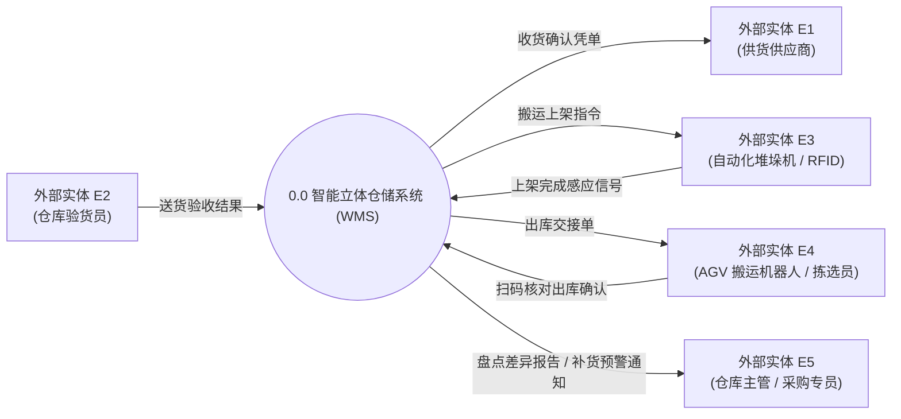
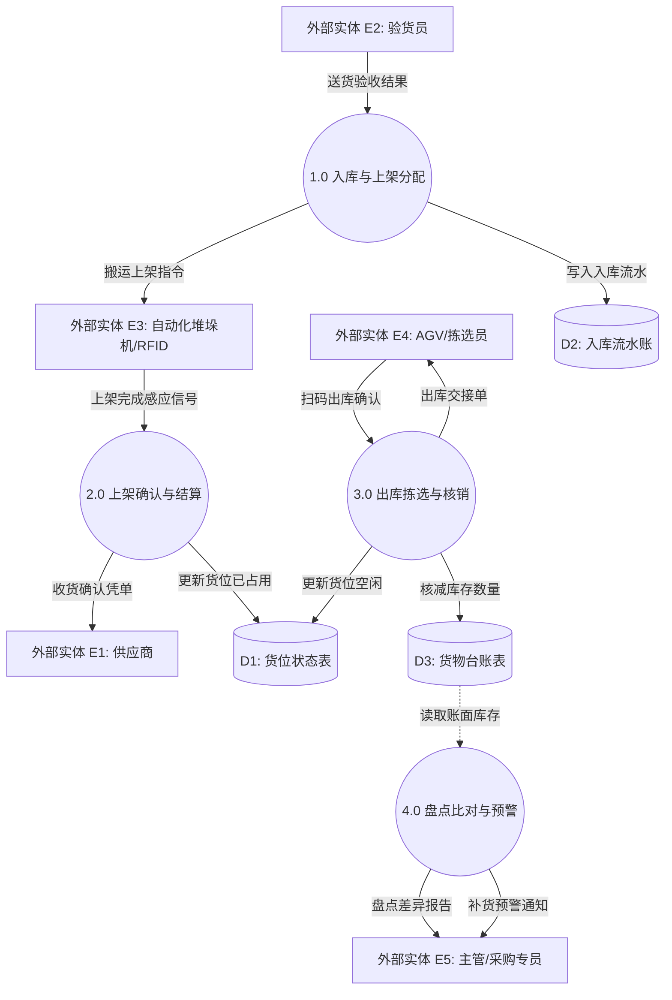

# 案例三：智能仓储入出库与物流监控系统 (DFD 精讲)

<Badge type="info" text="真题原型：物联网/智能物流仓储模型" />
<Badge type="tip" text="主攻考点：数据字典规范 · 组合数据流 · 越权连线纠偏" />
<Badge type="danger" text="及格保底：14 ~ 15 分 (冲刺满分)" />

::: tip 🎯 案例背景与训练目标
智能物流与仓储系统（WMS）涉及大量的自动化硬件感知设备（RFID 读卡器、立体库堆垛机、车载终端）与业务实体交互。
本案例重点攻坚：
1. 识别硬件传感器作为外部实体的特殊表现；
2. 识别并纠正“外部实体与数据存储直连”、“数据存储与数据存储直连”等重大违规错误；
3. 数据字典高级组合语法（如多重选择、限定重复次数、可选字段）的精准作答。
:::

---

## 一、 试题情境与需求说明

某大型智能物流中心为实现“货到人”自动化作业，建设智能立体仓储与物流调度系统（WMS）。系统核心业务功能描述如下：

1. **入库验货与货位推荐**：供应商送货到达仓库后，验货员使用手持终端扫描送货单并核验实物，录入入库验收结果。系统根据货位状态表中的库位空闲情况与货物承重规则，自动计算并分配最佳存放货位，生成入库上架任务单，记录至入库流水账，同时向自动化堆垛机下发移动搬运指令。
2. **自动化上架确认**：自动化堆垛机将托盘搬送至指定货位后，通过货位上的 RFID 读写器感应货物标签，将上架完成信号回传给系统。系统更新货位状态表为“已占用”，并向供应商发送收货确认电子签收凭单。
3. **出库拣选与订单出库**：调度员向系统导入销售出库单，系统依据先进先出（FIFO）规则生成出库拣货路线，并向 AGV 搬运机器人下达搬运货架指令。AGV 搬运机器人完成拣选货位定位后，由仓库拣选员扫码核对出库。系统核减货位状态表与货物台账表中的对应库存数量，向承运快递公司发送出库交接单。
4. **盘点与动态预警**：库存管理员每日启动例行盘点或动态循环盘点。系统自动比对货物台账表与货位物理扫描数据，若发现账实不符，生成盘亏/盘盈差异报告，发送给仓库主管审核；若某类货物库存低于设定的安全库存阈值，系统向采购专员发送补货预警通知。

---

## 二、 系统数据流图架构（Mermaid 矢量呈现）

### 2.1 顶层数据流图 (Context Diagram)



### 2.2 0 层数据流图 (Level 0 DFD 存在若干缺陷待排查)



---

## 三、 考场设问与检索式自测 (Active Recall Drill)

### 问题 1：识别外部实体（4分）
请根据题干说明，给出图 3-1 中外部实体 $E_1 \sim E_5$ 的具体名称。

<details>
<summary>🔍 查看外部实体标准答案与题眼解析</summary>

#### 标准答案：
- $E_1$：**供货供应商**（或：供应商、货主）
- $E_2$：**仓库验货员**（或：验货员）
- $E_3$：**自动化堆垛机与 RFID 读写器**（或：自动化堆垛机、堆垛机/RFID设备）
- $E_4$：**AGV 搬运机器人与拣选员**（或：AGV/拣选员、拣选作业人员）
- $E_5$：**仓库主管与采购专员**（或：仓储主管/采购专员、仓库管理员）

#### 题眼解析：
- **硬件当做外部实体**：在现代物联网自动化系统中，自动化堆垛机、RFID 读卡器能够自主与系统完成双向数据传输（接收搬运指令、回传完成信号），在系统边界上完全充当外部实体角色，必须予以明确辨识。
</details>

---

### 问题 2：识别数据存储（3分）
请根据题干说明，给出图 3-2 中数据存储 $D_1 \sim D_3$ 的具体名称。

<details>
<summary>🔍 查看数据存储标准答案与题眼解析</summary>

#### 标准答案：
- $D_1$：**货位状态表**（或：库位空闲状态表、货位状态库）
- $D_2$：**入库流水账**（或：入库任务单记录表、入库台账）
- $D_3$：**货物台账表**（或：库存商品信息表、库存台账表）

#### 题眼解析：
- 加工 1.0 和加工 2.0 联动操作货位分配与占用，对应 $D_1$ 货位状态表；
- 加工 1.0 生成入库任务记录，对应 $D_2$ 入库流水账；
- 加工 3.0 和加工 4.0 读写库存台账并进行出库核减与盘点比对，对应 $D_3$ 货物台账表。
</details>

---

### 问题 3：综合排错与缺失数据流补充（5分）
经审查，图 3-2（0 层数据流图）中存在 3 处严重的缺失数据流缺陷。请补齐这 3 条缺失数据流（写明数据流名称、起点与终点）。

<details>
<summary>🔍 查看缺失数据流标准答案与排查推导</summary>

#### 标准答案：
1. **数据流 1**：
   - 数据流名称：**可用货位空闲数据**（或：货位状态查询结果）
   - 起点：**数据存储 $D_1$**（货位状态表）
   - 终点：**加工 1.0**（入库与上架分配）
2. **数据流 2**：
   - 数据流名称：**增加商品台账库存**（或：更新货物台账入库数量）
   - 起点：**加工 2.0**（上架确认与结算）
   - 终点：**数据存储 $D_3$**（货物台账表）
3. **数据流 3**：
   - 数据流名称：**货位物理实际占用数据**（或：货位实物盘点数据）
   - 起点：**数据存储 $D_1$**（货位状态表）
   - 终点：**加工 4.0**（盘点比对与预警）

#### 逐条排错推演：
- **推导 1（灰洞排错）**：加工 1.0 职责是“计算并分配最佳存放货位”，如果不从 $D_1$ 查询当前哪些库位是空闲的、承重参数是多少，根本无法凭空计算推荐货位！因此缺失 $D_1 \to$ 加工 1.0 的输入流；
- **推导 2（业务完整性与只减不加异常）**：查看 $D_3$（货物台账表），只有加工 3.0 在出库时“核减库存数量”，而货物入库上架确认后，竟然没有任何加工向 $D_3$ 增加库存！如果库存只减不增，整个仓库账目必定崩溃。根据业务需求，上架完成后系统必须在 $D_3$ 中登记增加库存，因此缺失加工 2.0 $\to D_3$ 的入库更新流；
- **推导 3（灰洞与比对依据缺失）**：加工 4.0 执行“盘点比对”，比对的前提是“货物台账表 vs 物理货位数据”，图中加工 4.0 仅读取了 $D_3$ 台账，缺失了比对的另一方——$D_1$ 货位状态数据，因此必须补充 $D_1 \to$ 加工 4.0。
</details>

---

### 问题 4：违规连线辨析与数据字典综合填空（3分）
1. （1分）在某考生提交的设计草图中，存在一条从外部实体“验货员”直接指向数据存储“入库流水账”的数据流，以及一条从“入库流水账”直接指向“货物台账表”的数据流。请指出这两条连线是否符合数据流图建模规范，并简述理由。
2. （2分）系统中“入库上架任务单”由以下项目组成：任务单号、入库批次号、操作员编号，以及 1 到 50 个由【货物编号、分配货位号、建议存放托盘类型（木质/塑料/钢质三选一）】构成的上架明细项。请使用数据字典标准符号写出其定义式。

<details>
<summary>🔍 查看标准答案与解析</summary>

#### 标准答案：
1. **违规判定与理由**：
   - **均不符合规范（属于严重违规建模）**。
   - **理由**：
     - ① 外部实体与数据存储之间**严禁直接连线**，外部实体的交互数据必须通过加工处理后方能写入存储；
     - ② 数据存储与数据存储之间**严禁直接连线**，数据的迁移、同步或转录必须通过具体的系统加工处理程序来完成。
2. **数据字典定义式**：
   ```text
   入库上架任务单 = 任务单号 + 入库批次号 + 操作员编号 + 1 { 货物编号 + 分配货位号 + [ 木质托盘 | 塑料托盘 | 钢质托盘 ] } 50
   ```
</details>
