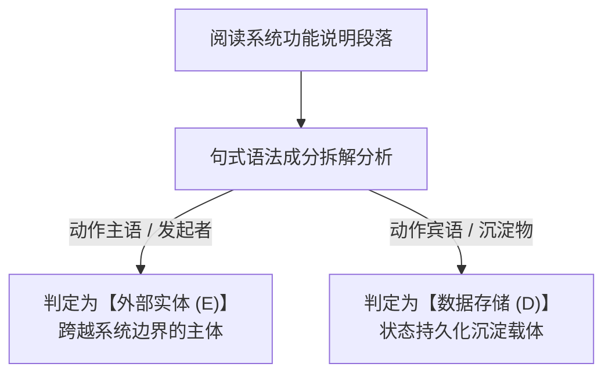
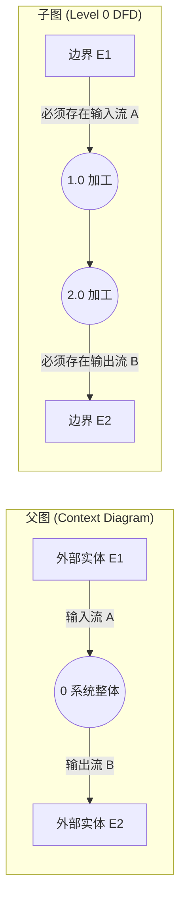

# 试题一：数据流图 (DFD) 万能解题法则与核心方法论

<Badge type="info" text="题型定位：必答题 · 分值: 15 分" />
<Badge type="tip" text="保底目标：13 ~ 15 分 (绝对送分基础盘)" />
<Badge type="danger" text="核心铁律：父子图平衡 · 黑洞/奇迹/灰洞排查 · 读写对称" />

::: tip 🎯 试题一通关战略定位
试题一为下午应用技术科目第一道大题。其题型模式自 2010 年以来**未发生过任何重大变化**，是全卷套路最固定、提分确定性最高、考查逻辑最单纯的“送分盘”。

考生失分的主要原因通常并非技术理论不懂，而是**粗心漏流、起点终点颠倒、外部实体与存储混淆**。通过本篇提炼的“题干定位三步法”、“父子图平衡四查法”与“异常排查矩阵”，可彻底实现 14 分以上的稳定斩获。

配套导航：[📖 下午题门户](/pm-application/) | [📐 案例一：电商订单支付](./01-case-ecommerce-orders) | [📐 案例二：智慧医疗门诊](./02-case-hospital-outpatient) | [📐 案例三：智能仓储物流](./03-case-smart-warehouse)
:::

---

## 一、 试题一本质解构与考场采分标准

### 1.1 试卷展现形式与 4 问固定模型

试题一通常以一段约 600~800 字的业务系统需求说明展开，附带 2~3 幅分层图谱：
1. **顶层数据流图（Context Diagram / 顶层图）**：仅包含 1 个代表整个系统的加工节点（编号通常为 0 或系统名）、所有外部实体，以及跨越系统边界的主干输入/输出流。
2. **0 层数据流图（Level 0 DFD）**：对系统整体的第一次分解，细化为 3~5 个顶层子加工（编号为 1.0, 2.0, 3.0 等），并引入数据存储及各子模块间的主干交互流。
3. **1 层及下层数据流图（Level 1 DFD / 细化子图）**：对 0 层图中某个复杂子加工进行再次展开分解（编号为 1.1, 1.2, 1.3 或 2.1, 2.2 等），考查局部的父子图输入/输出守恒。

历年真题固定设问如下表：

| 设问序号 | 考查要点 | 标准分值 | 得分难度 | 采分标准与扣分红线 |
| :---: | :--- | :---: | :---: | :--- |
| **问题 1** | **识别外部实体** ($E_1, E_2, \dots$) | 3 ~ 4分 | 极低 | 必须写全系统说明中出现的角色/系统/硬件名称。错别字不给分，自造词扣分。 |
| **问题 2** | **识别数据存储** ($D_1, D_2, \dots$) | 3 ~ 4分 | 极低 | 写明具体存储名词（如“库存台账表”、“用户信息文件”）。漏写实体表名扣分。 |
| **问题 3** | **补充缺失数据流** | 4 ~ 5分 | 中等 | **全题核心失分点**！必须完整写明：**数据流名称、起点（Source）、终点（Destination）**。方向反写或漏写其一即扣 1 分。 |
| **问题 4** | **数据字典 / 加工逻辑分析** | 2 ~ 3分 | 偏低 | 数据字典符号书写规范，或辨析判定树、判定表及结构化语言适用场景。 |

---

## 二、 核心解题法则与万能判定矩阵

### 2.1 外部实体与数据存储“题干定位三步法”

数据流图的外部实体和数据存储**100% 隐藏在题干功能说明文字中**。通过句式成分分析与动宾溯源，即可精准锁定图元归宿：

#### 外部实体与数据存储考场判别对照表

| 句式语法特征 | 判定图元 | 物理形态 | 典型考场实例与定位标志 |
| :--- | :---: | :--- | :--- |
| **动作的主语 / 发起者** （不在系统内部，向系统发起请求或接收业务处理反馈） | **外部实体 `E`** | **人员角色** | 客户、患者、系统管理员、教务处审核员、仓库管理员 |
| ^ | ^ | **外部系统** | 银联/微信支付网关、第三方物流平台、医保结算系统 |
| ^ | ^ | **智能硬件** | 温湿度传感器、条形码扫码枪、IC 卡读卡终端 |
| **动作的宾语 / 沉淀物** （带有保存、持久化、流水、台账、历史归档等语义） | **数据存储 `D`** | **数据库表** | 订单表、商品信息库、学生选课信息记录表 |
| ^ | ^ | **日志文件** | 登录审计日志、转账交易流水、系统异常告警文件 |
| ^ | ^ | **纸质/台账** | 纸质盘点明细台账、出入库纸质登记账册 |

> [!IMPORTANT] 外部实体与数据存储的三大约束红线
> 1. **数据存储不能主动发起动作**：凡是能“发起请求”、“提交凭据”的，必定是外部实体，绝非数据存储！
> 2. **外部实体与外部实体之间无连线**：数据流图仅表达系统内部流动，系统外部两实体间的交互与本系统无关，绝不能在图中连线。
> 3. **外部实体与数据存储严禁直连**：外部实体读取或写入数据存储，**必须经由系统加工节点转发**（例如：用户不能直接写入数据库，必须通过“保存用户信息”加工）。

---

### 2.2 补全缺失数据流的“三核排查法”

针对失分率最高的问题 3，严格执行以下 3 步排查，漏流无所遁形：

#### 核查一：父子图平衡四查法（边界流守恒）
- **定义**：父图中某加工的全部输入流与输出流，必须在子图的外边界上**原样、等量、同名出现**。
- **四查步骤**：
  1. 查**父图有而子图无**的输入流（顺藤摸瓜找到子图中接收该流的子加工）；
  2. 查**父图有而子图无**的输出流（顺藤摸瓜找到子图中产出该流的子加工）；
  3. 查**子图有而父图无**的外部流（子图边界流超出父图范围，说明子图漏向父图同步或流向多余）；
  4. 查**数据流命名一致性**（父图叫“缴费单”，子图不能私自改叫“凭证”）。

#### 核查二：加工节点“三态黑白洞”排查
加工是数据的转化器，输入与输出必须满足能量守恒：

| 异常形态 | 物理图示表现 | 典型错误成因 | 补全对策 |
| :---: | :--- | :--- | :--- |
| **黑洞 (Black Hole)** | 加工只有输入流，没有任何箭头向外流出 | 系统只收集数据却不做任何持久化或展示 | 必然缺失指向数据存储的**保存流**，或指向实体的**响应流**。 |
| **奇迹 (Miracle)** | 加工只有输出流，没有任何箭头流入加工 | 无米之炊，凭空凭据生成结果 | 必然缺失从外部实体输入的**参数流**，或从数据存储读取的**基础配置流**。 |
| **灰洞 (Grey Hole)** | 加工有进有出，但输入数据在逻辑上无法推导出输出数据 | 原材料不足以生产制成品（如输入是“用户名”，输出却是“信用卡扣款凭单”） | 必然缺失从存储或其他加工读取**关键支撑流**（如缺失“绑卡账户信息”）。 |

#### 核查三：数据存储读写对称性（防单向死锁）
- **只写不读（垃圾桶）**：某数据存储只有流入箭头，从未被任何加工读取过。通常必然缺失某加工对其进行的**查询/校验流**。
- **只读不写（凭空产生）**：某数据存储只有流出箭头，从未有任何加工写入过。通常必然缺失前置初始化加工向其**写入/更新流**。
- **存储间直连（违规）**：两个数据存储之间画了数据流箭头。**严禁直连**，必须通过“数据同步/归档加工”转接！

---

### 2.3 数据字典 (Data Dictionary) 定义符号体系

数据字典是结构化分析的核心工具，考场填空必须准确书写定义符号：

| 符号 | 符号名称 | 语义解释 | 典型真题应用示例 |
| :---: | :--- | :--- | :--- |
| **`=`** | **定义为 (is composed of)** | 声明数据结构的组成成分 | `客户账单 = 账单号 + 消费明细 + 总金额` |
| **`+`** | **顺序连接 (and)** | 各成分顺序按序连接出现 | `个人姓名 = 姓氏 + 名字` |
| **`[ \| ]`** | **选择其中之一 (or)** | 中括号内各备选成分任选其一，以竖线分隔 | `支付方式 = [ 微信支付 \| 支付宝支付 \| 银行卡支付 ]` |
| **`{ }`** | **重复 (iteration)** | 花括号内的成分重复出现 0 次或多次 | `订单商品条目 = { 商品编号 + 购买数量 + 单价 }` |
| **`m { } n`**| **限定重复次数** | 重复至少 $m$ 次，至多 $n$ 次 | `手机号码 = 11 { 数字 } 11` |
| **`( )`** | **可选成分 (optional)** | 圆括号内的成分可以出现 0 次或 1 次 | `邮寄地址 = 省 + 市 + 区 + 详细地址 + (邮编)` |

---

## 三、 标准化四步作答句式与防扣分规范

在机考文本框输入作答时，严格遵守以下标准输出格式，防范判卷踩坑：

> [!TIP] 缺失数据流标准回答模板
> - **格式**：`数据流名称：[名称]，起点：[节点名称]，终点：[节点名称]`
> - **范例**：
>   - 数据流 1：`数据流名称：采购计划单，起点：采购员，终点：1.0 编制采购计划`
>   - 数据流 2：`数据流名称：库存预警信息，起点：2.0 库存监控，终点：仓库管理员`
>   - 数据流 3：`数据流名称：商品详情数据，起点：D1 商品信息表，终点：3.0 订单结算`
> 
> **严禁以下不规范写法**：
> - ❌ 仅写节点编号：`采购计划单: E1 -> P1`（部分机考判分点要求必须带名称）；
> - ❌ 颠倒起点终点：`起点：1.0，终点：采购员`（数据流是有向箭头，由谁产生即谁为起点）。
