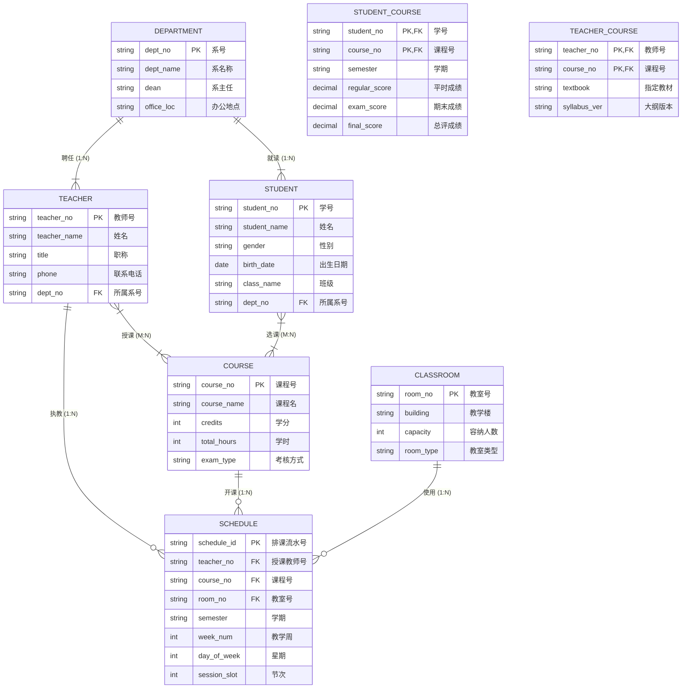

# 案例一：高校教务排课与成绩管理系统 (E-R 与规范化精讲)

<Badge type="info" text="真题原型：高校教务与排课教学管理模型" />
<Badge type="tip" text="主攻考点：E-R 转换三大铁律 · 复合主键判定 · 传递函数依赖消解 · SQL 级联约束" />
<Badge type="danger" text="及格保底：13 ~ 15 分 (冲刺满分)" />

::: tip 🎯 案例背景与训练目标
本案例基于全国软考下午试题二典型的高校信息化综合业务模型改编。系统涉及院系、教师、学生、课程、教室等多方实体与选课、授课、排课等核心业务联系，重点考查：
1. 识别实体之间的 1:1、1:N、M:N 联系并在 E-R 图中规范标明；
2. 遵循 E-R 向关系模型转换三大铁律，将联系准确并入关系模式或独立建表；
3. 推导关系模式的主键与外键（包括复合主键）；
4. 运用规范化理论剖析 1NF $\to$ 2NF $\to$ 3NF 的依赖缺陷，并实现无损分解；
5. 书写符合实体完整性、参照完整性与用户定义完整性的 SQL DDL 语句。
:::

---

## 一、 试题情境与业务需求说明

某大学为支撑学分制改革与智慧校园建设，拟重构其教务排课与成绩管理数据库系统。系统核心业务需求与数据模型说明如下：

1. **院系与人员管理**：
   - 学校设有多个院系，每个院系包含：系号、系名称、系主任、办公地点与联系电话。每个院系聘任多名教师，每名教师只属于一个院系；每个院系招收多名学生，每名学生只属于一个院系。
   - 教师信息包含：教师号、姓名、职称、联系电话。
   - 学生信息包含：学号、姓名、性别、出生日期、班级名称。
2. **课程与教学安排**：
   - 课程信息包含：课程号、课程名称、学分、总学时、考核方式。一门课程可由多位教师在不同学期主讲，一位教师也可讲授多门不同的课程。教师主讲某门课程时，需记录指定教材与教学大纲版本。
3. **学生选课与成绩评定**：
   - 学生根据培养方案选修课程。一名学生可以选修多门课程，一门课程可被多名学生选修。学生选修课程后，期末由系统记录平时成绩、期末卷面成绩以及按权重自动折算的总评成绩。学生因学籍变动退学时，其选课与成绩记录应自动级联清除。
4. **排课与教室资源调度**：
   - 教室信息包含：教室号、教学楼栋、容纳人数、教室类型（普通多媒体、计算机机房、语音室）。
   - 排课调度是教师、课程、教室与教学时间的综合安排。具体排课安排记录：排课流水号、授课教师号、课程号、教室号、上课学期、教学周次、星期与节次。同一教室在同一时间的同一节次只能安排一门课程；同一教师在同一节次不可出现在两个教室。

---

## 二、 概念结构模型（Mermaid E-R 图谱）

根据系统业务说明，系统分析师抽取了实体与联系，构建了如下实体关系模型：



---

## 三、 逻辑结构模型（待补全关系模式）

系统分析师拟定的初始关系模式设计如下（主键以标注说明，部分属性暂未补全）：

1. **院系模式**：Department（<u>系号</u>，系名称，系主任，办公地点，联系电话）
2. **教师模式**：Teacher（<u>教师号</u>，姓名，职称，联系电话，*(a)*）
3. **学生模式**：Student（<u>学号</u>，姓名，性别，出生日期，班级名称，*(b)*）
4. **课程模式**：Course（<u>课程号</u>，课程名称，学分，总学时，考核方式）
5. **教室模式**：Classroom（<u>教室号</u>，教学楼栋，容纳人数，教室类型）
6. **授课模式**：Teaching（*(c)*，指定教材，大纲版本）
7. **选课成绩模式**：Score（*(d)*，平时成绩，期末成绩，总评成绩）
8. **排课调度模式**：Schedule（<u>排课流水号</u>，*(e)*，上课学期，教学周次，星期，节次）

---

## 四、 考场设问与检索式自测 (Active Recall Drill)

### 问题 1：补充 E-R 图联系与联系类型（4分）
结合系统说明，请指出：
1. 实体“学生”与“课程”之间的联系名称是什么？联系类型是什么（写作 `1:1`、`1:N` 或 `M:N`）？
2. 实体“院系”与“教师”之间的联系类型是什么？
3. 实体“教师”与“课程”之间的联系类型是什么？
4. 排课调度联系中，涉及哪三个实体？

<details>
<summary>🔍 查看问题 1 标准答案与题眼解析</summary>

#### 标准答案：
1. 学生与课程之间为 **选课** 联系，联系类型为 **`M:N`（多对多）**；
2. 院系与教师之间的联系类型为 **`1:N`（一对多）**；
3. 教师与课程之间的联系类型为 **`M:N`（多对多）**；
4. 排课调度涉及实体：**教师**、**课程**、**教室**。

#### 题眼解析与避坑提示：
- **抓取联系基数**：题干说明“一名学生可以选修多门课程，一门课程可被多名学生选修”，双向均为“多”，毫无疑问为 `M:N`；
- **排课调度实体**：排课调度连接了谁教（教师）、教什么（课程）、在哪教（教室），是典型的实体调度联系。
</details>

---

### 问题 2：补全逻辑关系模式中的缺失属性与外键（4分）
请补全第三节逻辑结构模型中的属性占位符 `(a)` 至 `(e)`。

<details>
<summary>🔍 查看问题 2 标准答案与转换推导</summary>

#### 标准答案：
- `(a)`：**系号**（或：所属系号）
- `(b)`：**系号**（或：所属系号）
- `(c)`：**教师号，课程号**（或：`教师号, 课程号`）
- `(d)`：**学号，课程号，学期**（或：`学号, 课程号`）
- `(e)`：**教师号，课程号，教室号**

#### 逐条推导逻辑：
- **`(a)` 与 `(b)` 推导**：院系与教师、院系与学生均为 $1:N$ 联系。根据 1:N 转换铁律，必须将 1 端主键（系号）并入 N 端作为外键。
- **`(c)` 与 `(d)` 推导**：授课和选课均为 $M:N$ 联系。根据 M:N 转换铁律，必须独立建表，两端实体主键组合成为该表的核心字段（复合主键）并充当外键。选课成绩中由于存在不同学期的选课，通常主键为 `(学号, 课程号)` 或 `(学号, 课程号, 学期)`。
- **`(e)` 推导**：排课需要记录具体哪位老师在哪个教室上哪门课，因此必须包含三个关联实体的外键：`教师号`、`课程号`、`教室号`。
</details>

---

### 问题 3：主外键推导与规范化理论分析（4分）
1. 请给出补全后的 **选课成绩模式 (Score)** 的主键与外键；
2. 某研发人员为了提高查询效率，将部分信息冗余合并设计了如下临时视图模式：
   $$R(\text{学号}, \text{姓名}, \text{系号}, \text{系名}, \text{系主任}, \text{课程号}, \text{成绩})$$
   已知函数依赖集为：
   $$F = \{ \text{学号} \to (\text{姓名}, \text{系号}), \text{系号} \to (\text{系名}, \text{系主任}), (\text{学号}, \text{课程号}) \to \text{成绩} \}$$
   - 请指出关系模式 $R$ 的候选码；
   - 关系模式 $R$ 属于第几范式？请详细说明理由；
   - 若将 $R$ 分解为 3NF，请写出规范化分解后的关系模式。

<details>
<summary>🔍 查看问题 3 标准答案与规范化演算</summary>

#### 标准答案：
1. **Score 模式**：
   - **主键**：`(学号, 课程号)`（或 `(学号, 课程号, 学期)`）；
   - **外键**：`学号`（参照 Student 模式），`课程号`（参照 Course 模式）。
2. **临时模式 $R$ 规范化分析**：
   - **候选码**：**`(学号, 课程号)`**
     > **推导**：`课程号` 只出现在依赖左侧（L类），`学号` 只出现在左侧（L类）。$(\text{学号}, \text{课程号})^+ = \{ \text{学号}, \text{课程号}, \text{姓名}, \text{系号}, \text{系名}, \text{系主任}, \text{成绩} \} = U$，因此 `(学号, 课程号)` 为唯一候选码。
   - **范式级别**：**第一范式（1NF）**。
     > **理由**：
     > 候选码为 `(学号, 课程号)`（复合主键），存在非主属性（姓名、系号、系名、系主任）对候选码的**部分函数依赖**（例如：$\text{学号} \to \text{姓名}$，只需学号即可决定姓名，而无需课程号）。因为存在部分函数依赖，不满足 2NF，故仅属于 1NF。
   - **分解为 3NF 方案**：
     消除部分依赖和传递依赖，得到三个子模式：
     1. $R_1(\text{学号}, \text{课程号}, \text{成绩})$，主键为 `(学号, 课程号)`，无部分依赖与传递依赖，达 3NF；
     2. $R_2(\text{学号}, \text{姓名}, \text{系号})$，主键为 `学号`，单属性主键达 2NF，无传递依赖达 3NF；
     3. $R_3(\text{系号}, \text{系名}, \text{系主任})$，主键为 `系号`，消除 $R_2$ 中 $\text{学号} \to \text{系号} \to \text{系主任}$ 的传递依赖，达 3NF。
</details>

---

### 问题 4：SQL 约束与数据定义语言 (DDL) 填空（3分）
为了将“选课成绩模式”持久化到数据库中，开发团队编写了如下 SQL 建表脚本。请根据业务需求补充空缺的 SQL 语句 `[空 1]` 至 `[空 3]`。
- **业务需求**：
  1. 主键由学号与课程号联合构成；
  2. 学号参照 Student 表的学号，且当学生退学（删除学生记录）时，其选课成绩记录自动级联删除；
  3. 平时成绩与期末卷面成绩取值范围必须在 0.0 到 100.0 分之间。

```sql
CREATE TABLE Score (
    student_no    VARCHAR(20)   NOT NULL,
    course_no     VARCHAR(20)   NOT NULL,
    regular_score DECIMAL(5,2),
    exam_score    DECIMAL(5,2),
    final_score   DECIMAL(5,2),

    -- 定义主键约束
    [空 1],

    -- 定义外键约束与级联删除
    CONSTRAINT fk_score_student FOREIGN KEY (student_no) 
        REFERENCES Student(student_no) 
        [空 2],

    CONSTRAINT fk_score_course FOREIGN KEY (course_no) 
        REFERENCES Course(course_no),

    -- 定义成绩范围检查约束
    [空 3]
);
```

<details>
<summary>🔍 查看问题 4 标准答案与代码精解</summary>

#### 标准答案：
- `[空 1]`：`PRIMARY KEY (student_no, course_no)`
- `[空 2]`：`ON DELETE CASCADE`
- `[空 3]`：`CHECK (regular_score >= 0.0 AND regular_score <= 100.0 AND exam_score >= 0.0 AND exam_score <= 100.0)`  
  *(或单独写两条：`CHECK (regular_score BETWEEN 0.0 AND 100.0), CHECK (exam_score BETWEEN 0.0 AND 100.0)`)*

#### 填空采分关键：
- **`[空 1]` 表级复合主键**：不能在单列后直接写 `PRIMARY KEY`，复合主键必须使用表级约束语法 `PRIMARY KEY (student_no, course_no)`；
- **`[空 2]` 级联删除**：根据“退学时自动清除”的要求，必须使用 `ON DELETE CASCADE`；若为撤销置空则为 `ON DELETE SET NULL`；
- **`[空 3]` 取值区间约束**：使用 `CHECK` 关键字，条件表达式使用 `AND` 连接，或使用 `BETWEEN ... AND ...` 语法。
</details>
