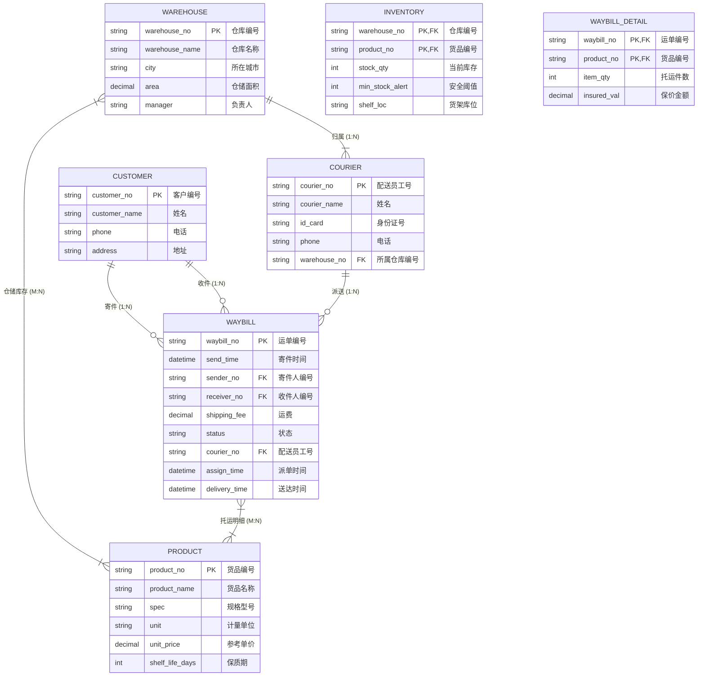

# 案例二：智慧物流仓储与配送调度系统 (E-R 与规范化精讲)

<Badge type="info" text="真题原型：仓储 WMS 与物流供应链调度模型" />
<Badge type="tip" text="主攻考点：M:N 联系独立建表 · 属性闭包计算 · 规范化 2NF/3NF 消除异常 · SQL 复合约束" />
<Badge type="danger" text="及格保底：13 ~ 15 分 (核心得分盘)" />

::: tip 🎯 案例背景与训练目标
本案例基于全国软考下午试题二现代智慧物流综合管理平台真题原型改编。系统涵盖多级仓库网点、SKU 货品、客户寄派件、运单托运明细与配送员派件调度，重点考查：
1. 分析仓储与运单复杂业务场景下的实体联系类型（1:N 与 M:N）；
2. 准确推导带联系属性的 M:N 关系模式（库存模式与运单明细模式）；
3. 运用属性闭包算法 $X^+$ 准确计算复合候选键；
4. 剖析混合模式中的非主属性部分依赖与传递依赖，熟练掌握分解为 3NF 的标准步骤；
5. 书写 SQL 数据定义语句中的主外键、唯一约束与业务检查规则。
:::

---

## 一、 试题情境与业务需求说明

某大型智慧物流企业为应对高并发、多网点调度的全链路流转，设计了物流仓储与智能配送调度系统。其核心业务功能描述如下：

1. **网点与仓库管理**：
   - 企业在全国设立多个分拣转运中心（仓库），每个仓库具有：仓库编号、仓库名称、所在城市、仓储面积与负责人姓名。一个仓库可存放多种货品，一种货品可同时存放在不同仓库中。仓库与货品之间需记录当前**库存数量**、**安全库存下限**以及**具体货架库位编号**。
2. **货品 (SKU) 信息管理**：
   - 货品基本信息包括：货品编号、货品名称、规格型号、计量单位、参考单价与保质期天数。
3. **客户寄件与运单处理**：
   - 客户包含寄件人与收件人，客户信息包括：客户编号、姓名、联系电话与默认地址。
   - 客户下单后系统生成唯一的**运单**，包含：运单编号、寄件时间、寄件人编号、收件人编号、运输费用与运输状态（待揽收、运输中、派送中、已签收）。一张运单可托运多种货品，一种货品可出现在多张运单中。运单托运货品时，必须记录每种货品的**托运件数**与**保价金额**。
4. **配送员与派送调度**：
   - 配送员基本信息包括：工号、姓名、身份证号、联系电话与所属仓库编号。一个仓库有多名配送员，每名配送员固定归属于一个仓库。
   - 运单进入“派送中”后，系统调度配送员进行末端派送。每张运单由一名配送员完成派送，一名配送员可负责派送多张运单。派送记录需记载派单时间、送达时间与客户签收码。

---

## 二、 概念结构模型（Mermaid E-R 图谱）

根据系统需求说明，系统分析师建立了如下实体关系模型：



---

## 三、 逻辑结构模型（待补全关系模式）

系统分析师拟定的初始关系模式设计如下（括号内部分属性待补全）：

1. **仓库模式**：Warehouse（<u>仓库编号</u>，仓库名称，所在城市，仓储面积，负责人）
2. **货品模式**：Product（<u>货品编号</u>，货品名称，规格型号，计量单位，参考单价，保质期天数）
3. **客户模式**：Customer（<u>客户编号</u>，姓名，联系电话，地址）
4. **配送员模式**：Courier（<u>配送员工号</u>，姓名，身份证号，联系电话，*(a)*）
5. **仓储库存模式**：Inventory（*(b)*，当前库存数量，安全库存下限，货架库位编号）
6. **运单模式**：Waybill（<u>运单编号</u>，寄件时间，*(c)*，运输费用，运输状态，派单时间，送达时间）
7. **运单明细模式**：WaybillDetail（*(d)*，托运件数，保价金额）

---

## 四、 考场设问与检索式自测 (Active Recall Drill)

### 问题 1：识别实体联系与联系类型（4分）
结合系统说明，请回答下列问题：
1. 实体“仓库”与实体“货品”之间的联系类型是什么（写作 `1:1`、`1:N` 或 `M:N`）？该联系对应的关系模式名称是什么？
2. 实体“运单”与实体“货品”之间的联系类型是什么？
3. 实体“运单”与实体“配送员”之间的联系类型是什么？
4. 客户实体在运单中充当了哪两种角色？

<details>
<summary>🔍 查看问题 1 标准答案与题眼解析</summary>

#### 标准答案：
1. 仓库与货品之间为 **`M:N`（多对多）** 联系；对应关系模式为 **仓储库存模式 (Inventory)**。
2. 运单与货品之间为 **`M:N`（多对多）** 联系。
3. 运单与配送员之间为 **`1:N`（一对多）** 联系（一名配送员可负责多张运单，一张运单由一名配送员派送）。
4. 客户在运单中充当：**寄件人** 和 **收件人**。

#### 题眼解析与避坑提示：
- **库存是典型的多对多联系**：仓库不能直接并入货品，货品也不能直接并入仓库，库存包含两者的交互属性（库位号、库存量），必须独立成表；
- **客户实体的双重角色**：运单中同时包含 `寄件人编号` 和 `收件人编号`，两者均作为外键参照客户表的主键。
</details>

---

### 问题 2：补全逻辑关系模式中的缺失属性与外键（4分）
请补全第三节逻辑结构模型中的属性占位符 `(a)` 至 `(d)`。

<details>
<summary>🔍 查看问题 2 标准答案与转换推导</summary>

#### 标准答案：
- `(a)`：**仓库编号**（或：所属仓库编号）
- `(b)`：**仓库编号，货品编号**（或：`仓库编号, 货品编号`）
- `(c)`：**寄件人编号，收件人编号，配送员工号**（或：寄件人编号, 收件人编号, 派送员工号）
- `(d)`：**运单编号，货品编号**（或：`运单编号, 货品编号`）

#### 逐条推导逻辑：
- **`(a)` 推导**：仓库与配送员为 $1:N$ 联系，根据 1:N 转换律，必须将 1 端主键（仓库编号）并入 N 端配送员模式作为外键。
- **`(b)` 推导**：仓储库存为仓库与货品之间的 $M:N$ 联系，必须独立建表，两端主键组合成为该模式的主键与外键，即 `仓库编号, 货品编号`。
- **`(c)` 推导**：运单涉及寄件客户、收件客户（均为 $1:N$ 关联），以及配送员（$1:N$ 关联），因此运单模式必须包含三个外键：`寄件人编号`、`收件人编号`、`配送员工号`。
- **`(d)` 推导**：运单与货品为 $M:N$ 托运联系，运单明细必须独立建表，复合主键为 `运单编号, 货品编号`。
</details>

---

### 问题 3：主外键判定与规范化理论分析（4分）
1. 请给出补全后的 **运单明细模式 (WaybillDetail)** 的主键与外键；
2. 某实习工程师将仓库、货品与库存合并为如下单表模式：
   $$R(\text{仓库编号}, \text{货品编号}, \text{仓库名称}, \text{所在城市}, \text{货品名称}, \text{参考单价}, \text{库存数量})$$
   已知函数依赖集为：
   $$F = \{ \text{仓库编号} \to (\text{仓库名称}, \text{所在城市}), \text{货品编号} \to (\text{货品名称}, \text{参考单价}), (\text{仓库编号}, \text{货品编号}) \to \text{库存数量} \}$$
   - 请计算关系模式 $R$ 的候选码；
   - 关系模式 $R$ 属于第几范式？请详细说明理由；
   - 指出模式 $R$ 中存在哪些数据操作异常？
   - 请将模式 $R$ 规范化分解为满足 3NF 的关系模式集合。

<details>
<summary>🔍 查看问题 3 标准答案与规范化演算</summary>

#### 标准答案：
1. **WaybillDetail 模式**：
   - **主键**：`(运单编号, 货品编号)`；
   - **外键**：`运单编号`（参照 Waybill 模式），`货品编号`（参照 Product 模式）。
2. **模式 $R$ 规范化分析**：
   - **候选码**：**`(仓库编号, 货品编号)`**
     > **推导**：`仓库编号` 和 `货品编号` 只出现在依赖左侧（L类属性），其闭包 `(仓库编号, 货品编号)+ = U`，因此是唯一的极小候选码。
   - **范式级别**：**第一范式（1NF）**。
     > **理由**：
     > 候选码为 `(仓库编号, 货品编号)`，是非单属性的复合主键。
     > 存在非主属性对候选码的**部分函数依赖**：
     > - $\text{仓库编号} \to (\text{仓库名称}, \text{所在城市})$（仓库信息只依赖主键中的仓库编号）；
     > - $\text{货品编号} \to (\text{货品名称}, \text{参考单价})$（货品信息只依赖主键中的货品编号）。
     > 由于存在非主属性对码的部分函数依赖，不满足 2NF，故属于 1NF。
   - **存在的数据操作异常**：
     1. **数据冗余**：同一个仓库每存放一种货品，仓库名称和城市就重复存储一次；
     2. **插入异常**：若新建了一个仓库但尚未存放任何货品，由于货品编号为主键的一部分不能为空，导致新仓库无法录入系统；
     3. **删除异常**：若某仓库清仓删除所有货品记录，会导致该仓库本身的基础信息（名称、城市）也被连带误删；
     4. **修改异常**：若某货品调整参考单价，必须遍历修改该货品在所有仓库的库存行，容易造成数据不一致。
   - **3NF 规范化分解方案**：
     将部分依赖的属性剥离独立成表，消除部分依赖：
     - $R_1(\text{仓库编号}, \text{仓库名称}, \text{所在城市})$，主键为 `仓库编号`，达 3NF；
     - $R_2(\text{货品编号}, \text{货品名称}, \text{参考单价})$，主键为 `货品编号`，达 3NF；
     - $R_3(\text{仓库编号}, \text{货品编号}, \text{库存数量})$，主键为 `(仓库编号, 货品编号)`，外键为仓库编号和货品编号，消除部分依赖，达 3NF。
</details>

---

### 问题 4：SQL 约束与数据定义语言 (DDL) 填空（3分）
根据系统需求，使用 SQL 语句创建“运单明细表 (WaybillDetail)”。请补全空缺代码 `[空 1]` 至 `[空 3]`。
- **业务约束**：
  1. 主键由运单编号与货品编号联合构成；
  2. 货品编号外键参照 Product 表的货品编号；
  3. 托运件数必须大于 0，保价金额必须大于或等于 0.00 元。

```sql
CREATE TABLE WaybillDetail (
    waybill_no   VARCHAR(32)   NOT NULL,
    product_no   VARCHAR(20)   NOT NULL,
    item_qty     INT           NOT NULL,
    insured_val  DECIMAL(10,2) DEFAULT 0.00,

    -- 复合主键定义
    [空 1],

    -- 外键定义
    CONSTRAINT fk_wd_waybill FOREIGN KEY (waybill_no) REFERENCES Waybill(waybill_no) ON DELETE CASCADE,
    [空 2],

    -- 托运件数与保价金额业务约束
    [空 3]
);
```

<details>
<summary>🔍 查看问题 4 标准答案与代码精解</summary>

#### 标准答案：
- `[空 1]`：`PRIMARY KEY (waybill_no, product_no)`
- `[空 2]`：`CONSTRAINT fk_wd_product FOREIGN KEY (product_no) REFERENCES Product(product_no)`
- `[空 3]`：`CHECK (item_qty > 0 AND insured_val >= 0.00)`

#### 填空采分关键：
- **`[空 1]`**：复合主键标准格式 `PRIMARY KEY (waybill_no, product_no)`；
- **`[空 2]`**：外键关键字 `FOREIGN KEY (product_no) REFERENCES Product(product_no)`；
- **`[空 3]`**：检查约束 `CHECK`，条件严格依据题干“件数大于 0”（`item_qty > 0`）与“保价大于等于 0”（`insured_val >= 0.00`），用 `AND` 连接。
</details>
