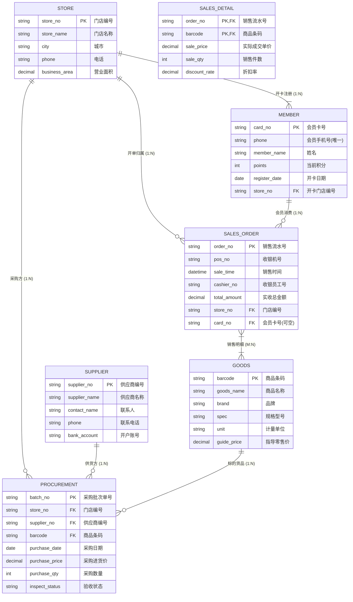

# 案例三：连锁超市会员销售与供应链系统 (E-R 与规范化精讲)

<Badge type="info" text="真题原型：新零售 ERP、会员积分与供应链采购模型" />
<Badge type="tip" text="主攻考点：三元联系转换 · BCNF 深度判定 · 无损连接充要条件 · SQL 视图与级联规则" />
<Badge type="danger" text="及格保底：13 ~ 15 分 (冲刺满分)" />

::: tip 🎯 案例背景与训练目标
本案例基于全国软考下午试题二典型的大型连锁零售与供应链管理真题原型改编。系统涵盖连锁门店、多级供应商、商品 SKU、会员顾客、收银流水小票以及采购供货三元业务联系，重点考查：
1. 掌握三元联系（门店-供应商-商品）与二元联系（销售明细）在 E-R 图中的规范表达；
2. 遵循多元联系与 1:N/M:N 转换铁律，准确推导关系模式复合主键与外键；
3. 深入理解候选码多解性与 BCNF（巴克斯范式）判定规则；
4. 熟练运用模式分解的**无损连接（Lossless Join）充要条件**公式进行数学证明；
5. 书写包含 `CREATE VIEW`、多表关联、级联更新 `ON UPDATE CASCADE` 与受限删除 `ON DELETE RESTRICT` 的标准 SQL 语句。
:::

---

## 一、 试题情境与业务需求说明

某大型跨区域连锁超市集团为整合线上线下一体化运营，决定全面升级其会员销售与供应链采购核心数据库。主要业务场景与模型规范如下：

1. **连锁门店与基础资料**：
   - 集团拥有分布在各城市的多个直营连锁门店。门店信息包括：门店编号、门店名称、所在城市、门店电话与营业面积。
2. **供应商与采购供货（三元联系）**：
   - 供应商信息包括：供应商编号、供应商名称、联系人姓名、联系手机与开户银行账号。
   - 连锁超市各门店根据日常库存缺口，定期向指定供应商采购商品。采购涉及**门店**、**供应商**与**商品**三方实体：一个门店可从不同供应商处采购同一种商品；同一供应商可向不同门店供应同一种商品；同一种商品可由多个供应商供应给不同门店。每次采购需记录：采购批次单号、采购日期、**采购进货单价**、**采购数量**与**验收状态**（待验收、已入库、退货）。
3. **商品 (SKU) 信息管理**：
   - 商品信息包括：商品条码（69码，全国唯一）、商品名称、品牌、规格型号、计量单位与指导零售价。
4. **会员管理与积分规则**：
   - 顾客可在任一门店注册成为会员。会员信息包括：会员卡号（主键）、会员手机号（系统内全局唯一）、会员姓名、当前积分余额、开卡日期与开卡注册门店编号。每位会员只绑定一张会员卡和一个手机号。
5. **前台收银与销售小票**：
   - 顾客在门店收银台结账时，系统打印销售小票并生成收银流水。流水信息包括：销售流水号、收银机台号、销售时间、收银员工号、实收总金额、所属门店编号以及会员卡号（非会员结账时该项为空）。
   - 一张销售小票可包含多种商品，一种商品可在多张小票中售出。销售明细中必须记录每种商品的**实际成交单价**、**销售件数**与**折扣率**。

---

## 二、 概念结构模型（Mermaid E-R 图谱）

系统分析师结合上述业务描述，构建了包含多元联系的实体关系图：



---

## 三、 逻辑结构模型（待补全关系模式）

系统分析师拟定的初始关系模式设计如下（部分属性与外键待补全）：

1. **门店模式**：Store（<u>门店编号</u>，门店名称，所在城市，门店电话，营业面积）
2. **供应商模式**：Supplier（<u>供应商编号</u>，供应商名称，联系人姓名，联系手机，开户银行账号）
3. **商品模式**：Goods（<u>商品条码</u>，商品名称，品牌，规格型号，计量单位，指导零售价）
4. **会员模式**：Member（<u>会员卡号</u>，会员手机号，会员姓名，当前积分余额，开卡日期，*(a)*）
5. **销售小票模式**：SalesOrder（<u>销售流水号</u>，收银机台号，销售时间，收银员工号，实收总金额，*(b)*）
6. **销售明细模式**：SalesDetail（*(c)*，实际成交单价，销售件数，折扣率）
7. **采购供货模式**：Procurement（<u>采购批次单号</u>，*(d)*，采购日期，采购进货单价，采购数量，验收状态）

---

## 四、 考场设问与检索式自测 (Active Recall Drill)

### 问题 1：识别实体联系与多元联系转换（4分）
结合系统说明，请回答下列问题：
1. 实体“会员”与实体“销售小票”之间的联系类型是什么（写作 `1:1`、`1:N` 或 `M:N`）？
2. 实体“门店”、“供应商”与“商品”之间的采购联系属于几元联系？联系类型是什么？
3. 采购供货模式中，若没有设计专门的代理主键“采购批次单号”，根据业务定义，该模式的最小复合候选键应由哪些属性构成？

<details>
<summary>🔍 查看问题 1 标准答案与题眼解析</summary>

#### 标准答案：
1. 会员与销售小票之间为 **`1:N`（一对多）** 联系（一名会员可产生多张消费小票，一张小票最多关联一名会员）；
2. 属于 **三元联系**；联系类型为 **`M:N:P`（多对多对多）**；
3. 若无批次单号，最小复合候选键由：**`(门店编号, 供应商编号, 商品条码, 采购日期)`** 联合构成（若同一天允许对同一供货多次进货，还需加入时间戳或采购序号）。

#### 题眼解析与避坑提示：
- **三元联系分析**：对于某一个确定的门店和确定的商品，可以有多个供应商供货；对于某个供应商和商品，可以供货给多个门店。因此三方维度均为“多”，属于三元 $M:N:P$ 联系；
- **采购批次单号的作用**：工程实践中通常引入自增流水单号或 UUID（代理主键）简化三元复合主键。
</details>

---

### 问题 2：补全逻辑关系模式中的缺失属性与外键（4分）
请补全第三节逻辑结构模型中的属性占位符 `(a)` 至 `(d)`。

<details>
<summary>🔍 查看问题 2 标准答案与转换推导</summary>

#### 标准答案：
- `(a)`：**开卡门店编号**（或：门店编号）
- `(b)`：**门店编号，会员卡号**
- `(c)`：**销售流水号，商品条码**（或：`销售流水号, 商品条码`）
- `(d)`：**门店编号，供应商编号，商品条码**

#### 逐条推导逻辑：
- **`(a)` 推导**：门店与会员为 $1:N$ 联系，根据 1:N 转换律，必须将 1 端主键（门店编号）并入 N 端会员模式作为外键。
- **`(b)` 推导**：销售小票归属于具体门店（$1:N$），且可能关联会员消费（$1:N$），因此外键必须包含：`门店编号` 与 `会员卡号`。
- **`(c)` 推导**：销售小票与商品是 $M:N$ 关联，销售明细必须独立建表，主键由两端实体主键 `销售流水号, 商品条码` 联合构成。
- **`(d)` 推导**：采购供货为三元联系，必须包含三方实体的外键：`门店编号`、`供应商编号`、`商品条码`。
</details>

---

### 问题 3：候选码多解性、BCNF 与无损连接充要性证明（4分）
1. 在“会员模式 (Member)”中，已知每个会员卡号唯一分配给一人，每个手机号也只能注册一个会员账号。
   - 该模式存在几个候选码？分别是什么？
   - 该模式满足 BCNF 吗？请说明理由。
2. 设某采购核算临时模式为：
   $$R(\text{商品条码}, \text{供应商编号}, \text{进货价格}, \text{供应商名称})$$
   已知函数依赖集为：
   $$F = \{ (\text{商品条码}, \text{供应商编号}) \to \text{进货价格}, \text{供应商编号} \to \text{供应商名称} \}$$
   - 请指出 $R$ 的候选码并判定 $R$ 达到的最高范式级别（1NF/2NF/3NF/BCNF）；
   - 现将其分解为两个子模式：
     $$R_1(\text{商品条码}, \text{供应商编号}, \text{进货价格}), \quad R_2(\text{供应商编号}, \text{供应商名称})$$
     请运用**模式分解无损连接的充要条件公式**，数学推导证明该分解是否为无损连接。

<details>
<summary>🔍 查看问题 3 标准答案与数学严密推导</summary>

#### 标准答案：
1. **会员模式分析**：
   - **候选码个数**：**2 个**；
   - **具体候选码**：**`会员卡号`** 与 **`会员手机号`**；
   - **BCNF 判定**：**满足 BCNF**。
     > **理由**：
     > 该模式的函数依赖为：$\text{会员卡号} \to (\text{会员手机号}, \text{会员姓名}, \text{当前积分}, \text{开卡日期}, \text{门店编号})$，以及 $\text{会员手机号} \to (\text{会员卡号}, \text{会员姓名}, \text{当前积分}, \text{开卡日期}, \text{门店编号})$。每一个函数依赖的左部决定因素都是候选码（超码），消除了主属性和非主属性对码的任何依赖，因此完全符合 BCNF。
2. **模式 $R$ 规范化与无损连接证明**：
   - **候选码**：**`(商品条码, 供应商编号)`**；
   - **范式级别**：**第一范式（1NF）**（或未达 2NF）。
     > **理由**：候选码为复合主键，存在非主属性（供应商名称）对候选码的部分函数依赖：$\text{供应商编号} \to \text{供应商名称}$，不满足 2NF。
   - **无损连接充要条件数学推导证明**：
     根据两模式无损连接定理，分解 $\rho = \{ R_1, R_2 \}$ 具有无损连接的充要条件是：
     $$R_1 \cap R_2 \to (R_1 - R_2) \in F^+ \quad \text{或} \quad R_1 \cap R_2 \to (R_2 - R_1) \in F^+$$
     - 计算公共属性集：$R_1 \cap R_2 = \{ \text{供应商编号} \}$
     - 计算 $R_2$ 私有属性集：$R_2 - R_1 = \{ \text{供应商名称} \}$
     - 检查函数依赖：在 $F$ 中明确存在依赖 $\text{供应商编号} \to \text{供应商名称}$，即：
       $$R_1 \cap R_2 \to (R_2 - R_1) \in F^+$$
     - **结论**：条件成立，因此该模式分解**必定是无损连接分解**（不会发生信息丢失或伪元组）。
</details>

---

### 问题 4：SQL 视图创建与完整性约束填空（3分）
为了满足财务部门快速查询“会员在各门店消费汇总”的需求，DBA 决定创建一个数据库视图 `MemberSalesSummary`，统计每位会员在各个门店的累计消费金额与消费次数。同时，为了防止误删门店导致会员数据异常，对外键设置级联规则。
请补全下列 SQL 脚本中的 `[空 1]` 至 `[空 3]`。

```sql
-- 1. 创建会员在各门店消费汇总视图
CREATE VIEW MemberSalesSummary AS
SELECT 
    m.card_no,
    m.member_name,
    s.store_no,
    s.store_name,
    [空 1] AS total_spent,
    COUNT(so.order_no) AS order_count
FROM Member m
JOIN SalesOrder so ON m.card_no = so.card_no
JOIN Store s ON so.store_no = s.store_no
GROUP BY 
    [空 2];

-- 2. 完善销售小票表对外键引用的约束规则
-- 要求：当门店编号变更时小票表自动同步更新，但当门店下存在小票时禁止删除该门店
ALTER TABLE SalesOrder 
ADD CONSTRAINT fk_sales_store 
FOREIGN KEY (store_no) REFERENCES Store(store_no) 
[空 3];
```

<details>
<summary>🔍 查看问题 4 标准答案与代码精解</summary>

#### 标准答案：
- `[空 1]`：`SUM(so.total_amount)`
- `[空 2]`：`m.card_no, m.member_name, s.store_no, s.store_name`
- `[空 3]`：`ON UPDATE CASCADE ON DELETE RESTRICT`（或：`ON UPDATE CASCADE ON DELETE NO ACTION`）

#### 填空采分关键：
- **`[空 1]` 聚合函数**：计算累计消费金额，标准 SQL 语法为 `SUM(so.total_amount)`；
- **`[空 2]` 分组 GROUP BY**：SQL 语法规定，`SELECT` 中所有非聚合函数字段必须全部列在 `GROUP BY` 子句中，因此包含卡号、姓名、门店号、门店名；
- **`[空 3]` 外键动作联动**：“门店编号变更时小票表自动同步更新”对应 `ON UPDATE CASCADE`；“存在小票时禁止删除该门店”对应 `ON DELETE RESTRICT`（或 `ON DELETE NO ACTION`）。
</details>
