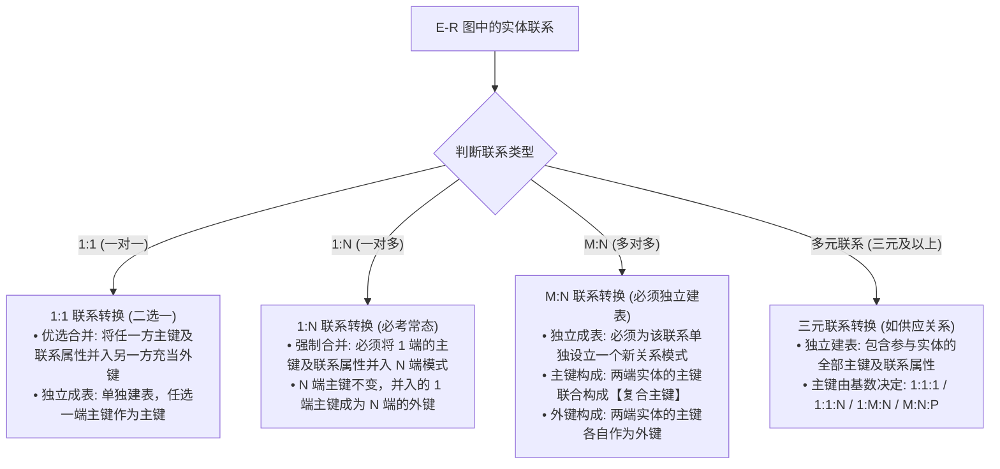
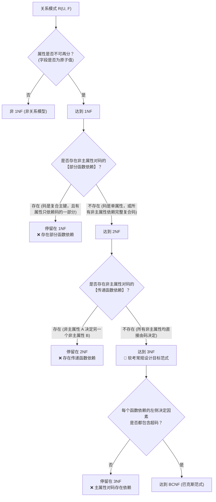

# 试题二：数据库系统设计 (E-R 模型与 SQL) 万能解题法则与核心方法论

<Badge type="info" text="题型定位：必答题 · 分值: 15 分" />
<Badge type="tip" text="保底目标：12 ~ 14 分 (核心得分盘)" />
<Badge type="danger" text="核心铁律：E-R 转换三大法则 · 复合主外键识别 · 规范化 1NF/2NF/3NF 秒杀" />

::: tip 🎯 试题二战略通关定位
试题二考查考生从**概念结构设计（E-R 模型）**到**逻辑结构设计（关系模式规范化）**的完整工程映射能力，是全卷除 DFD 外提分确定性最高、模式最严谨的 15 分核心得分盘。

根据历年真题命题规律，考查内容呈现高度固化的“四步连环问”：
1. **补全 E-R 图**（补充实体、联系或联系类型 1:1, 1:N, M:N）；
2. **补全关系模式**（补充缺失的属性或外键）；
3. **识别主键与外键**（利用候选键定义或属性闭包算法推导）；
4. **规范化理论辨析与 SQL 填空**（判断范式级别、指出依赖类型、模式分解、书写主外键及约束 SQL）。

配套导航：[📖 下午题门户](/pm-application/) | [📐 案例一：高校教务排课](./01-case-academic-scheduling) | [📐 案例二：智慧物流仓储](./02-case-smart-logistics) | [📐 案例三：连锁超市销售](./03-case-retail-membership)
:::

---

## 一、 试题二本质解构与考场设问模型

试题二题干通常给出一个 600~1000 字的企事业单位业务系统说明，并附带一张待完善的 **E-R 图** 与一组待完善的 **关系模式**。历年 4 问标准分值与采分点如下：

| 设问序号 | 考查核心要点 | 分值 | 采分标准与失分红线 | 备考对策 |
| :---: | :--- | :---: | :--- | :--- |
| **问题 1** | **补全 E-R 图**（实体/联系/联系类型） | 3 ~ 4分 | 实体名必须与题干完全一致；联系名需精准对应；**连线必须标注联系类型**（`1:1`、`1:n`、`m:n`），漏标类型扣一半分。 | 圈画题干主谓宾，实体通常为名词，联系通常为及物动词。 |
| **问题 2** | **补全关系模式**（补充属性与外键） | 4 ~ 5分 | 必须写清关系模式中缺失的属性全名。外键若由联系并入，需同时包含联系本身的属性。 | 牢记 E-R 转换三大铁律，缺什么外键补什么。 |
| **问题 3** | **指出关系模式的主键与外键** | 3 ~ 4分 | 主键若为复合主键，必须写完整所有组成属性（用括号或逗号连接）；外键必须指明来自哪个被参照关系的主键。 | 利用属性闭包算法推导候选键；外键检查跨表关联。 |
| **问题 4** | **规范化理论判定 / SQL 约束填空** | 3 ~ 4分 | 范式判断必须写明“第几范式”，并准确给出原因（部分依赖或传递依赖的具体依赖式）；SQL 语法严禁拼写错误。 | 掌握 1NF $\to$ 2NF $\to$ 3NF 判定树；熟记 DDL 常用约束。 |

---

## 二、 E-R 模型向关系模式转换三大铁律

E-R 图向关系模型的转换是试题二的第一核心抓手。实体一律转换为独立关系模式，而**联系的转换方式完全由其联系类型（映射基数）决定**：



### 2.1 一对一联系 ($1:1$) 转换法则
* **法则 A（合并至任意一方，最常用）**：
  将联系与其中任意一方实体对应的关系模式合并。合并后，**在被合并的一方模式中加入另一方实体的主键作为外键**，并加入联系本身的属性。
  > **示例**：班级与班长（$1:1$）。
  > - 方案 1：班级（<u>班级编号</u>, 班级名称, 班长学号, 任职时间），其中“班长学号”为外键；
  > - 方案 2：学生（<u>学号</u>, 姓名, 所属班级编号, 班级名称），但通常按方案 1 合并更符合现实业务直觉。
* **法则 B（独立建表）**：
  若该联系独立转换成一个关系模式，其属性包括两端实体的主键及联系自身的属性。**两端实体的主键均是该模式的候选键，任选其一作为主键，另一端作为唯一外键**。

### 2.2 一对多联系 ($1:N$) 转换法则
* **法则 A（合并至 $N$ 端，软考必考送分点）**：
  必须将联系与 **$N$ 端（多端）**实体对应的关系模式合并！
  - **$N$ 端模式原主键保持不变**；
  - **将 $1$ 端实体的主键并入 $N$ 端模式，作为 $N$ 端的外键**；
  - 若联系本身带有属性（如任职时间、入库日期），该属性也**一并并入 $N$ 端模式**。
  > **示例**：部门（1）与员工（N）。
  > - 部门模式（<u>部门编号</u>, 部门名称, 办公地点）
  > - 员工模式（<u>员工号</u>, 姓名, 岗位, 入职时间, **部门编号**），其中“部门编号”为外键。
* **法则 B（独立建表）**：
  较少使用。若独立建表，该模式的主键为 **$N$ 端实体的主键**，两端实体主键均充当外键。

### 2.3 多对多联系 ($M:N$) 转换法则
* **法则（绝对铁律：必须独立建表）**：
  多对多联系**绝不能与任何一方实体合并**，必须独立转换为一个关系模式！
  - **模式属性**：两端实体的主键，加上联系本身的全部属性；
  - **主键确定**：**两端实体的主键联合构成该模式的【复合主键】（联合主键）**；
  - **外键确定**：两端实体的主键分别作为外键，分别参照各自实体关系模式的主键。
  > **示例**：学生（M）与课程（N）的“选课”联系，联系带属性“成绩”。
  > - 选课记录（<u>学号, 课程号</u>, 成绩, 选课学期）
  > - 主键：`(学号, 课程号)` 复合主键；
  > - 外键：`学号` 参照学生表，`课程号` 参照课程表。

### 2.4 三元及多元联系转换口诀
若一个联系涉及三个实体（如“供应商、工程项目、零件”之间的“供应”联系）：
1. **$M:N:P$ 联系**：独立建表，主键为**三方实体主键的全部组合**（复合主键）。
2. **$1:M:N$ 联系**：独立建表，主键为**两个多端实体主键的组合**（即 $M$ 端主键 + $N$ 端主键），$1$ 端主键作为普通外键并入。
3. **$1:1:N$ 联系**：独立建表，主键为 **$N$ 端实体的主键**，其余两方主键作为普通外键并入。

---

## 三、 主键与外键推导法（属性闭包算法）

在试题二问题 2 和问题 3 中，常要求指出模式的主键和外键。对于复杂依赖关系，必须通过**属性闭包算法**进行严谨推导。

### 3.1 属性分类法则（L / R / N / LR 分类法）
设关系模式为 $R(U, F)$，属性集为 $U$，函数依赖集为 $F$。将所有属性分为四类：

| 属性类别 | 定义特征 | 在候选码中的地位 | 推导策略 |
| :---: | :--- | :--- | :--- |
| **L 类 (Left)** | **仅在依赖左侧出现**，右侧从未出现 | **必定属于候选码**！ | 必须作为候选码的初始核心属性。 |
| **R 类 (Right)** | **仅在依赖右侧出现**，左侧从未出现 | **绝不可能属于候选码**！ | 直接从候选码候选集中剔除，不参与组合。 |
| **N 类 (Neither)** | **在依赖两侧均未出现**（孤立属性） | **必定属于候选码**！ | 任何属性都推不出它，它也推不出别人，必须入选。 |
| **LR 类 (Both)** | **在依赖两侧均有出现** | **可能属于候选码** | 需与 L 类、N 类属性组合，测试其属性闭包是否覆盖全集 $U$。 |

### 3.2 属性闭包推导四步法
1. **第一步：提取必定在候选码中的属性集合** $X_0 = L \cup N$；
2. **第二步：计算闭包** $X_0^+$：
   - 设当前闭包集合 $B = X_0$；
   - 遍历 $F$ 中每个依赖 $Y \to Z$，若 $Y \subseteq B$，则将 $Z$ 并入 $B$（即 $B = B \cup Z$）；
   - 重复遍历，直到 $B$ 不再扩大；
3. **第三步：判断是否覆盖全集**：
   - 若 $X_0^+ = U$，则 $X_0$ 就是该关系模式唯一的**最小候选码**（主键）；
   - 若 $X_0^+ \neq U$，则将 LR 类中的属性逐个与 $X_0$ 组合，分别求闭包，直至找到所有能使闭包等于 $U$ 的极小属性组合。

---

## 四、 规范化理论快速判定口诀与递进判定树

规范化理论是下午试题二的“试金石”。掌握以下递进判定树，可在 30 秒内秒杀范式级别：



### 4.1 范式核心判定口诀表

| 范式级别 | 核心约束条件 | 考场快速秒杀识别法 | 典型反例与结构缺陷 |
| :---: | :--- | :--- | :--- |
| **1NF** | 属性原子性（不可再分） | 表格无嵌套表、无多值字段 | 某字段存储“家庭住址与电话”复合字符串。 |
| **2NF** | 在 1NF 基础，**消除非主属性的部分依赖** | **单属性主键必达 2NF**！<br/>复合主键才需警惕。 | 模式 `(学号, 课程号, 姓名, 成绩)`：<br/>主键为 `(学号, 课程号)`，但 `学号 -> 姓名`，姓名只依赖一部分主键（部分依赖）。 |
| **3NF** | 在 2NF 基础，**消除非主属性的传递依赖** | 检查是否有**非主属性决定另一个非主属性** | 模式 `(学号, 系号, 系主任)`：<br/>`学号 -> 系号` 且 `系号 -> 系主任`，非主属性“系主任”传递依赖于学号。 |
| **BCNF** | 在 3NF 基础，**消除主属性对码的部分与传递依赖** | 检查**所有依赖的左侧是否全部是候选码** | 模式 `STJ(S, T, J)`，候选码为 `(S, J)` 和 `(T, J)`，存在依赖 `T -> J`，左侧 `T` 不是码。 |

> [!IMPORTANT] 考场必杀技：单属性主键定律
> 若关系模式的主键是**单一属性**（非复合主键），只要该模式满足 1NF，则**它必定自动满足 2NF**！因为只有一个属性的主键不可能被“部分依赖”。此时只需核查是否存在传递依赖即可判断是否达到 3NF。

---

## 五、 模式分解三大定理与无损连接判定

当关系模式因存在部分依赖或传递依赖而产生数据冗余、更新异常时，必须进行**模式分解**。

### 5.1 无损连接（Lossless Join）充要条件判定
将关系模式 $R(U, F)$ 分解为两个子模式 $\rho = \{ R_1, R_2 \}$。
该分解具有**无损连接**的充要条件是：
$$R_1 \cap R_2 \to (R_1 - R_2) \in F^+ \quad \text{或} \quad R_1 \cap R_2 \to (R_2 - R_1) \in F^+$$

* **通俗口诀**：**两个子模式的公共属性集，必须能够决定其中某一个子模式的私有属性集**（即公共属性必须是其中一个子模式的超码）！
* 若公共属性是 $R_1$ 或 $R_2$ 的码，则分解必定无损连接；若公共属性谁的码都不是，则分解必然是有损的（会产生伪元组）。

### 5.2 保持函数依赖（Preserving Functional Dependencies）
模式分解后，原关系依赖集 $F$ 中的每一个函数依赖 $X \to Y$，都能够在分解后的某个子关系模式上直接得以验证，或者由各子模式依赖的并集闭包推导出来，即：
$$(\bigcup_{i=1}^{k} F_i)^+ = F^+$$
> [!TIP] 范式分解折中定律
> - 任何一个模式总可以分解为 **保持依赖且无损连接的 3NF**；
> - 任何一个模式总可以分解为 **无损连接的 BCNF**，但不一定能同时保持函数依赖！

---

## 六、 常用 SQL 约束与 DDL 真题填空模板

试题二问题 4 经常涉及关系模式表结构的 SQL DDL 创建语句填空。考场必须熟练书写标准语法：

```sql
CREATE TABLE CourseSelection (
    -- 1. 字段类型与非空约束
    student_id   VARCHAR(20)  NOT NULL,
    course_id    VARCHAR(20)  NOT NULL,
    score        DECIMAL(5,2),
    selected_at  DATETIME     DEFAULT CURRENT_TIMESTAMP,
    status       VARCHAR(10)  DEFAULT '已选' CHECK (status IN ('已选', '退选', '已结课')),

    -- 2. 复合主键定义 (考点: 表级主键约束)
    PRIMARY KEY (student_id, course_id),

    -- 3. 外键与参照完整性 (考点: FOREIGN KEY 与 REFERENCES 及级联操作)
    CONSTRAINT fk_cs_student FOREIGN KEY (student_id) 
        REFERENCES Student(student_id) 
        ON DELETE CASCADE 
        ON UPDATE CASCADE,

    CONSTRAINT fk_cs_course FOREIGN KEY (course_id) 
        REFERENCES Course(course_id) 
        ON DELETE RESTRICT,

    -- 4. 业务检查约束 (考点: 成绩取值范围检查)
    CONSTRAINT chk_score CHECK (score >= 0.0 AND score <= 100.0)
);
```

### 6.1 常用 SQL 约束填空速查表

| 约束关键字 | 语法格式 | 核心作用与语义 | 真题填空典型题眼 |
| :--- | :--- | :--- | :--- |
| `PRIMARY KEY` | `PRIMARY KEY (col1, col2)` | 实体完整性，唯一且不可为空 | 复合主键必须在字段列表末尾通过表级约束定义 |
| `FOREIGN KEY ... REFERENCES` | `FOREIGN KEY (fk) REFERENCES T(pk)` | 参照完整性，关联父表主键 | 括号外写 `REFERENCES 父表名(父表主键)` |
| `ON DELETE CASCADE` | 附在外键约束后 | 级联删除：父表记录删除时子表联动删除 | 题干说明“学生退学后其选课记录自动清除” |
| `ON DELETE SET NULL`| 附在外键约束后 | 置空删除：父表删除时子表外键置为 NULL | 题干说明“部门撤销后该部门员工暂不分配部门” |
| `CHECK` | `CHECK (表达式)` | 用户自定义完整性，校验字段值合法性 | `CHECK (Gender IN ('男', '女'))` 或数值区间判断 |
| `NOT NULL` | 字段类型后跟 `NOT NULL` | 禁止为空值 | 必填字段、核心编号属性 |
| `UNIQUE` | 字段类型后或表级 `UNIQUE (col)` | 唯一性约束，允许出现单个 NULL | 身份证号、手机号等非主键唯一标识 |

---

## 七、 机考作答书写规范与避坑防线

1. **主键表示法**：在文本作答框中回答主键时，若无法画下划线，必须明确使用文字标注，格式如：
   - `主键：(学号, 课程号)`
   - `外键：学号 (参照学生表)，课程号 (参照课程表)`
2. **关系模式补全格式**：补充关系模式属性时，按照原题目命名填入，切勿自造同义词。例如题目已定义实体属性为 `dept_no`，补全时切勿写成 `系代码` 或 `department_id`。
3. **范式原因作答模板**：
   - 答停留在 1NF 的原因：`因为存在非主属性 [属性名] 对主键 [复合主键] 的部分函数依赖，具体依赖式为：[主键部分属性] -> [非主属性]`；
   - 答停留在 2NF 的原因：`因为存在非主属性 [属性名] 对主键的传递函数依赖，具体依赖式为：[主键] -> [属性A] 且 [属性A] -> [非主属性]`。
