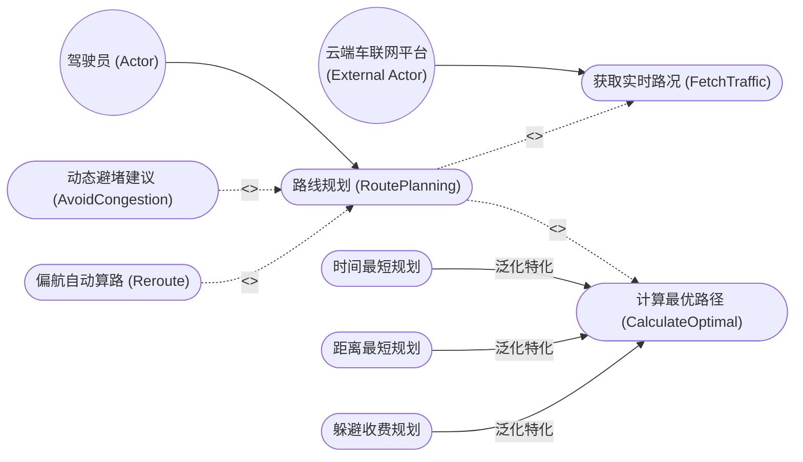
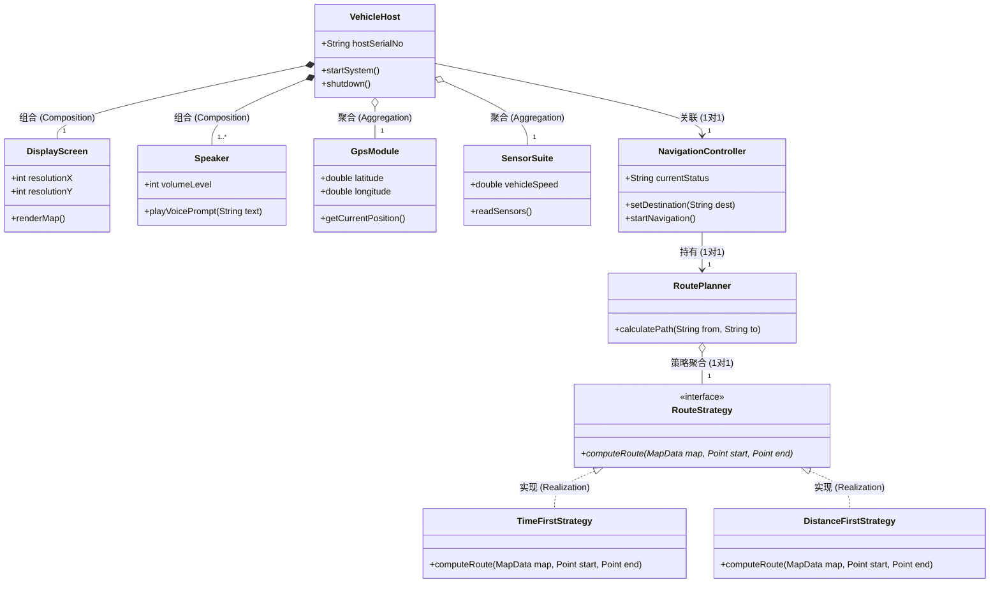
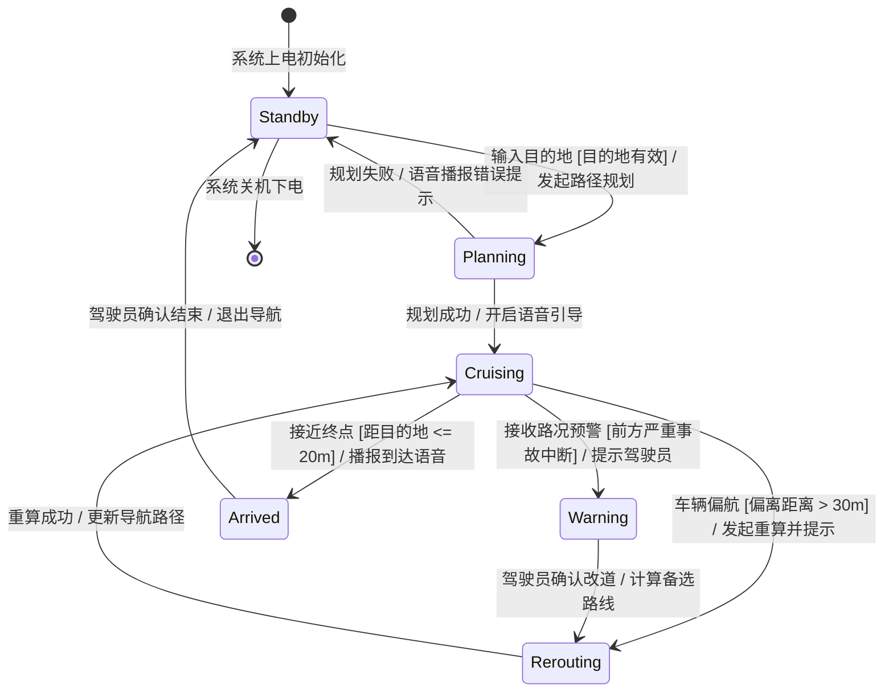

# 案例一：智能车载导航与高级驾驶辅助系统 (UML 类图与状态机精讲)

<Badge type="info" text="真题原型：车联网智能座舱与 ADAS 驾驶辅助系统" />
<Badge type="tip" text="主攻考点：用例三大关系 · 聚合与组合辨析 · 多重度推导 · 状态机守卫条件" />
<Badge type="danger" text="及格保底：13 ~ 15 分 (冲刺满分)" />

::: tip 🎯 案例背景与训练目标
本案例基于全国软考下午试题三近年来高频出现的“智能物联网/车载嵌入式系统”真题原型改编。系统涵盖多模态交互、多传感器数据采集、高精地图算路以及车载导航复杂状态机，重点考查：
1. 快速辨析用例图中的参与者，精准判定包含 (`<<include>>`)、扩展 (`<<extend>>`) 与泛化关系；
2. 依据生命周期绑定特征，准确判定类图中的**聚合（空心菱形）**与**组合（实心菱形）**；
3. 双向独立推导类间关联的多重度取值；
4. 剖析状态机图中状态跃迁的“事件 - 守卫条件 - 动作”三元组。
:::

---

## 一、 试题情境与业务需求说明

某汽车制造集团为量产下一代新能源汽车，研发了一套智能车载导航与驾驶辅助系统 (In-Vehicle Navigation and ADAS)。系统的核心业务功能说明如下：

1. **多方参与者与交互**：
   - **驾驶员**通过中控触控屏或语音助手输入导航目的地并启动导航。
   - **智能语音引擎**（外部交互服务）负责接收驾驶员语音指令，并在行车过程中提供实时语音路况播报。
   - **云端车联网服务平台**（外部服务）为系统持续推送高精地图增量数据、实时拥堵路况及突发恶劣天气预警。
2. **导航用例与行为建模**：
   - 驾驶员发起“路线规划 (RoutePlanning)”用例。在规划路线过程中，系统**必须**执行“获取实时路况 (FetchTrafficInfo)”以及“计算最优路径 (CalculateOptimalRoute)”；
   - 在路径计算完成后，若系统检测到前方道路突发事故或拥堵指数过高，系统可**可选触发**“动态避堵方案建议 (AvoidCongestion)”用例向驾驶员推荐备选路线；若行车中车辆驶离规定航线，系统将**可选触发**“偏航自动重新算路 (Reroute)”用例；
   - “计算最优路径”用例根据策略不同，具体划分为“时间最短规划”、“距离最短规划”与“躲避收费规划”三种具体特化形式。
3. **车载硬件与核心软件类结构**：
   - **车载智能主机 (VehicleHost)** 严格由 1 个**高清中控显示屏 (DisplayScreen)** 和 1 到多个**立体声音频扬声器 (Speaker)** 组成。显示屏和扬声器是车载主机不可分割的硬件部件，若主机报废拆解，这些专用部件随之销毁；
   - 车载主机通过外部总线挂载接入了 1 个**高精 GPS 接收模块 (GpsModule)** 和 1 个**环境传感器套件 (SensorSuite)**。这些传感器属于可插拔外设，若主机关闭或更换，传感器仍可拆卸并独立使用；
   - 车载主机持有 1 个**导航控制器 (NavigationController)**。导航控制器关联了 1 个**路径规划器 (RoutePlanner)**；
   - 路径规划器聚合了**路线规划算法策略接口 (RouteStrategy)**，具体包含**时间优先策略 (TimeFirstStrategy)** 与**距离优先策略 (DistanceFirstStrategy)** 两个实现类；
   - 高精地图数据包含多条**道路区段 (RoadSegment)**，每个道路区段包含 2 个**道路节点 (RoadNode)**（起点与终点）。
4. **导航控制器生命周期状态机**：
   - 导航控制器初始处于**待机就绪 (Standby)** 状态；
   - 驾驶员确认目的地后，触发“规划路线”事件，系统进入**规划中 (Planning)** 状态；
   - 规划成功后，触发“开始导航”事件，进入**巡航引导 (Cruising)** 状态；
   - 巡航过程中，若传感器检测到车辆偏移航线，且满足守卫条件 `[偏离距离 > 30m]`，触发进入**偏航重算 (Rerouting)** 状态；重算成功后自动返回“巡航引导”状态；
   - 巡航过程中，若收到云端推送的严重事故警报，且满足守卫条件 `[前方道路中断]`，触发进入**紧急改道警告 (Warning)** 状态；
   - 当车辆抵达目的地设定半径范围内，满足守卫条件 `[距目的地 <= 20m]`，进入**到达终点 (Arrived)** 状态，随后结束导航回到待机状态。

---

## 二、 概念结构模型（Mermaid UML 矢量图谱）

### 2.1 系统用例图 (Use Case Diagram)

### 2.2 核心类图 (Class Diagram)

### 2.3 导航状态机图 (State Machine Diagram)

---

## 三、 考场设问与检索式自测 (Active Recall Drill)

### 问题 1：用例识别与用例关系判定（4分）
结合系统需求说明，请回答下列关于用例模型的问题：
1. 图 2-1 中，“云端车联网平台”属于什么类型的参与者？
2. 试说明“路线规划”与“获取实时路况”之间的关系类型是什么？“路线规划”与“动态避堵建议”之间的关系类型是什么？
3. 在绘制扩展关系连线时，虚线箭头的起始端与指向端有何严格规定？
4. “时间最短规划”与“计算最优路径”之间属于什么 UML 关系？

🔍 查看问题 1 标准答案与题眼解析

#### 标准答案：
1. **系统外部参与者**（或：外部系统参与者 / Secondary Actor）。
2. - “路线规划”与“获取实时路况”之间为 **包含关系 (`<<include>>`)**；
   - “路线规划”与“动态避堵建议”之间为 **扩展关系 (`<<extend>>`)**。
3. 扩展关系的虚线箭头必须**由扩展用例指向基础用例**（即：从“动态避堵建议”指向“路线规划”）。
4. **泛化关系（继承关系 / Generalization）**。

#### 题眼解析与避坑提示：
- **必选 vs 可选**：题干明确指出“规划路线必须执行获取实时路况”，是典型的包含逻辑；“突发拥堵或偏航时可选推荐”属于条件触发的扩展逻辑；
- **扩展关系方向陷阱**：考场极易将扩展箭头反画。记住：基础用例不知道扩展用例的存在，是扩展用例向基础用例**注入**行为，故箭头由扩展用例指向基础用例！

---

### 问题 2：类图关系辨析（聚合 vs 组合）（4分）
在系统类图中：
1. “车载主机 (VehicleHost)”与“高清中控显示屏 (DisplayScreen)”之间是什么关系？在 UML 中使用什么图形符号表示？
2. “车载主机 (VehicleHost)”与“GPS 模块 (GpsModule)”之间是什么关系？在 UML 中使用什么图形符号表示？
3. 请从**生命周期**和**共享性**两个角度，详细阐述题中将显示屏设计为组合、将 GPS 模块设计为聚合的设计决策理由。

🔍 查看问题 2 标准答案与设计决策推导

#### 标准答案：
1. **组合关系 (Composition)**；UML 图元使用 **实心菱形（加实线）**，实心菱形置于整体端（VehicleHost）。
2. **聚合关系 (Aggregation)**；UML 图元使用 **空心菱形（加实线）**，空心菱形置于整体端（VehicleHost）。
3. **架构设计决策理由**：
   - **生命周期维度**：
     - **显示屏（组合）**：是车载主机的专用紧耦合内嵌部件，具有与主机**完全绑定的生命周期（同生共死）**。主机报废或销毁时，该定制显示屏随之消亡，无法独立脱离主机运行。
     - **GPS 模块（聚合）**：属于外部通用标准传感器部件，生命周期与主机**解耦**。主机断电或报废更换时，GPS 模块可独立拆卸并安装至其他车辆主机中继续使用。
   - **共享性与引用维度**：
     - 显示屏作为部分，同一时刻只能专属归属于唯一确定的主机实例；而 GPS 模块具有独立对象身份，符合聚合的弱拥有松耦合语义。

---

### 问题 3：类图多重度推导与设计模式识别（4分）
1. 请给出类图中下列类间关系的多重度（Multiplicity）：
   - “车载主机 (VehicleHost)”与“扬声器 (Speaker)”之间的多重度约束（写在扬声器端）；
   - “道路区段 (RoadSegment)”与“道路节点 (RoadNode)”之间的多重度约束（写在道路节点端）。
2. 在类图中，“路径规划器 (RoutePlanner)”聚合了“路线规划算法策略接口 (RouteStrategy)”，并拥有具体策略实现类。
   - 这里采用了哪种 GoF 设计模式？
   - 采用该设计模式的主要优点是什么？

🔍 查看问题 3 标准答案与设计模式精析

#### 标准答案：
1. **多重度推导**：
   - 车载主机与扬声器端的多重度为：**`1..*`**（或：`1..多`，依据题干“1 到多个立体声扬声器”）；
   - 道路区段与道路节点端的多重度为：**`2`**（依据题干“每个道路区段包含 2 个道路节点（起点与终点）”）。
2. **设计模式识别与收益**：
   - 采用的设计模式为：**策略模式 (Strategy Pattern)**。
   - **核心优点**：
     1. **符合开闭原则 (OCP)**：未来新增算路策略（如“能耗最低策略”）时，只需扩展新的实现类，无需修改已有的路径规划器核心代码；
     2. **避免冗长的条件分支**：消除了大量 `if-else` 或 `switch` 算法选择分支，将算法封装在独立策略类中，易于单元测试与独立演化。

---

### 问题 4：状态机图状态、事件与守卫条件填空（3分）
结合系统说明中导航控制器的生命周期流转，请补充下列状态机图迁移过程中的缺失要素 `[空 1]` 至 `[空 3]`。
1. 从状态“规划中 (Planning)”流转至“巡航引导 (Cruising)”的触发事件是：`[空 1]`；
2. 从“巡航引导 (Cruising)”转移至“偏航重算 (Rerouting)”的守卫条件是：`[空 2]`；
3. 从“巡航引导 (Cruising)”转移至“到达终点 (Arrived)”的守卫条件是：`[空 3]`。

🔍 查看问题 4 标准答案与状态迁移解析

#### 标准答案：
- `[空 1]`：**规划成功**（或：计算路径完成 / 开启导航）
- `[空 2]`：**`[偏离距离 > 30m]`**（必须带方括号）
- `[空 3]`：**`[距目的地 <= 20m]`**（必须带方括号）

#### 填空采分关键：
- **`[空 1]` 事件名称**：状态迁移必须由具体业务事件触发，题干明确说明“规划成功后开始导航”；
- **`[空 2]` 与 `[空 3]` 守卫条件**：UML 规范规定守卫条件必须书写在**方括号 `[...]`** 内部，表示布尔谓词表达式。若漏写方括号扣 0.5 分。

