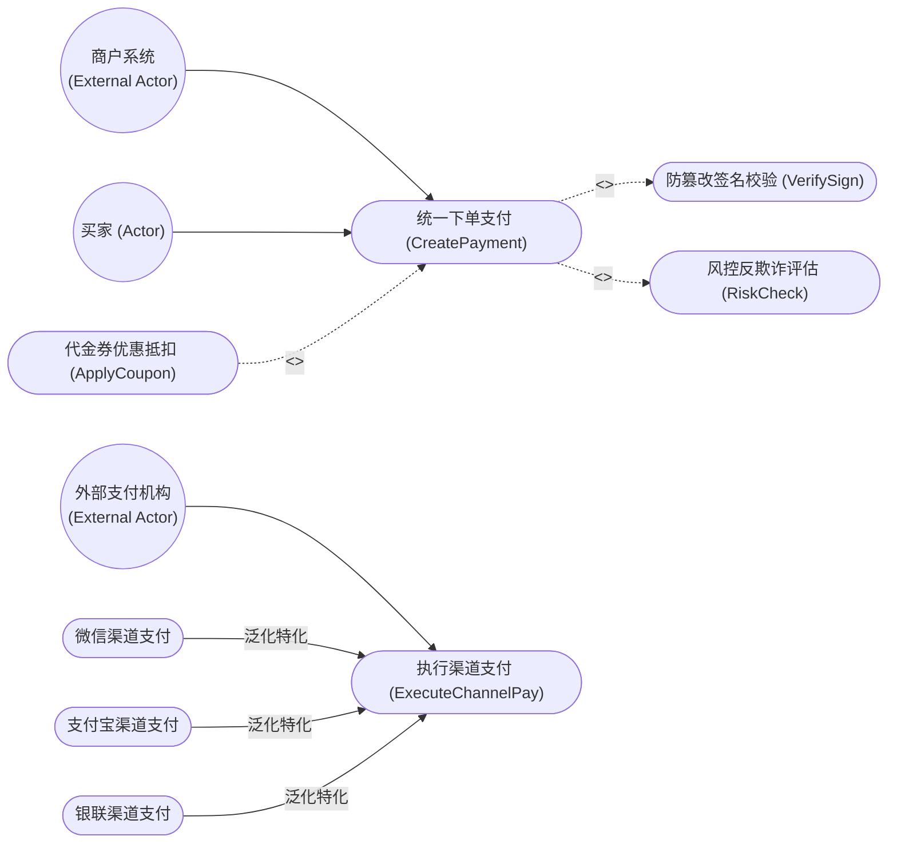
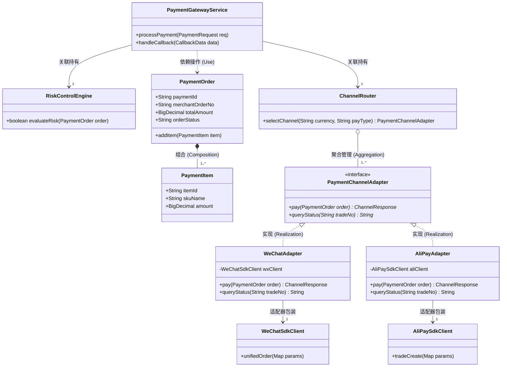
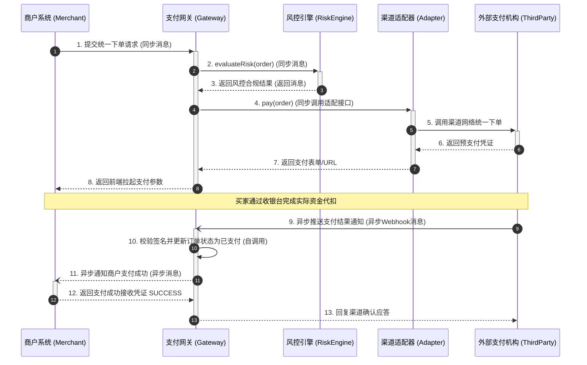

# 案例二：线上多渠道聚合支付网关系统 (UML 类图与时序图精讲)

<Badge type="info" text="真题原型：电商金融、第三方聚合支付与清结算平台模型" />
<Badge type="tip" text="主攻考点：类图结构建模 · 适配器模式映射 · 时序图消息时序 · 异步回调机制" />
<Badge type="danger" text="及格保底：13 ~ 15 分 (冲刺满分)" />

::: tip 🎯 案例背景与训练目标
本案例基于全国软考下午试题三近年来高频考察的“企业级聚合支付与清结算平台”真题原型改编。系统涵盖多渠道路由接入、风控前置拦截、统一交易适配以及多系统跨网络异步通知，重点考查：
1. 分析金融交易中用例的依赖、包含 (`<<include>>`) 与扩展 (`<<extend>>`) 关系；
2. 识别系统类图中的结构型设计模式（适配器模式 / 策略模式）；
3. 准确标记类图成员多重度与接口实现关系；
4. 深度掌握时序图 (Sequence Diagram) 中**同步调用、异步消息、返回消息及控制焦点 (Activation)** 的绘制与填空规则。
:::

---

## 一、 试题情境与业务需求说明

某大型跨境电商集团为统一管理微信支付、支付宝、银联云闪付及多国本地信用卡结算，研发了统一线上多渠道聚合支付网关系统 (Unified Payment Gateway)。系统核心业务说明如下：

1. **核心业务用例描述**：
   - **买家 (Customer)** 在电商收银台确认订单并点击“立即支付”；
   - **商户系统 (MerchantSystem)**（外部系统）向聚合支付网关提交统一下单请求；
   - 支付网关在处理“统一下单 (CreatePaymentOrder)”用例过程中，**必须**执行“交易签名防篡改校验 (VerifySignature)”与“风控与反欺诈评估 (RiskAssessment)”；
   - 当检测到商户已配置可用代金券且符合满减规则时，系统**可选触发**“代金券抵扣计算 (ApplyCoupon)”用例；
   - 针对不同的底层支付渠道，“执行渠道支付”用例具体特化为“微信渠道支付”、“支付宝渠道支付”与“银联渠道支付”。
2. **核心软件架构类图结构**：
   - **支付订单实体 (PaymentOrder)**：包含唯一支付单号、商户单号、交易金额与订单状态。每个支付订单严格包含 1 到多条**支付明细项 (PaymentItem)**。支付明细项从属于支付订单，一旦订单被取消或从内存持久化清理，明细项不得单独脱离订单存在；
   - **支付网关服务 (PaymentGatewayService)**：统一调度业务流程。网关持有 1 个**风控引擎 (RiskControlEngine)** 和 1 个**渠道路由器 (ChannelRouter)**；
   - 渠道路由器根据交易币种和费率，聚合了多个**支付渠道适配器接口 (PaymentChannelAdapter)**。该接口定义了统一的渠道接口：`pay(PaymentOrder order)` 与 `queryStatus(String channelTradeNo)`；
   - 具体的微信渠道适配器 (WeChatAdapter) 和支付宝适配器 (AliPayAdapter) 分别实现了该接口；
   - 各适配器内部通过对象组合方式，分别封装了微信官方 SDK (WeChatSdkClient) 与支付宝官方 SDK (AliPaySdkClient)，将第三方各异的接口参数转换为系统内部统一的数据结构。
3. **统一下单与异步回调时序流**：
   - ① 商户系统向支付网关发起“提交支付请求”同步调用；
   - ② 支付网关激活后，同步调用风控引擎进行风险扫描；风控引擎完成检测后返回合规凭单；
   - ③ 支付网关同步调用渠道路由器选择最优通道，渠道路由器返回选中的适配器实例；
   - ④ 支付网关同步调用适配器的 `pay` 方法；
   - ⑤ 适配器通过网络向外部银行/第三方支付网络发起交易创建指令；
   - ⑥ 外部渠道异步完成用户账户资金扣划后，向支付网关发送“支付结果异步通知 (Webhook/Callback)”；
   - ⑦ 支付网关接收回调后，更新本地数据库订单状态，并异步向商户系统推送发货前支付成功通知；
   - ⑧ 商户系统接收并确认通知后，向支付网关返回“接收成功回执 (ACK)”。

---

## 二、 概念结构模型（Mermaid UML 矢量图谱）

### 2.1 系统用例图 (Use Case Diagram)

### 2.2 核心类图 (Class Diagram)

### 2.3 统一下单与回调时序图 (Sequence Diagram)

---

## 三、 考场设问与检索式自测 (Active Recall Drill)

### 问题 1：用例关系与参与者分析（4分）
根据系统需求与用例模型，请回答：
1. 在图 2-1 中，“商户系统”和“外部支付机构”属于什么类型的 UML 参与者？
2. 说明“统一下单支付”与“交易签名防篡改校验”之间的 UML 关系，并写出构造型名称；
3. 说明“代金券优惠抵扣”与“统一下单支付”之间的 UML 关系，并写出构造型名称；
4. 试述为什么“执行渠道支付”与“微信/支付宝/银联渠道支付”不能设计为包含关系，而必须设计为泛化关系？

🔍 查看问题 1 标准答案与题眼解析

#### 标准答案：
1. **外部系统参与者**（或：次要参与者 / Secondary Actors）。
2. **包含关系**，构造型为 **`<<include>>`**。
3. **扩展关系**，构造型为 **`<<extend>>`**。
4. **理由分析**：
   - 微信、支付宝、银联支付是执行渠道支付的具体实现方式，它们之间是**概念特化与通用的“Is-a”继承关系**，而不是基础用例拆解子步骤的“Has-a”关系；
   - 任何一次支付只能选择其中某一种具体支付方式完成，而不是在一个支付流程中同时执行微信、支付宝和银联支付。因此不能建模为包含关系，必须建模为泛化关系。

---

### 问题 2：类图设计模式识别与结构辨析（4分）
结合系统类图设计：
1. “支付订单 (PaymentOrder)”与“支付明细项 (PaymentItem)”之间是什么关系？请在“依赖、关联、聚合、组合、泛化”中选择，并说明理由。
2. 在类图中，针对微信和支付宝 SDK 的封装接入，采用了哪种 GoF 设计模式？
3. 在该设计模式中，`PaymentChannelAdapter`、`WeChatAdapter`、`WeChatSdkClient` 分别充当什么角色？

🔍 查看问题 2 标准答案与模式精解

#### 标准答案：
1. **组合关系 (Composition)**。
   - **理由**：支付明细项具有与支付订单严格绑定的生命周期（同生共死）。明细项作为订单的部分，脱离订单没有独立存在的业务语义，订单销毁时其明细项随之消除。
2. 采用了 **适配器模式 (Adapter Pattern)**（或：对象适配器模式）。
3. **适配器角色分工**：
   - `PaymentChannelAdapter`：**目标接口 (Target Interface)**，定义系统内部客户端期待调用的统一规范接口；
   - `WeChatAdapter`：**适配器类 (Adapter)**，实现目标接口，把第三方 SDK 接口转换为目标接口；
   - `WeChatSdkClient`：**被适配者 (Adaptee)**，第三方外部类库中已存在的接口或 SDK。

---

### 问题 3：类图多重度推导（4分）
根据题干中面向对象的类结构描述，请写出下列连线端的多重度约束（Multiplicity）：
1. 支付订单 (PaymentOrder) 与支付明细项 (PaymentItem) 之间，在 PaymentItem 端的多重度为：`[多重度 1]`；
2. 渠道路由器 (ChannelRouter) 与支付渠道适配器 (PaymentChannelAdapter) 之间，在 PaymentChannelAdapter 端的多重度为：`[多重度 2]`；
3. 微信适配器 (WeChatAdapter) 与微信 SDK 客户端 (WeChatSdkClient) 之间，在 WeChatSdkClient 端的多重度为：`[多重度 3]`。

🔍 查看问题 3 标准答案与多重度推导

#### 标准答案：
- `[多重度 1]`：**`1..*`**（依据题干“每个支付订单严格包含 1 到多条支付明细项”）
- `[多重度 2]`：**`1..*`**（或：`*`，依据题干“渠道路由器聚合了多个支付渠道适配器接口”）
- `[多重度 3]`：**`1`**（或：`1..1`，每个适配器内部持有 1 个具体的微信 SDK 客户端实例）

---

### 问题 4：时序图消息类型与控制流分析（3分）
根据统一下单与异步通知的时序图（图 2-3），请回答下列关于时序图建模规范的问题：
1. 步骤 1 中，商户系统向支付网关发送的消息属于什么类型的消息？在 UML 中使用什么线条和箭头表示？
2. 步骤 9 中，外部渠道向支付网关发送异步 Webhook 回调通知，属于什么类型的消息？在 UML 中使用什么线条和箭头表示？
3. 时序图中垂直细长矩形框（如步骤 1 到 8 期间支付网关节点上的矩形）代表什么概念？它表达什么含义？

🔍 查看问题 4 标准答案与时序图精解

#### 标准答案：
1. **同步消息 (Synchronous Call)**；在 UML 中使用 **实线 + 实心闭合三角形箭头**（`──▶`）表示。
2. **异步消息 (Asynchronous Signal / Message)**；在 UML 中使用 **实线 + 开放半箭头**（`──>`）表示。
3. **激活期 / 控制焦点 (Activation / Focus of Control)**。
   - **含义**：表示对象正在执行某个操作的时间段，在此期间对象处于激活状态并占有系统执行控制权。

