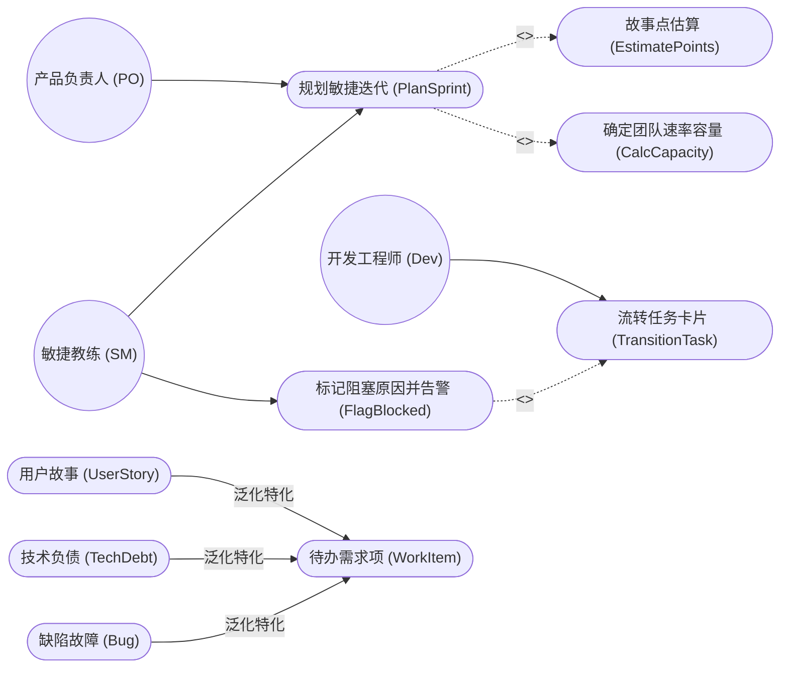
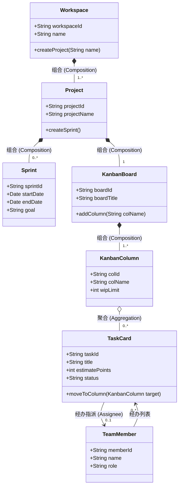
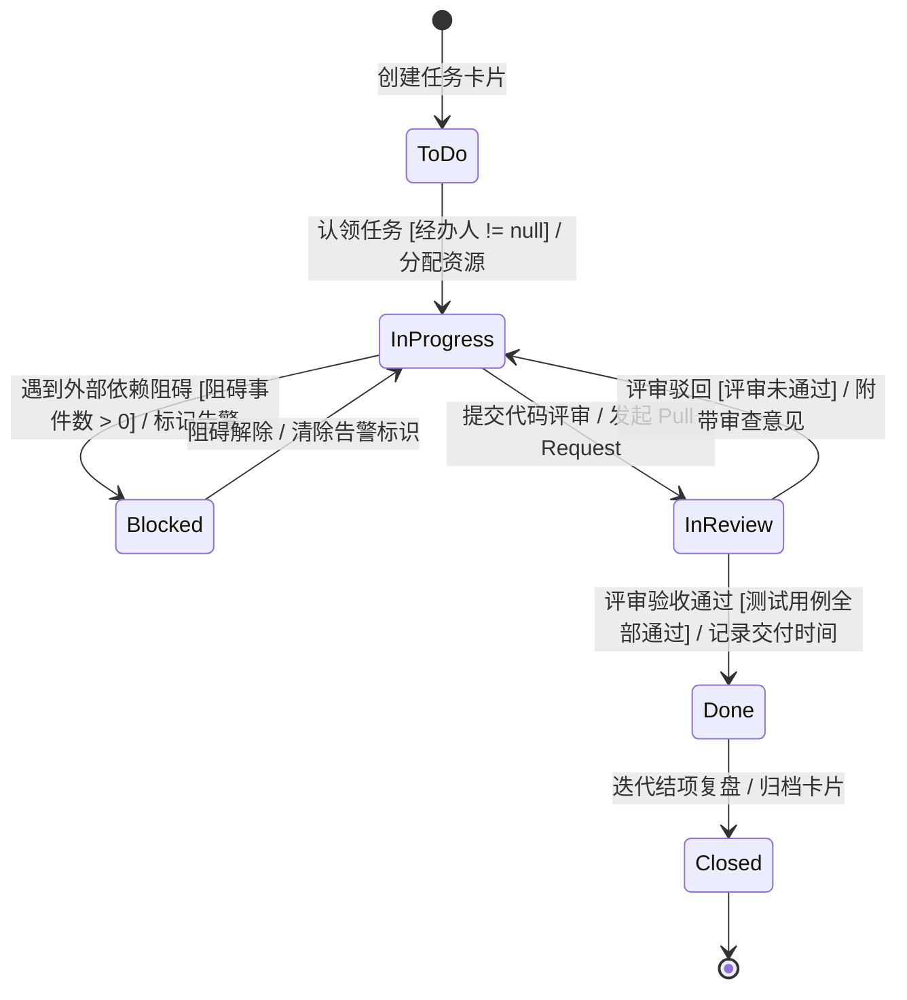

# 案例三：敏捷项目看板与协同研发系统 (UML 综合建模与状态机精讲)

<Badge type="info" text="真题原型：研发效能管理平台、Jira/TAPD 敏捷看板协作模型" />
<Badge type="tip" text="主攻考点：用例建模 · 类层次与聚合/组合辨析 · 任务工作流状态机 · 守卫条件" />
<Badge type="danger" text="及格保底：13 ~ 15 分 (冲刺满分)" />

::: tip 🎯 案例背景与训练目标
本案例基于全国软考下午试题三近年来贴近现代互联网研发团队日常协作的“项目管理与协同工具平台”真题原型改编。系统涵盖敏捷项目迭代管理、看板泳道流转、任务工作流状态机以及研发效能数据统计，重点考查：
1. 识别敏捷团队多角色参与者并理清用例的包含 (`<<include>>`) 与扩展 (`<<extend>>`) 依赖；
2. 深刻辨析类图中“项目与迭代（组合）”与“看板列与任务卡片（聚合）”的生命周期与对象流转差异；
3. 准确推导面向对象多重度约束；
4. 掌握复杂工单/任务卡片有限状态机 (FSM) 的状态跳转、事件触发与守卫条件表达式。
:::

---

## 一、 试题情境与业务需求说明

某高科技软件研发企业为落地 Scrum 敏捷开发规范与全流程可信交付，研发了一套敏捷项目协同研发看板系统 (Agile Kanban Collaboration System)。系统的核心业务功能说明如下：

1. **组织架构与角色参与者**：
   - **产品负责人 (Product Owner / PO)**：负责梳理产品需求待办列表 (Product Backlog)，创建用户故事，规划并开启迭代 (Sprint)；
   - **开发工程师 (Developer)**：在看板上认领开发任务卡片，流转卡片状态，提交代码评审请求；
   - **敏捷教练 (Scrum Master / SM)**：负责监控每日燃尽图 (Burn-Down Chart)，协调跨团队依赖，并在团队遭遇技术瓶颈时协助解除阻塞。
2. **核心业务用例描述**：
   - 产品负责人执行“规划敏捷迭代 (PlanSprint)”用例。在规划迭代过程中，系统**必须**执行“故事点估算 (EstimateStoryPoints)”与“确定团队速率容量 (CalculateCapacity)”；
   - 在开发人员推进“流转任务卡片 (TransitionTask)”用例时，若任务由于外部接口依赖未就绪或硬件环境损坏导致停滞，系统**可选触发**“标记阻塞原因并告警 (FlagBlockedIssue)”用例；
   - 待办需求项 (WorkItem) 包含“用户故事 (UserStory)”、“技术负债 (TechDebt)”与“缺陷故障 (Bug)”三种具体分类形式。
3. **软件架构与核心类图结构**：
   - **协同工作空间 (Workspace)**：一个工作空间包含 1 到多个**敏捷项目 (Project)**。工作空间是项目的顶层容器，若注销工作空间，其中的全部敏捷项目随之被物理删除；
   - **敏捷项目 (Project)**：每个项目严格拥有 1 个**电子看板 (KanbanBoard)**，并包含 0 到多个**开发迭代 (Sprint)**。看板和迭代均不能脱离项目独立存在，项目被删除时，其看板与所有迭代随之销毁；
   - **电子看板 (KanbanBoard)**：看板包含 1 到多个**看板列/泳道 (KanbanColumn)**（如“待处理 ToDo”、“进行中 InProgress”、“代码审查 InReview”、“已完成 Done”）。看板列是看板专用结构，随看板销毁而销毁；
   - **看板列 (KanbanColumn)** 与 **任务卡片 (TaskCard)**：任务卡片随着开发进度在不同的看板列之间来回拖拽移动。任务卡片与当前所在的看板列之间不存在生命周期绑定关系，即便某看板列被清空或移除，任务卡片仍可转入其他列或被归档；
   - **任务卡片 (TaskCard)**：每张卡片记录任务标题、估算工时、优先级与状态。一张卡片同一时刻最多被 1 名开发人员经办（经办人可为空）；一名开发人员可同时经办多张卡片。
4. **任务卡片生命周期有限状态机**：
   - 任务卡片初始进入**待处理 (ToDo)** 状态；
   - 团队成员认领任务并分配经办人后，触发“开始开发”事件，进入**进行中 (InProgress)** 状态；
   - 进行中状态下，若外部依赖不可用且满足守卫条件 `[阻碍事件数 > 0]`，触发进入**阻塞挂起 (Blocked)** 状态；阻碍消除后恢复为“进行中”；
   - 代码编写完毕后，发起合并请求，进入**代码审查 (InReview)** 状态；
   - 审查过程中若发现逻辑缺陷，满足守卫条件 `[评审未通过]`，退回“进行中”重新修改；
   - 审查通过且单元测试通过，满足守卫条件 `[测试用例全部通过]`，进入**已完成 (Done)** 状态；
   - 迭代复盘后，卡片最终进入**归档关闭 (Closed)** 终止状态。

---

## 二、 概念结构模型（Mermaid UML 矢量图谱）

### 2.1 系统用例图 (Use Case Diagram)

### 2.2 核心类图 (Class Diagram)

### 2.3 任务卡片状态机图 (State Machine Diagram)

---

## 三、 考场设问与检索式自测 (Active Recall Drill)

### 问题 1：用例关系与模型辨析（4分）
结合系统说明中关于敏捷协作的描述，请回答下列问题：
1. 产品负责人执行“规划敏捷迭代”与“故事点估算”之间是什么 UML 用例关系？请写出其构造型；
2. 团队成员处理任务过程中，“流转任务卡片”与“标记阻塞原因并告警”之间是什么 UML 用例关系？请写出其构造型；
3. 待办需求项 (WorkItem) 与用户故事、技术负债、缺陷故障之间属于什么关系？
4. 试解释为什么在 UML 用例图中，不能在两个外部参与者 (Actor) 之间直接画包含 (`<<include>>`) 关系连线？

🔍 查看问题 1 标准答案与题眼解析

#### 标准答案：
1. **包含关系**，构造型为 **`<<include>>`**。
2. **扩展关系**，构造型为 **`<<extend>>`**。
3. **泛化关系（继承关系 / Generalization）**。
4. **理由分析**：
   - 包含 (`<<include>>`) 和扩展 (`<<extend>>`) 是**专属于用例与用例之间**的行为依赖构造型；
   - 参与者 (Actor) 代表系统外部与系统交互的人员或外部实体。参与者之间只能存在**泛化关系（角色继承，如“项目经理”继承自“普通成员”）**，参与者之间绝对不能画包含或扩展连线。

---

### 问题 2：类图组合与聚合设计辨析（4分）
在系统类图中：
1. “电子看板 (KanbanBoard)”与“看板列 (KanbanColumn)”之间属于什么关系？在 UML 类图中如何表示？
2. “看板列 (KanbanColumn)”与“任务卡片 (TaskCard)”之间属于什么关系？在 UML 类图中如何表示？
3. 为什么系统将“看板列与任务卡片”设计为聚合，而不是组合？请结合业务场景和对象生命周期说明设计原因。

🔍 查看问题 2 标准答案与设计决策推导

#### 标准答案：
1. **组合关系 (Composition)**；在 UML 类图中使用 **实心菱形（加实线）** 表示，实心菱形置于 KanbanBoard 一端。
2. **聚合关系 (Aggregation)**；在 UML 类图中使用 **空心菱形（加实线）** 表示，空心菱形置于 KanbanColumn 一端。
3. **架构设计决策理由**：
   - **对象流转与多列解耦**：任务卡片随着开发进度需要在“ToDo”、“InProgress”、“Done”等多个不同列之间动态拖拽移动。如果将卡片与某列设计为组合关系，由于组合具有严格归属与排他性，卡片将无法在列之间自由迁移；
   - **生命周期解耦**：当项目管理员调整工作流（例如删除“代码审查”列）时，该列中的任务卡片并不会随之被物理删除销毁，而是可以移入其他列或回到待办池中。这符合聚合关系“整体与部分生命周期解耦”的本质特征。

---

### 问题 3：类图多重度推导（4分）
结合系统说明，请推导下列关联在对应端的多重度约束（Multiplicity）：
1. 敏捷项目 (Project) 与开发迭代 (Sprint) 之间，在 Sprint 端的多重度为：`[多重度 1]`；
2. 电子看板 (KanbanBoard) 与看板列 (KanbanColumn) 之间，在 KanbanColumn 端的多重度为：`[多重度 2]`；
3. 任务卡片 (TaskCard) 与开发团队成员 (TeamMember) 之间，在 TeamMember 端的多重度为：`[多重度 3]`；在 TaskCard 端的多重度为：`[多重度 4]`。

🔍 查看问题 3 标准答案与多重度推导

#### 标准答案：
- `[多重度 1]`：**`0..*`**（或：`*`，依据题干“项目包含 0 到多个开发迭代”）
- `[多重度 2]`：**`1..*`**（依据题干“看板包含 1 到多个看板列/泳道”）
- `[多重度 3]`：**`0..1`**（依据题干“一张卡片同一时刻最多被 1 名开发人员经办，经办人可为空”）
- `[多重度 4]`：**`0..*`**（或：`*`，依据题干“一名开发人员可同时经办多张卡片，也可以没有卡片”）

---

### 问题 4：状态机图状态、事件与守卫条件填空（3分）
结合图 2-2 中任务卡片的生命周期状态机，请补全下列状态转移中的空缺内容 `[空 1]` 至 `[空 3]`。
1. 卡片由“待处理 (ToDo)”流转至“进行中 (InProgress)”的触发事件与守卫条件为：`[空 1]`；
2. 卡片由“进行中 (InProgress)”流转至“阻塞挂起 (Blocked)”的守卫条件是：`[空 2]`；
3. 卡片由“代码审查 (InReview)”流转至“已完成 (Done)”的守卫条件是：`[空 3]`。

🔍 查看问题 4 标准答案与状态机解析

#### 标准答案：
- `[空 1]`：**认领任务 `[经办人 != null]`**（或：开始开发 `[已分配经办人]`）
- `[空 2]`：**`[阻碍事件数 > 0]`**（必须带方括号）
- `[空 3]`：**`[测试用例全部通过]`**（或：`[测试用例通过率 == 100%]`，必须带方括号）

#### 填空采分关键：
- **`[空 1]` 事件与守卫**：包含认领动作及经办人非空的守卫条件判断；
- **`[空 2]` 守卫条件**：方括号表达布尔谓词 `[阻碍事件数 > 0]`；
- **`[空 3]` 验收守卫**：方括号表达进入 Done 的前置条件 `[测试用例全部通过]`。

