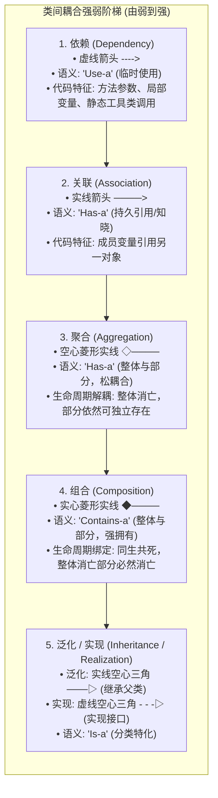
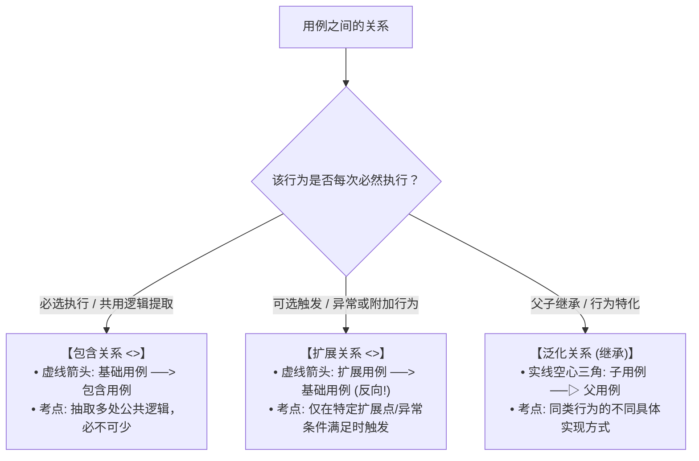
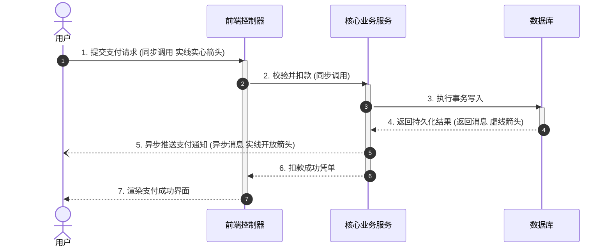
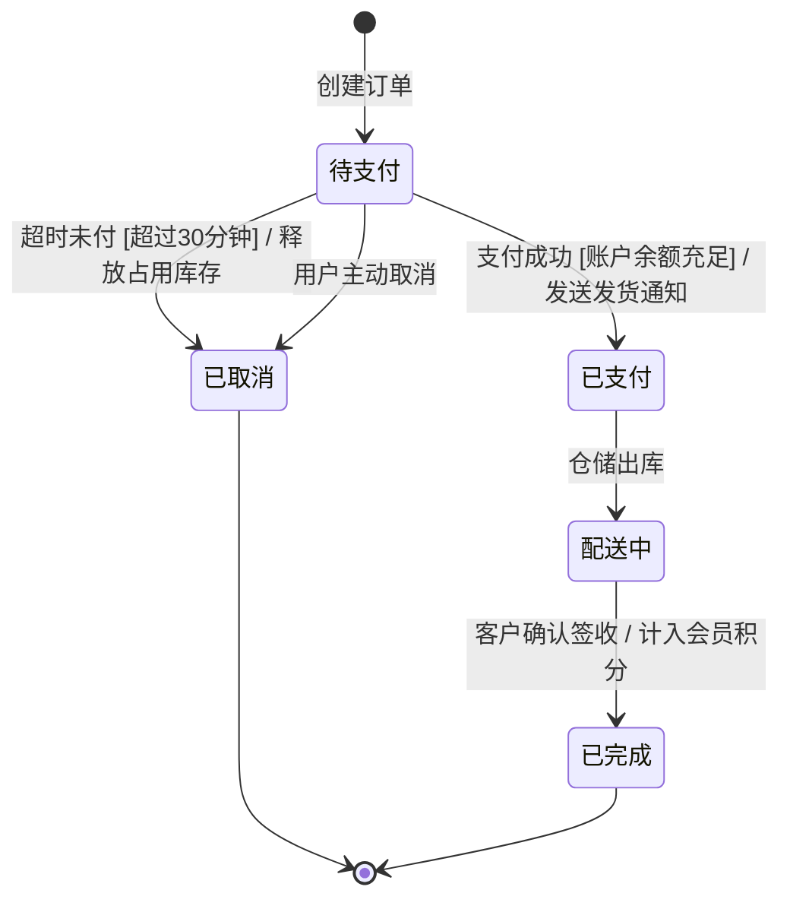

# 试题三：面向对象 UML 系统建模万能解题法则与核心方法论

<Badge type="info" text="题型定位：必答题 · 分值: 15 分" />
<Badge type="tip" text="保底目标：12 ~ 14 分 (核心得分盘)" />
<Badge type="danger" text="核心铁律：类间耦合强弱阶梯 · 用例三大关系秒杀 · 多重度推导 · 动态行为建模" />

::: tip 🎯 试题三战略通关定位
试题三重点考查考生基于**统一建模语言 (UML 2.0)** 进行面向对象分析 (OOA) 与面向对象设计 (OOD) 的能力，是全卷套路固定、模型工整的 15 分核心得分盘。

真题试卷通常由一段约 600~1000 字的面向对象系统需求说明展开，附带 1~2 幅不完整的核心图谱（以**类图**、**用例图**为主，交替考查**时序图**或**状态机图**）。标准设问模型固定为 4 问：
1. **补全用例图或识别参与者 (Actor)**；
2. **补全类图中的类名、属性与方法**；
3. **判定类与类之间的关系类型及多重度 (Multiplicity)**；
4. **动态行为图补全**（时序图消息时序、状态图状态名及守卫条件）。

配套导航：[📖 下午题门户](/pm-application/) | [📐 案例一：智能车载导航](./01-case-vehicle-navigation) | [📐 案例二：线上聚合支付](./02-case-online-payment-gateway) | [📐 案例三：敏捷看板协作](./03-case-agile-kanban-collaboration)
:::

---

## 一、 类间耦合强弱阶梯全景图（考场必考命题基石）

面向对象类与类之间的关系绝非扁平并列，而是具有极其鲜明的**耦合强度递进阶梯**。考场判断关系时，严格按此阶梯从弱到强对号入座：

$$\text{依赖 (Dependency)} < \text{关联 (Association)} < \text{聚合 (Aggregation)} < \text{组合 (Composition)} < \text{泛化/实现 (Generalization/Realization)}$$

### 1.1 聚合 (Aggregation) 与 组合 (Composition) 本质辨析表

这是试题三**失分率最高、历年必考**的核心题眼：

| 维度对比 | 聚合 (Aggregation) | 组合 (Composition) |
| :--- | :--- | :--- |
| **UML 图元标记** | **空心菱形**（菱形端连接整体，箭头端指向部分） | **实心菱形**（菱形端连接整体，箭头端指向部分） |
| **关系语义** | 弱拥有（共享关联），表示“整体由部分构成” | 强拥有（严格归属），表示“部分是整体不可分割的一部分” |
| **生命周期约束** | **解耦**。整体不存在时，部分仍然有独立存在的意义。 | **绑定（同生共死）**。整体被销毁时，部分随之被销毁。 |
| **部分的多重性** | 一个部分实例**可以同时被多个整体共享**。 | 一个部分实例**同一时刻只能属于一个整体**。 |
| **生活经典隐喻** | • 班级与学生（班级解散，学生依然在） • 电脑与鼠标/键盘（拔掉鼠标，鼠标独立存在） • 车队与汽车（车队解散，汽车依然可开） | • 公司与部门（公司注销，部门随之不复存在） • 窗体窗口与菜单栏（窗口关闭销毁，菜单栏随之销毁） • 人与心脏（身体死亡，心脏无法独立生命运转） |
| **代码构造特征** | 部分对象通过**Setter 方法或构造函数参数外部传入** | 部分对象在整体的**构造函数内部直接 new 创建** |

> [!IMPORTANT] 考场图形连线方向口诀
> 无论是聚合还是组合：**菱形永远画在【整体】（宿主）一端，无符号或箭头端指向【部分】**！
> - 例如：汽车由发动机组合而成，实心菱形画在“汽车”端，箭头指向“发动机”。

---

## 二、 用例图三大关系秒杀判别口诀

用例图考查**参与者 (Actor)** 与**用例 (Use Case)** 的识别，以及用例之间的三种特殊关系：

### 2.1 三大用例关系判别矩阵

| 关系类型 | 构造型 (Stereotype) | 连线符号与箭头指向 | 题干核心题眼与判断标准 |
| :---: | :---: | :---: | :--- |
| **包含 (Include)** | `<<include>>` | **虚线开放箭头** **基础用例 $\to$ 被包含用例** | • **必选执行**：执行基础用例的过程中，**必定**要执行该用例； • **代码抽取**：多个用例均包含相同的公共子流程（如“身份认证”、“打印凭条”）。 |
| **扩展 (Extend)** | `<<extend>>` | **虚线开放箭头** **扩展用例 $\to$ 基础用例** *(⚠️ 软考极高频扣分点：反向箭头！)* | • **可选执行**：基础用例本身功能完整，仅在**特定条件/扩展点**下才执行（如“余额不足提醒”、“偏航重新规划”）； • **异常处理**：遇到系统故障或用户取消时的分支补偿行为。 |
| **泛化 (Generalization)**| 无须构造型 | **实线空心三角形箭头** **子用例 $\to$ 父用例** | • **特化与通用**：父用例是抽象通用概念，子用例是其具体的特化实现； • **典型考例**：“在线支付”（父用例）与“微信支付/支付宝支付/银联支付”（子用例）。 |

> [!CAUTION] 箭头方向致命雷区：扩展关系的“逆向箭头”
> - **包含关系**：`登录` $\xrightarrow{<<include>>}$ `输入密码验证`（箭头由基础用例指向被包含用例，符合直觉）；
> - **扩展关系**：`发送溢价补贴` $\xrightarrow{<<extend>>}$ `打车结算`（**箭头必须由扩展用例指向基础用例**！含义是扩展用例向基础用例注入附加逻辑，绝不能画反！）。

---

## 三、 多重度 (Multiplicity) 快速推导法

在类图关联关系连线两端，必须标注多重度，表达一个类的实例与另一个类的实例之间的数量对应约束：

### 3.1 常见多重度标记速查表

| 标记符号 | 语义含义 | 典型业务场景示例 |
| :---: | :--- | :--- |
| **`0..1`** | **零个或一个（至多一个/可选）** | 一个人可以没有护照，最多拥有一本护照；订单与优惠券。 |
| **`1`**（或 `1..1`） | **必须且仅有一个（严格单一）** | 每本图书严格属于一个出版社；员工严格归属于一个部门。 |
| **`0..*`**（或 `*`） | **零个或多个（不设上限）** | 一个客户可以拥有 0 到多张信用卡；一个文件夹包含多个文件。 |
| **`1..*`** | **至少一个（一个或多个）** | 一张订单必须至少包含 1 件商品条目；一个班级至少有 1 名学生。 |
| **`m..n`** | **明确的固定闭区间范围** | 一辆轿车有 `4..5` 个车轮；一个工作小组有 `3..8` 名成员。 |

### 3.2 双向独立推导两步法
严禁将两端的数字混为一谈。推导多重度必须分两步独立审视：
1. **第一步（站在 A 视点看 B）**：固定 1 个 A 实例，思考它对应最少几个 B、最多几个 B？将结果写在 **B 类的旁边**；
2. **第二步（站在 B 视点看 A）**：固定 1 个 B 实例，思考它对应最少几个 A、最多几个 A？将结果写在 **A 类的旁边**。

---

## 四、 动态行为图核心考点精要

### 4.1 时序图 (Sequence Diagram) 消息类型与控制流

时序图按时间顺序强调对象之间的协作交互：

* **三大消息图元**：
  1. **同步消息 (Synchronous Message)**：实线 + 实心闭合三角箭头 `->>`，发送方挂起等待接收方处理完毕并返回；
  2. **异步消息 (Asynchronous Message)**：实线 + 开放半箭头 `-->>`，发送方发送后不等待响应，直接继续向下执行；
  3. **返回消息 (Return Message)**：虚线 + 开放箭头 `-->>`，从被调用方回传执行结果。

### 4.2 状态机图 (State Machine Diagram) 状态转换五要素

状态图考查对象生命周期内的状态跃迁，其转换表达式标准格式为：
$$\text{事件 (Event)} \; [\text{守卫条件 (Guard)}] \; / \; \text{动作 (Action)}$$

* **核心要素拆解**：
  - **初态与终态**：初始状态为实心圆球 `[*] -> State`；终止状态为双重圆（牛眼）`State -> [*]`；
  - **守卫条件 (Guard)**：必须置于方括号 `[...]` 内，只有布尔值为真时，该事件才能触发状态跳转；
  - **动作 (Action)**：斜杠 `/` 后面紧跟状态转移过程中伴随执行的系统行为。

---

## 五、 考场机考作答书写规范与避坑防线

1. **类名大小写敏感**：类名必须采用驼峰命名或严格与系统需求中的实体英文词根对齐（如 `OrderController`、`PaymentService`），切勿随意简写；
2. **多重度格式严禁自造**：标准语法为 `0..1`、`1`、`*`、`1..*`，严禁写成 `0-1`、`N`、`>=1` 或 `0~多`；
3. **关系名称填写准确**：题目要求写出类间关系时，标准术语为：**依赖、关联、聚合、组合、泛化（继承）、实现**。不可写“从属关系”、“包含关系”、“父子关系”等非规范口语。
