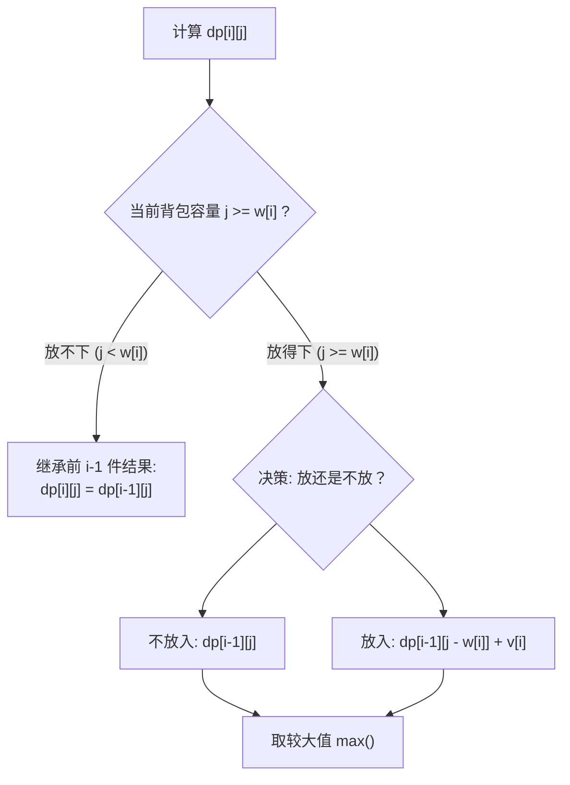

# 动态规划专精：0-1 背包问题与最长公共子序列 (LCS)

<Badge type="info" text="真题原型：全国软考动态规划必考双子星" />
<Badge type="tip" text="主攻考点：最优子结构 · 状态转移方程填表 · C 语言代码填空 · 空间优化" />
<Badge type="danger" text="保底目标：8 ~ 10 分 (核心得分盘)" />

::: tip 🎯 章节攻坚目标
动态规划 (Dynamic Programming, DP) 是下午试题四出现频次最高（约占 45%）的命题宗门。其解题模式极其标准化：
1. 识别状态数组定义（通常为二维数组 `dp[i][j]` 或 `c[i][j]`）；
2. 翻译状态转移方程中的“选与不选”或“匹配与不匹配”分支；
3. 准确填写循环边界与基线初值；
4. 理解一维滚动数组的倒序更新机制。
:::

---

## 一、 0-1 背包问题全景精解

### 1.1 问题数学建模
给定 $N$ 件物品和一个容量为 $W$ 的背包。第 $i$ 件物品的重量为 $w[i]$，价值为 $v[i]$。每种物品仅有 1 件，可选择“装入”或“不装入”。目标是选择部分物品装入背包，在总重量不超过 $W$ 的前提下使总价值最大。

### 1.2 状态定义与状态转移方程
- **状态定义**：设 `dp[i][j]` 表示从前 $i$ 件物品中挑选物品放入承重为 $j$ 的背包中所能获得的最大总价值（$0 \le i \le N, 0 \le j \le W$）。
- **边界条件**：
  - `dp[0][j] = 0`（前 0 件物品放入任何背包价值均为 0）；
  - `dp[i][0] = 0`（背包容量为 0 时装不下任何物品，价值为 0）。
- **状态转移方程**：
  $$\text{dp}[i][j] = \begin{cases} \text{dp}[i-1][j], & j < w[i] \quad (\text{当前背包放不下物品 } i) \\ \max(\text{dp}[i-1][j], \; \text{dp}[i-1][j - w[i]] + v[i]), & j \ge w[i] \quad (\text{放与不放取较大者}) \end{cases}$$



---

## 二、 最长公共子序列 (LCS) 全景精解

### 2.1 问题描述
给定两个序列 $X = \langle x_1, x_2, \dots, x_m \rangle$ 与 $Y = \langle y_1, y_2, \dots, y_n \rangle$，找出 $X$ 与 $Y$ 的一个长度最长的公共子序列（子序列不要求在原串中连续出现，但需保持先后次序）。

### 2.2 状态定义与状态转移方程
- **状态定义**：设 `c[i][j]` 表示序列 $X$ 的前 $i$ 个字符和序列 $Y$ 的前 $j$ 个字符的最长公共子序列长度。
- **状态转移方程**：
  $$c[i][j] = \begin{cases} 0, & i=0 \text{ 或 } j=0 \\ c[i-1][j-1] + 1, & i, j > 0 \text{ 且 } x_i = y_j \\ \max(c[i-1][j], \; c[i][j-1]), & i, j > 0 \text{ 且 } x_i \neq y_j \end{cases}$$
- **方向标记数组 `b[i][j]`**：
  - 若 $x_i = y_j$，`b[i][j] = 1`（代表向左上方对角线回溯）；
  - 若 $c[i-1][j] \ge c[i][j-1]$，`b[i][j] = 2`（代表向上方回溯）；
  - 否则 `b[i][j] = 3`（代表向左方回溯）。

---

## 三、 C 语言代码骨架与标准演练

### 3.1 0-1 背包 C 语言标准实现

```c
#include <stdio.h>

#define MAX_N 100
#define MAX_W 1000

int max(int a, int b) {
    return (a > b) ? a : b;
}

int Knapsack(int n, int W, int w[], int v[]) {
    int dp[MAX_N + 1][MAX_W + 1];
    int i, j;

    // 1. 初始化边界条件
    for (i = 0; i <= n; i++) {
        dp[i][0] = 0;
    }
    for (j = 0; j <= W; j++) {
        dp[0][j] = 0;
    }

    // 2. 双重循环自底向上递推填表
    for (i = 1; i <= n; i++) {
        for (j = 1; j <= W; j++) {
            if (j < w[i]) {
                dp[i][j] = dp[i - 1][j];
            } else {
                dp[i][j] = max(dp[i - 1][j], dp[i - 1][j - w[i]] + v[i]);
            }
        }
    }

    return dp[n][W]; // 返回全局最优解
}
```

---

## 四、 考场设问与检索式自测 (Active Recall Drill)

### 问题 1：算法策略与复杂度分析（4分）
1. 0-1 背包问题和 LCS 问题均采用了哪种算法设计策略？该策略的核心特征是什么？
2. 给出上述 0-1 背包算法的时间复杂度与空间复杂度（用大 $O$ 符号表示，物品数量为 $N$，背包容量为 $W$）。

<details>
<summary>🔍 查看问题 1 标准答案与解析</summary>

#### 标准答案：
1. **动态规划法 (Dynamic Programming)**。
   - **核心特征**：最优子结构性质（问题的最优解包含其子问题的最优解）与重叠子问题性质（子问题在递推过程中被反复计算，通过查表避免重复计算）。
2. - **时间复杂度**：$O(N \times W)$（或伪多项式时间）；
   - **空间复杂度**：$O(N \times W)$。
</details>

---

### 问题 2：0-1 背包 C 语言代码填空（4分）
阅读下列 0-1 背包函数代码片段，补全空缺 `[空 1]` 与 `[空 2]`。

```c
for (i = 1; i <= n; i++) {
    for (j = 1; j <= W; j++) {
        if (j < w[i]) {
            dp[i][j] = [空 1];
        } else {
            dp[i][j] = max(dp[i - 1][j], [空 2]);
        }
    }
}
```

<details>
<summary>🔍 查看问题 2 标准答案与代码精析</summary>

#### 标准答案：
- `[空 1]`：`dp[i - 1][j]`
- `[空 2]`：`dp[i - 1][j - w[i]] + v[i]`

#### 填空采分关键：
- **`[空 1]`**：背包容量不足以装入第 $i$ 件物品，直接继承前 $i-1$ 件物品在同容量 $j$ 下的最优解；
- **`[空 2]`**：装入第 $i$ 件物品的方案：价值为第 $i$ 件的价值 $v[i]$ 加上背包剩余容量 $j - w[i]$ 下前 $i-1$ 件物品的最优解 `dp[i - 1][j - w[i]]`。
</details>

---

### 问题 3：LCS 最长公共子序列回溯输出填空（4分）
下面是依据方向标记数组 `b` 递归打印最长公共子序列字符的 C 语言函数。请补全 `[空 1]` 与 `[空 2]`。

```c
void PrintLCS(int b[][MAX_LEN], char X[], int i, int j) {
    // 递归基线出口
    if ([空 1]) {
        return;
    }

    if (b[i][j] == 1) { // 字符匹配，向对角线回溯
        PrintLCS(b, X, i - 1, j - 1);
        printf("%c", X[i - 1]); // 输出公共字符
    } else if (b[i][j] == 2) { // 向上回溯
        [空 2];
    } else { // 向左回溯
        PrintLCS(b, X, i, j - 1);
    }
}
```

<details>
<summary>🔍 查看问题 3 标准答案与递归精析</summary>

#### 标准答案：
- `[空 1]`：`i == 0 || j == 0`（或：`i <= 0 || j <= 0`）
- `[空 2]`：`PrintLCS(b, X, i - 1, j)`

#### 填空采分关键：
- **`[空 1]` 递归基线**：任何一个串长度到达 0（空串）即为递归终点，无需继续比对；
- **`[空 2]` 向上回溯**：向上意味着行号减少，因此传入参数为 `i - 1`，列号 `j` 保持不变。
</details>

---

### 问题 4：0-1 背包一维滚动数组空间优化原理（3分）
在工程实现中，0-1 背包通常将空间复杂度从 $O(N \times W)$ 优化到 $O(W)$，其核心循环代码如下：

```c
for (i = 1; i <= n; i++) {
    for (j = W; j >= w[i]; j--) {
        dp[j] = max(dp[j], dp[j - w[i]] + v[i]);
    }
}
```

请回答：为什么内层循环中变量 $j$ 的遍历顺序**必须采用从 $W$ 倒序递减至 $w[i]$**，而绝对不能采用正序？

<details>
<summary>🔍 查看问题 4 标准答案与原理解析</summary>

#### 标准答案：
- **核心原因**：为了保证每件物品在每个阶段**只被放入一次**（满足 0-1 背包约束）。
- **机理详解**：
  若采用正序遍历（$j$ 从小到大递增），在计算较大的容量 $j$ 时，所引用的 `dp[j - w[i]]` 已经被当前第 $i$ 件物品更新过，导致第 $i$ 件物品在同一轮中被重复放入（退化为完全背包问题）；
  采用倒序遍历时，计算 `dp[j]` 所用到的 `dp[j - w[i]]` 尚未被本轮更新，仍然保留着前 $i-1$ 件物品的历史状态，从而确保了状态转移的正确性。
</details>
