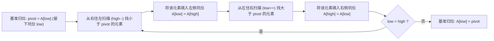

# 分治与贪心实战：快速排序与最短路径算法 (Dijkstra/Kruskal)

<Badge type="info" text="真题原型：全国软考分治与贪心算法必考题型" />
<Badge type="tip" text="主攻考点：分治递归基线 · 双指针填坑划分 · 贪心局部最优 · 松弛操作" />
<Badge type="danger" text="保底目标：8 ~ 10 分 (核心防守盘)" />

::: tip 🎯 章节攻坚目标
分治法 (Divide and Conquer) 与贪心算法 (Greedy Algorithm) 是试题四考查频次仅次于动态规划的两大宗门：
1. **分治法攻坚**：掌握“划分 (Divide) - 求解 (Conquer) - 合并 (Combine)”三部曲，重点攻克快速排序双指针 `Partition` 挖空；
2. **贪心法攻坚**：掌握“局部最优即全局最优”的单向决策机制，熟练书写 Dijkstra 单源最短路径的**松弛条件 (Relaxation)**；
3. 掌握快速排序最坏复杂度退化场景与工程防退化措施。
:::

---

## 一、 快速排序 (QuickSort) 分治机制精解

### 1.1 分治设计哲学
快速排序是分治法的典型代表。其算法逻辑分为三步：
1. **分解 (Divide)**：在待排序数组 $A[low..high]$ 中选取一个基准元素（Pivot），通过一次划分操作将数组划分为两部分 $A[low..mid-1]$ 和 $A[mid+1..high]$，使得左侧所有元素均 $\le$ Pivot，右侧所有元素均 $\ge$ Pivot；
2. **解决 (Conquer)**：通过递归调用自身，分别对左、右两个子数组独立进行快速排序；
3. **合并 (Combine)**：由于划分过程已就地完成元素重排，子数组排序完成后无需任何额外的合并操作，整表天然有序。

### 1.2 双指针交替填坑划分流程 (Partition)



---

## 二、 贪心算法核心机制：Dijkstra 最短路径

### 2.1 贪心选择性质与单源最短路径
Dijkstra 算法用于求解带非负权图的单源最短路径：
- **集合划分**：将顶点集合划分为两部分：已确定最短路径的集合 $S$ 和尚未确定的顶点集合 $V - S$；
- **贪心选择**：每次从未确定集合 $V - S$ 中，挑选一个**当前距离源点最近的顶点 $u$**，将其加入集合 $S$；
- **松弛操作 (Relaxation)**：以顶点 $u$ 为中继跳板，检查并更新与 $u$ 相邻的所有未访问顶点 $v$ 的最短估计距离：
  $$\text{若 } dist[v] > dist[u] + cost[u][v]，\quad \text{则更新 } dist[v] = dist[u] + cost[u][v]$$

---

## 三、 C 语言代码骨架与标准演练

### 3.1 快速排序 C 语言标准实现

```c
#include <stdio.h>

// 1. 双指针划分函数 (Partition)
int Partition(int arr[], int low, int high) {
    int pivot = arr[low]; // 选取首元素作为基准

    while (low < high) {
        // 从右向左找比 pivot 小的数
        while (low < high && arr[high] >= pivot) {
            high--;
        }
        arr[low] = arr[high]; // 填入左坑

        // 从左向右找比 pivot 大的数
        while (low < high && arr[low] <= pivot) {
            low++;
        }
        arr[high] = arr[low]; // 填入右坑
    }

    arr[low] = pivot; // 基准归位
    return low;       // 返回划分位置索引
}

// 2. 递归分治主函数
void QuickSort(int arr[], int low, int high) {
    int mid;
    // 递归基线出口
    if (low < high) {
        mid = Partition(arr, low, high); // 划分
        QuickSort(arr, low, mid - 1);     // 递归左半部
        QuickSort(arr, mid + 1, high);    // 递归右半部
    }
}
```

### 3.2 Dijkstra 算法核心 C 语言骨架

```c
#define INF 999999
#define MAX_V 100

void Dijkstra(int graph[MAX_V][MAX_V], int n, int src, int dist[]) {
    int visited[MAX_V];
    int i, j, u, min_dist;

    // 1. 初始化数组
    for (i = 0; i < n; i++) {
        dist[i] = graph[src][i];
        visited[i] = 0;
    }
    visited[src] = 1;
    dist[src] = 0;

    // 2. 循环寻找剩余 n-1 个顶点的最短路
    for (i = 1; i < n; i++) {
        min_dist = INF;
        u = -1;

        // 贪心选择当前未访问的最短点
        for (j = 0; j < n; j++) {
            if (!visited[j] && dist[j] < min_dist) {
                min_dist = dist[j];
                u = j;
            }
        }

        if (u == -1) break; // 剩余节点均不可达
        visited[u] = 1;     // 标记为已访问

        // 核心松弛操作更新邻接点
        for (j = 0; j < n; j++) {
            if (!visited[j] && graph[u][j] < INF) {
                if (dist[u] + graph[u][j] < dist[j]) {
                    dist[j] = dist[u] + graph[u][j];
                }
            }
        }
    }
}
```

---

## 四、 考场设问与检索式自测 (Active Recall Drill)

### 问题 1：算法策略与时空复杂度判定（4分）
1. 快速排序与 Dijkstra 算法分别属于四大算法宗门中的哪一种？
2. 请写出快速排序算法在**最好情况**、**平均情况**与**最坏情况**下的时间复杂度；
3. 请说明快速排序的额外空间复杂度是多少？消耗在何处？

<details>
<summary>🔍 查看问题 1 标准答案与解析</summary>

#### 标准答案：
1. - 快速排序：**分治法 (Divide and Conquer)**；
   - Dijkstra 算法：**贪心算法 (Greedy Algorithm)**。
2. - 最好时间复杂度：$O(n \log n)$；
   - 平均时间复杂度：$O(n \log n)$；
   - 最坏时间复杂度：$O(n^2)$。
3. - 额外空间复杂度：$O(\log n)$（平均/最好）或 $O(n)$（最坏）；
   - **消耗来源**：递归调用过程中**系统函数调用栈 (Call Stack)** 所占用的存储空间。
</details>

---

### 问题 2：快速排序核心代码挖空填空（4分）
阅读下列 `Partition` 划分与快速排序递归函数代码，补全 `[空 1]` 与 `[空 2]`。

```c
int Partition(int arr[], int low, int high) {
    int pivot = arr[low];
    while (low < high) {
        while (low < high && arr[high] >= pivot) {
            high--;
        }
        [空 1];
        while (low < high && arr[low] <= pivot) {
            low++;
        }
        arr[high] = arr[low];
    }
    [空 2];
    return low;
}
```

<details>
<summary>🔍 查看问题 2 标准答案与代码精析</summary>

#### 标准答案：
- `[空 1]`：`arr[low] = arr[high]`
- `[空 2]`：`arr[low] = pivot`（或：`arr[high] = pivot`）

#### 填空采分关键：
- **`[空 1]` 填左坑**：右指针扫描停滞后，发现 `arr[high] < pivot`，将其搬移填入左指针形成的空坑 `arr[low]` 中；
- **`[空 2]` 基准归位**：两指针在 `low == high` 处相遇碰撞，必须将此前暂存的基准值 `pivot` 归位放入该最终位置。
</details>

---

### 问题 3：Dijkstra 松弛操作代码填空（4分）
阅读下列 Dijkstra 核心松弛代码段，补全 `[空 1]` 与 `[空 2]`。

```c
// 寻找未访问集合中距离源点最近的节点
for (j = 0; j < n; j++) {
    if ([空 1] && dist[j] < min_dist) {
        min_dist = dist[j];
        u = j;
    }
}
visited[u] = 1;

// 松弛操作
for (j = 0; j < n; j++) {
    if (!visited[j] && graph[u][j] < INF) {
        if ([空 2]) {
            dist[j] = dist[u] + graph[u][j];
        }
    }
}
```

<details>
<summary>🔍 查看问题 3 标准答案与算法精析</summary>

#### 标准答案：
- `[空 1]`：`!visited[j]`（或：`visited[j] == 0`）
- `[空 2]`：`dist[u] + graph[u][j] < dist[j]`（或：`dist[j] > dist[u] + graph[u][j]`）

#### 填空采分关键：
- **`[空 1]`**：只能在尚未访问（未确定最短距离）的顶点集合中进行最小距离贪心选择；
- **`[空 2]`**：经典的三角不等式松弛判断条件：以 $u$ 为中继站的新路径长度 `dist[u] + graph[u][j]` 小于原先直达或历史记录的最短距离 `dist[j]`。
</details>

---

### 问题 4：快速排序最坏情况分析与优化防范（3分）
1. 快速排序在何种初始输入数据特征下会触发最坏时间复杂度 $O(n^2)$？
2. 工程上通常采取什么手段来避免快速排序发生性能退化？

<details>
<summary>🔍 查看问题 4 标准答案与工程防退化措施</summary>

#### 标准答案：
1. **触发最坏情况的输入特征**：
   - 待排序序列**已经完全有序（正序或逆序）**；
   - 待排序数组中**所有元素值完全相同**。
   - 在上述情况下，若每次均选首元素作为基准，会导致每次划分产生的两个子区间极其不平衡（一个长度为 0，另一个长度为 $n-1$），分治递归树退化为一条链表单支树，递归深度达到 $n$ 层，总比较次数达到 $\frac{n(n-1)}{2} = O(n^2)$。
2. **工程防范优化手段**：
   - **三数取中法 (Median-of-Three)**：取区间首、中、尾三个元素的中位数作为基准，有效避免选到最大或最小值；
   - **随机化基准 (Randomized Pivot)**：在待排区间内随机挑选一个位置的元素与首元素交换作为基准。
</details>
