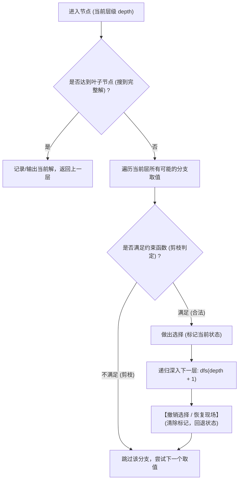

# 回溯搜索实战：N 皇后问题与解空间剪枝模型

<Badge type="info" text="真题原型：解空间树深度优先遍历与约束剪枝模型" />
<Badge type="tip" text="主攻考点：解空间树 · 冲突剪枝判定 · 恢复现场机制 · 递归代码填空" />
<Badge type="danger" text="保底目标：8 ~ 10 分 (核心防守盘)" />

::: tip 🎯 章节攻坚目标
回溯法 (Backtracking) 在全国软考下午题中通常以“经典棋盘问题（N 皇后）”或“组合搜索/装载问题”为命题载体。掌握回溯法的核心在于：
1. 理解解空间树的结构（排列树 vs 子集树）；
2. 熟记 N 皇后**同列与对角线数学冲突公式**；
3. 掌握“试探 - 剪枝 - 深入递归 - 恢复现场”的代码骨架。
:::

---

## 一、 回溯法理论本质与控制流程

### 1.1 回溯法核心思想
回溯法本质上是一种**带有剪枝策略的深度优先搜索 (DFS)**：
- **试探前进**：从根节点出发，沿某一分支向前深度试探搜索；
- **剪枝过滤**：在当前节点通过**约束函数**或**限界函数**评估，若发现当前路径不可能产生合法解或最优解，则立即停止向前，**剪去以该节点为根的整棵子树**；
- **回退与恢复现场**：返回父节点，撤销当前试探产生的所有状态变更（恢复现场），继续尝试其他兄弟分支。



---

## 二、 N 皇后问题 (N-Queens) 数学建模

### 2.1 规则与解向量定义
在 $N \times N$ 的国际象棋棋盘上摆放 $N$ 个皇后，使其互不攻击。任何两个皇后不能处于**同一行**、**同一列**或**同一斜对角线**上。

- **解向量紧凑表示**：使用一个一维数组 `q[1..N]`，其中 `q[k] = c` 表示**第 $k$ 行的皇后放置在第 $c$ 列**。
  - 由于每行只放一个皇后，行号由下标 $k$ 自然递增，因此**天然消除了“同行冲突”**！

### 2.2 冲突检测数学推导式
对于第 $k$ 行新摆放的皇后（列位置为 `q[k]`），必须与前面已经放置好的第 $i$ 行皇后（$1 \le i < k$，列位置为 `q[i]`）逐一检测：

| 冲突类型 | 几何表现 | 数学等价判定式 | C 语言表达式 |
| :--- | :--- | :--- | :--- |
| **同列冲突** | 两皇后处于棋盘同一垂直线上 | $q[i] = q[k]$ | `q[i] == q[k]` |
| **主对角线冲突** | 两皇后连线斜率为 1 | $q[i] - q[k] = i - k$ | `q[i] - q[k] == i - k` |
| **副对角线冲突** | 两皇后连线斜率为 -1 | $q[i] - q[k] = -(i - k)$ | `q[i] - q[k] == -(i - k)` |
| **综合对角线** | 绝对值斜率等于 1 | $|q[i] - q[k]| = |i - k|$ | `abs(q[i] - q[k]) == abs(i - k)` |

---

## 三、 C 语言代码骨架与标准演练

```c
#include <stdio.h>
#include <stdlib.h>
#include <math.h>

#define MAX_N 20

int q[MAX_N]; // 解向量：q[k] 表示第 k 行皇后放置在第 q[k] 列
int count = 0;

// 1. 约束函数：检测在第 k 行第 q[k] 列放置皇后是否安全
int is_safe(int k) {
    int i;
    for (i = 1; i < k; i++) {
        // 同列冲突 或 对角线冲突
        if (q[i] == q[k] || abs(q[i] - q[k]) == abs(i - k)) {
            return 0; // 发生冲突，不安全
        }
    }
    return 1; // 安全合法
}

// 2. 递归回溯主函数
void Backtrack(int k, int n) {
    int col;

    // 递归基线出口：已成功放置第 n 个皇后
    if (k > n) {
        count++;
        // 可输出解向量 q
        return;
    }

    // 尝试在第 k 行的第 1 列到第 n 列放置皇后
    for (col = 1; col <= n; col++) {
        q[k] = col; // 做出选择：尝试放入第 col 列
        
        if (is_safe(k)) { // 剪枝判断
            Backtrack(k + 1, n); // 满足约束，深入下一行
        }
        // 注：此处因为数组直接被下一轮循环覆盖赋值，无需显式恢复现场
    }
}
```

---

## 四、 考场设问与检索式自测 (Active Recall Drill)

### 问题 1：算法策略与复杂度分析（4分）
1. N 皇后问题采用了哪种算法设计策略？其解空间树属于什么类型的树（子集树还是排列树）？
2. N 皇后问题的最坏时间复杂度与额外空间复杂度分别是多少？

<details>
<summary>🔍 查看问题 1 标准答案与解析</summary>

#### 标准答案：
1. - 算法策略：**回溯法 (Backtracking)**；
   - 解空间树类型：**排列树 (Permutation Tree)**（在消除了同列冲突后，本质为寻找 $1..N$ 的合法排列）。
2. - 最坏时间复杂度：$O(N!)$（阶乘级指数增长）；
   - 额外空间复杂度：$O(N)$（消耗在一维解向量数组 `q` 与深度为 $N$ 的递归系统栈）。
</details>

---

### 问题 2：冲突检测函数 C 语言代码填空（4分）
阅读下列 `is_safe` 约束检测函数代码，补全 `[空 1]` 与 `[空 2]`。

```c
int is_safe(int k) {
    int i;
    for (i = 1; i < k; i++) {
        // 检测列冲突与对角线冲突
        if ([空 1] || [空 2]) {
            return 0;
        }
    }
    return 1;
}
```

<details>
<summary>🔍 查看问题 2 标准答案与代码精析</summary>

#### 标准答案：
- `[空 1]`：`q[i] == q[k]`
- `[空 2]`：`abs(q[i] - q[k]) == abs(i - k)`（或：`abs(q[i] - q[k]) == k - i`）

#### 填空采分关键：
- **`[空 1]` 列冲突**：第 $i$ 行与第 $k$ 行皇后的列号相同；
- **`[空 2]` 对角线冲突**：列号差值的绝对值等于行号差值的绝对值。因为 $i < k$，所以行号差值可直接写作 `k - i`。
</details>

---

### 问题 3：递归回溯主函数代码填空（4分）
阅读下列 `Backtrack` 递归函数代码，补全 `[空 1]` 与 `[空 2]`。

```c
void Backtrack(int k, int n) {
    int col;

    // 递归基线判断
    if ([空 1]) {
        count++;
        return;
    }

    for (col = 1; col <= n; col++) {
        q[k] = col;
        if (is_safe(k)) {
            [空 2];
        }
    }
}
```

<details>
<summary>🔍 查看问题 3 标准答案与递归精析</summary>

#### 标准答案：
- `[空 1]`：`k > n`（或：`k == n + 1`）
- `[空 2]`：`Backtrack(k + 1, n)`

#### 填空采分关键：
- **`[空 1]` 递归出口**：行号 $k$ 从 1 开始递增，当 $k$ 超过 $n$ 时，说明 $1 \sim n$ 行均已成功摆放无冲突的皇后，找到一组完整解；
- **`[空 2]` 递归深入**：当前第 $k$ 行安全，进入下一行 $k + 1$ 的放置测试。
</details>

---

### 问题 4：回溯法“恢复现场”机制的深入辨析（3分）
在典型的回溯法实现中（例如图着色或迷宫寻路），在深入递归返回后通常必须显式执行“恢复现场”操作（例如 `visited[i] = 0;`）。
请问：在上述 N 皇后的 C 语言实现中，为什么在 `Backtrack(k + 1, n)` 后面**没有看到显式的清空恢复语句**（例如 `q[k] = 0;`），算法仍然能够完全正确地运行？

<details>
<summary>🔍 查看问题 4 标准答案与原理解析</summary>

#### 标准答案：
- **核心原因**：一维数组 `q[k]` 的赋值方式是**值覆写（覆盖机制）**，天然具有隐式的现场重置效果。
- **机理详解**：
  在 `for (col = 1; col <= n; col++)` 循环中，每次尝试新的列号时，语句 `q[k] = col` 会直接用新的列值覆盖旧的列值；
  而在约束函数 `is_safe(k)` 中，只检测当前行之前已生效的前 $k-1$ 行（`for (i = 1; i < k; i++)`），根本不会读取超出当前行的数据。因此未显式重置为 0 不会对后续搜索产生任何脏数据干扰。
</details>
