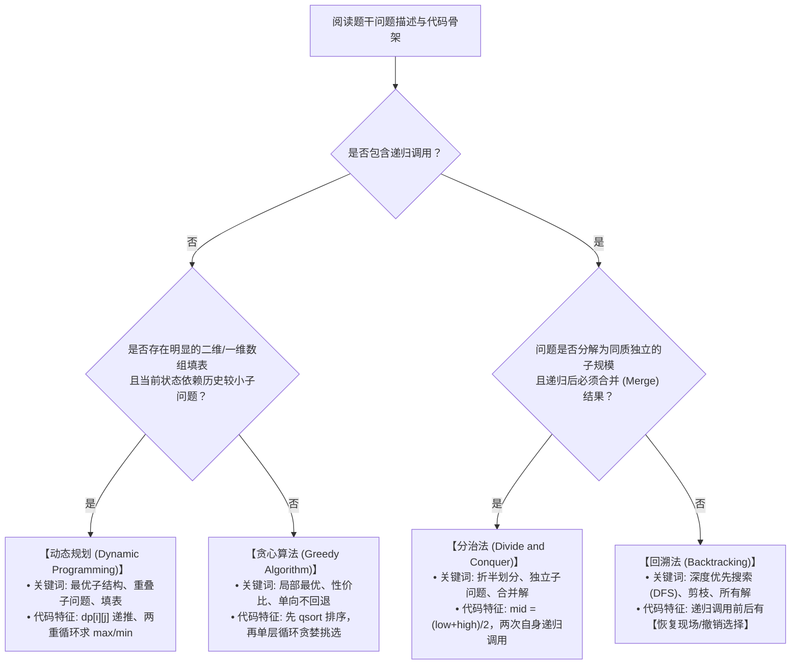
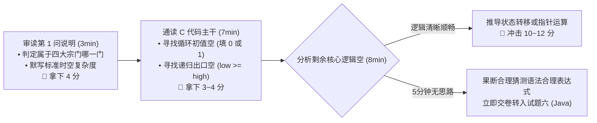

# 试题四：C 语言算法设计与分析战略防守通关手册

<Badge type="info" text="题型定位：必答题 · 分值: 15 分" />
<Badge type="tip" text="战略目标：7 ~ 9 分 (保底防守基础盘)" />
<Badge type="danger" text="核心战术：四大宗门模式识别 · 时空复杂度秒杀 · 循环初值与基线填空抢分" />

::: tip 🎯 试题四通关战略定位与心态建设
试题四为全卷必做的 C 语言算法综合大题。历年考情统计显示，试题四是**全卷平均得分最低、耗时最长、最容易引发考场焦虑**的题目（全国考生平均得分仅在 4~6 分）。

对于非计算机竞赛出身的考生，**切忌将目标定在 15 分满分**，更切忌在考场上花费超过 30 分钟去死磕复杂的链表指针或二维数组多重循环推演。本项目遵循 [ADR 0007 架构决策](/adr/0007-下午应用技术知识库架构与Java实战工程规范)，制定严密的**“7~9 分战略防守战术”**：
1. **第 1 问必拿满分 (4~5分)**：秒认算法策略（DP/贪心/分治/回溯）与最坏/平均时间复杂度；
2. **第 2 问稳拿前 2 空 (3~4分)**：利用通用语法结构攻克循环初始值、数组边界与递归基线（出口）；
3. **理智放弃后两空**：遇到极其晦涩的动态转移方程或深层指针逻辑时，果断猜测并迅速进入试题六，稳保全卷总分 $\ge 57$ 分及格底线。

配套导航：[📖 下午题门户](/pm-application/) | [📐 动态规划：背包与LCS](./01-dynamic-programming-knapsack-lcs) | [📐 分治与贪心：快排与Dijkstra](./02-divide-conquer-and-greedy) | [📐 回溯搜索：N 皇后](./03-backtracking-n-queens)
:::

---

## 一、 四大宗门特征识别全景矩阵（考场第 1 问秒杀）

软考下午试题四的命题范围严格限定在四大经典算法范式（宗门）之中。通过题干关键字与数据结构特征，可在 10 秒内锁定宗门归属：

### 1.1 四大算法宗门深度特征对照表

| 算法宗门 | 核心理论本质 | 题干高频典型命题词 | 代码结构典型特征 | 软考经典真题原型 |
| :---: | :--- | :--- | :--- | :--- |
| **动态规划 (DP)** | • 最优子结构 • 重叠子问题 • 无后效性 | “最大价值”、“最长长度”、“最少硬币”、“阶段最优决策” | • 定义数组 `dp[i][j]` 或 `opt[i]`； • 双重 `for` 循环递推填表； • `max(dp[i-1][j], dp[i-1][j-w[i]] + v[i])`。 | • 0-1 背包问题 • 最长公共子序列 (LCS) • 矩阵连乘积 • 最大子段和 |
| **贪心算法 (Greedy)** | • 贪心选择性质（局部最优即全局最优） • 无需穷举回溯 | “按单位价值从高到低”、“优先满足”、“最短耗时”、“局部最优” | • 首先调用 `qsort()` 进行升序/降序排序； • 单重循环线性扫描，遇到合规项直接采纳并累加； • 没有回退与撤销逻辑。 | • 部分背包 (分数背包) • 活动安排/区间调度 • 霍夫曼编码 (Huffman) • 单源最短路径 (Dijkstra) |
| **分治法 (D & C)** | • 划分同质子问题 • 子问题**相互独立** • 递归合并求解 | “二分查找”、“将序列均分为两部分”、“递归合并” | • 计算中间位置 `mid = (low + high) / 2`； • 两次递归：`solve(low, mid)` 与 `solve(mid+1, high)`； • 递归底层基线：`if (low >= high) return;`。 | • 快速排序 (QuickSort) • 归并排序 (MergeSort) • 棋盘覆盖问题 • 寻找第 k 小元素 |
| **回溯法 (Backtrack)** | • 深度优先遍历解空间树 • 约束条件剪枝 • 试探与**恢复现场** | “寻找所有满足条件的排列/组合”、“约束条件”、“试探” | • `void backtrack(int t)` 递归函数； • 循环尝试所有分支并调用 `constraint(t)` 校验； • **存在恢复现场语句**：递归后执行 `visited[i] = 0;`。 | • N 皇后问题 • 图的 m 着色问题 • 旅行商问题 (TSP 递归) • 0-1 背包回溯版 |

---

## 二、 算法时空复杂度速判口诀与主定理 (Master Theorem)

试题四第 1 问或第 3 问通常要求填写算法的**时间复杂度**与**空间复杂度**（通常计 2~3 分）。

### 2.1 高频算法复杂度速查矩阵

| 算法名称 | 算法宗门 | 平均时间复杂度 | 最坏时间复杂度 | 额外空间复杂度 | 考场核心判定规律 |
| :--- | :---: | :---: | :---: | :---: | :--- |
| **0-1 背包问题** | DP | $O(N \times W)$ | $O(N \times W)$ | $O(N \times W)$ 或 $O(W)$ | 双重循环：外层物品数 $N$，内层背包承重 $W$（伪多项式时间） |
| **最长公共子序列 (LCS)**| DP | $O(m \times n)$ | $O(m \times n)$ | $O(m \times n)$ | 双重循环遍历两字符串长度 $m$ 和 $n$ |
| **快速排序 (QuickSort)**| 分治 | $O(n \log n)$ | $O(n^2)$ | $O(\log n)$ (递归栈) | 最坏情况：输入序列已经完全有序或逆序，划分极度不平衡 |
| **归并排序 (MergeSort)**| 分治 | $O(n \log n)$ | $O(n \log n)$ | $O(n)$ (辅助数组) | 任何情况下均稳定为 $O(n \log n)$，但需额外 $O(n)$ 空间 |
| **Dijkstra 最短路径** | 贪心 | $O(V^2)$ 或 $O(E \log V)$ | $O(V^2)$ | $O(V)$ | 朴素邻接矩阵实现为 $O(V^2)$；优先队列实现为 $O(E \log V)$ |
| **Kruskal 最小生成树** | 贪心 | $O(E \log E)$ | $O(E \log E)$ | $O(E)$ | 瓶颈在于对边集按权值排序，边数 $E$ |
| **N 皇后问题** | 回溯 | $O(N!)$ | $O(N!)$ | $O(N)$ (解向量) | 阶乘级指数爆炸，空间主要消耗为长度为 $N$ 的递归栈与数组 |

### 2.2 递归分治主定理 (Master Theorem) 快速解法
对于形如 $T(n) = a T(n/b) + O(n^d)$ 的分治递归式（其中 $a \ge 1, b > 1$）：
1. **若 $\log_b a > d$**：递归树叶子节点占主导，时间复杂度为 $O(n^{\log_b a})$；
2. **若 $\log_b a = d$**：各层工作量均等，时间复杂度为 $O(n^d \log n)$；
3. **若 $\log_b a < d$**：根节点划分占主导，时间复杂度为 $O(n^d)$。

> **经典应用**：
> - 归并排序：$T(n) = 2T(n/2) + O(n) \implies a=2, b=2, d=1$。因为 $\log_2 2 = 1 = d$，故 $T(n) = O(n \log n)$。
> - 二分查找：$T(n) = 1T(n/2) + O(1) \implies a=1, b=2, d=0$。因为 $\log_2 1 = 0 = d$，故 $T(n) = O(\log n)$。

---

## 三、 C 语言代码填空“保底 4 分”抢分战术

试题四核心大题通常设 4~5 个代码填空。每个空通常在 1.5~2 分。攻克前两个简单空，即可直接斩获 3~4 分！

### 3.1 抢分题眼一：循环变量初始值与步长
- **考点特征**：在核心逻辑前，寻找循环变量 `i`、`j` 或累加计数器 `sum`、`count` 的初始化。
- **作答套路**：
  - 数组从下标 0 开始遍历：`for (i = 0; i < n; i++)` 或 `for (i = 1; i <= n; i++)`（先看主函数数组从 0 还是 1 开始填充）；
  - 动态规划边界初始化：第一行第一列置零，如 `dp[0][j] = 0` 或 `dp[i][0] = 0`；
  - 最小值比较初值置无穷大：`min_val = INF` 或 `min_val = 999999`；
  - 最大值比较初值置零：`max_val = 0` 或 `max_val = -1`。

### 3.2 抢分题眼二：递归函数的终止基线 (Base Case)
- **考点特征**：递归函数顶部的 `if (...) return ...;` 前置卫语句。
- **作答套路**：
  - 二分/快排区间相遇：`if (low >= high) return;` 或 `if (left > right) return 0;`；
  - 树节点触底遍历：`if (root == NULL) return;`；
  - 回溯到达叶子节点：`if (t > n)` 或 `if (depth == N)`（说明已尝试完所有层级，打印解并返回）。

### 3.3 抢分题眼三：递归调用自身的入参推演
- **考点特征**：函数体内调用自己，括号内参数留空。
- **作答套路**：
  - 寻找左右两个子区间：左区间通常为 `(..., low, mid - 1)` 或 `(..., low, mid)`；右区间通常为 `(..., mid + 1, high)`；
  - 回溯下一层：深度参数加一，如 `backtrack(t + 1)` 或 `dfs(step + 1)`。

### 3.4 抢分题眼四：动态规划状态转移方程的翻译
- **考点特征**：双重循环内的递推赋值语句。
- **作答套路**：根据题目中文说明直接翻译数学公式：
  - “取放入与不放入的最大值” $\to$ `dp[i][j] = max(dp[i-1][j], dp[i-1][j - w[i]] + v[i])`；
  - “字符相同时长度加一” $\to$ `c[i][j] = c[i-1][j-1] + 1`；
  - “字符不同时取上方或左方较大值” $\to$ `c[i][j] = (c[i-1][j] > c[i][j-1]) ? c[i-1][j] : c[i][j-1]`。

---

## 四、 考场策略与时间管理（防守型底线）

> [!WARNING] 考场止损铁律
> 试题四的答题时间**严格控制在 25 分钟以内**！一旦发现第 3 或第 4 个代码空涉及非常罕见的位运算、三重指针或复杂剪枝，**严禁原地苦思冥想**。
> 根据上下文猜一个符合类型的变量或简单表达式写上去，立刻收手，把宝贵时间留给稳拿 14 分的试题六 (Java)！
