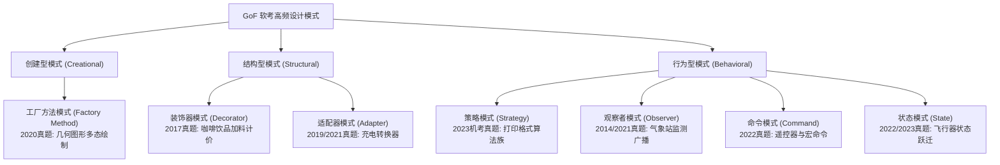
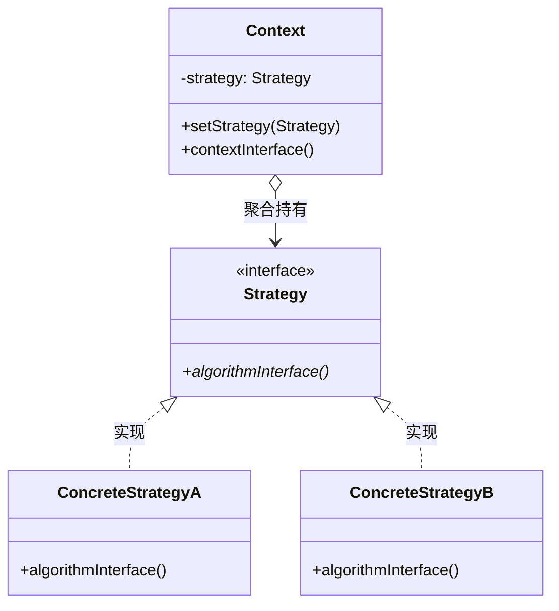
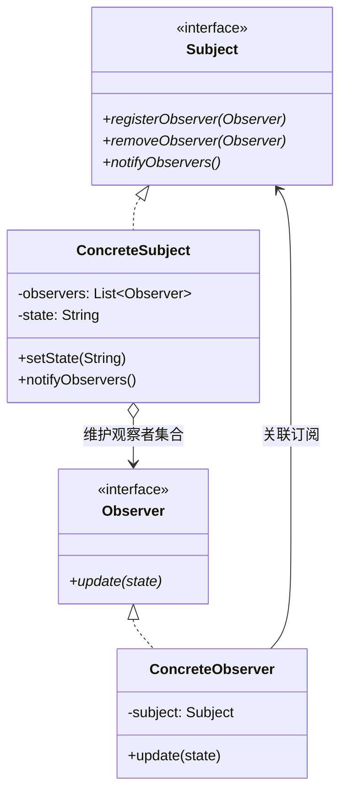
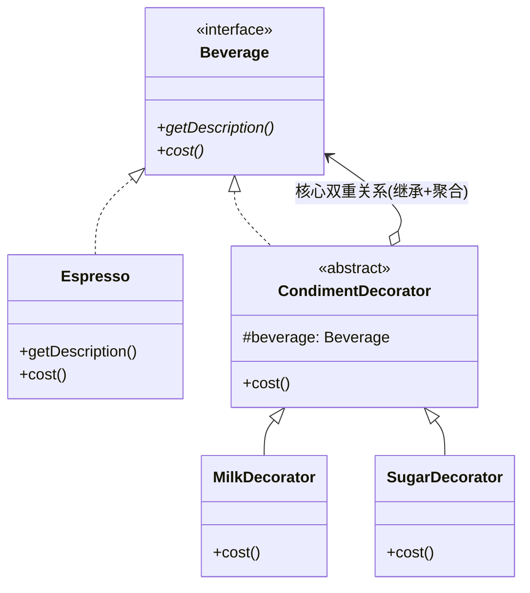
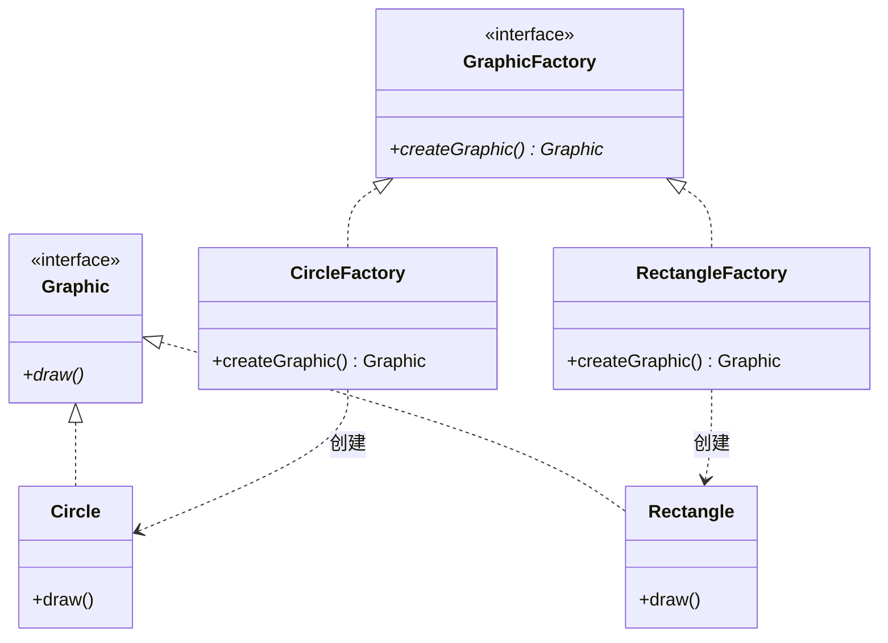
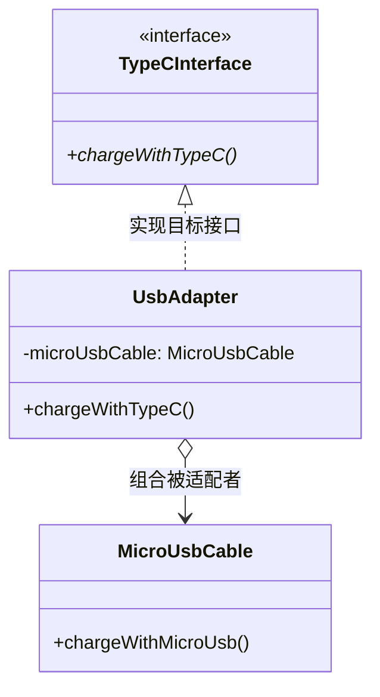
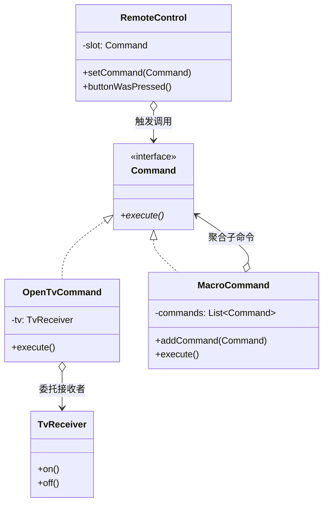
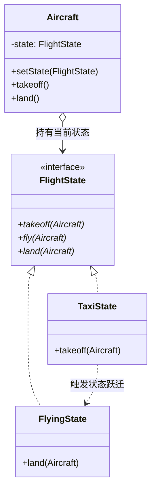

# 试题六：面向对象与设计模式 (Java 选做)

<Badge type="info" text="题型定位：二选一选做题 · 分值: 15 分" />
<Badge type="tip" text="及格目标：13 ~ 15 分 (核心胜负手/高分保底)" />
<Badge type="danger" text="核心法则：类图接口映射 · 7大高频模式 · Java双轨实战工程" />

::: tip 🎯 试题六战略地位与拿分策略
下午应用技术试卷由 5 道必答题（DFD、数据库、UML、C语言算法）与 2 道选答题（试题五 C++ vs 试题六 Java）构成。**强烈推荐所有考生坚定选择【试题六 Java】**！

- **试题六的规律性极高**：题型固定为“一段面向对象背景描述 + 一张 UML 类图 + 5 个 Java 代码填空（每空 3 分，共 15 分）”；
- **考点范围确定**：100% 考察经典 GoF 设计模式，尤其高度集中在 7 大金牌高频模式；
- **拿分门槛最低**：即使不完全理解业务，只要掌握 UML 类图与 Java 语法的机械映射关系，也能稳拿 12 分以上；只要系统刷透 7 大高频模式，15 分满分志在必得。
:::

---

## 一、五空秒杀模型：Java 代码填空的 5 大设问规律

历年软考下午 Java 填空虽然场景多变（从气象站到咖啡调料，从飞行器到遥控器），但挖空的语法与逻辑位置几乎完全一致。掌握以下“五空秒杀模型”，可以在 5 分钟内精准破题：

| 设问位置 | 命题题眼与考核点 | UML 类图映射特征 | 标准答题规范与语法范例 |
| :--- | :--- | :--- | :--- |
| **空 1：类继承/实现声明** | 考察类与接口、抽象父类的继承关系 | 指向接口的虚线空心三角（实现），或指向父类的实线空心三角（继承） | `implements Strategy`<br>`extends CoffeeDecorator` |
| **空 2：聚合/组合变量声明** | 考察面向接口编程，依赖倒置原则（DIP） | 类图中的空心/实心菱形连线，指向被聚合的接口 | `private Strategy strategy;`<br>`protected Coffee decoratedCoffee;` |
| **空 3：构造注入与注册绑定** | 考察对象组装、多态注入或自身注册（`this`） | 构造函数的参数列表，或与观察者主题的双向绑定 | `this.strategy = strategy;`<br>`weatherData.registerObserver(this);` |
| **空 4：方法签名与返回类型** | 考察多态方法重写，或工厂方法返回值类型 | UML 类图中本类声明的操作列表及返回值标注 | `public Graphic createGraphic()`<br>`public void update(float temp, ...)` |
| **空 5：多态委托调用与状态跃迁** | 考察组合委托机制或状态机动态流转 | 协作调用被聚合接口的方法，或驱动上下文切换状态 | `strategy.draw();`<br>`aircraft.setState(new FlyingState());` |

---

## 二、GoF 7 大核心高频设计模式全景拆解

在软考软件设计师近十余年的下午试题中，以下 7 大模式占据了 85% 以上的命题频次。本项目在 `exam-java` 子模块中为每一个模式建立了**标准规范（standard）**与**真题原型（exam）**的双轨工程，并配套了全量 JUnit 5 单元测试断言。



---

### 1. 策略模式 (Strategy Pattern)

#### 模式意图与口诀
- **意图**：定义一系列算法，把它们一个个封装起来，并且使它们可相互替换。本模式使得算法可独立于使用它的客户而变化。
- **记忆口诀**：**算法独立封装，上下文组合委托，运行时动态替换**。
- **真题考频**：2011、2015、2018、2023（机考）。

#### UML 结构图谱


#### 真题原型与填空题眼解析 (2023 机考打印格式原型)
- **工程源码**：`exam-java/src/main/java/com/ateng/ruankao/designpattern/strategy/`
- **核心题眼**：
  1. `public interface PrintStrategy { void print(Interval interval); }` —— 策略接口声明；
  2. `public class Context { private PrintStrategy strategy; }` —— 聚合策略接口；
  3. `public void setPrintStrategy(PrintStrategy strategy) { this.strategy = strategy; }` —— 动态切换策略；
  4. `public void printInterval() { strategy.print(interval); }` —— 委托调用策略算法。

<details>
<summary><b>🔍 策略模式真题检索式自测（点击展开查看代码填空）</b></summary>

```java
// 代码段节选自 exam-java/src/main/java/com/ateng/ruankao/designpattern/strategy/exam/
public class Interval {
    private final double lower;
    private final double upper;
    // 【空 1】：维护策略接口引用
    private PrintStrategy printStrategy;

    public Interval(double lower, double upper, PrintStrategy printStrategy) {
        this.lower = lower;
        this.upper = upper;
        // 【空 2】：构造方法策略注入
        this.printStrategy = printStrategy;
    }

    public void setPrintStrategy(PrintStrategy printStrategy) {
        // 【空 3】：Setter 动态替换策略
        this.printStrategy = printStrategy;
    }

    public void print() {
        // 【空 4】：委托策略对象执行具体打印算法，回传自身 this
        printStrategy.print(this);
    }
}
```
> **答案解析**：
> - 空 1：`PrintStrategy`（面向接口编程，不能写具体策略类）；
> - 空 2：`this.printStrategy = printStrategy`；
> - 空 3：`this.printStrategy = printStrategy`；
> - 空 4：`printStrategy.print(this)`。
</details>

---

### 2. 观察者模式 (Observer Pattern)

#### 模式意图与口诀
- **意图**：定义对象间的一种一对多的依赖关系，当一个对象的状态发生改变时，所有依赖于它的对象都得到通知并被自动更新。
- **记忆口诀**：**一变多知，注册注销，状态广播，解耦监听**。
- **真题考频**：2014、2016、2019、2021。

#### UML 结构图谱


#### 真题原型与填空题眼解析 (2021 气象监测站原型)
- **工程源码**：`exam-java/src/main/java/com/ateng/ruankao/designpattern/observer/`
- **核心题眼**：
  1. `public class WeatherData implements Subject` —— 主题实现接口；
  2. `private List<Observer> observers;` —— 聚合容器；
  3. `public void notifyObservers() { for (Observer o : observers) { o.update(temp, humidity, pressure); } }` —— 循环广播；
  4. 观察者构造函数中：`weatherData.registerObserver(this);` —— 将自身注册到主题中。

<details>
<summary><b>🔍 观察者模式真题检索式自测（点击展开查看代码填空）</b></summary>

```java
// 代码段节选自 exam-java/src/main/java/com/ateng/ruankao/designpattern/observer/exam/
public class CurrentConditionsDisplay implements Observer {
    private float temperature;
    private float humidity;
    private final Subject weatherData;

    public CurrentConditionsDisplay(Subject weatherData) {
        this.weatherData = weatherData;
        // 【空 1】：将自身观察者注册到主题对象
        weatherData.registerObserver(this);
    }

    // 【空 2】：重写观察者接口更新方法
    @Override
    public void update(float temp, float humidity, float pressure) {
        this.temperature = temp;
        this.humidity = humidity;
    }
}
```
> **答案解析**：
> - 空 1：`weatherData.registerObserver(this)`；
> - 空 2：`update(float temp, float humidity, float pressure)`。
</details>

---

### 3. 装饰器模式 (Decorator Pattern)

#### 模式意图与口诀
- **意图**：动态地给一个对象添加一些额外的职责。就增加功能来说，Decorator 模式相比生成子类更为灵活。
- **记忆口诀**：**同源同宗，内部聚合，递归包装，动态扩充**。
- **真题考频**：2013、2017、2020。

#### UML 结构图谱


#### 真题原型与填空题眼解析 (2017 咖啡饮品加料计价)
- **工程源码**：`exam-java/src/main/java/com/ateng/ruankao/designpattern/decorator/`
- **核心双重关系题眼**：
  1. 抽象装饰器必须实现抽象构件：`public abstract class CoffeeDecorator implements Coffee`；
  2. 抽象装饰器必须聚合抽象构件：`protected final Coffee decoratedCoffee;`；
  3. 构造注入被包装对象：`public CoffeeDecorator(Coffee decoratedCoffee) { this.decoratedCoffee = decoratedCoffee; }`；
  4. 具体装饰器计价叠加：`return super.getCost() + 3.0;`（或 `decoratedCoffee.getCost() + 3.0;`）。

<details>
<summary><b>🔍 装饰器模式真题检索式自测（点击展开查看代码填空）</b></summary>

```java
// 代码段节选自 exam-java/src/main/java/com/ateng/ruankao/designpattern/decorator/exam/
// 【空 1】：抽象装饰器实现构件接口
public abstract class CoffeeDecorator implements Coffee {
    // 【空 2】：受保护的被装饰构件引用
    protected final Coffee decoratedCoffee;

    public CoffeeDecorator(Coffee decoratedCoffee) {
        this.decoratedCoffee = decoratedCoffee;
    }

    public double getCost() {
        return decoratedCoffee.getCost();
    }
}

public class MilkDecorator extends CoffeeDecorator {
    public MilkDecorator(Coffee decoratedCoffee) {
        super(decoratedCoffee);
    }

    @Override
    public double getCost() {
        // 【空 3】：调用父类或原对象费用并叠加牛奶价格
        return super.getCost() + 3.0;
    }
}
```
> **答案解析**：
> - 空 1：`implements Coffee`；
> - 空 2：`Coffee decoratedCoffee`（必须声明为顶层接口类型）；
> - 空 3：`super.getCost() + 3.0`（或 `decoratedCoffee.getCost() + 3.0`）。
</details>

---

### 4. 工厂方法模式 (Factory Method Pattern)

#### 模式意图与口诀
- **意图**：定义一个用于创建对象的接口，让子类决定实例化哪一个类。Factory Method 使一个类的实例化延迟到其子类。
- **记忆口诀**：**接口定规范，子类定实例，解耦调用者，开闭原则立**。
- **真题考频**：2012、2015、2020。

#### UML 结构图谱


#### 真题原型与填空题眼解析 (2020 图形工厂多态实例化)
- **工程源码**：`exam-java/src/main/java/com/ateng/ruankao/designpattern/factorymethod/`
- **核心题眼**：
  1. 抽象工厂方法返回抽象产品：`public interface GraphicFactory { Graphic createGraphic(); }`；
  2. 具体工厂实例化具体产品：`public Graphic createGraphic() { return new Circle(); }`；
  3. 客户端多态调用：`GraphicFactory factory = new CircleFactory(); Graphic g = factory.createGraphic();`。

---

### 5. 适配器模式 (Adapter Pattern)

#### 模式意图与口诀
- **意图**：将一个类的接口转换成客户希望的另外一个接口。Adapter 模式使得原本由于接口不兼容而不能一起工作的那些类可以一起工作。
- **记忆口诀**：**接口不兼容，对象来包容，委托旧方法，转换新标准**。
- **真题考频**：2010、2014、2019、2021。

#### UML 结构图谱


#### 真题原型与填空题眼解析 (2021 硬件充电转接头)
- **工程源码**：`exam-java/src/main/java/com/ateng/ruankao/designpattern/adapter/`
- **核心题眼**：
  1. `public class UsbAdapter implements TypeCInterface` —— 实现目标规范；
  2. `private final MicroUsbCable microUsbCable;` —— 聚合被适配旧类；
  3. `public String chargeWithTypeC() { return microUsbCable.chargeWithMicroUsb(); }` —— 协议转换委托。

---

### 6. 命令模式 (Command Pattern)

#### 模式意图与口诀
- **意图**：将一个请求封装为一个对象，从而使你可用不同的请求对客户进行参数化；对请求排队或记录请求日志，以及支持可撤销的操作。
- **记忆口诀**：**请求封装成对象，调用执行两解耦，参数化排队撤销，宏命令组合执行**。
- **真题考频**：2016、2018、2022。

#### UML 结构图谱


#### 真题原型与填空题眼解析 (2022 家电遥控器与宏命令)
- **工程源码**：`exam-java/src/main/java/com/ateng/ruankao/designpattern/command/`
- **核心题眼**：
  1. `public class MacroCommand implements Command` —— 宏命令自身也是 Command；
  2. `for (Command cmd : commands) { cmd.execute(); }` —— 遍历执行宏批处理；
  3. `public void buttonWasPressed() { slot.execute(); }` —— 调用者触发。

---

### 7. 状态模式 (State Pattern)

#### 模式意图与口诀
- **意图**：允许一个对象在其内部状态改变时改变它的行为。对象看起来似乎修改了它的类。
- **记忆口诀**：**状态封装成类，行为随态而变，消除冗长分支，状态主动跃迁**。
- **真题考频**：2017、2022、2023。

#### UML 结构图谱


#### 真题原型与填空题眼解析 (2023 飞行器状态跃迁机)
- **工程源码**：`exam-java/src/main/java/com/ateng/ruankao/designpattern/state/`
- **核心题眼**：
  1. 状态方法接收上下文对象入参：`void takeoff(Aircraft aircraft);`；
  2. 具体状态类内部主动触发上下文状态变更：`aircraft.setState(new FlyingState());`；
  3. 上下文类业务方法委托当前状态：`state.takeoff(this);`。

---

## 三、`exam-java` 实战工程与本地一键验证

本项目在根目录提供了统一的测试与构建接缝，确保所有设计模式代码可编译、可调试、可断言验证：

### 1. 运行设计模式全量断言
```powershell
# 在根目录一键运行全量 Maven 单元测试 (17 个测试全绿)
mvn -f exam-java/pom.xml test
```

### 2. 运行单一模式专项测试
```powershell
# 仅测试策略模式
mvn -f exam-java/pom.xml test -Dtest=StrategyPatternTest

# 仅测试观察者模式
mvn -f exam-java/pom.xml test -Dtest=ObserverPatternTest

# 仅测试状态模式
mvn -f exam-java/pom.xml test -Dtest=StatePatternTest
```

### 3. 全局最高级验证接缝 (CI 聚合)
```powershell
# 串联 VitePress 站点构建与 Java 全套测试
pnpm test
```
