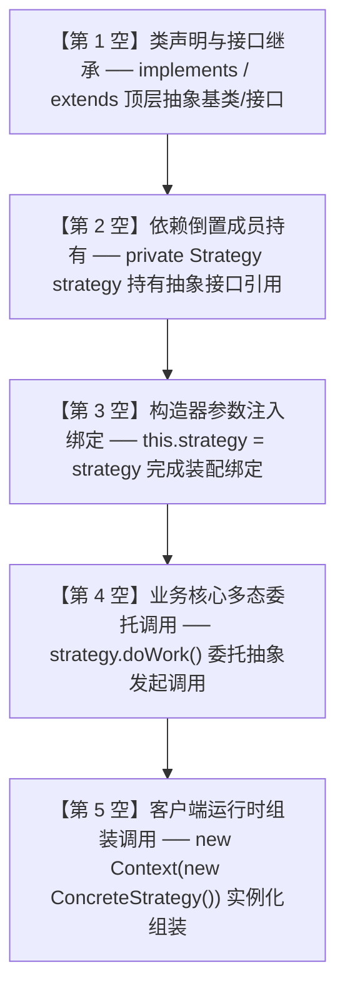

# 下午应用技术万能采分公式与速记口诀手册

<Badge type="info" text="类型：全题型横向聚合速查手册" />
<Badge type="tip" text="适用对象：考前集中背诵 · 考场推导利器" />
<Badge type="danger" text="覆盖范围：试题一至试题六核心得分公式 · 标准机考答题模板" />

::: tip 🎯 手册定位与使用指南
本手册横向汇聚全国计算机技术与软件专业技术资格（水平）考试 —— **软件设计师（中级）下午应用技术** 全卷 5 道大题的核心公式、速记口诀、判别矩阵与标准机考作答模板。

考生在考前冲刺阶段可直接背诵本手册中的加粗口诀与模板；在考场上遇到相应题型时，直接对号入座，快速套用规范作答，防范扣分。

配套导航：[📖 下午题门户](/pm-application/) | [🛡️ 机考作答与避坑指南](./cbt-guidelines) | [试题一 DFD](./01-data-flow-diagram/) | [试题二 数据库](./02-database-design/) | [试题三 UML](./03-uml-modeling/) | [试题四 算法](./04-algorithm-analysis/) | [试题六 Java](./05-design-patterns-java/)
:::

---

## 一、 试题一：数据流图 (DFD) 万能采分法则

### 1.1 外部实体与数据存储“语法成分定位法”
- **外部实体 (E)**：句式中的**主语/发起者**（不在系统内但与系统直接交互）。角色（客户、管理员）、外部系统（银行网关、物流系统）、硬件设备（传感器、扫码枪）。
- **数据存储 (D)**：句式中的**宾语/沉淀物**（带有保存、记录、归档、台账语义）。数据库表（订单表、商品信息库）、文件（操作日志、流水明细）。
- **三大铁律**：
  1. 外部实体之间**严禁连线**；
  2. 外部实体与数据存储之间**严禁直连**（必须经由加工转发）；
  3. 数据存储**不能主动发起动作**。

### 1.2 父子图平衡“四查法”
1. **查输入守恒**：父图加工有的输入流，子图边界必须等量、同名出现；
2. **查输出守恒**：父图加工有的输出流，子图边界必须等量、同名出现；
3. **查无中生有**：子图边界流超出父图范围，必有流向多余或遗漏向父图同步；
4. **查命名一致**：跨层数据流名称必须完全一致，切勿擅自更名。

### 1.3 加工节点“三态黑白洞”排查表
- **黑洞 (Black Hole)**：加工只有流入箭头，没有流出箭头 $\to$ 补指向存储的**保存流**或实体的**响应流**；
- **奇迹 (Miracle)**：加工只有流出箭头，没有流入箭头 $\to$ 补外部实体的**参数流**或存储的**基础配置流**；
- **灰洞 (Grey Hole)**：加工输入的数据在逻辑上推导不出输出的数据（如输入只有用户名，输出却是扣款单） $\to$ 补**业务支撑流**。

### 1.4 数据字典 (Data Dictionary) 定义符号体系

| 符号 | 符号名称 | 语义解释 | 典型真题应用示例 |
| :---: | :--- | :--- | :--- |
| **`=`** | **定义为** | 声明数据结构的组成成分 | `客户账单 = 账单号 + 消费明细 + 总金额` |
| **`+`** | **顺序连接** | 各成分顺序按序连接出现 | `个人姓名 = 姓氏 + 名字` |
| **`[ \| ]`** | **选择其中之一** | 中括号内各备选成分任选其一，以竖线分隔 | `支付方式 = [ 微信支付 \| 支付宝支付 \| 银联支付 ]` |
| **`{ }`** | **重复** | 花括号内的成分重复出现 0 次或多次 | `订单商品条目 = { 商品编号 + 购买数量 + 单价 }` |
| **`m { } n`**| **限定重复次数** | 重复至少 $m$ 次，至多 $n$ 次 | `手机号码 = 11 { 数字 } 11` |
| **`( )`** | **可选成分** | 圆括号内的成分可以出现 0 次或 1 次 | `邮寄地址 = 省 + 市 + 区 + 详细地址 + (邮编)` |

### 1.5 缺失数据流机考标准作答模板
```text
数据流 1：数据流名称：[数据流名称]，起点：[起点加工/实体/存储名称]，终点：[终点加工/实体/存储名称]
数据流 2：数据流名称：[数据流名称]，起点：[起点名称]，终点：[终点名称]
```

---

## 二、 试题二：数据库系统设计核心公式

### 2.1 E-R 模型向关系模式转换三大铁律
1. **$1:1$ 联系转换**：
   - 优选合并法：将联系与**任意一方**实体模式合并，在被合并端加入另一端主键作为**外键**，并加入联系属性；
   - 独立建表法：独立成表，两端主键均为候选码，任选其一为主键，另一方为外键。
2. **$1:N$ 联系转换（必考）**：
   - **强制合并至 $N$ 端**！将 $1$ 端实体的主键及联系属性并入 $N$ 端实体模式，$N$ 端原主键不变，并入的 $1$ 端主键成为 $N$ 端模式的**外键**。
3. **$M:N$ 联系转换（必考）**：
   - **必须独立建立新表**！模式属性由两端实体主键加联系属性构成；**两端实体主键联合构成【复合主键】**，两端主键各自作为外键。
4. **三元 $M:N:P$ 联系**：
   - 必须独立建表，主键由**三方实体主键联合构成**。

### 2.2 属性闭包算法 $X^+$ 与候选码推导
- **L 类属性**（仅在依赖左侧出现）：**必属于候选码**；
- **R 类属性**（仅在依赖右侧出现）：**绝不属于候选码**；
- **N 类属性**（两边均不出现）：**必属于候选码**；
- **LR 类属性**（两边均出现）：与 L 类属性组合验证其闭包是否等于全集 $U$。

### 2.3 规范化递进判定口诀
- **1NF**：属性值不可再分（原子性）；
- **2NF**：在 1NF 基础上，**消除非主属性对码的部分函数依赖**；
  > 💡 **秒杀定律**：若关系模式的主键是**单一属性**，只要满足 1NF，则**自动满足 2NF**！
- **3NF**：在 2NF 基础上，**消除非主属性对码的传递函数依赖**（即不存在非主属性决定另一个非主属性）；
- **BCNF**：在 3NF 基础上，**消除主属性对码的部分与传递依赖**（所有函数依赖左部决定因素均包含超码）。

### 2.4 模式分解无损连接（Lossless Join）充要条件公式
关系模式 $R$ 分解为 $\rho = \{ R_1, R_2 \}$，该分解具有无损连接的充要条件为：
$$R_1 \cap R_2 \to (R_1 - R_2) \in F^+ \quad \text{或} \quad R_1 \cap R_2 \to (R_2 - R_1) \in F^+$$
> **口诀**：两子模式的**公共属性集**，必须能够函数决定其中某一个子模式的**私有属性集**！

### 2.5 常用 SQL 约束填空速查表

| 约束关键字 | 语法格式 | 核心作用与真题题眼 |
| :--- | :--- | :--- |
| `PRIMARY KEY` | `PRIMARY KEY (col1, col2)` | 实体完整性，复合主键必须表级定义 |
| `FOREIGN KEY ... REFERENCES` | `FOREIGN KEY (fk) REFERENCES T(pk)` | 参照完整性，关联父表主键 |
| `ON DELETE CASCADE` | 附在外键定义后 | 级联删除：“父表记录删除时子表联动删除” |
| `ON DELETE SET NULL`| 附在外键定义后 | 置空删除：“父表删除时子表外键置为 NULL” |
| `CHECK` | `CHECK (表达式)` | 用户定义完整性：“取值范围检查”、“性别只能男女” |
| `NOT NULL` / `UNIQUE` | 字段后紧跟 | “必填不可为空” / “唯一不可重复” |

---

## 三、 试题三：面向对象 UML 系统建模口诀

### 3.1 类间耦合强弱阶梯（从弱到强）
$$\text{依赖 (Dependency)} < \text{关联 (Association)} < \text{聚合 (Aggregation)} < \text{组合 (Composition)} < \text{泛化/实现 (Generalization/Realization)}$$

### 3.2 聚合 vs 组合本质辨析表
- **聚合 (Aggregation)**：**空心菱形**。弱拥有，“整体由部分构成”。**生命周期解耦**（整体消亡，部分独立存在，如班级与学生、计算机与外设）；
- **组合 (Composition)**：**实心菱形**。强拥有，“部分是整体不可分割的一部分”。**生命周期绑定（同生共死）**（整体消亡，部分随之消亡，如公司与部门、窗口与菜单）；
- **菱形端位置口诀**：**菱形永远画在【整体】（宿主）一端，无符号端指向【部分】**！

### 3.3 用例三大关系秒杀判别矩阵
- **包含 (`<<include>>`)**：**必选执行**。虚线箭头：**基础用例 $\to$ 被包含用例**（代码抽取共享逻辑）；
- **扩展 (`<<extend>>`)**：**可选触发**。虚线箭头：**扩展用例 $\to$ 基础用例**（⚠️ **反向箭头**，特定条件/异常补偿注入）；
- **泛化 (Generalization)**：**继承特化**。实线空心三角箭头：**子用例 $\to$ 父用例**（同类行为的具体实现特化，如微信支付继承自渠道支付）。

### 3.4 多重度 (Multiplicity) 双向独立推导法
- `0..1`（至多一个/可选）、`1`（必须且仅有一个）、`0..*` 或 `*`（零个或多个）、`1..*`（至少一个）；
- **推导法**：固定 1 个 A，看能对应几个 B（数字写在 B 旁边）；固定 1 个 B，看能对应几个 A（数字写在 A 旁边）。

### 3.5 动态图核心规范
- **时序图三大消息**：同步消息（实线实心三角 `->>`）、异步消息（实线开放箭头 `-->>`）、返回消息（虚线开放箭头 `-->>`）；
- **状态机图三元组**：转换表达式标准格式为 `事件 [守卫条件] / 动作`，守卫条件必须书写在方括号 `[...]` 内。

---

## 四、 试题四：C 语言算法设计与分析防守矩阵

### 4.1 四大宗门特征识别矩阵

| 算法宗门 | 核心理论本质 | 题干高频关键词 | C 代码结构典型特征 |
| :---: | :--- | :--- | :--- |
| **动态规划 (DP)** | 最优子结构、重叠子问题、无后效性 | “最大价值”、“最长长度”、“最优策略” | 二维/一维数组 `dp[][]`，双重循环递推填表 |
| **贪心算法 (Greedy)** | 贪心选择性质、局部最优 | “性价比最高”、“优先挑选”、“贪婪选择” | 先调用 `qsort()` 排序，单重循环线性扫描挑选 |
| **分治法 (D & C)** | 同质独立子问题、递归合并 | “折半划分”、“二分搜索”、“递归合并” | `mid = (low + high) / 2`，两次独立子递归 |
| **回溯法 (Backtrack)**| 深度优先搜索、约束剪枝、恢复现场 | “寻找所有解/排列”、“棋盘冲突”、“试探” | 深度递归 `dfs(t + 1)`，存在显式/隐式撤销与恢复现场 |

### 4.2 常见算法时空复杂度速查矩阵

| 算法名称 | 算法宗门 | 平均时间复杂度 | 最坏时间复杂度 | 额外空间复杂度 |
| :--- | :---: | :---: | :---: | :---: |
| **0-1 背包问题** | DP | $O(N \times W)$ | $O(N \times W)$ | $O(N \times W)$ 或 $O(W)$ |
| **最长公共子序列 (LCS)**| DP | $O(m \times n)$ | $O(m \times n)$ | $O(m \times n)$ |
| **快速排序 (QuickSort)**| 分治 | $O(n \log n)$ | $O(n^2)$ | $O(\log n)$ (递归栈) |
| **归并排序 (MergeSort)**| 分治 | $O(n \log n)$ | $O(n \log n)$ | $O(n)$ (辅助数组) |
| **Dijkstra 最短路径** | 贪心 | $O(V^2)$ 或 $O(E \log V)$ | $O(V^2)$ | $O(V)$ |
| **Kruskal 最小生成树** | 贪心 | $O(E \log E)$ | $O(E \log E)$ | $O(E)$ |
| **N 皇后问题** | 回溯 | $O(N!)$ | $O(N!)$ | $O(N)$ (解向量) |

### 4.3 分治主定理 (Master Theorem) 判定式
对于 $T(n) = a T(n/b) + O(n^d)$：
- 若 $\log_b a > d \implies T(n) = O(n^{\log_b a})$；
- 若 $\log_b a = d \implies T(n) = O(n^d \log n)$；
- 若 $\log_b a < d \implies T(n) = O(n^d)$。

### 4.4 代码填空前两空保底 4 分套路
1. **循环变量初值与边界**：`for (i = 0; i < n; i++)` 或 `for (i = 1; i <= n; i++)`；边界 `dp[0][j] = 0`；
2. **递归终止基线 (Base Case)**：`if (low >= high) return;` 或 `if (i == 0 || j == 0) return;`；
3. **N 皇后对角线冲突**：`abs(q[i] - q[k]) == abs(i - k)`。

---

## 五、 试题六：面向对象程序设计 (Java) 五空秒杀模型

试题六固定考查 GoF 23 种设计模式中的 7 大高频模式，代码填空固定为 5 空（每空 3 分，满分 15 分）：



#### 试题六 Java 填空“五空秒杀定位模型”速查表

| 填空空号 | 考查位点与语法特征 | UML 类图对应题眼 | 典型标准语法范例 | 考场秒杀口诀与避坑 |
| :---: | :--- | :--- | :--- | :--- |
| **第 1 空** | **类声明与接口继承** | 指向抽象接口的虚线三角（实现），或指向抽象基类的实线三角（继承） | `implements Strategy`<br/>`extends Decorator` | 先找顶层角色，首字母大写，辨清 `implements` 与 `extends`。 |
| **第 2 空** | **组合/聚合成员变量持有** | 类图中 Context/Subject 指出的菱形关联线，指向抽象接口 | `private Strategy strategy;`<br/>`protected Component component;` | 依赖倒置原则（DIP）：声明类型必须是抽象接口，绝非具体实现类！ |
| **第 3 空** | **构造器参数注入 / 初始化** | 构造方法 `public Context(...)` 的参数列表与属性赋值 | `this.strategy = strategy;`<br/>`this.observers = new ArrayList<>();` | 辨清属性名与形参名；若形参同名必须加 `this.` 显式指明成员变量。 |
| **第 4 空** | **多态委托调用 (核心业务)** | 核心业务方法内，委托第 2 空持有的成员变量发起方法调用 | `strategy.doAlgorithm();`<br/>`component.operation();` | 绝大多数为第 2 空变量名加抽象接口中的方法，注意参数传递一致性。 |
| **第 5 空** | **客户端装配与实例化** | 位于 `main()` 方法中，完成具体对象与上下文的组装并触发运行 | `new Context(new ConcreteStrategy());`<br/>`context.doWork();` | 认清具体策略/产品子类名，通过 `new` 完成多态注入并启动业务。 |

### 5.1 7 大高频设计模式速记矩阵

| 模式名称 | 模式类型 | 核心设计意图 | 类图结构核心标志 | 填空第 4 空典型多态调用 |
| :--- | :---: | :--- | :--- | :--- |
| **策略模式 (Strategy)** | 行为型 | 封装一系列算法，使其可相互替换 | Context 聚合 `Strategy` 接口 | `strategy.doAlgorithm()` |
| **观察者模式 (Observer)**| 行为型 | 一对多依赖，状态变更广播通知 | Subject 组合 `List<Observer>` | `observer.update(state)` |
| **装饰器模式 (Decorator)**| 行为型 | 动态为对象增加附加职责，比继承更灵活 | Decorator 既继承又聚合 `Component` | `component.operation()` |
| **工厂方法 (Factory Method)**| 创建型 | 定义创建对象接口，由子类决定实例化哪一个类 | Factory 接口定义 `createProduct()` | `return new ConcreteProduct()` |
| **适配器模式 (Adapter)** | 结构型 | 将一个类的接口转换为客户期待的另一个接口 | Adapter 实现 Target 接口，包装 Adaptee | `adaptee.specificRequest()` |
| **命令模式 (Command)** | 行为型 | 将请求封装为对象，支持排队、撤销与重做 | Invoker 持有 `Command`，Command 持有 Receiver | `receiver.action()` |
| **状态模式 (State)** | 行为型 | 允许对象在内部状态改变时改变其行为 | Context 持有 `State` 接口 | `state.handle(this)` |
