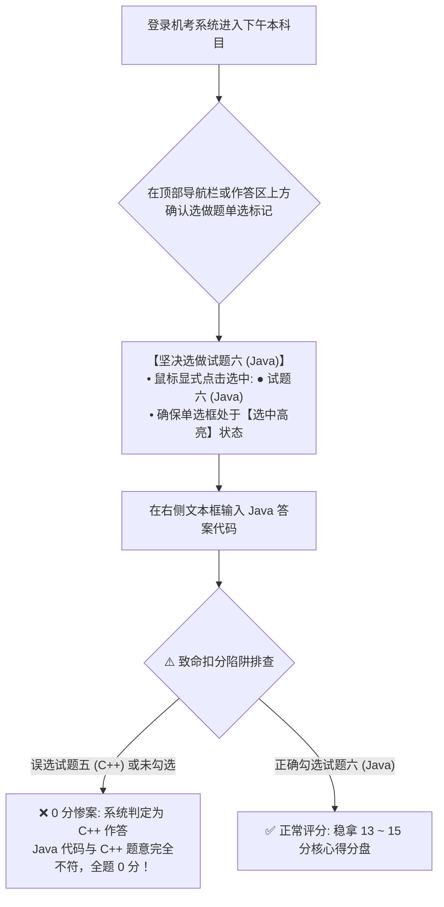

# 机考常态化上机作答规范与高频避坑手册

<Badge type="info" text="类型：机考实操与考场防坑规范" />
<Badge type="tip" text="适用对象：全体中级软件设计师考生" />
<Badge type="danger" text="通关红线：选做题勾选 · 文本框格式排版 · 全角标点防错 · 150分钟时间把控" />

::: tip 🎯 为什么机考时代必须掌握上机作答规范？
自 2023 年下半年起，全国计算机技术与软件专业技术资格（水平）考试已全面实行**机考常态化（计算机化无纸化考试）**。

下午应用技术科目由传统的“纸质试卷笔答”彻底转变为“屏幕分栏展示 + 纯文本框键盘输入”。历年上机阅卷大数据表明，大量考生失分**并非专业知识掌握不牢，而是因为机考界面操作失误、选做题漏勾选、全角中文标点混入代码、或文本框排版混乱**被阅卷系统误判。

本手册针对机考真实操作环境，提炼出不可触碰的四大核心防线与全真 150 分钟答题时间规划。

配套导航：[📖 下午题门户](/pm-application/) | [📐 万能采分公式速记手册](./answer-templates)
:::

---

## 一、 第一防线：选做题（试题五 vs 试题六）防漏选机制

下午大题共 6 道，考生需完成 5 道。其中**试题五 (C++) 与 试题六 (Java) 为二选一选做题**：



> [!CAUTION] 选做题三大绝对禁忌
> 1. **进入考试第一件事必须先勾选**：不要等全部代码写完再勾选，答题伊始立即核查题号选择；
> 2. **两题切忌同时作答**：系统只识别勾选的一道题，在另一道题文本框输入任何内容均不计分且白白浪费宝贵时间；
> 3. **交卷前最后 20 分钟必核查**：在最终提交前，返回选做题界面，再次确认单选框是否稳定勾选在“试题六”。

---

## 二、 第二防线：机考文本框输入与排版规范

机考判卷主要采用“计算机模式匹配初筛 + 人工复核”。混乱的输入排版会极大增加误判概率。必须严格遵守以下排版规矩：

### 2.1 结构化题型（试题一 DFD、试题二数据库、试题三 UML）输入规范
- **禁止裸写无修饰答案**：
  - ❌ 错误示范：`E1, 订单表, 1:N`
  - ✅ 正确示范：
    ```text
    问题 1：
    E1：买家
    E2：物流系统
    E3：支付网关

    问题 2：
    数据流名称：出库发货通知，起点：3.0 出库处理，终点：E1 买家
    数据流名称：库存扣减指令，起点：3.0 出库处理，终点：D2 商品库存表
    ```
- **标明清晰题号与空位**：
  每个设问之间空一行，每个具体空位单独成行，并标明 `(1)`、`(2)` 或 `[空 1]`、`[空 2]`。

### 2.2 代码与语法题型（试题四 C 语言、试题六 Java）输入规范
- **仅填入空缺代码片段**：
  除非题目明确要求重写整个方法，否则只在文本框中填写挖空处的语法表达式，**切勿把整篇长达数十行的完整源码原样抄写进输入框**；
- **分行对应**：
  ```text
  (1) implements Strategy
  (2) private Strategy strategy
  (3) this.strategy = strategy
  (4) strategy.doAlgorithm()
  (5) new ConcreteStrategyA()
  ```

---

## 三、 第三防线：标点符号与全角/半角输入法防御

在计算机阅卷与代码语法检测中，**中文全角符号与英文半角符号的 ASCII/Unicode 编码完全不同**。在输入代码时混入全角标点是导致零分的头号隐形杀手！

### 3.1 常见全角与半角符号对照表

| 符号名称 | 英文半角 (正确 ✅) | 中文全角 (致命错误 ❌) | 典型出错场景 |
| :---: | :---: | :---: | :--- |
| **逗号** | `,` (ASCII 44) | `，` (Unicode 65292) | SQL 字段列表、Java 方法参数列表 |
| **分号** | `;` (ASCII 59) | `；` (Unicode 65307) | C/Java 语句结束分号、SQL 分隔符 |
| **括号** | `()` (ASCII 40/41) | `（）` (Unicode 65288/65289) | 方法调用、SQL `PRIMARY KEY (col)` |
| **引号** | `"` 或 `'` | `“”` 或 `‘’` | 字符串常量，如 `'已支付'`、`"admin"` |
| **方括号** | `[]` (ASCII 91/93) | `【】` (Unicode 65307) | 状态机守卫条件 `[条件]`、数组定义 |
| **冒号** | `:` (ASCII 58) | `：` (Unicode 65306) | 泛型约束、条件表达式 `a ? b : c` |

> [!IMPORTANT] 考场输入法极简防错准则
> - **作答纯文字题目**（如简述题、概念判断）：使用中文输入法，但遇到括号、英文字母时尽量切换为英文半角；
> - **作答代码题目（试题四、试题六、SQL 填空）**：**强制切换为系统纯英文半角键盘**（按 `Shift` 键或 `Win + Space`），确保敲出的每一个标点均为半角字符。

---

## 四、 第四防线：150 分钟全真时间管理矩阵

下午考试时间为 **14:30 ~ 17:00（共计 150 分钟）**。切忌在一道难题上耗尽时间，导致后续送分题无暇作答：

```mermaid
gantt
    title 下午应用技术 150 分钟考场黄金时间分配
    dateFormat  m
    axisFormat %m分

    section 第一战役 (送分盘)
    试题一 DFD (14分保底)          :active, p1, 0, 25m

    section 第二战役 (得分盘)
    试题二 数据库设计 (13分保底)    :active, p2, 25, 50m

    section 第三战役 (建模盘)
    试题三 UML 建模 (13分保底)      :active, p3, 50, 75m

    section 第四战役 (胜负手)
    试题六 Java 实战 (14分必拿)     :active, p6, 75, 100m

    section 第五战役 (防守盘)
    试题四 C 算法 (8分防守止损)    :crit, p4, 100, 130m

    section 决胜收官 (复核盘)
    全卷复核与选做题防漏检         :done, rev, 130, 150m
```



### 4.1 各大题作战节奏与强行止损红线

| 作战阶段 | 对应试题 | 分配时长 | 目标得分 | 强行止损红线与战术动作 |
| :---: | :--- | :---: | :---: | :--- |
| **第 1 战** | **试题一：数据流图 (DFD)** | 25 分钟 | **13 ~ 15 分** | 25 分钟一到必须交卷。若有 1 条缺失数据流找不到，直接按直觉写一个，切勿恋战。 |
| **第 2 战** | **试题二：数据库设计 (E-R)**| 25 分钟 | **12 ~ 14 分** | 25 分钟一到必须交卷。牢记 1:N 并入多端、M:N 独立建表。 |
| **第 3 战** | **试题三：UML 系统建模** | 25 分钟 | **12 ~ 14 分** | 25 分钟一到必须交卷。辨清聚合（解耦）与组合（同生共死）。 |
| **第 4 战** | **试题六：面向对象 Java** | 25 分钟 | **13 ~ 15 分** | **全卷最高性价比**。依据五空套路对准类图和多态填空，稳拿 14 分。 |
| **第 5 战** | **试题四：C 语言算法防守** | 30 分钟 | **7 ~ 9 分** | **严格止损线：30 分钟**！拿下第 1 问策略和前 2 空初值后，后两空思考超过 5 分钟无思路果断猜写一个，立刻退出！ |
| **收官** | **全卷复核与防漏选核验** | 20 分钟 | — | **绝不提前交卷**！严格逐项核对复核清单。 |

---

## 五、 收官复核黄金 20 分钟检查清单

在考试结束前最后 20 分钟，严格按照以下顺序执行逐项排查：

- [ ] **核验 1：选做题标记确认**：检查试题五与试题六的单选框，确认是否**100% 选中试题六 (Java)**；
- [ ] **核验 2：答题区域无空白遗漏**：检查左侧题目导航树，确认所有小题是否均显示“已作答”状态，坚决杜绝任何留空；
- [ ] **核验 3：输入框排版核对**：检查试题一、二、三的文本框，是否清晰标明了 `问题1：`、`数据流名称：` 等引导词；
- [ ] **核验 4：代码全角标点大清查**：快速浏览试题四与试题六的输入框，核查是否存在中文逗号 `，`、分号 `；` 或中文双引号 `“”`；
- [ ] **核验 5：Java 大小写敏感核对**：检查 Java 关键字（如 `implements`、`extends`、`new`、`return`）是否全为小写，类名首字母是否大写。

---

## 六、 考场突发设备与系统异常应急预案

1. **界面卡死或鼠标无响应**：
   - 保持冷静，**切勿自行拔掉电源或反复长按关机键**；
   - 立即起立或举手向监考考官报告。机考系统后台具备**实时答卷快照持久化机制**，监考老师更换备用机或重启系统后，已保存的答题记录将自动完整恢复，且考场会根据故障时间按规程补足考试时长；
2. **输入法候选框被遮挡或无法呼出中文**：
   - 使用快捷键 `Ctrl + Space` 或 `Ctrl + Shift` 重新激活输入法管理器；
   - 若依然失效，举手示意监考老师协助调出系统软键盘或切换输入法配置；
3. **试题附图字迹偏小或模糊**：
   - 机考界面图片区域通常支持**鼠标悬停放大镜**或**点击新窗口弹出大图**功能，利用窗口缩放功能细致查阅数据流箭头方向与类图菱形标记。
