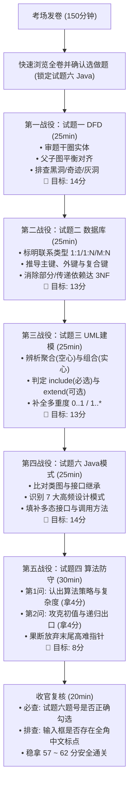

# 软考软件设计师下午应用技术（案例分析与 Java 实战）通关门户

<Badge type="info" text="科目：下午系统应用技术 (科目代码: 02)" />
<Badge type="tip" text="总分：75 分 · 及格线：45 分" />
<Badge type="danger" text="战术核心：保底 57 分及格攻防矩阵 · 击穿挂科壁垒" />

::: tip 🎯 下午题战略通关指南
全国计算机技术与软件专业技术资格（水平）考试实行“单次考试双科同时 $\ge 45$ 分方为及格，单科成绩不予保留”的严格规则。历年考情显示，80% 以上未通过考生的失分重灾区在**下午应用技术（75分满分）**。

下午应用技术不是盲目刷题，而是高度标准化的系统工程分析与模式匹配。本项目遵循 [ADR 0007 架构决策](/adr/0007-下午应用技术知识库架构与Java实战工程规范)，全面锁定“稳拿盘 + 得分盘 + 算法防守 + Java 胜负手”的 57 分安全攻防模型。

配套导航：[📖 首页](/) | [📐 上午计算公式手册](/am-general/formula-cheat-sheet) | [🛡️ 上午避坑秒杀库](/am-general/exam-pitfalls-and-short-cuts) | [📝 下午万能采分公式](./answer-templates) | [🖥️ 机考防坑指南](./cbt-guidelines)
:::

---

## 一、 下午题 57 分及格攻防矩阵与时间分配

下午考试时长为 **150 分钟**，共计 6 道大题，考生作答 5 道，总分 75 分：

| 试题编号 | 题型名称 | 分值 | 性质 | 建议用时 | 保底目标 | 核心战略与突破口 | 专栏入口 |
| :---: | :--- | :---: | :---: | :---: | :---: | :--- | :---: |
| **试题一** | **结构化分析：数据流图 (DFD)** | 15分 | 必答 | 25分钟 | **13 ~ 15 分** | **送分基础盘**。父子图平衡四查法、黑洞/奇迹/灰洞排错、外部实体定位。 | [进入专栏](./01-data-flow-diagram/) |
| **试题二** | **数据库设计：E-R 模型与 SQL** | 15分 | 必答 | 25分钟 | **12 ~ 14 分** | **核心得分盘**。1:1/1:N/M:N 转换律、主外键推导、规范化 1NF/2NF/3NF。 | [进入专栏](./02-database-design/) |
| **试题三** | **面向对象分析：UML 系统建模** | 15分 | 必答 | 25分钟 | **12 ~ 14 分** | **核心得分盘**。强弱耦合阶梯（聚合vs组合）、用例三大关系（包含/扩展/泛化）。 | [进入专栏](./03-uml-modeling/) |
| **试题四** | **算法设计与分析 (C 语言)** | 15分 | 必答 | 30分钟 | **7 ~ 8 分** | **战略防守盘**。四大宗门模式识别、时空复杂度判别、循环初值与基线填空。 | [进入专栏](./04-algorithm-analysis/) |
| **试题六** | **面向对象程序设计 (Java 选做)** | 15分 | 选做 | 25分钟 | **13 ~ 15 分** | **核心胜负手**。锁定 Java 语言，GoF 7 大高频模式、双轨实战工程与真题断言。 | [进入专栏](./05-design-patterns-java/) |
| **复核** | **全卷检查与防漏选标记** | — | — | 20分钟 | — | 检查选选题号标记、防全角标点、防题号错位。 | [机考规范](./cbt-guidelines) |

> **得分底线总计**：$13 + 12 + 12 + 7 + 13 = 57$ 分（远超 45 分及格红线，具备高达 12 分的容错垫）。

---

## 二、 答题全流程通关全景图

---

## 三、 知识专栏与核心资产导航

### 3.1 试题精解与案例实战专栏
1. **[试题一：结构化分析与数据流图 (DFD)](./01-data-flow-diagram/)**（必答 · 15分）
   - [00 核心法则与异常排查方法论](./01-data-flow-diagram/) · [01 电商订单与支付](./01-data-flow-diagram/01-case-ecommerce-orders) · [02 智慧医院门诊挂号](./01-data-flow-diagram/02-case-hospital-outpatient) · [03 智能仓储出入库物流](./01-data-flow-diagram/03-case-smart-warehouse)
2. **[试题二：数据库系统设计 (E-R 与 SQL)](./02-database-design/)**（必答 · 15分）
   - [00 核心铁律与规范化方法论](./02-database-design/) · [01 高校教务排课与成绩](./02-database-design/01-case-academic-scheduling) · [02 智慧物流仓储调度](./02-database-design/02-case-smart-logistics) · [03 连锁超市销售与供应链](./02-database-design/03-case-retail-membership)
3. **[试题三：面向对象 UML 系统建模](./03-uml-modeling/)**（必答 · 15分）
   - [00 核心法则与图元建模方法论](./03-uml-modeling/) · [01 智能车载导航与ADAS](./03-uml-modeling/01-case-vehicle-navigation) · [02 线上多渠道聚合支付网关](./03-uml-modeling/02-case-online-payment-gateway) · [03 敏捷项目看板协同研发](./03-uml-modeling/03-case-agile-kanban-collaboration)
4. **[试题四：C 语言算法设计与分析](./04-algorithm-analysis/)**（必答 · 15分）
   - [00 战略防守法则与四大宗门识别](./04-algorithm-analysis/) · [01 动态规划：背包与LCS](./04-algorithm-analysis/01-dynamic-programming-knapsack-lcs) · [02 分治与贪心：快排与最短路径](./04-algorithm-analysis/02-divide-conquer-and-greedy) · [03 回溯搜索：N 皇后与剪枝](./04-algorithm-analysis/03-backtracking-n-queens)
5. **[试题六：面向对象与设计模式 (Java 选做)](./05-design-patterns-java/)**（选做 · 15分）
   - [00 7 大高频设计模式全景矩阵与五空秒杀](./05-design-patterns-java/) · `exam-java` 纯净双轨工程（策略、观察者、装饰器、工厂方法、适配器、命令、状态）17 个单元测试全绿。

### 3.2 跨题型通用通关秘籍与决策规范
- **[📐 下午应用技术万能采分公式手册](./answer-templates)** —— 集中横向汇总全卷 5 题的判别公式、属性闭包算法、无损连接证明与速记口诀；
- **[🛡️ 机考常态化上机作答规范与高频避坑手册](./cbt-guidelines)** —— 选做题防漏选标记、文本框输入排版、符号全角错判防御、150分钟黄金答题节奏与考场应急预案；
- **[🏛️ ADR 0007 架构决策记录](/adr/0007-下午应用技术知识库架构与Java实战工程规范)** —— 下午应用技术知识库架构与 Java 实战工程建设技术规范。
